# Localizeflow – Rychlý průvodce

#### Podporováno [Localizeflow](https://localizeflow.com/)

<!-- CO-OP TRANSLATOR LANGUAGES TABLE START -->
[Arabic](../ar/README.md) | [Bengali](../bn/README.md) | [Bulgarian](../bg/README.md) | [Burmese (Myanmar)](../my/README.md) | [Chinese (Simplified)](../zh-CN/README.md) | [Chinese (Traditional, Hong Kong)](../zh-HK/README.md) | [Chinese (Traditional, Macau)](../zh-MO/README.md) | [Chinese (Traditional, Taiwan)](../zh-TW/README.md) | [Croatian](../hr/README.md) | [Czech](./README.md) | [Danish](../da/README.md) | [Dutch](../nl/README.md) | [Estonian](../et/README.md) | [Finnish](../fi/README.md) | [French](../fr/README.md) | [German](../de/README.md) | [Greek](../el/README.md) | [Hebrew](../he/README.md) | [Hindi](../hi/README.md) | [Hungarian](../hu/README.md) | [Indonesian](../id/README.md) | [Italian](../it/README.md) | [Japanese](../ja/README.md) | [Kannada](../kn/README.md) | [Korean](../ko/README.md) | [Lithuanian](../lt/README.md) | [Malay](../ms/README.md) | [Malayalam](../ml/README.md) | [Marathi](../mr/README.md) | [Nepali](../ne/README.md) | [Nigerian Pidgin](../pcm/README.md) | [Norwegian](../no/README.md) | [Persian (Farsi)](../fa/README.md) | [Polish](../pl/README.md) | [Portuguese (Brazil)](../pt-BR/README.md) | [Portuguese (Portugal)](../pt-PT/README.md) | [Punjabi (Gurmukhi)](../pa/README.md) | [Romanian](../ro/README.md) | [Russian](../ru/README.md) | [Serbian (Cyrillic)](../sr/README.md) | [Slovak](../sk/README.md) | [Slovenian](../sl/README.md) | [Spanish](../es/README.md) | [Swahili](../sw/README.md) | [Swedish](../sv/README.md) | [Tagalog (Filipino)](../tl/README.md) | [Tamil](../ta/README.md) | [Telugu](../te/README.md) | [Thai](../th/README.md) | [Turkish](../tr/README.md) | [Ukrainian](../uk/README.md) | [Urdu](../ur/README.md) | [Vietnamese](../vi/README.md)

> **Dáváte přednost klonování lokálně?**

> Tento repozitář obsahuje překlady do více než 50 jazyků, což výrazně zvyšuje velikost stahování. Pro klonování bez překladů použijte sparse checkout:
> ```bash
> git clone --filter=blob:none --sparse https://github.com/localizeflow/localizeflow-docs.git
> cd localizeflow-docs
> git sparse-checkout set --no-cone '/*' '!translations' '!translated_images'
> ```
> Tím získáte vše potřebné ke splnění kurzu mnohem rychleji.
<!-- CO-OP TRANSLATOR LANGUAGES TABLE END -->

Localizeflow automaticky překládá vaši dokumentaci a otevírá pull requesty vždy, když se změní zdrojový soubor.  
Tento průvodce vám ukáže, jak nainstalovat GitHub App a spustit první překlad do 2 minut.


> [!NOTE]
>
> Localizeflow momentálně podporuje projekty dokumentace založené na GitHubu
> (například AI for Beginners a většinu standardních open-source repozitářů).  
> 
> Podpora moderních frameworků pro dokumentaci, jako jsou Astro, Docusaurus a Hugo,  
> je v aktivním vývoji.


---

## Přihlaste se a nainstalujte GitHub App

1. Navštivte **[localizeflow.com](https://localizeflow.com/)**.
2. Vyberte **Start with free trial**.
   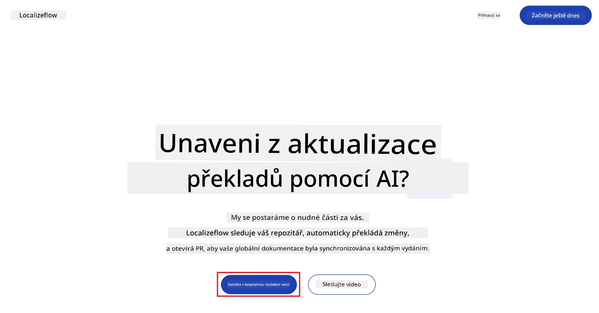
3. Vyberte **Sign in with GitHub**.  
   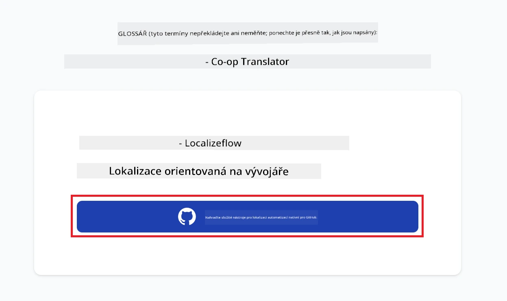
4. Přihlaste se pomocí vašeho GitHub účtu.  
   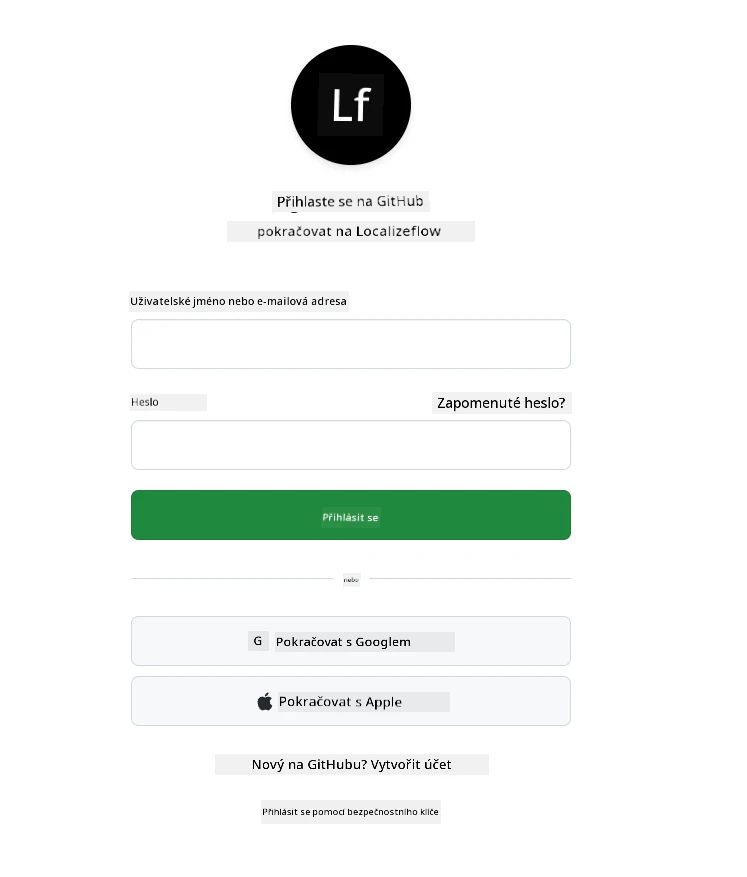
5. Vyberte účet, kde chcete nainstalovat Localizeflow GitHub App — váš osobní účet nebo organizaci, kterou spravujete.  
   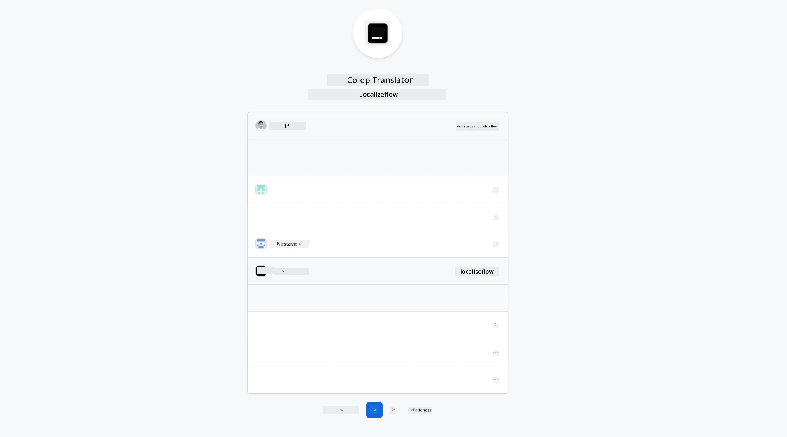
6. Vyberte repozitáře, ke kterým chcete, aby měl Localizeflow přístup, a pak klikněte na **Save**.  
   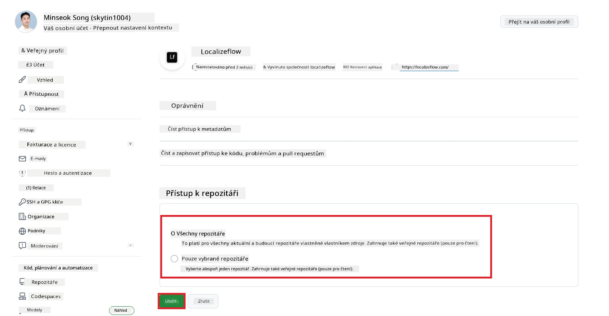
7. Budete přesměrováni na domovskou stránku Localizeflow.

> [!TIP]
> Pro přidání dalších repozitářů později vyberte svůj účet v záhlaví a zvolte **+ Add more repositories**.  
> 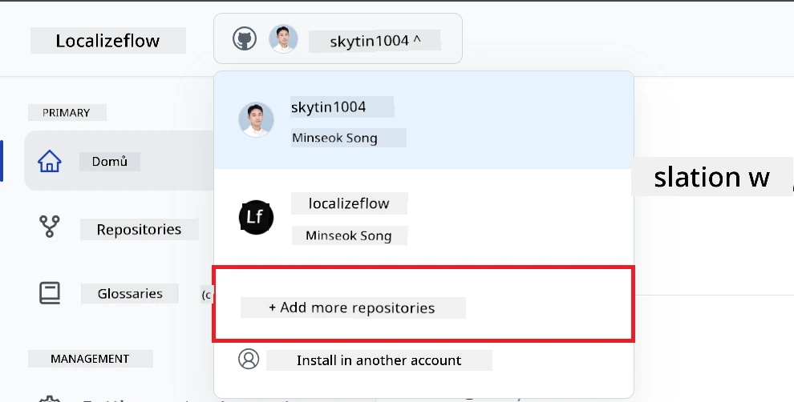

---

## Připojte své repozitáře k Localizeflow

1. Na domovské stránce Localizeflow vyberte **+ Connect repositories**.  
   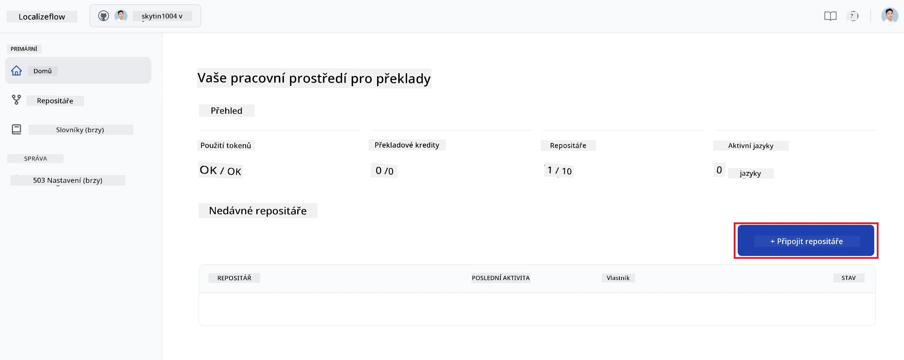

2. Vyberte jeden z nainstalovaných repozitářů, který chcete připojit, a klikněte na **Save**.  
   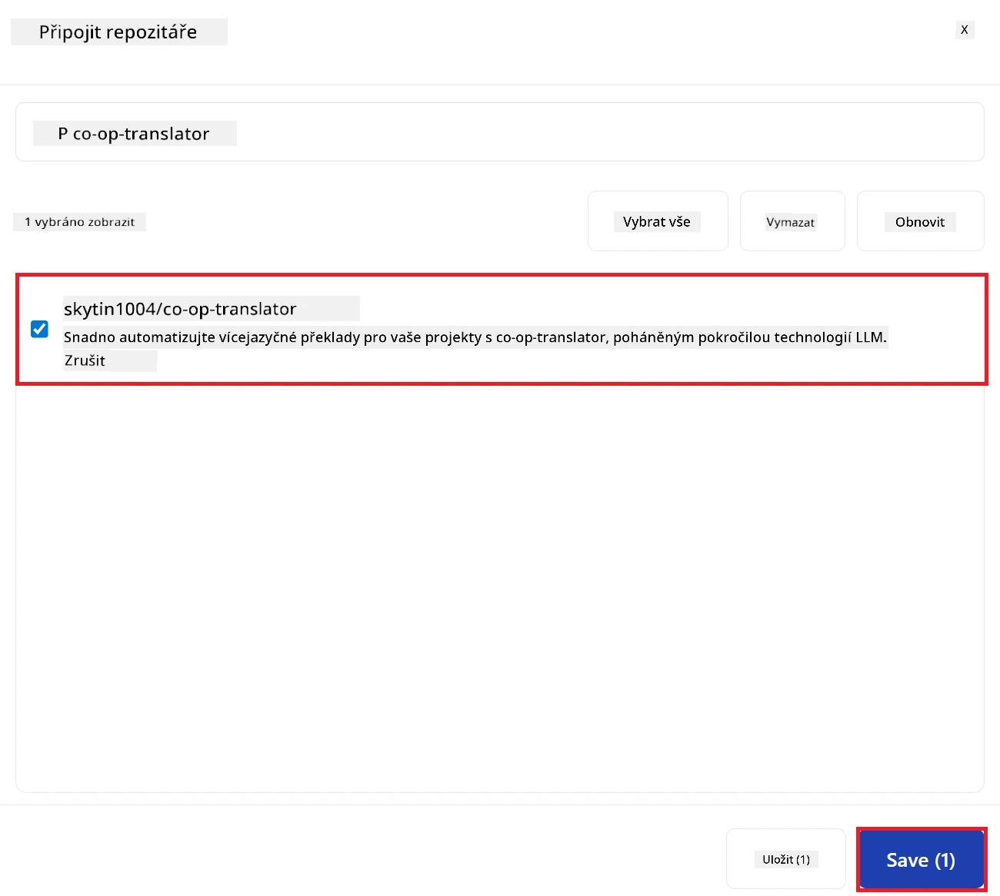

3. Vámi připojené repozitáře se nyní zobrazí jak na domovské stránce, tak na stránce Repositories.  
   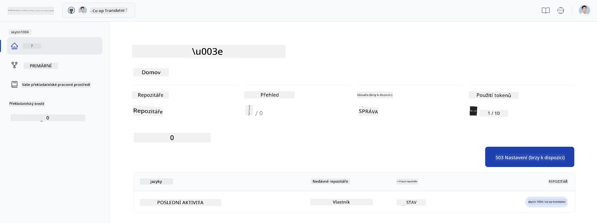

---

## Spusťte automatický překlad

1. Vyberte repozitář, který jste právě připojili.  
   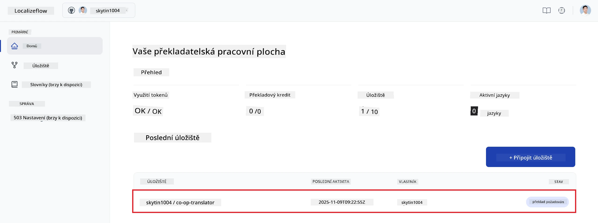

2. Na detailní stránce repozitáře vyberte dole **Edit**.  
   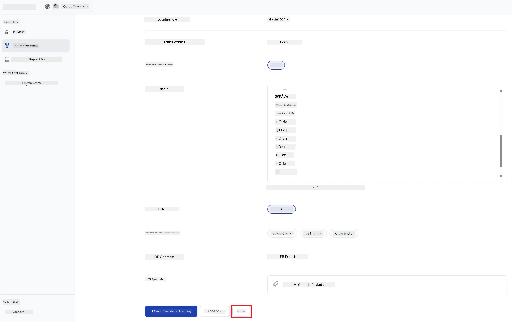

3. Nakonfigurujte nastavení překladu — cílovou větev (výchozí: `main`), cílové jazyky a zdrojový jazyk (výchozí: `en`). Poté vyberte **Save**.  
   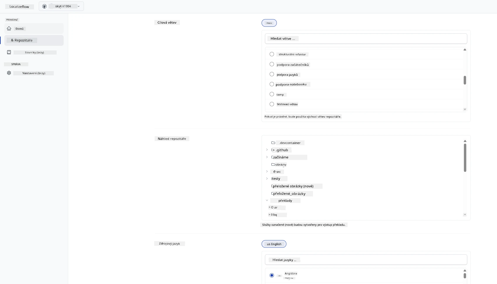

4. Vyberte **Start & Automate**.  
   Localizeflow nyní automaticky přeloží vaši dokumentaci a otevře pull requesty vždy, když dojde ke změně zdroje.  
   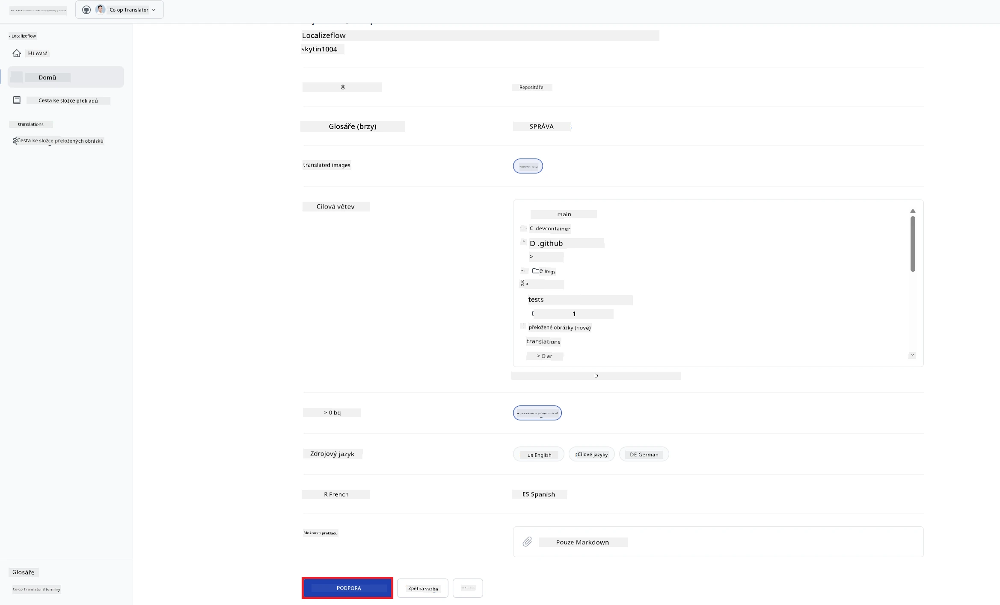

---

<!-- CO-OP TRANSLATOR DISCLAIMER START -->
**Prohlášení o vyloučení odpovědnosti**:
Tento dokument byl přeložen pomocí AI překladatelské služby [Co-op Translator](https://github.com/Azure/co-op-translator). Přestože se snažíme o přesnost, vezměte prosím na vědomí, že automatizované překlady mohou obsahovat chyby nebo nepřesnosti. Původní dokument v jeho rodném jazyce je považován za autoritativní zdroj. Pro důležité informace je doporučen profesionální lidský překlad. Nejsme odpovědní za jakékoliv nedorozumění nebo chybné výklady vzniklé použitím tohoto překladu.
<!-- CO-OP TRANSLATOR DISCLAIMER END -->