# Localizeflow – Guía de inicio rápido

#### Con el apoyo de [Localizeflow](https://localizeflow.com/)

<!-- CO-OP TRANSLATOR LANGUAGES TABLE START -->
[Arabic](../ar/README.md) | [Bengali](../bn/README.md) | [Bulgarian](../bg/README.md) | [Burmese (Myanmar)](../my/README.md) | [Chinese (Simplified)](../zh-CN/README.md) | [Chinese (Traditional, Hong Kong)](../zh-HK/README.md) | [Chinese (Traditional, Macau)](../zh-MO/README.md) | [Chinese (Traditional, Taiwan)](../zh-TW/README.md) | [Croatian](../hr/README.md) | [Czech](../cs/README.md) | [Danish](../da/README.md) | [Dutch](../nl/README.md) | [Estonian](../et/README.md) | [Finnish](../fi/README.md) | [French](../fr/README.md) | [German](../de/README.md) | [Greek](../el/README.md) | [Hebrew](../he/README.md) | [Hindi](../hi/README.md) | [Hungarian](../hu/README.md) | [Indonesian](../id/README.md) | [Italian](../it/README.md) | [Japanese](../ja/README.md) | [Kannada](../kn/README.md) | [Korean](../ko/README.md) | [Lithuanian](../lt/README.md) | [Malay](../ms/README.md) | [Malayalam](../ml/README.md) | [Marathi](../mr/README.md) | [Nepali](../ne/README.md) | [Nigerian Pidgin](../pcm/README.md) | [Norwegian](../no/README.md) | [Persian (Farsi)](../fa/README.md) | [Polish](../pl/README.md) | [Portuguese (Brazil)](../pt-BR/README.md) | [Portuguese (Portugal)](../pt-PT/README.md) | [Punjabi (Gurmukhi)](../pa/README.md) | [Romanian](../ro/README.md) | [Russian](../ru/README.md) | [Serbian (Cyrillic)](../sr/README.md) | [Slovak](../sk/README.md) | [Slovenian](../sl/README.md) | [Spanish](./README.md) | [Swahili](../sw/README.md) | [Swedish](../sv/README.md) | [Tagalog (Filipino)](../tl/README.md) | [Tamil](../ta/README.md) | [Telugu](../te/README.md) | [Thai](../th/README.md) | [Turkish](../tr/README.md) | [Ukrainian](../uk/README.md) | [Urdu](../ur/README.md) | [Vietnamese](../vi/README.md)

> **¿Prefieres clonar localmente?**

> Este repositorio incluye más de 50 idiomas traducidos, lo que aumenta significativamente el tamaño de la descarga. Para clonar sin las traducciones, usa sparse checkout:  
> ```bash
> git clone --filter=blob:none --sparse https://github.com/localizeflow/localizeflow-docs.git
> cd localizeflow-docs
> git sparse-checkout set --no-cone '/*' '!translations' '!translated_images'
> ```
> Esto te ofrece todo lo necesario para completar el curso con una descarga mucho más rápida.
<!-- CO-OP TRANSLATOR LANGUAGES TABLE END -->

Localizeflow traduce automáticamente tu documentación y abre pull requests cada vez que el archivo fuente cambia.  
Esta guía te muestra cómo instalar la aplicación de GitHub y ejecutar tu primera traducción en menos de 2 minutos.

> [!NOTE]
>
> Actualmente Localizeflow soporta proyectos de documentación basados en GitHub  
> (por ejemplo: AI for Beginners y la mayoría de repositorios open-source estándar).  
> 
> El soporte para frameworks modernos de documentación como Astro, Docusaurus y Hugo  
> está en desarrollo activo.

---

## Inicia sesión e instala la aplicación de GitHub

1. Visita **[localizeflow.com](https://localizeflow.com/)**.
2. Selecciona **Comenzar con prueba gratuita**.
   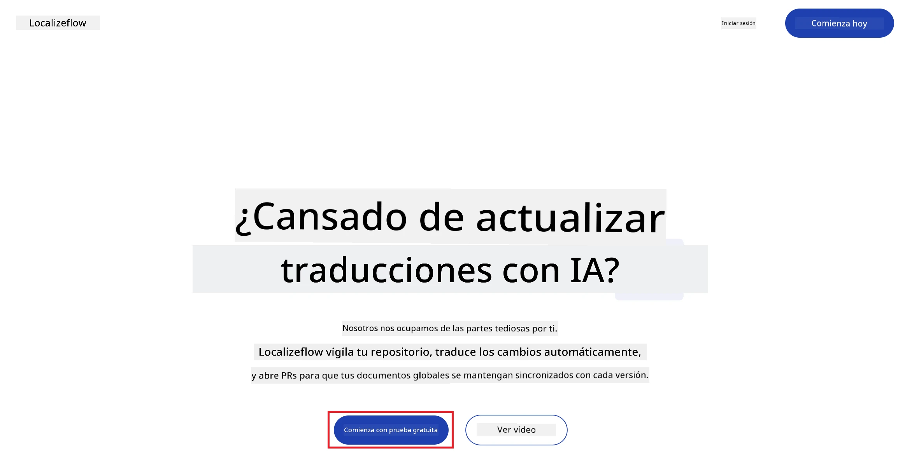
3. Selecciona **Iniciar sesión con GitHub**.  
   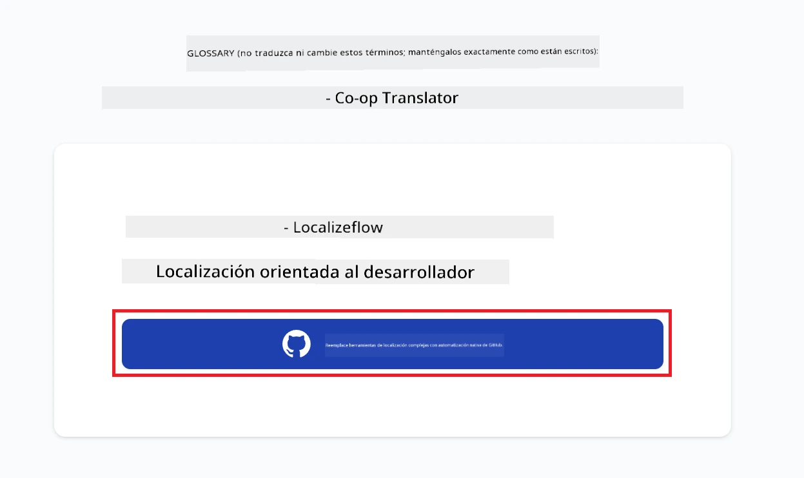
4. Inicia sesión con tu cuenta de GitHub.  
   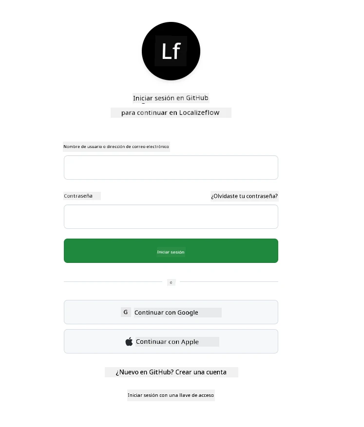
5. Elige la cuenta en la que deseas instalar la aplicación Localizeflow de GitHub — tu cuenta personal o una organización que administres.  
   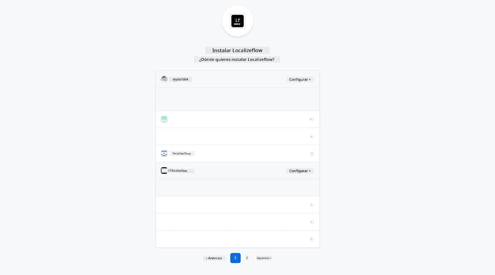
6. Selecciona los repositorios a los que quieres que Localizeflow tenga acceso, luego elige **Guardar**.  
   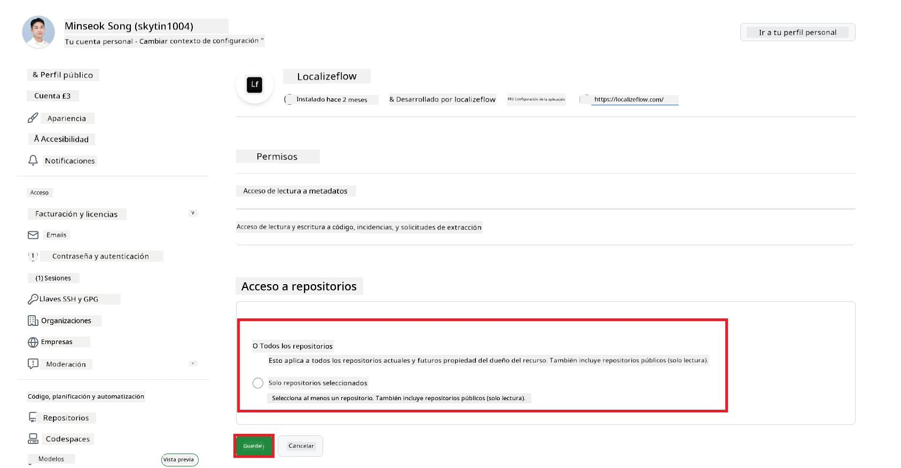
7. Serás redirigido a la página principal de Localizeflow.

> [!TIP]
> Para añadir más repositorios después, selecciona tu cuenta en el encabezado y elige **+ Añadir más repositorios**.  
> 

---

## Conecta tus repositorios a Localizeflow

1. En la página principal de Localizeflow, selecciona **+ Conectar repositorios**.  
   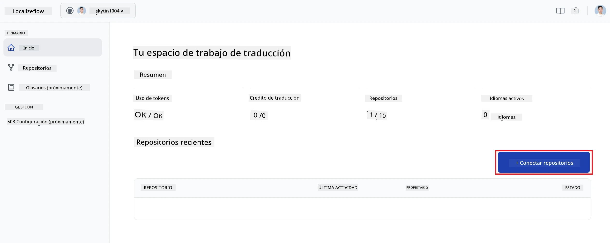

2. Elige uno de los repositorios instalados que quieres conectar y selecciona **Guardar**.  
   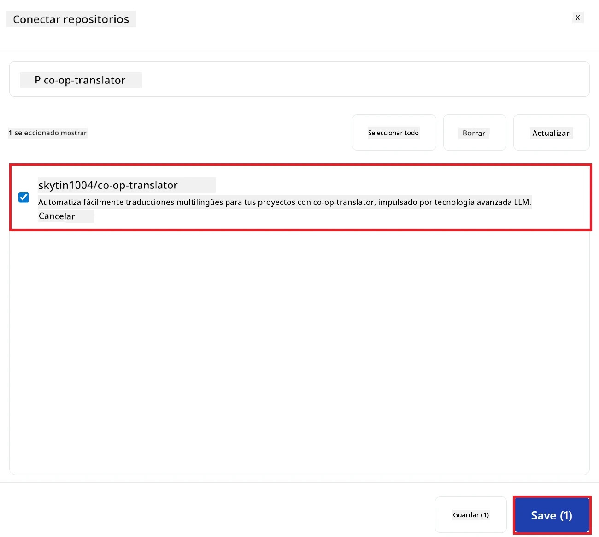

3. Tus repositorios conectados aparecerán ahora tanto en la página principal como en la página de Repositorios.  
   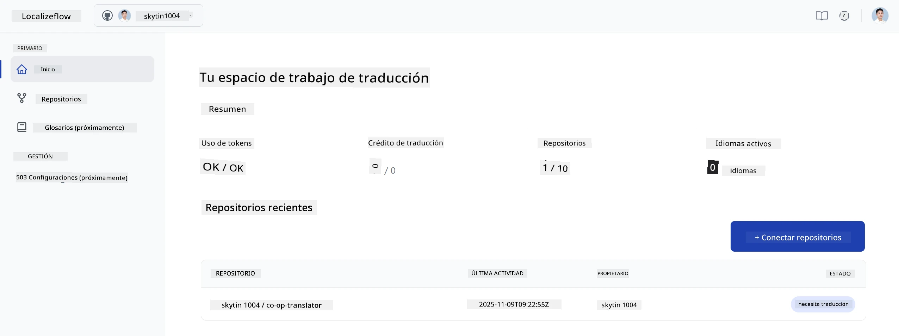

---

## Comienza la traducción automática

1. Selecciona el repositorio que acabas de conectar.  
   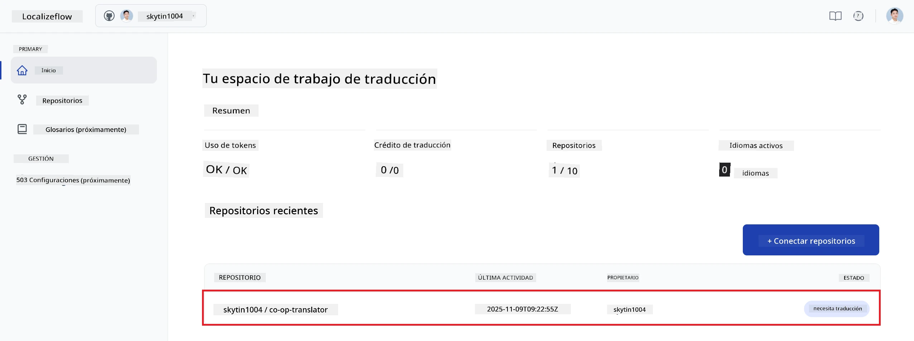

2. En la página del detalle del repositorio, selecciona **Editar** en la parte inferior.  
   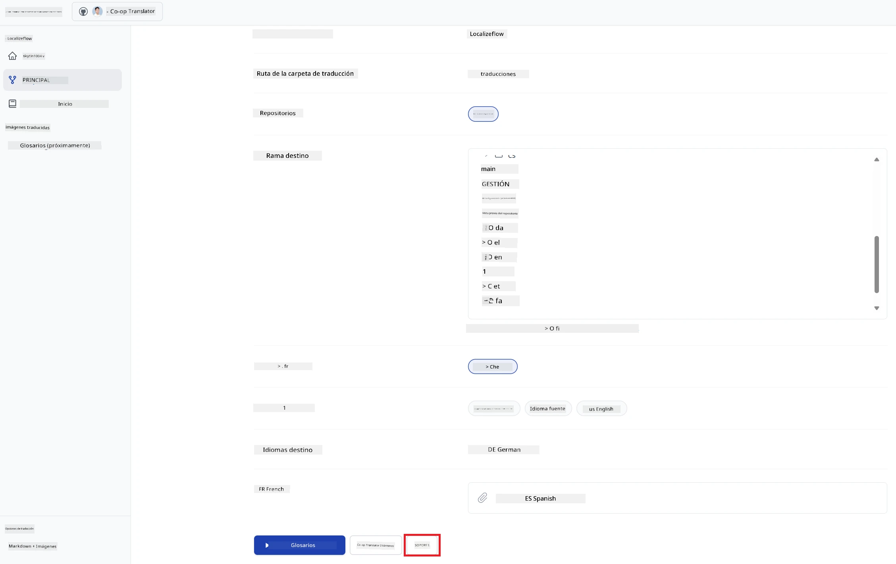

3. Configura tus ajustes de traducción — rama objetivo (predeterminado: `main`), idiomas objetivo y idioma fuente (predeterminado: `en`). Selecciona **Guardar**.  
   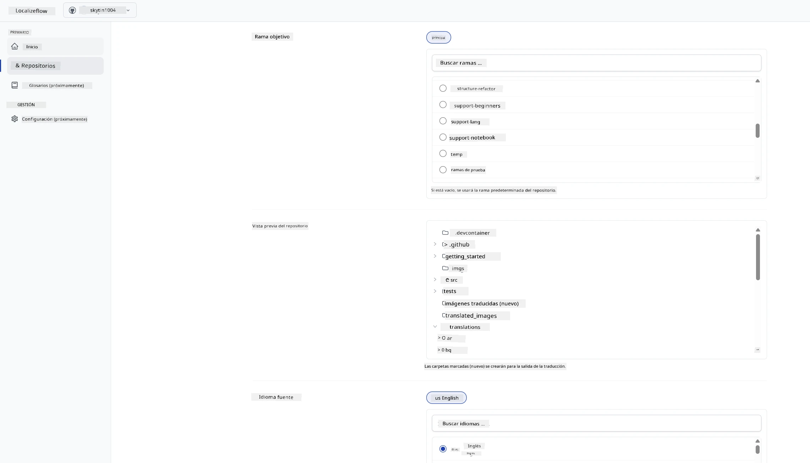

4. Selecciona **Iniciar y Automatizar**.  
   Localizeflow ahora traducirá automáticamente tu documentación y abrirá pull requests cada vez que cambie el archivo fuente.  
   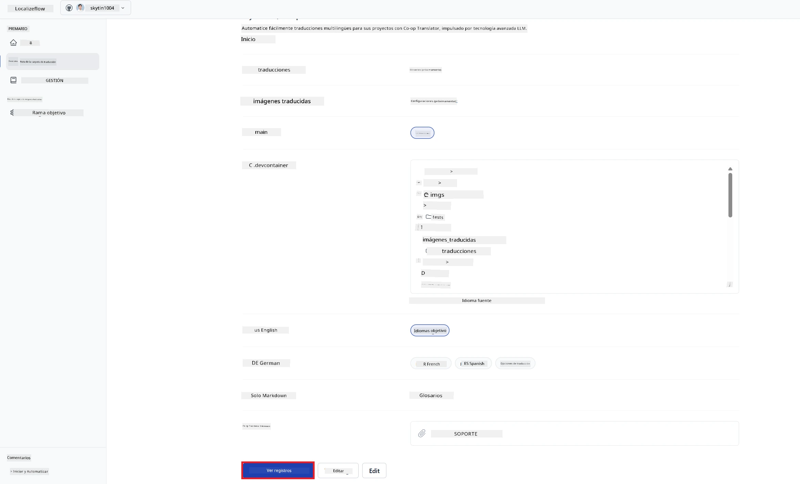

---

<!-- CO-OP TRANSLATOR DISCLAIMER START -->
**Aviso Legal**:
Este documento ha sido traducido utilizando el servicio de traducción automática [Co-op Translator](https://github.com/Azure/co-op-translator). Aunque nos esforzamos por la precisión, tenga en cuenta que las traducciones automatizadas pueden contener errores o inexactitudes. El documento original en su idioma nativo debe considerarse la fuente autorizada. Para información crítica, se recomienda una traducción profesional realizada por humanos. No nos hacemos responsables de ningún malentendido o interpretación errónea derivada del uso de esta traducción.
<!-- CO-OP TRANSLATOR DISCLAIMER END -->