# Localizeflow – Kiirjuhend

#### Toetatud [Localizeflow](https://localizeflow.com/) poolt

<!-- CO-OP TRANSLATOR LANGUAGES TABLE START -->
[Arabic](../ar/README.md) | [Bengali](../bn/README.md) | [Bulgarian](../bg/README.md) | [Burmese (Myanmar)](../my/README.md) | [Chinese (Simplified)](../zh-CN/README.md) | [Chinese (Traditional, Hong Kong)](../zh-HK/README.md) | [Chinese (Traditional, Macau)](../zh-MO/README.md) | [Chinese (Traditional, Taiwan)](../zh-TW/README.md) | [Croatian](../hr/README.md) | [Czech](../cs/README.md) | [Danish](../da/README.md) | [Dutch](../nl/README.md) | [Estonian](./README.md) | [Finnish](../fi/README.md) | [French](../fr/README.md) | [German](../de/README.md) | [Greek](../el/README.md) | [Hebrew](../he/README.md) | [Hindi](../hi/README.md) | [Hungarian](../hu/README.md) | [Indonesian](../id/README.md) | [Italian](../it/README.md) | [Japanese](../ja/README.md) | [Kannada](../kn/README.md) | [Korean](../ko/README.md) | [Lithuanian](../lt/README.md) | [Malay](../ms/README.md) | [Malayalam](../ml/README.md) | [Marathi](../mr/README.md) | [Nepali](../ne/README.md) | [Nigerian Pidgin](../pcm/README.md) | [Norwegian](../no/README.md) | [Persian (Farsi)](../fa/README.md) | [Polish](../pl/README.md) | [Portuguese (Brazil)](../pt-BR/README.md) | [Portuguese (Portugal)](../pt-PT/README.md) | [Punjabi (Gurmukhi)](../pa/README.md) | [Romanian](../ro/README.md) | [Russian](../ru/README.md) | [Serbian (Cyrillic)](../sr/README.md) | [Slovak](../sk/README.md) | [Slovenian](../sl/README.md) | [Spanish](../es/README.md) | [Swahili](../sw/README.md) | [Swedish](../sv/README.md) | [Tagalog (Filipino)](../tl/README.md) | [Tamil](../ta/README.md) | [Telugu](../te/README.md) | [Thai](../th/README.md) | [Turkish](../tr/README.md) | [Ukrainian](../uk/README.md) | [Urdu](../ur/README.md) | [Vietnamese](../vi/README.md)

> **Eelistad kloonimist lokaalselt?**

> See hoidla sisaldab üle 50 keele tõlget, mis suurendab oluliselt allalaadimise mahtu. Tõlgeteta kloonimiseks kasuta sparsent väljavõtet:  
> ```bash
> git clone --filter=blob:none --sparse https://github.com/localizeflow/localizeflow-docs.git
> cd localizeflow-docs
> git sparse-checkout set --no-cone '/*' '!translations' '!translated_images'
> ```
> See annab sulle kõik vajaliku kursuse lõpetamiseks palju kiiremalt.

<!-- CO-OP TRANSLATOR LANGUAGES TABLE END -->

Localizeflow tõlgib sinu dokumentatsiooni automaatselt ning avab pull requeste iga kord, kui algfail muutub.  
See juhend näitab, kuidas paigaldada GitHubi rakendus ja käivitada esimene tõlge vähem kui 2 minutiga.


> [!NOTE]
>
> Localizeflow toetab hetkel GitHubi-põhiseid dokumentatsiooniprojekte  
> (näiteks: AI for Beginners ja enamik standardseid avatud lähtekoodiga hoidlaid).  
> 
> Toetust kaasaegsetele dokumentatsiooniraamistikule nagu Astro, Docusaurus ja Hugo  
> arendatakse aktiivselt.


---

## Logi sisse ja paigalda GitHubi rakendus

1. Mine aadressile **[localizeflow.com](https://localizeflow.com/)**.
2. Vali **Start with free trial**.  
   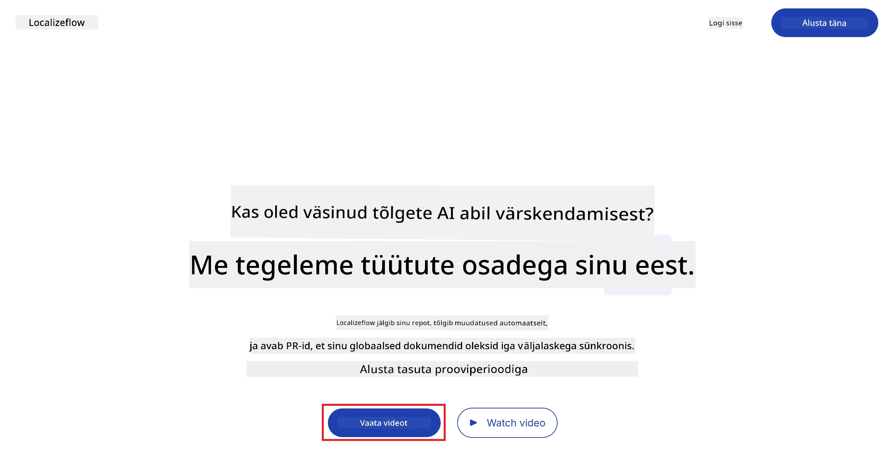
3. Vali **Sign in with GitHub**.  
   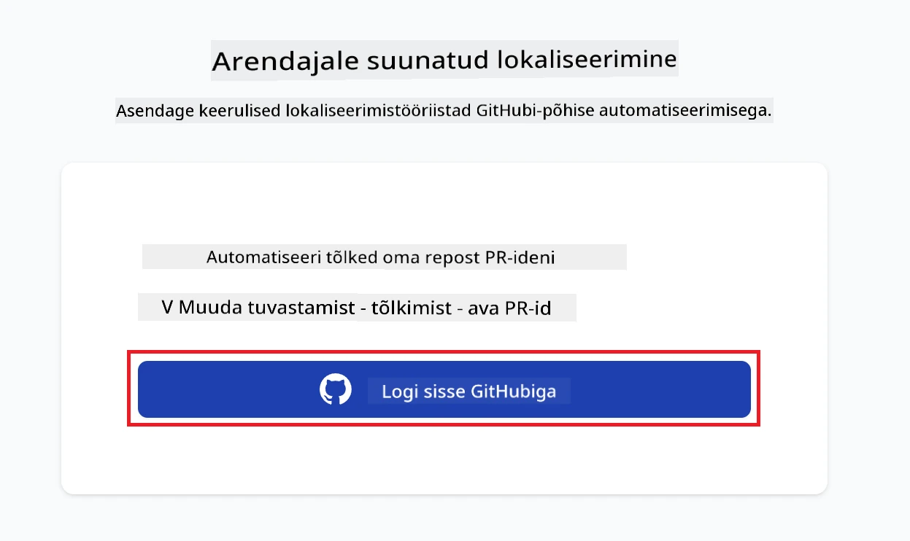
4. Logi sisse oma GitHubi kontoga.  
   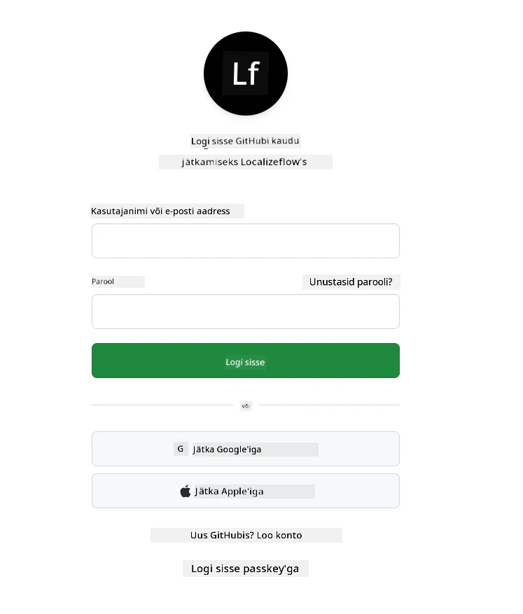
5. Vali konto, kuhu soovid Localizeflow GitHubi rakenduse installida — kas isiklik konto või organisatsioon, mida haldad.  
   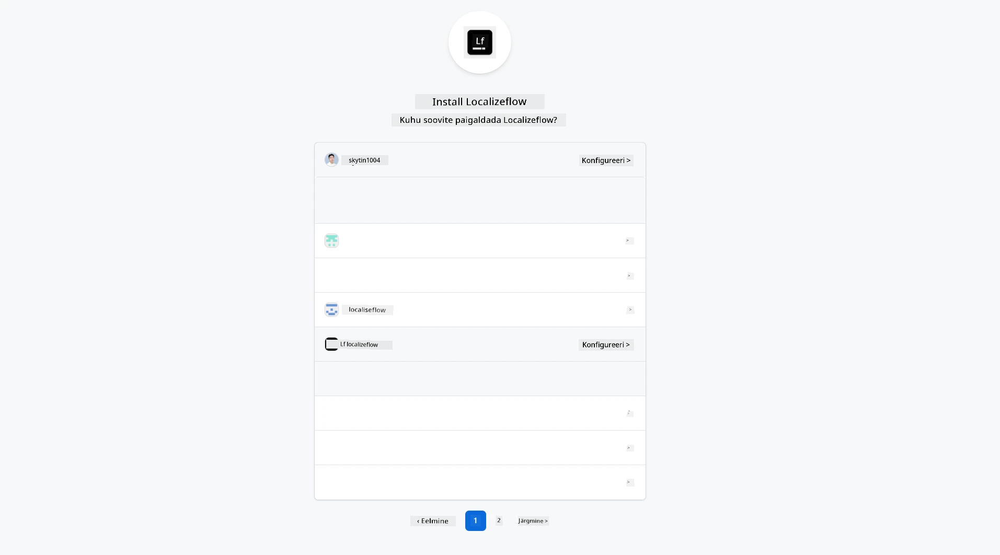
6. Vali hoidlad, millele soovid Localizeflow'l ligipääsu anda, seejärel vali **Save**.  
   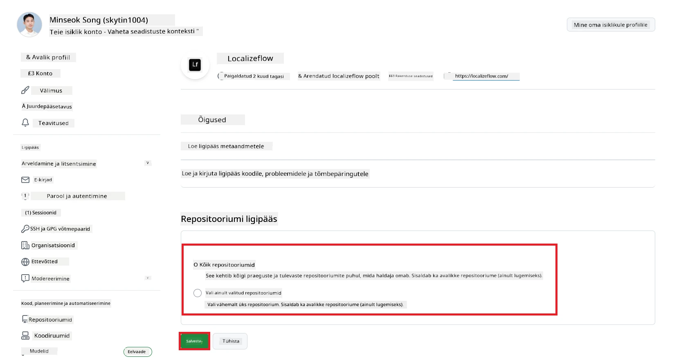
7. Sind suunatakse tagasi Localizeflow avalehele.

> [!TIP]
> Hiljem saab juurde lisada hoidlasi, valides oma konto päises ja klõpsates **+ Add more repositories**.  
> 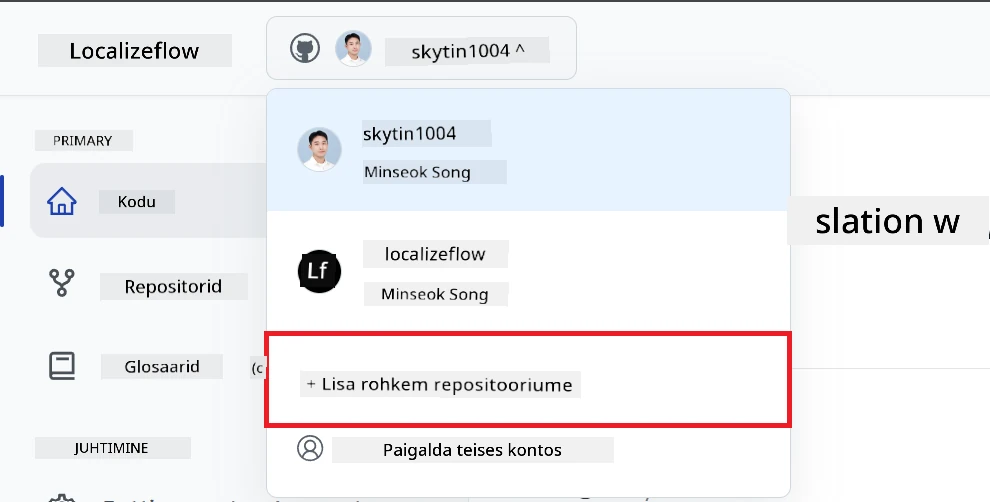

---

## Ühenda oma hoidlad Localizeflow'ga

1. Localizeflow avalehel vali **+ Connect repositories**.  
   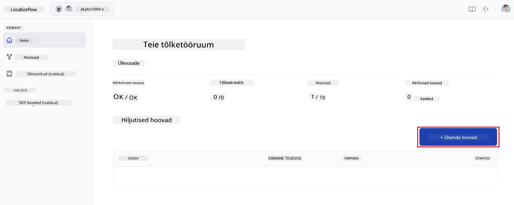

2. Vali üks paigaldatud hoidlatest, mida soovid ühendada, ja vali **Save**.  
   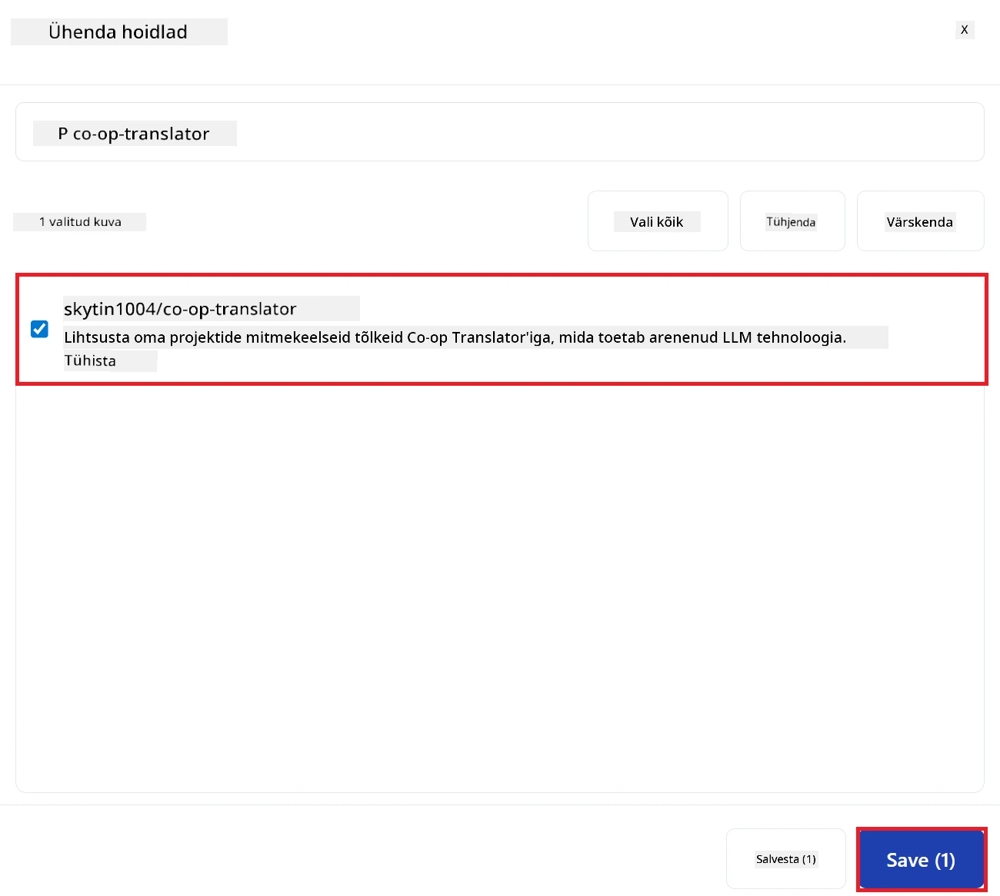

3. Ühendatud hoidlad kuvatakse nüüd nii Avalehel kui ka Hoidlate lehel.  
   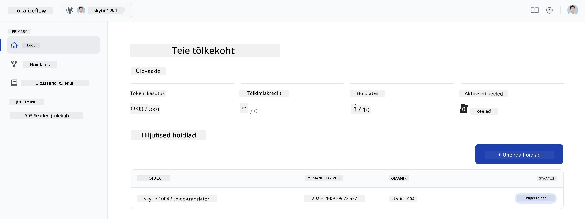

---

## Alusta automaatset tõlget

1. Vali äsja ühendatud hoidla.  
   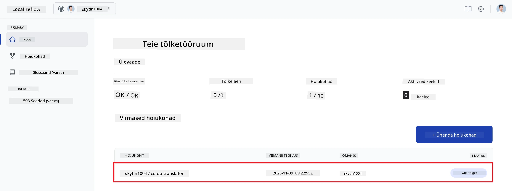

2. Hoidla detaillehel vali allosas **Edit**.  
   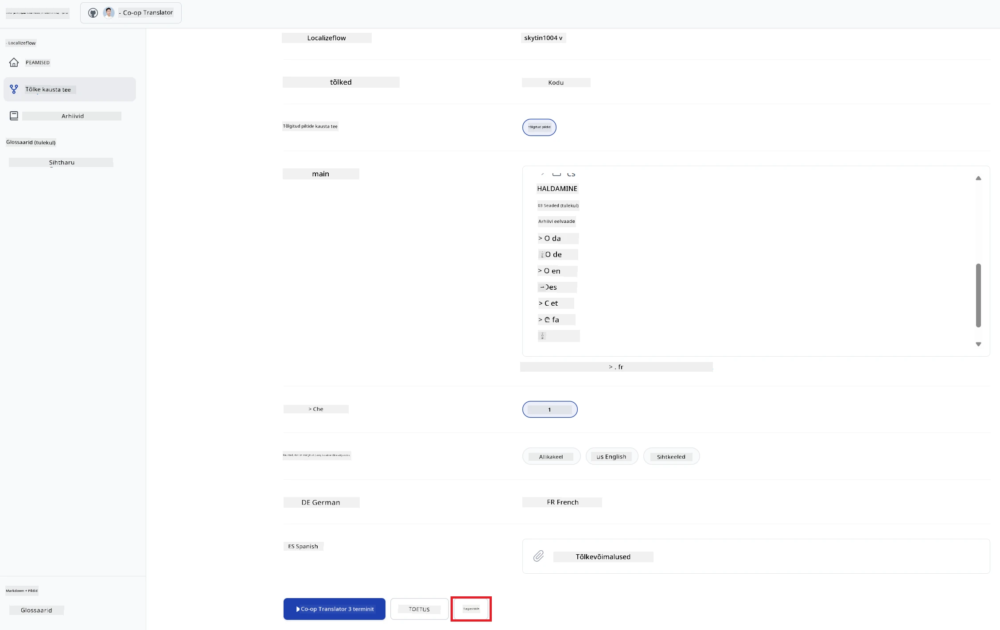

3. Sea oma tõlkesätted — sihtharu (vaikimisi: `main`), sihtkeeled ja lähtekeel (vaikimisi: `en`). Vali **Save**.  
   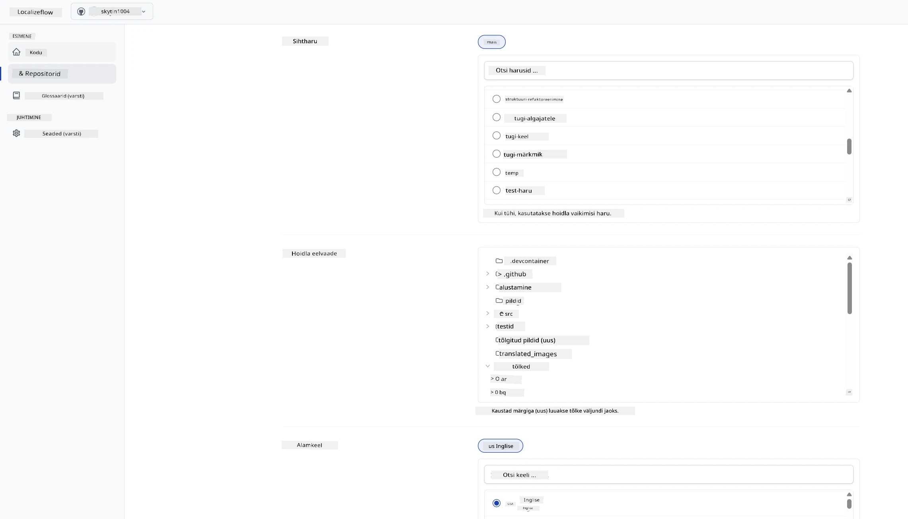

4. Vali **Start & Automate**.  
   Localizeflow hakkab nüüd sinu dokumentatsiooni automaatselt tõlkima ja avab pull requeste iga kord, kui algfail muutub.  
   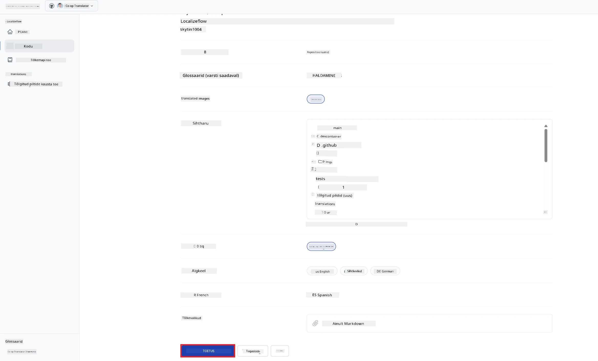

---

<!-- CO-OP TRANSLATOR DISCLAIMER START -->
**Vastutusest loobumine**:
See dokument on tõlgitud tehisintellekti tõlke teenuse [Co-op Translator](https://github.com/Azure/co-op-translator) abil. Kuigi püüame tagada täpsust, palun arvestage, et automatiseeritud tõlked võivad sisaldada vigu või ebatäpsusi. Originaaldokument algkeeles tuleb pidada autoriteetseks allikaks. Olulise teabe puhul soovitatakse kasutada professionaalset inimtõlget. Me ei vastuta ühegi arusaamatuse või väärinterpreteerimise eest, mis võivad tuleneda selle tõlke kasutamisest.
<!-- CO-OP TRANSLATOR DISCLAIMER END -->