# Localizeflow – Vodič za brzo početak

#### Podržano od [Localizeflow](https://localizeflow.com/)

<!-- CO-OP TRANSLATOR LANGUAGES TABLE START -->
[Arabic](../ar/README.md) | [Bengali](../bn/README.md) | [Bulgarian](../bg/README.md) | [Burmese (Myanmar)](../my/README.md) | [Chinese (Simplified)](../zh-CN/README.md) | [Chinese (Traditional, Hong Kong)](../zh-HK/README.md) | [Chinese (Traditional, Macau)](../zh-MO/README.md) | [Chinese (Traditional, Taiwan)](../zh-TW/README.md) | [Croatian](./README.md) | [Czech](../cs/README.md) | [Danish](../da/README.md) | [Dutch](../nl/README.md) | [Estonian](../et/README.md) | [Finnish](../fi/README.md) | [French](../fr/README.md) | [German](../de/README.md) | [Greek](../el/README.md) | [Hebrew](../he/README.md) | [Hindi](../hi/README.md) | [Hungarian](../hu/README.md) | [Indonesian](../id/README.md) | [Italian](../it/README.md) | [Japanese](../ja/README.md) | [Kannada](../kn/README.md) | [Korean](../ko/README.md) | [Lithuanian](../lt/README.md) | [Malay](../ms/README.md) | [Malayalam](../ml/README.md) | [Marathi](../mr/README.md) | [Nepali](../ne/README.md) | [Nigerian Pidgin](../pcm/README.md) | [Norwegian](../no/README.md) | [Persian (Farsi)](../fa/README.md) | [Polish](../pl/README.md) | [Portuguese (Brazil)](../pt-BR/README.md) | [Portuguese (Portugal)](../pt-PT/README.md) | [Punjabi (Gurmukhi)](../pa/README.md) | [Romanian](../ro/README.md) | [Russian](../ru/README.md) | [Serbian (Cyrillic)](../sr/README.md) | [Slovak](../sk/README.md) | [Slovenian](../sl/README.md) | [Spanish](../es/README.md) | [Swahili](../sw/README.md) | [Swedish](../sv/README.md) | [Tagalog (Filipino)](../tl/README.md) | [Tamil](../ta/README.md) | [Telugu](../te/README.md) | [Thai](../th/README.md) | [Turkish](../tr/README.md) | [Ukrainian](../uk/README.md) | [Urdu](../ur/README.md) | [Vietnamese](../vi/README.md)

> **Radije klonirati lokalno?**

> Ovaj repozitorij uključuje više od 50 prijevoda jezika koji značajno povećavaju veličinu preuzimanja. Za kloniranje bez prijevoda, koristite sparse checkout:
> ```bash
> git clone --filter=blob:none --sparse https://github.com/localizeflow/localizeflow-docs.git
> cd localizeflow-docs
> git sparse-checkout set --no-cone '/*' '!translations' '!translated_images'
> ```
> Ovo vam daje sve što vam je potrebno za dovršetak tečaja uz znatno brže preuzimanje.
<!-- CO-OP TRANSLATOR LANGUAGES TABLE END -->

Localizeflow automatski prevodi vašu dokumentaciju i otvara pull zahtjeve kad god se izvorna datoteka promijeni.  
Ovaj vodič prikazuje kako instalirati GitHub aplikaciju i pokrenuti prvi prijevod za manje od 2 minute.


> [!NOTE]
>
> Localizeflow trenutno podržava projekte s dokumentacijom temeljene na GitHub-u
> (na primjer: AI for Beginners i većina standardnih open-source repozitorija).  
> 
> Podrška za moderne dokumentacijske okvire kao što su Astro, Docusaurus i Hugo  
> je u aktivnom razvoju.


---

## Prijavite se i instalirajte GitHub aplikaciju

1. Posjetite **[localizeflow.com](https://localizeflow.com/)**.
2. Odaberite **Start with free trial**.
   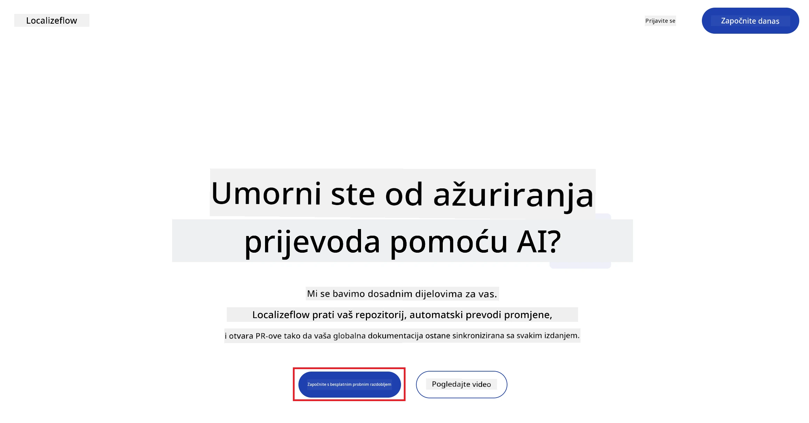
3. Odaberite **Sign in with GitHub**.  
   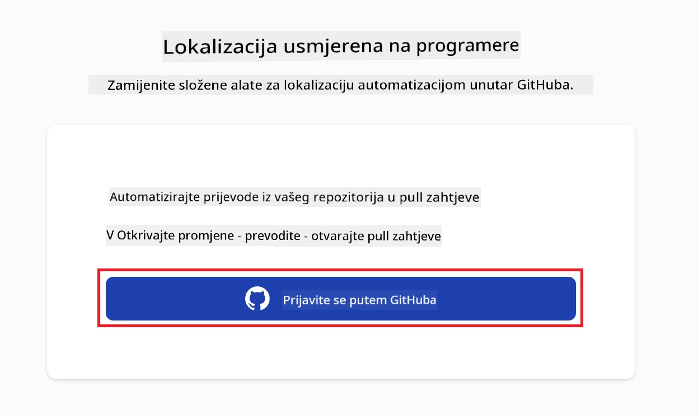
4. Prijavite se putem svog GitHub računa.  
   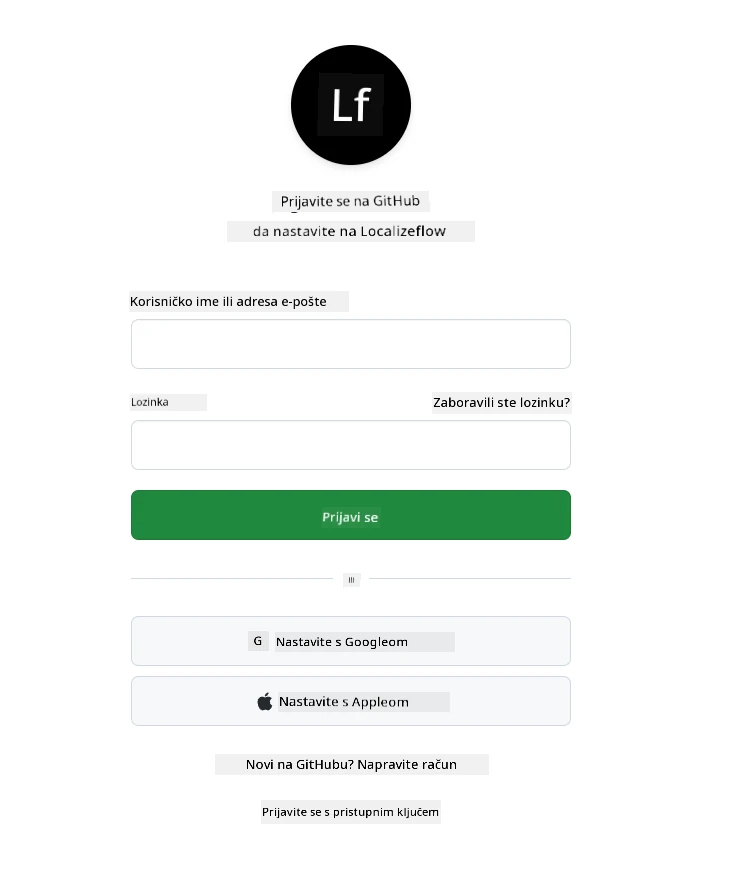
5. Odaberite račun na koji želite instalirati Localizeflow GitHub aplikaciju — svoj osobni račun ili neku organizaciju kojom upravljate.  
   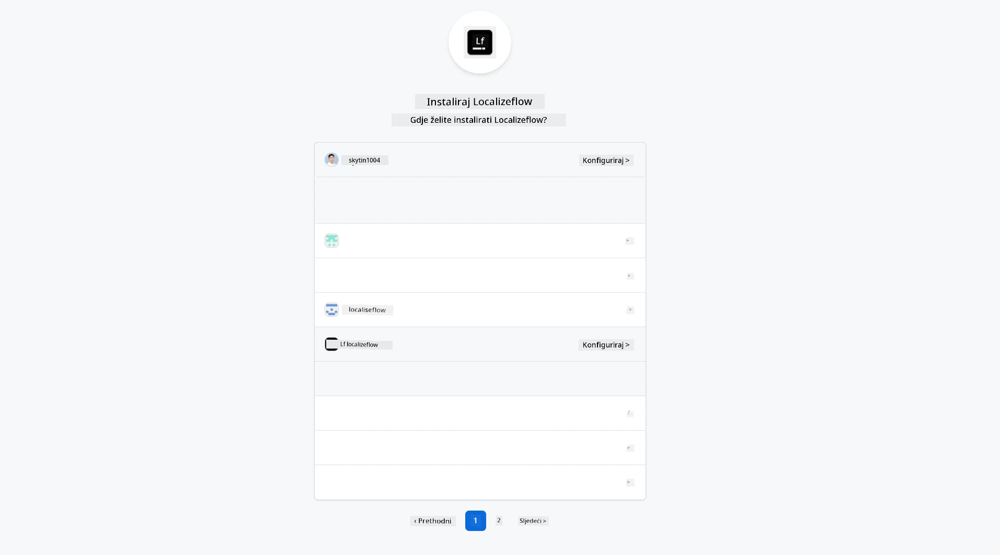
6. Odaberite repozitorije kojima želite dopustiti pristup Localizeflow-u, zatim odaberite **Save**.  
   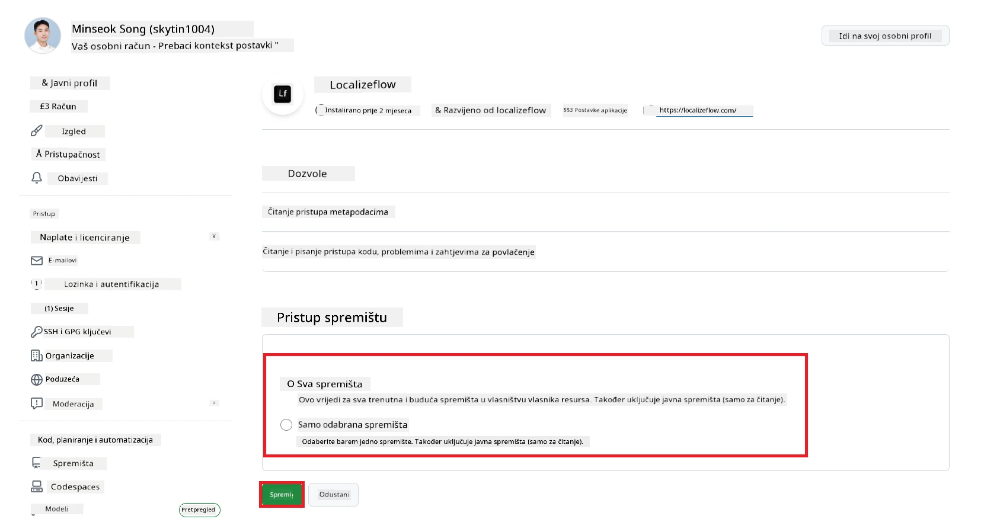
7. Bit ćete preusmjereni na početnu stranicu Localizeflow-a.

> [!TIP]
> Za dodavanje više repozitorija kasnije, odaberite svoj račun u zaglavlju i odaberite **+ Add more repositories**.  
> 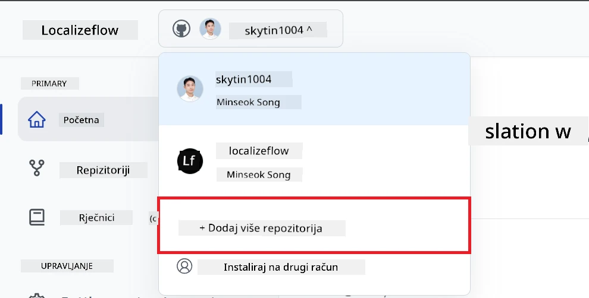

---

## Povežite svoje repozitorije s Localizeflow

1. Na početnoj stranici Localizeflow-a odaberite **+ Connect repositories**.  
   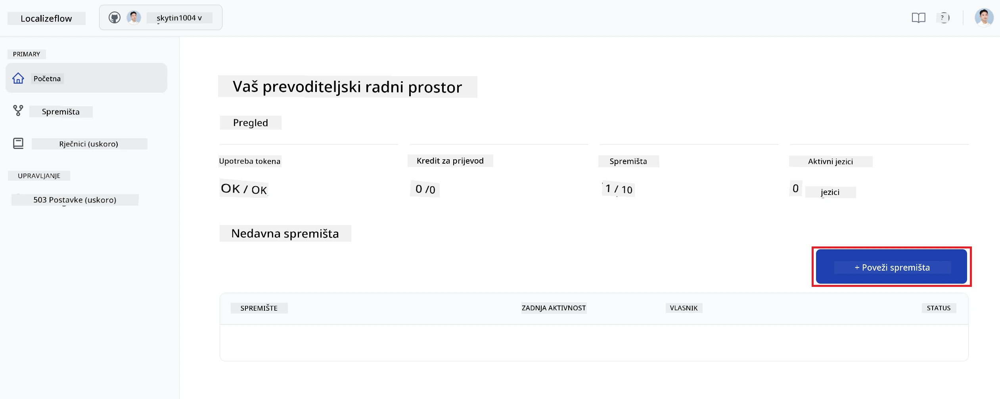

2. Odaberite jedan od instaliranih repozitorija koji želite povezati i odaberite **Save**.  
   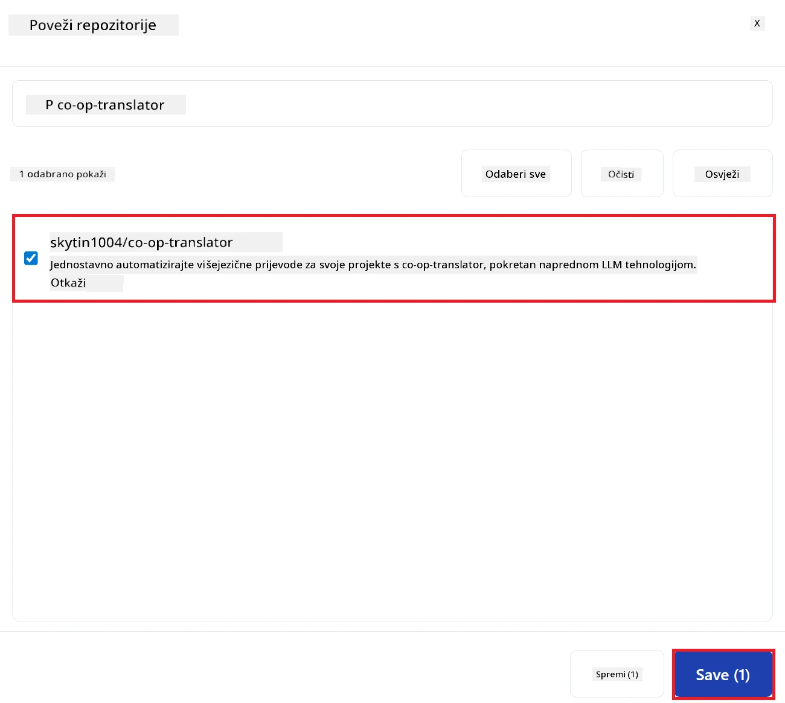

3. Vaši povezani repozitoriji sada će se prikazivati i na početnoj stranici i na stranici Repositories.  
   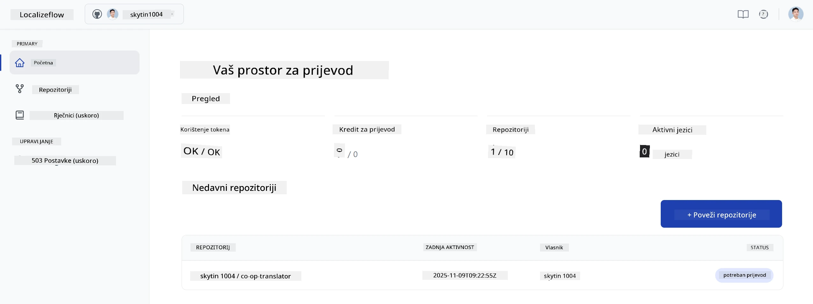

---

## Pokrenite automatski prijevod

1. Odaberite repozitorij koji ste upravo povezali.  
   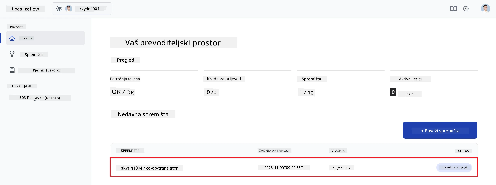

2. Na stranici s detaljima repozitorija, pri dnu odaberite **Edit**.  
   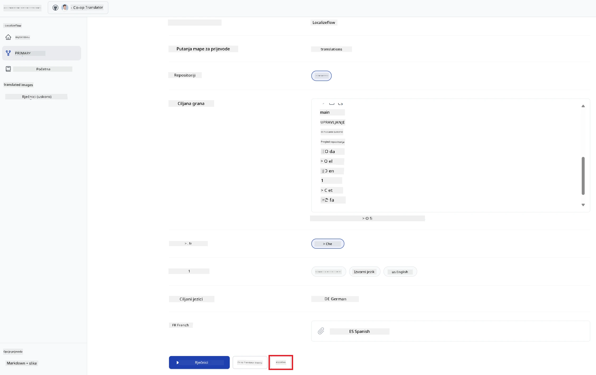

3. Konfigurirajte svoje postavke prijevoda — ciljnu granu (zadano: `main`), ciljne jezike i izvorni jezik (zadano: `en`). Odaberite **Save**.  
   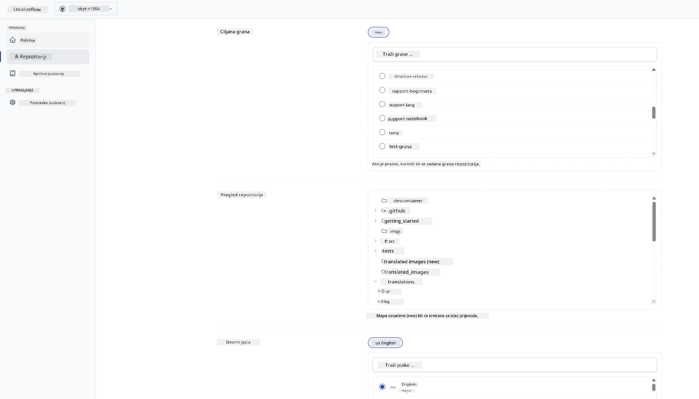

4. Odaberite **Start & Automate**.  
   Localizeflow će sada automatski prevoditi vašu dokumentaciju i otvarati pull zahtjeve kad god se izvor promijeni.  
   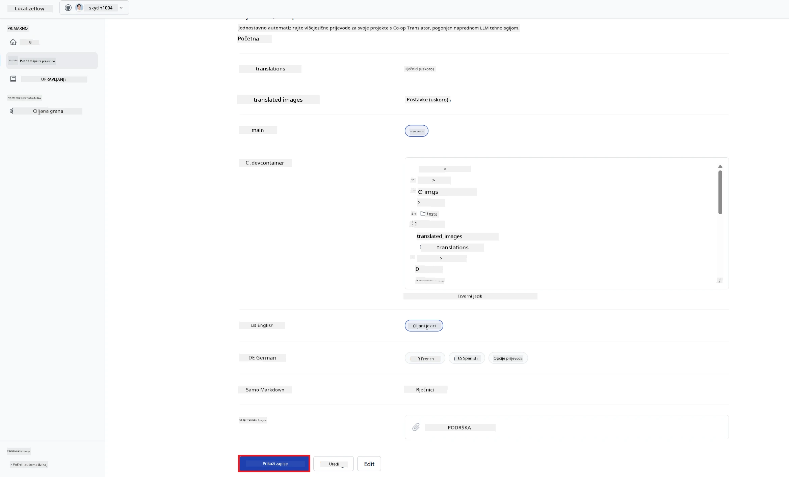

---

<!-- CO-OP TRANSLATOR DISCLAIMER START -->
**Izjava o odricanju od odgovornosti**:
Ovaj dokument je preveden pomoću AI usluge za prijevod [Co-op Translator](https://github.com/Azure/co-op-translator). Iako težimo točnosti, imajte na umu da automatski prijevodi mogu sadržavati pogreške ili netočnosti. Izvorni dokument na njegovom izvornom jeziku smatra se autoritativnim izvorom. Za kritične informacije preporučujemo profesionalni ljudski prijevod. Ne snosimo odgovornost za bilo kakva nesporazuma ili kriva tumačenja koja proizlaze iz korištenja ovog prijevoda.
<!-- CO-OP TRANSLATOR DISCLAIMER END -->