# Localizeflow – Gyors kezdő útmutató

#### Támogatja a [Localizeflow](https://localizeflow.com/)

<!-- CO-OP TRANSLATOR LANGUAGES TABLE START -->
[Arabic](../ar/README.md) | [Bengali](../bn/README.md) | [Bulgarian](../bg/README.md) | [Burmese (Myanmar)](../my/README.md) | [Chinese (Simplified)](../zh-CN/README.md) | [Chinese (Traditional, Hong Kong)](../zh-HK/README.md) | [Chinese (Traditional, Macau)](../zh-MO/README.md) | [Chinese (Traditional, Taiwan)](../zh-TW/README.md) | [Croatian](../hr/README.md) | [Czech](../cs/README.md) | [Danish](../da/README.md) | [Dutch](../nl/README.md) | [Estonian](../et/README.md) | [Finnish](../fi/README.md) | [French](../fr/README.md) | [German](../de/README.md) | [Greek](../el/README.md) | [Hebrew](../he/README.md) | [Hindi](../hi/README.md) | [Hungarian](./README.md) | [Indonesian](../id/README.md) | [Italian](../it/README.md) | [Japanese](../ja/README.md) | [Kannada](../kn/README.md) | [Korean](../ko/README.md) | [Lithuanian](../lt/README.md) | [Malay](../ms/README.md) | [Malayalam](../ml/README.md) | [Marathi](../mr/README.md) | [Nepali](../ne/README.md) | [Nigerian Pidgin](../pcm/README.md) | [Norwegian](../no/README.md) | [Persian (Farsi)](../fa/README.md) | [Polish](../pl/README.md) | [Portuguese (Brazil)](../pt-BR/README.md) | [Portuguese (Portugal)](../pt-PT/README.md) | [Punjabi (Gurmukhi)](../pa/README.md) | [Romanian](../ro/README.md) | [Russian](../ru/README.md) | [Serbian (Cyrillic)](../sr/README.md) | [Slovak](../sk/README.md) | [Slovenian](../sl/README.md) | [Spanish](../es/README.md) | [Swahili](../sw/README.md) | [Swedish](../sv/README.md) | [Tagalog (Filipino)](../tl/README.md) | [Tamil](../ta/README.md) | [Telugu](../te/README.md) | [Thai](../th/README.md) | [Turkish](../tr/README.md) | [Ukrainian](../uk/README.md) | [Urdu](../ur/README.md) | [Vietnamese](../vi/README.md)

> **Inkább helyben klónoznál?**

> Ez a tároló több mint 50 nyelvi fordítást tartalmaz, ami jelentősen megnöveli a letöltési méretet. Ha fordítások nélküli klónozást szeretnél, használd a sparse checkout-ot:  
> ```bash
> git clone --filter=blob:none --sparse https://github.com/localizeflow/localizeflow-docs.git
> cd localizeflow-docs
> git sparse-checkout set --no-cone '/*' '!translations' '!translated_images'
> ```
> Ez mindent megad, amire szükséged van a kurzus teljesítéséhez sokkal gyorsabb letöltéssel.
<!-- CO-OP TRANSLATOR LANGUAGES TABLE END -->

A Localizeflow automatikusan lefordítja a dokumentációdat, és húzási kérelmeket nyit, amikor a forrásfájl változik.  
Ez az útmutató megmutatja, hogyan telepítheted a GitHub alkalmazást, és futtathatod első fordításodat kevesebb mint 2 perc alatt.


> [!NOTE]
>
> A Localizeflow jelenleg GitHub-alapú dokumentációs projektek támogatását nyújtja
> (például: AI for Beginners és a legtöbb szabványos nyílt forráskódú tároló).  
> 
> Modern dokumentációs keretrendszerek, mint az Astro, Docusaurus és Hugo támogatása
> aktív fejlesztés alatt áll.


---

## Jelentkezz be és telepítsd a GitHub alkalmazást

1. Látogass el a **[localizeflow.com](https://localizeflow.com/)** oldalra.
2. Válaszd a **Start with free trial** opciót.
   
3. Válaszd a **Sign in with GitHub** lehetőséget.  
   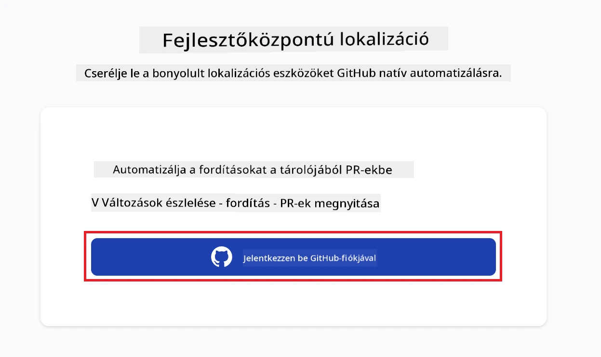
4. Jelentkezz be a GitHub fiókoddal.  
   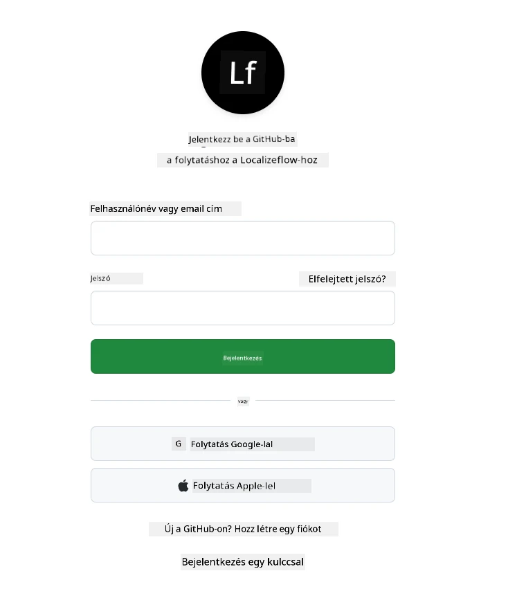
5. Válaszd ki azt a fiókot, ahol telepíteni szeretnéd a Localizeflow GitHub alkalmazást — a saját személyes fiókodat vagy egy általad kezelt szervezetet.  
   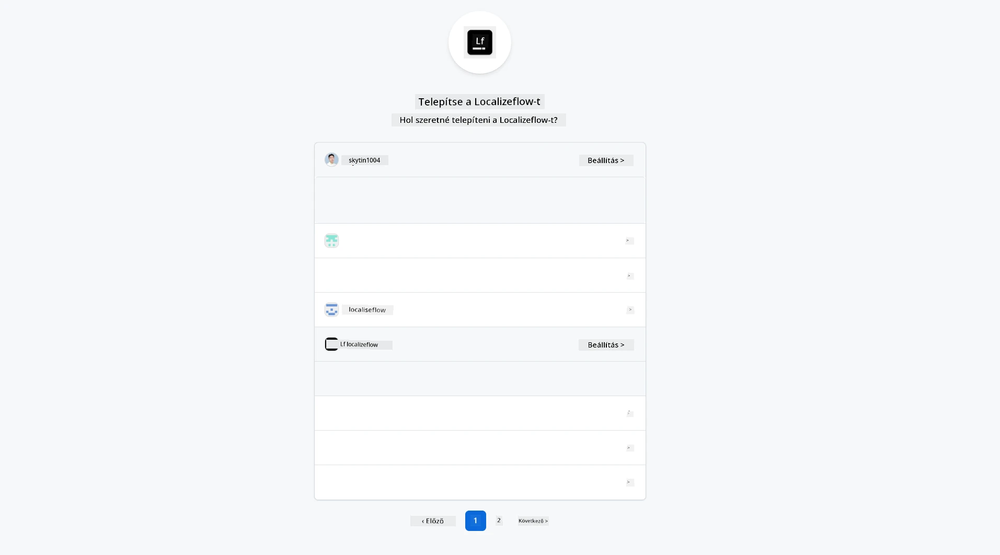
6. Válaszd ki azokat a tárolókat, amelyekhez a Localizeflow hozzáférést kapjon, majd kattints a **Save** gombra.  
   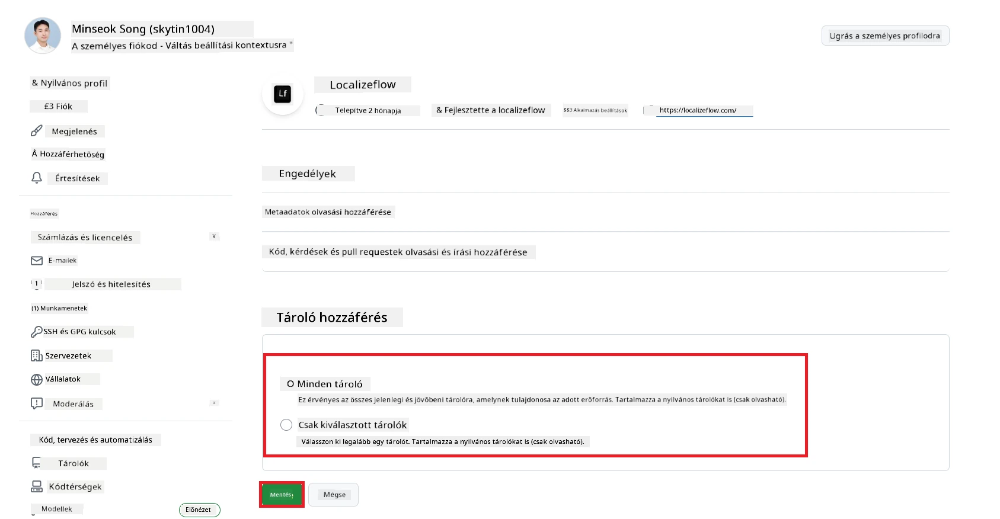
7. Átirányítanak a Localizeflow kezdőlapjára.

> [!TIP]
> Ha később szeretnél több tárolót hozzáadni, válaszd ki a fiókodat a fejlécben, majd kattints a **+ Add more repositories** lehetőségre.  
> 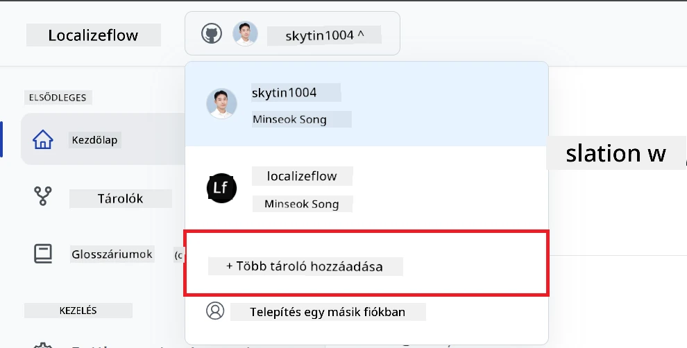

---

## Kapcsold össze tárolóidat a Localizeflow-val

1. A Localizeflow kezdőlapon válaszd a **+ Connect repositories** lehetőséget.  
   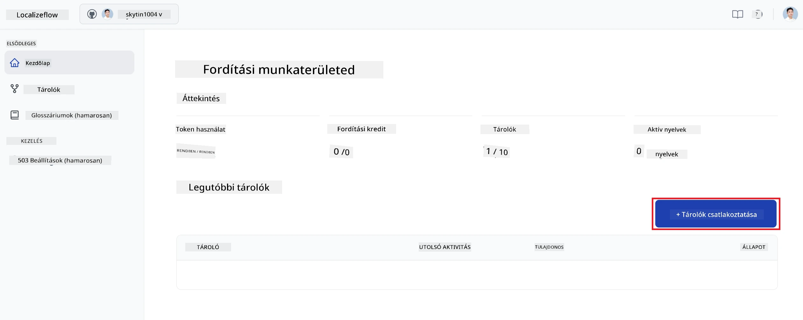

2. Válaszd ki az egyik telepített tárolót, amelyet csatlakoztatni szeretnél, majd kattints a **Save** gombra.  
   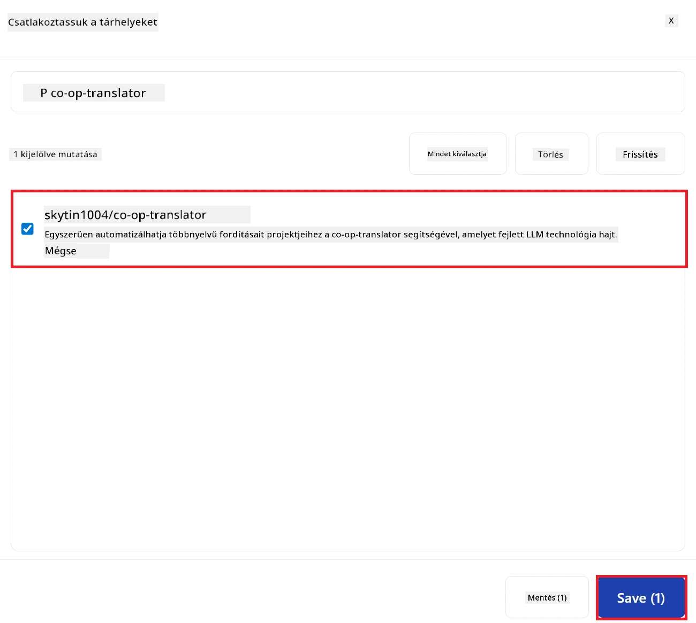

3. Az összekapcsolt tárolóid most már megjelennek a Kezdőlap és a Tárolók oldalon egyaránt.  
   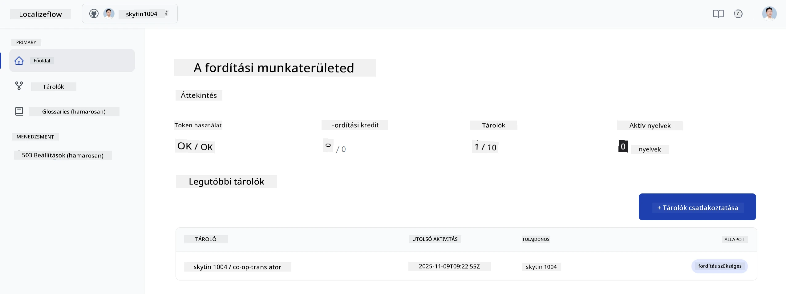

---

## Indítsd el az automatikus fordítást

1. Válaszd ki az imént összekapcsolt tárolót.  
   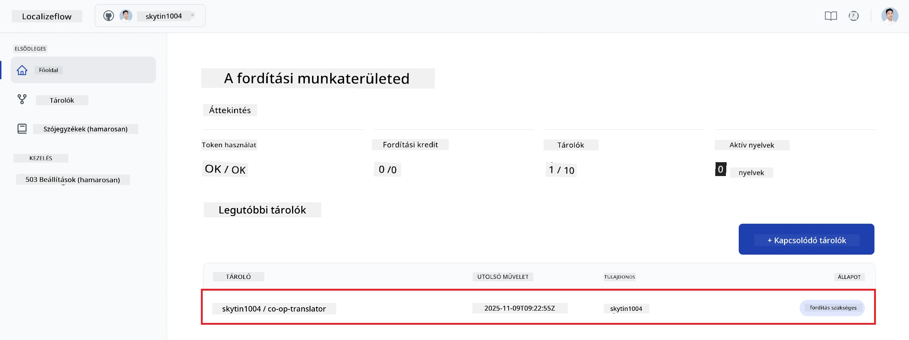

2. A tároló részletező oldalán kattints az alul található **Edit** gombra.  
   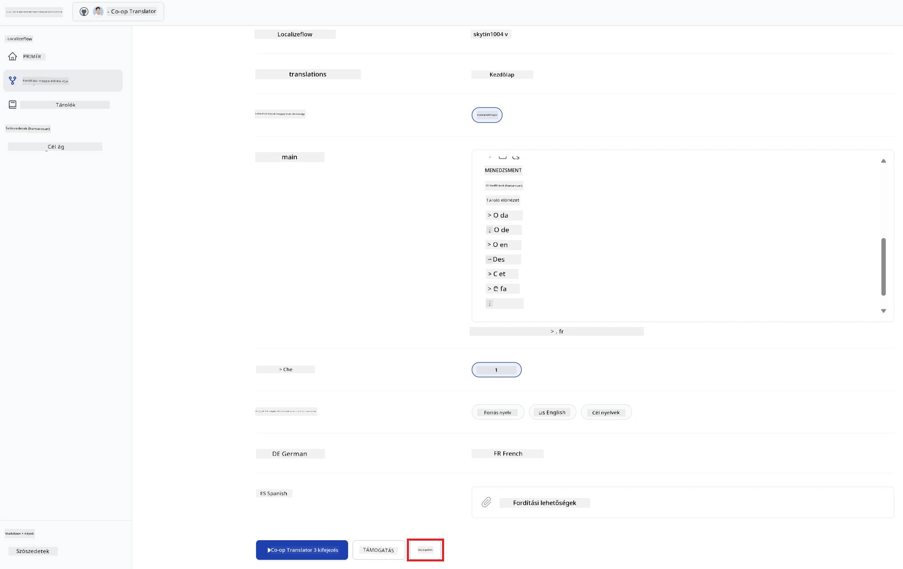

3. Állítsd be a fordítási beállításokat – cél ágat (alapértelmezett: `main`), cél nyelveket, és a forrásnyelvet (alapértelmezett: `en`). Kattints a **Save** gombra.  
   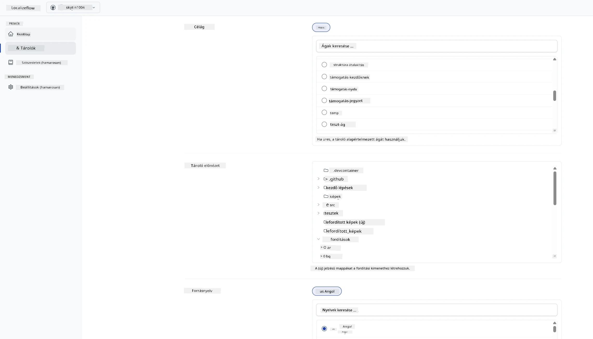

4. Kattints a **Start & Automate** gombra.  
   A Localizeflow ezután automatikusan lefordítja a dokumentációdat, és húzási kérelmeket nyit, amikor a forrás megváltozik.  
   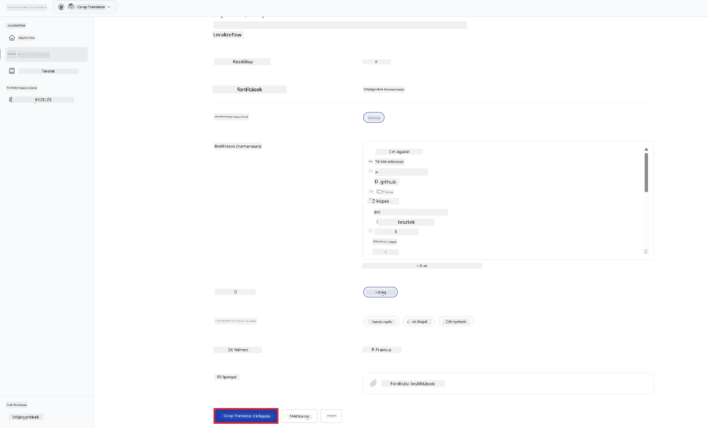

---

<!-- CO-OP TRANSLATOR DISCLAIMER START -->
**Jogi nyilatkozat**:
Ezt a dokumentumot az AI fordítási szolgáltatás, a [Co-op Translator](https://github.com/Azure/co-op-translator) segítségével fordítottuk le. Bár igyekszünk pontos fordítást biztosítani, kérjük, vegye figyelembe, hogy az automatikus fordítások hibákat vagy pontatlanságokat tartalmazhatnak. Az eredeti dokumentum az anyanyelvén tekintendő hiteles forrásnak. Fontos információk esetén szakmai emberi fordítást javasolunk. Nem vállalunk felelősséget az ebből a fordításból eredő félreértésekért vagy téves értelmezésekért.
<!-- CO-OP TRANSLATOR DISCLAIMER END -->