# Localizeflow – Panduan Memulai Cepat

#### Didukung oleh [Localizeflow](https://localizeflow.com/)

<!-- CO-OP TRANSLATOR LANGUAGES TABLE START -->
[Arabic](../ar/README.md) | [Bengali](../bn/README.md) | [Bulgarian](../bg/README.md) | [Burmese (Myanmar)](../my/README.md) | [Chinese (Simplified)](../zh-CN/README.md) | [Chinese (Traditional, Hong Kong)](../zh-HK/README.md) | [Chinese (Traditional, Macau)](../zh-MO/README.md) | [Chinese (Traditional, Taiwan)](../zh-TW/README.md) | [Croatian](../hr/README.md) | [Czech](../cs/README.md) | [Danish](../da/README.md) | [Dutch](../nl/README.md) | [Estonian](../et/README.md) | [Finnish](../fi/README.md) | [French](../fr/README.md) | [German](../de/README.md) | [Greek](../el/README.md) | [Hebrew](../he/README.md) | [Hindi](../hi/README.md) | [Hungarian](../hu/README.md) | [Indonesian](./README.md) | [Italian](../it/README.md) | [Japanese](../ja/README.md) | [Kannada](../kn/README.md) | [Korean](../ko/README.md) | [Lithuanian](../lt/README.md) | [Malay](../ms/README.md) | [Malayalam](../ml/README.md) | [Marathi](../mr/README.md) | [Nepali](../ne/README.md) | [Nigerian Pidgin](../pcm/README.md) | [Norwegian](../no/README.md) | [Persian (Farsi)](../fa/README.md) | [Polish](../pl/README.md) | [Portuguese (Brazil)](../pt-BR/README.md) | [Portuguese (Portugal)](../pt-PT/README.md) | [Punjabi (Gurmukhi)](../pa/README.md) | [Romanian](../ro/README.md) | [Russian](../ru/README.md) | [Serbian (Cyrillic)](../sr/README.md) | [Slovak](../sk/README.md) | [Slovenian](../sl/README.md) | [Spanish](../es/README.md) | [Swahili](../sw/README.md) | [Swedish](../sv/README.md) | [Tagalog (Filipino)](../tl/README.md) | [Tamil](../ta/README.md) | [Telugu](../te/README.md) | [Thai](../th/README.md) | [Turkish](../tr/README.md) | [Ukrainian](../uk/README.md) | [Urdu](../ur/README.md) | [Vietnamese](../vi/README.md)

> **Lebih Suka Mengkloning Secara Lokal?**

> Repositori ini menyertakan terjemahan dalam 50+ bahasa yang secara signifikan meningkatkan ukuran unduhan. Untuk mengkloning tanpa terjemahan, gunakan sparse checkout:
> ```bash
> git clone --filter=blob:none --sparse https://github.com/localizeflow/localizeflow-docs.git
> cd localizeflow-docs
> git sparse-checkout set --no-cone '/*' '!translations' '!translated_images'
> ```
> Ini memberi Anda semua yang Anda butuhkan untuk menyelesaikan kursus dengan unduhan yang jauh lebih cepat.
<!-- CO-OP TRANSLATOR LANGUAGES TABLE END -->

Localizeflow secara otomatis menerjemahkan dokumentasi Anda dan membuka permintaan tarik kapan pun file sumber berubah.  
Panduan ini menunjukkan cara menginstal GitHub App dan menjalankan terjemahan pertama Anda dalam waktu kurang dari 2 menit.


> [!NOTE]
>
> Localizeflow saat ini mendukung proyek dokumentasi berbasis GitHub  
> (misalnya: AI for Beginners dan sebagian besar repositori open-source standar).  
> 
> Dukungan untuk kerangka kerja dokumentasi modern seperti Astro, Docusaurus, dan Hugo  
> sedang dalam pengembangan aktif.


---

## Masuk dan pasang GitHub App

1. Kunjungi **[localizeflow.com](https://localizeflow.com/)**.
2. Pilih **Mulai dengan uji coba gratis**.
   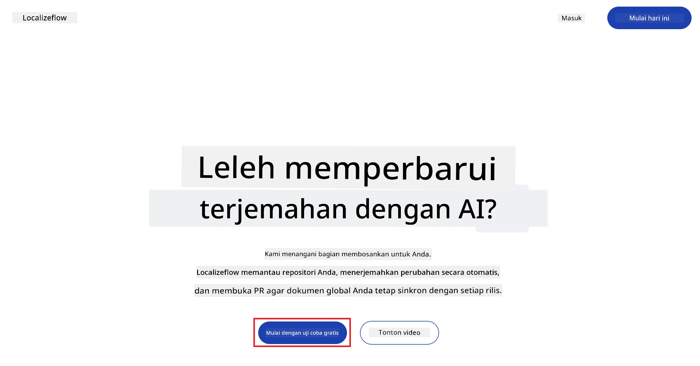
3. Pilih **Masuk dengan GitHub**.  
   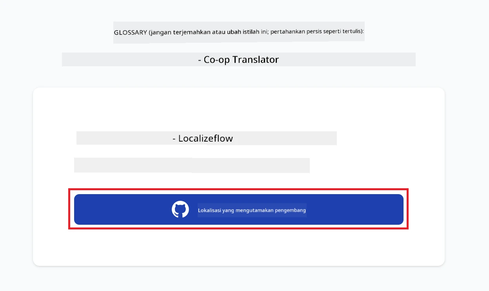
4. Masuk dengan akun GitHub Anda.  
   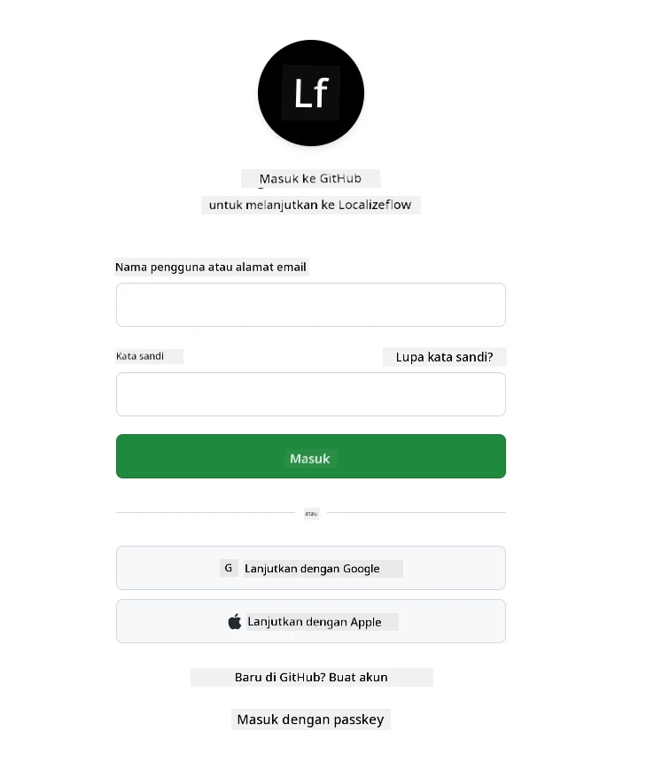
5. Pilih akun tempat Anda ingin memasang Localizeflow GitHub App — akun pribadi Anda atau organisasi yang Anda kelola.  
   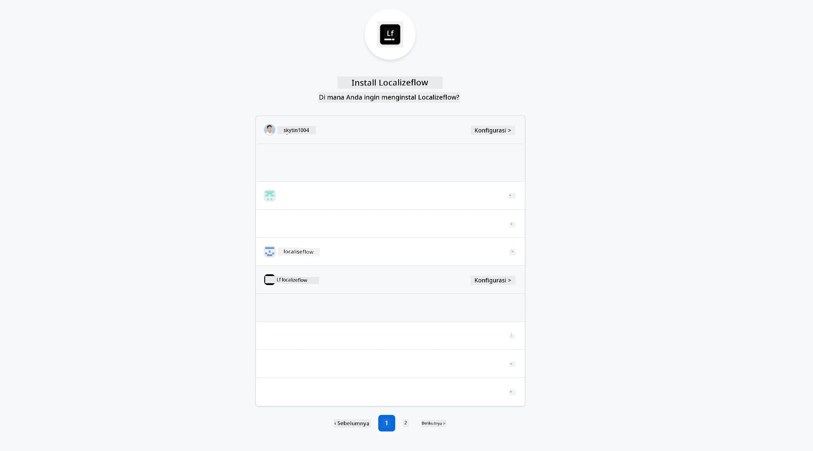
6. Pilih repositori yang ingin Anda berikan akses kepada Localizeflow, lalu pilih **Simpan**.  
   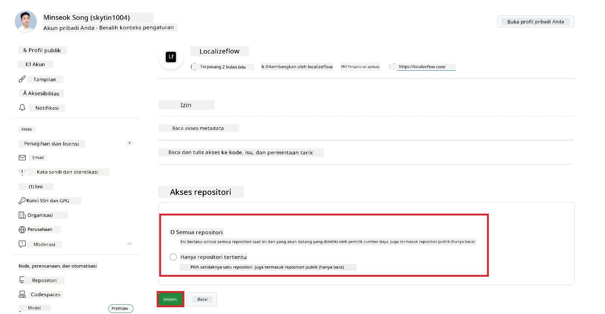
7. Anda akan diarahkan ke halaman beranda Localizeflow.

> [!TIP]
> Untuk menambahkan repositori lebih banyak nanti, pilih akun Anda di bagian header dan pilih **+ Tambah repositori lebih banyak**.  
> 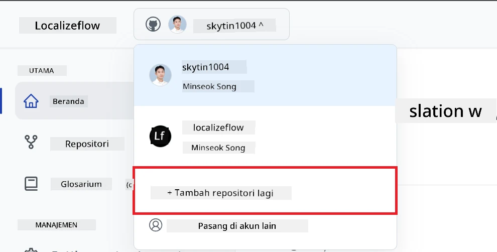

---

## Hubungkan repositori Anda ke Localizeflow

1. Di halaman beranda Localizeflow, pilih **+ Hubungkan repositori**.  
   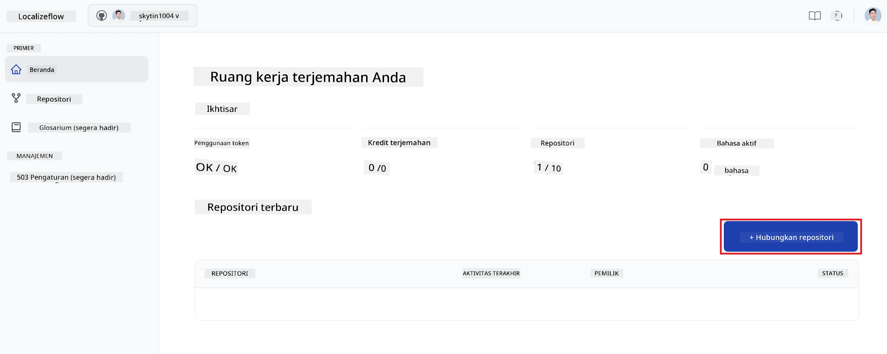

2. Pilih salah satu repositori yang sudah dipasang yang ingin Anda hubungkan dan pilih **Simpan**.  
   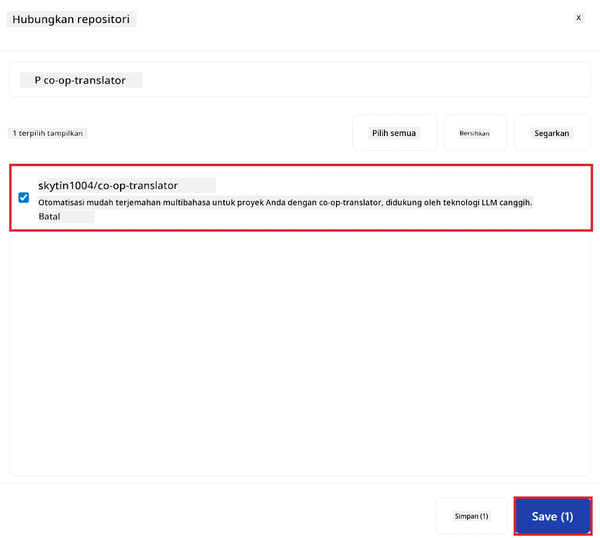

3. Repositori yang terhubung kini akan muncul di halaman Beranda dan halaman Repositori.  
   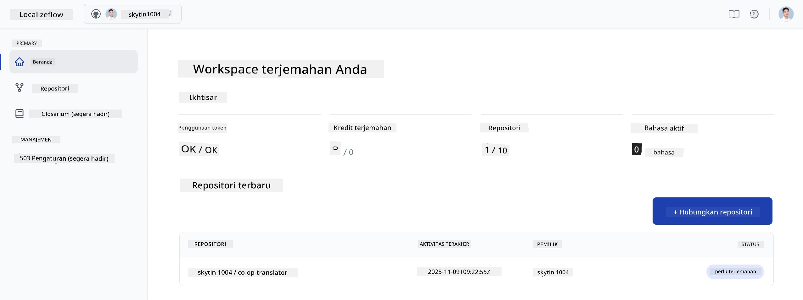

---

## Mulai terjemahan otomatis

1. Pilih repositori yang baru saja Anda hubungkan.  
   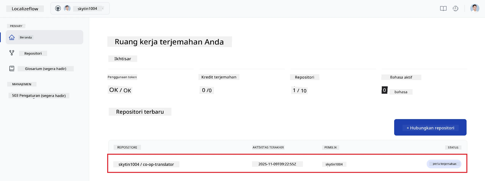

2. Pada halaman detail repositori, pilih **Edit** di bagian bawah.  
   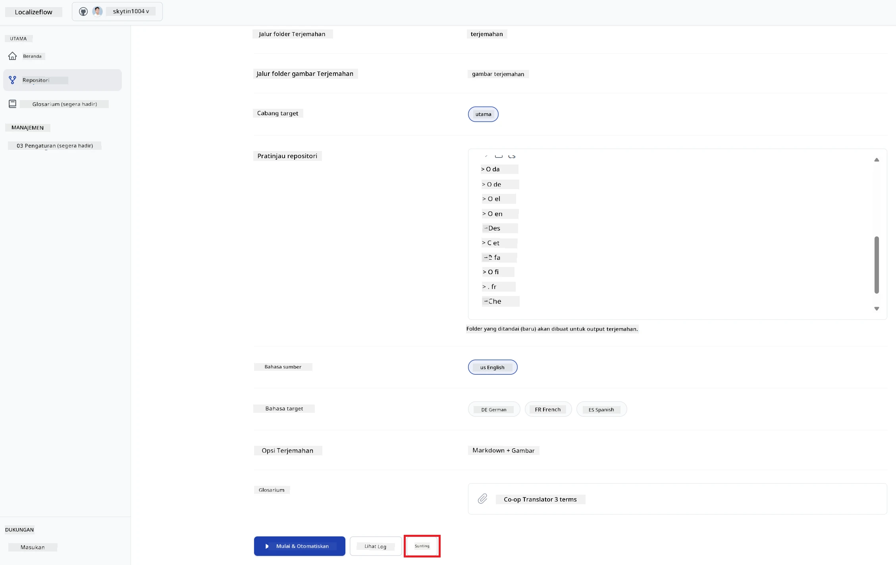

3. Konfigurasikan pengaturan terjemahan Anda — cabang tujuan (default: `main`), bahasa target, dan bahasa sumber (default: `en`). Pilih **Simpan**.  
   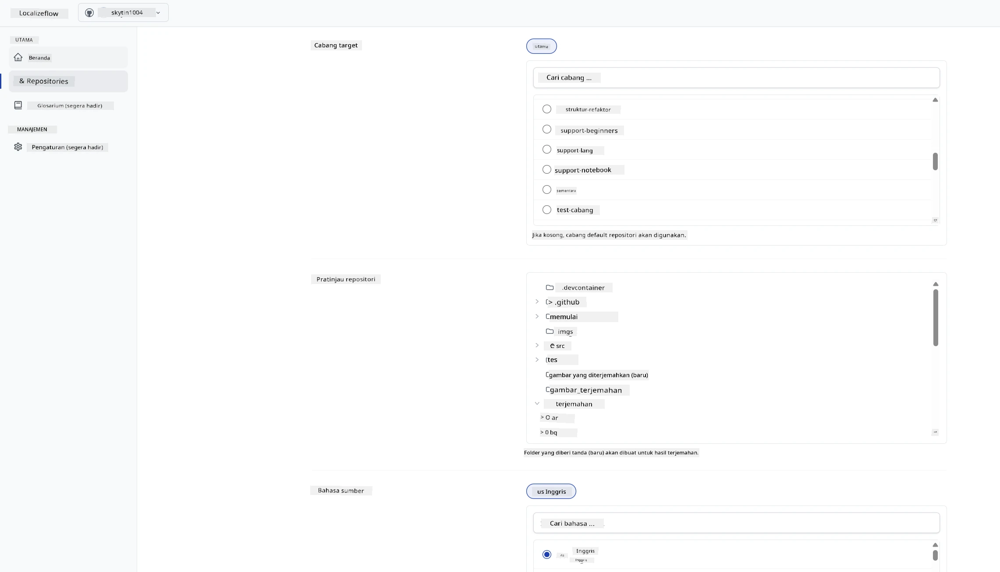

4. Pilih **Mulai & Otomatiskan**.  
   Localizeflow sekarang akan secara otomatis menerjemahkan dokumentasi Anda dan membuka permintaan tarik kapan pun sumber berubah.  
   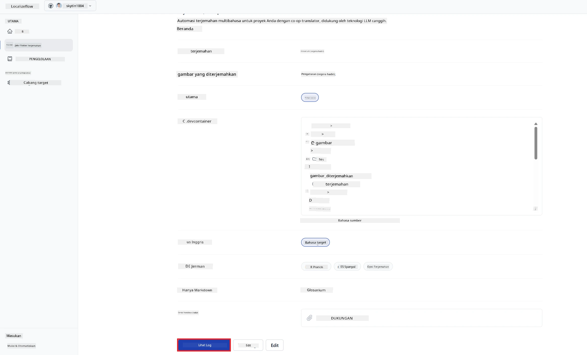

---

<!-- CO-OP TRANSLATOR DISCLAIMER START -->
**Penafian**:  
Dokumen ini telah diterjemahkan menggunakan layanan terjemahan AI [Co-op Translator](https://github.com/Azure/co-op-translator). Meskipun kami berusaha mencapai akurasi, harap diperhatikan bahwa terjemahan otomatis mungkin mengandung kesalahan atau ketidakakuratan. Dokumen asli dalam bahasa aslinya harus dianggap sebagai sumber yang berwenang. Untuk informasi penting, disarankan menggunakan terjemahan profesional oleh manusia. Kami tidak bertanggung jawab atas kesalahpahaman atau salah penafsiran yang mungkin timbul dari penggunaan terjemahan ini.
<!-- CO-OP TRANSLATOR DISCLAIMER END -->