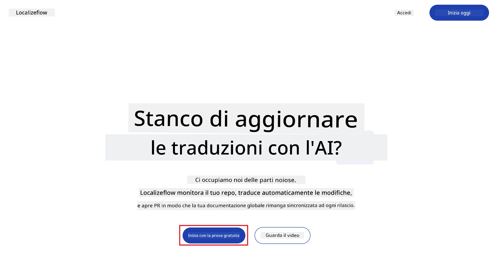
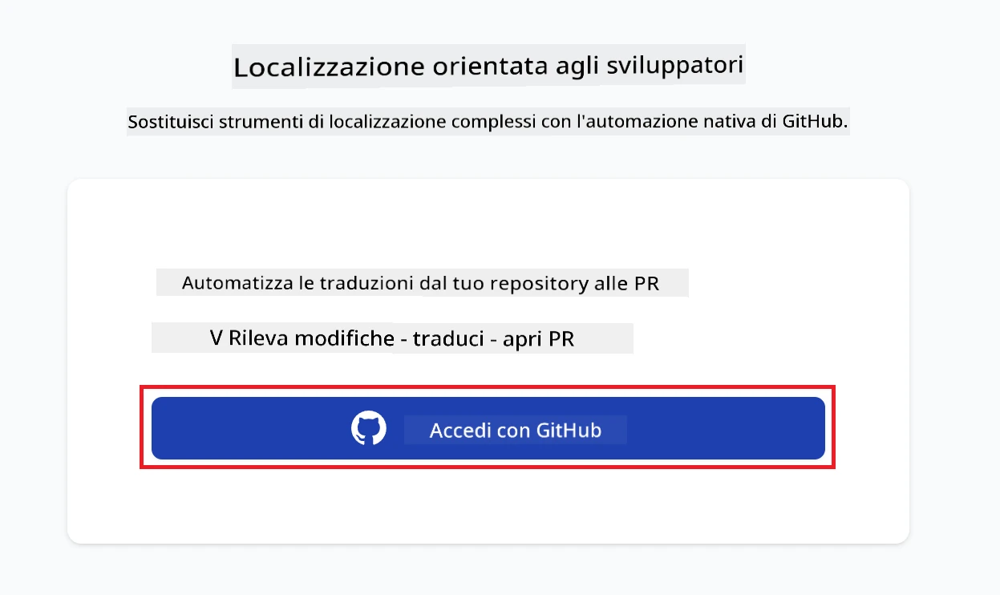
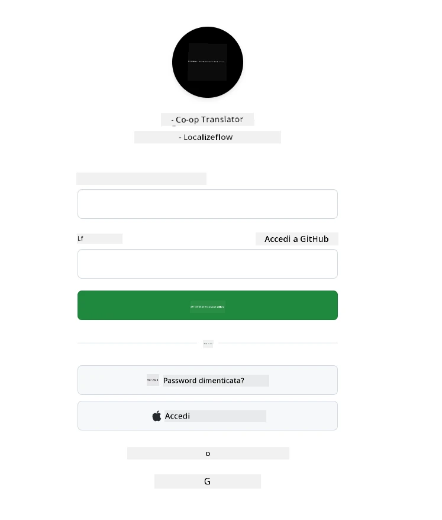
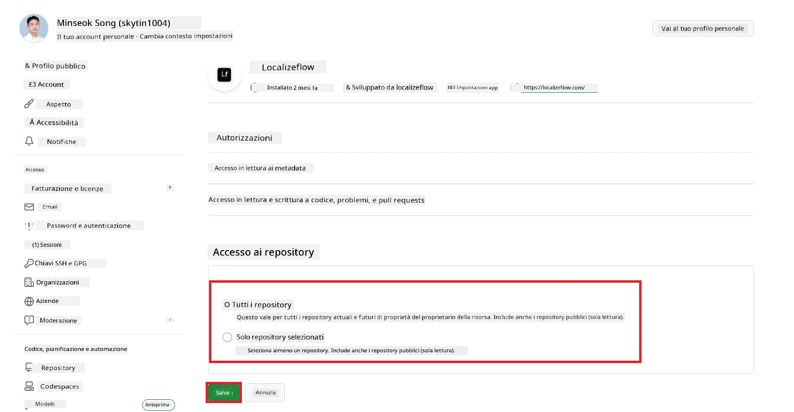
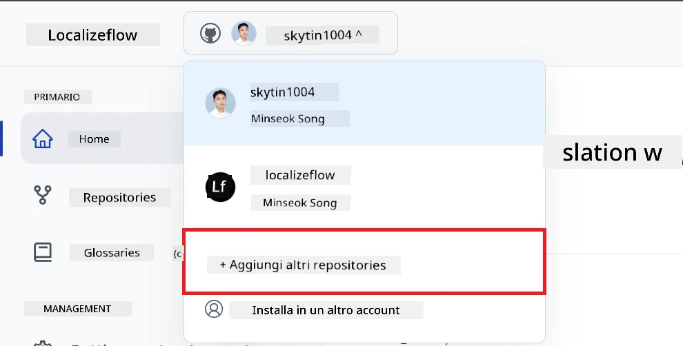
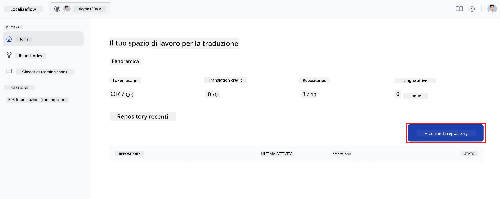
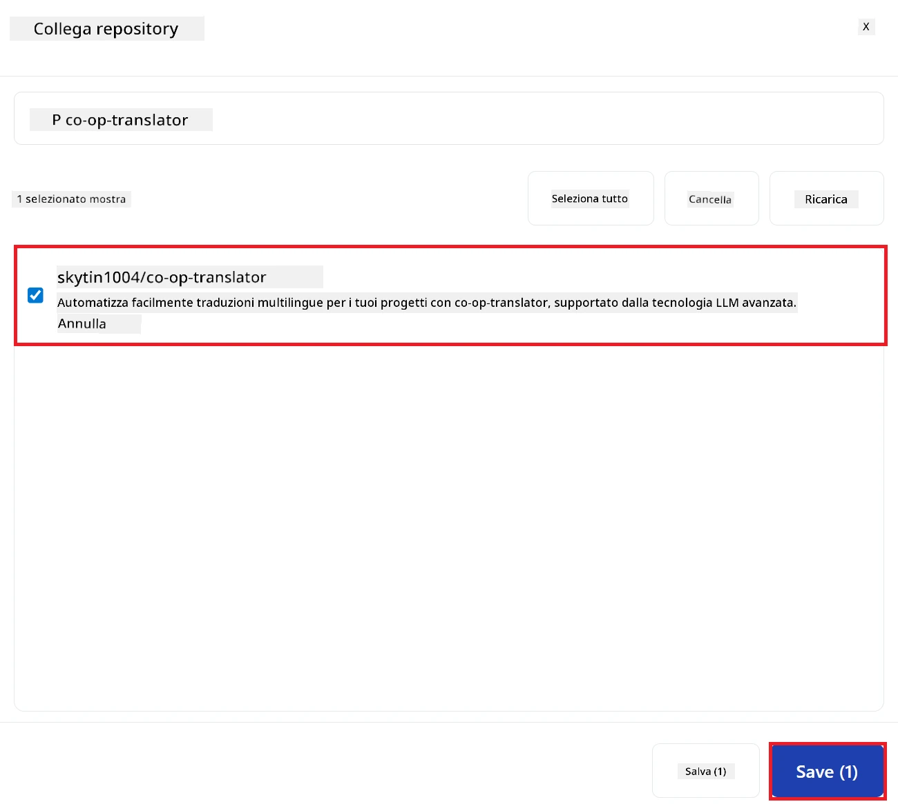
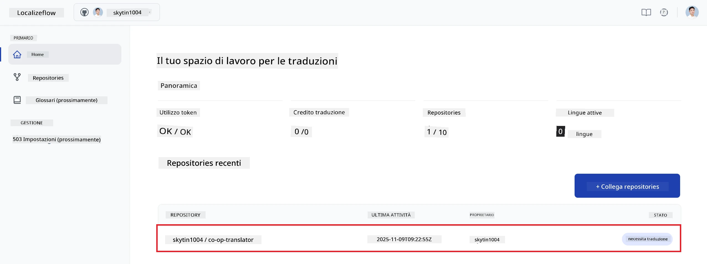
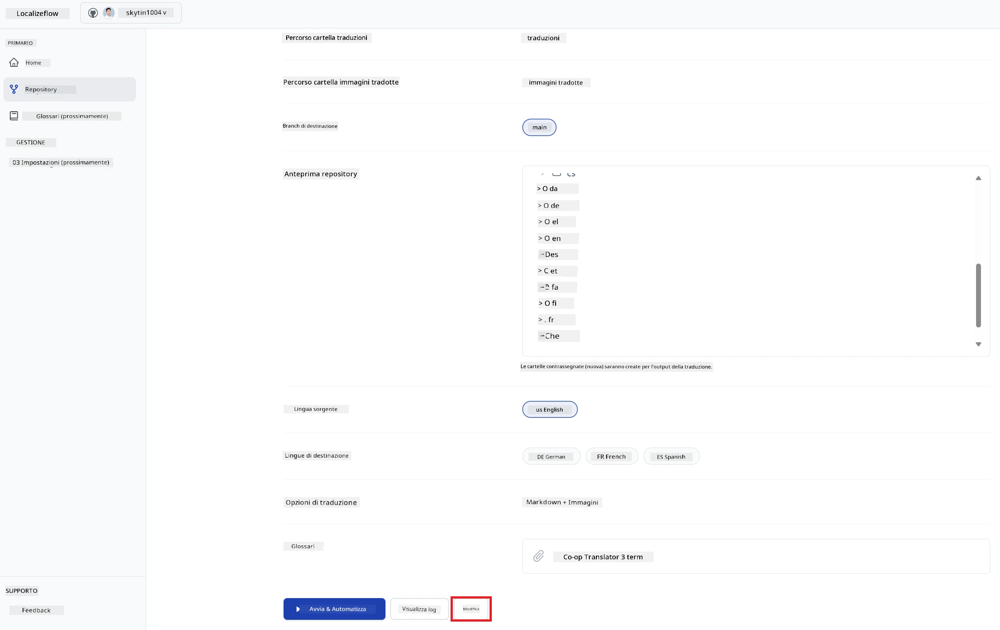
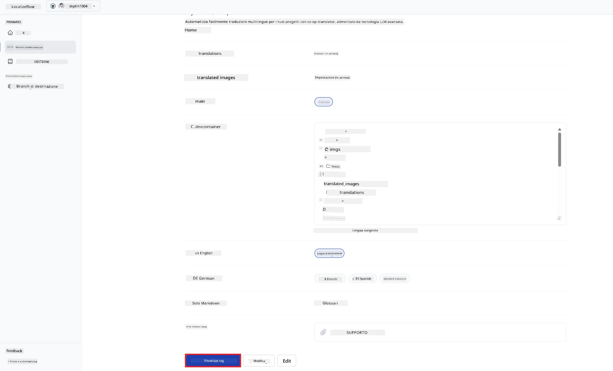

# Localizeflow – Guida Rapida

#### Supportato da [Localizeflow](https://localizeflow.com/)

<!-- CO-OP TRANSLATOR LANGUAGES TABLE START -->
[Arabic](../ar/README.md) | [Bengali](../bn/README.md) | [Bulgarian](../bg/README.md) | [Burmese (Myanmar)](../my/README.md) | [Chinese (Simplified)](../zh-CN/README.md) | [Chinese (Traditional, Hong Kong)](../zh-HK/README.md) | [Chinese (Traditional, Macau)](../zh-MO/README.md) | [Chinese (Traditional, Taiwan)](../zh-TW/README.md) | [Croatian](../hr/README.md) | [Czech](../cs/README.md) | [Danish](../da/README.md) | [Dutch](../nl/README.md) | [Estonian](../et/README.md) | [Finnish](../fi/README.md) | [French](../fr/README.md) | [German](../de/README.md) | [Greek](../el/README.md) | [Hebrew](../he/README.md) | [Hindi](../hi/README.md) | [Hungarian](../hu/README.md) | [Indonesian](../id/README.md) | [Italian](./README.md) | [Japanese](../ja/README.md) | [Kannada](../kn/README.md) | [Korean](../ko/README.md) | [Lithuanian](../lt/README.md) | [Malay](../ms/README.md) | [Malayalam](../ml/README.md) | [Marathi](../mr/README.md) | [Nepali](../ne/README.md) | [Nigerian Pidgin](../pcm/README.md) | [Norwegian](../no/README.md) | [Persian (Farsi)](../fa/README.md) | [Polish](../pl/README.md) | [Portuguese (Brazil)](../pt-BR/README.md) | [Portuguese (Portugal)](../pt-PT/README.md) | [Punjabi (Gurmukhi)](../pa/README.md) | [Romanian](../ro/README.md) | [Russian](../ru/README.md) | [Serbian (Cyrillic)](../sr/README.md) | [Slovak](../sk/README.md) | [Slovenian](../sl/README.md) | [Spanish](../es/README.md) | [Swahili](../sw/README.md) | [Swedish](../sv/README.md) | [Tagalog (Filipino)](../tl/README.md) | [Tamil](../ta/README.md) | [Telugu](../te/README.md) | [Thai](../th/README.md) | [Turkish](../tr/README.md) | [Ukrainian](../uk/README.md) | [Urdu](../ur/README.md) | [Vietnamese](../vi/README.md)

> **Preferisci clonare localmente?**

> Questo repository include oltre 50 traduzioni linguistiche, il che aumenta significativamente la dimensione del download. Per clonare senza le traduzioni, usa lo sparse checkout:
> ```bash
> git clone --filter=blob:none --sparse https://github.com/localizeflow/localizeflow-docs.git
> cd localizeflow-docs
> git sparse-checkout set --no-cone '/*' '!translations' '!translated_images'
> ```
> Questo ti fornisce tutto il necessario per completare il corso con un download molto più veloce.
<!-- CO-OP TRANSLATOR LANGUAGES TABLE END -->

Localizeflow traduce automaticamente la tua documentazione e apre pull request ogni volta che il file sorgente cambia.  
Questa guida ti mostra come installare l'App GitHub ed eseguire la tua prima traduzione in meno di 2 minuti.


> [!NOTE]
>
> Localizeflow supporta attualmente progetti di documentazione basati su GitHub
> (per esempio: AI for Beginners e la maggior parte dei repo open-source standard).  
> 
> Il supporto per framework di documentazione moderni come Astro, Docusaurus e Hugo  
> è in fase di sviluppo attivo.


---

## Accedi e installa l’App GitHub

1. Visita **[localizeflow.com](https://localizeflow.com/)**.
2. Seleziona **Inizia con la prova gratuita**.
   
3. Seleziona **Accedi con GitHub**.  
   
4. Accedi con il tuo account GitHub.  
   
5. Scegli l’account dove vuoi installare l’App GitHub Localizeflow — il tuo account personale o un’organizzazione che gestisci.  
   
6. Seleziona i repository a cui vuoi che Localizeflow abbia accesso, poi scegli **Salva**.  
   
7. Verrai reindirizzato alla pagina principale di Localizeflow.

> [!TIP]
> Per aggiungere altri repository in seguito, seleziona il tuo account nell’intestazione e scegli **+ Aggiungi altri repository**.  
> 

---

## Collega i tuoi repository a Localizeflow

1. Nella pagina principale di Localizeflow, seleziona **+ Collega repository**.  
   

2. Scegli uno dei repository installati che vuoi collegare e seleziona **Salva**.  
   

3. I tuoi repository collegati appariranno ora sia nella pagina Home che nella pagina Repository.  
   

---

## Avvia la traduzione automatica

1. Seleziona il repository che hai appena collegato.  
   

2. Nella pagina dei dettagli del repository, seleziona **Modifica** in fondo.  
   

3. Configura le impostazioni di traduzione — branch di destinazione (predefinito: `main`), lingue di destinazione e lingua sorgente (predefinito: `en`). Seleziona **Salva**.  
   

4. Seleziona **Avvia & Automatizza**.  
   Localizeflow tradurrà automaticamente la tua documentazione e aprirà pull request ogni volta che la sorgente cambia.  
   

---

<!-- CO-OP TRANSLATOR DISCLAIMER START -->
**Disclaimer**:  
Questo documento è stato tradotto utilizzando il servizio di traduzione automatica AI [Co-op Translator](https://github.com/Azure/co-op-translator). Anche se ci impegniamo per garantire l'accuratezza, si prega di considerare che le traduzioni automatiche possono contenere errori o imprecisioni. Il documento originale nella sua lingua nativa deve essere considerato la fonte autorevole. Per informazioni critiche, si raccomanda la traduzione professionale effettuata da un traduttore umano. Non siamo responsabili per eventuali incomprensioni o interpretazioni errate derivanti dall'uso di questa traduzione.
<!-- CO-OP TRANSLATOR DISCLAIMER END -->