# Localizeflow – クイックスタートガイド

#### [Localizeflow](https://localizeflow.com/) 提供

<!-- CO-OP TRANSLATOR LANGUAGES TABLE START -->
[Arabic](../ar/README.md) | [Bengali](../bn/README.md) | [Bulgarian](../bg/README.md) | [Burmese (Myanmar)](../my/README.md) | [Chinese (Simplified)](../zh-CN/README.md) | [Chinese (Traditional, Hong Kong)](../zh-HK/README.md) | [Chinese (Traditional, Macau)](../zh-MO/README.md) | [Chinese (Traditional, Taiwan)](../zh-TW/README.md) | [Croatian](../hr/README.md) | [Czech](../cs/README.md) | [Danish](../da/README.md) | [Dutch](../nl/README.md) | [Estonian](../et/README.md) | [Finnish](../fi/README.md) | [French](../fr/README.md) | [German](../de/README.md) | [Greek](../el/README.md) | [Hebrew](../he/README.md) | [Hindi](../hi/README.md) | [Hungarian](../hu/README.md) | [Indonesian](../id/README.md) | [Italian](../it/README.md) | [Japanese](./README.md) | [Kannada](../kn/README.md) | [Korean](../ko/README.md) | [Lithuanian](../lt/README.md) | [Malay](../ms/README.md) | [Malayalam](../ml/README.md) | [Marathi](../mr/README.md) | [Nepali](../ne/README.md) | [Nigerian Pidgin](../pcm/README.md) | [Norwegian](../no/README.md) | [Persian (Farsi)](../fa/README.md) | [Polish](../pl/README.md) | [Portuguese (Brazil)](../pt-BR/README.md) | [Portuguese (Portugal)](../pt-PT/README.md) | [Punjabi (Gurmukhi)](../pa/README.md) | [Romanian](../ro/README.md) | [Russian](../ru/README.md) | [Serbian (Cyrillic)](../sr/README.md) | [Slovak](../sk/README.md) | [Slovenian](../sl/README.md) | [Spanish](../es/README.md) | [Swahili](../sw/README.md) | [Swedish](../sv/README.md) | [Tagalog (Filipino)](../tl/README.md) | [Tamil](../ta/README.md) | [Telugu](../te/README.md) | [Thai](../th/README.md) | [Turkish](../tr/README.md) | [Ukrainian](../uk/README.md) | [Urdu](../ur/README.md) | [Vietnamese](../vi/README.md)

> **ローカルにクローンすることをお好みですか？**

> このリポジトリには50以上の言語翻訳が含まれているため、ダウンロードサイズが大幅に増加します。翻訳を含まずにクローンするには、スパースチェックアウトを使用してください。
> ```bash
> git clone --filter=blob:none --sparse https://github.com/localizeflow/localizeflow-docs.git
> cd localizeflow-docs
> git sparse-checkout set --no-cone '/*' '!translations' '!translated_images'
> ```
> これにより、はるかに高速なダウンロードでコース完了に必要なすべてが手に入ります。
<!-- CO-OP TRANSLATOR LANGUAGES TABLE END -->

Localizeflowはドキュメントを自動で翻訳し、ソースファイルが変更されるたびにプルリクエストを開きます。  
このガイドでは、GitHub Appのインストール方法と2分以内に最初の翻訳を実行する手順を示します。


> [!NOTE]
>
> Localizeflowは現在GitHubベースのドキュメントプロジェクトをサポートしています
> （例：AI for Beginnersやほとんどの標準的なオープンソースリポジトリ）。  
> 
> Astro、Docusaurus、Hugoなどの最新ドキュメントフレームワークのサポートは
> 積極的に開発中です。


---

## サインインしてGitHub Appをインストールする

1. **[localizeflow.com](https://localizeflow.com/)** にアクセスします。
2. **無料トライアルを開始** を選択します。
   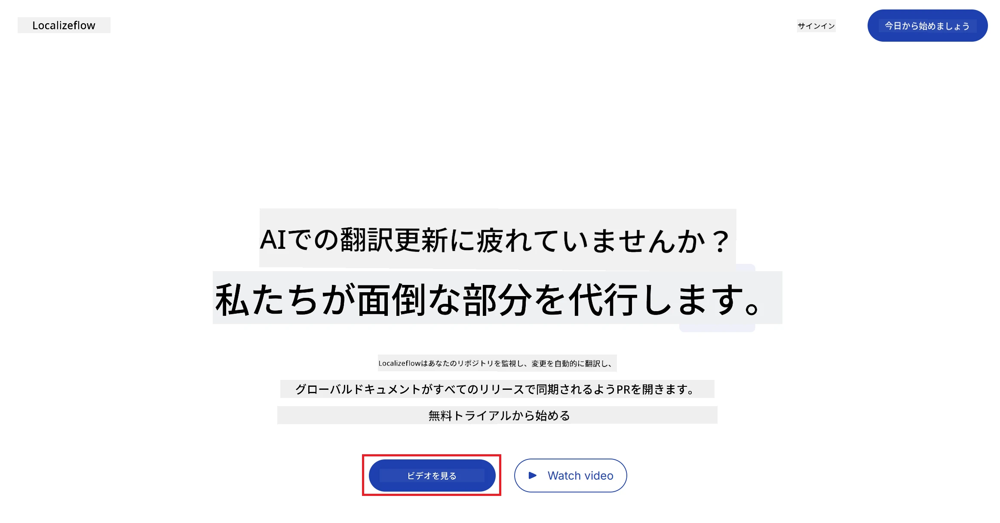
3. **GitHubでサインイン** を選択します。  
   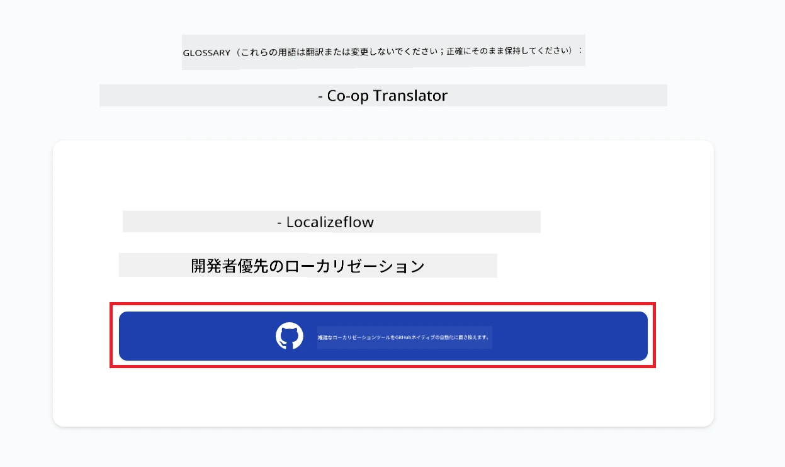
4. GitHubアカウントでサインインします。  
   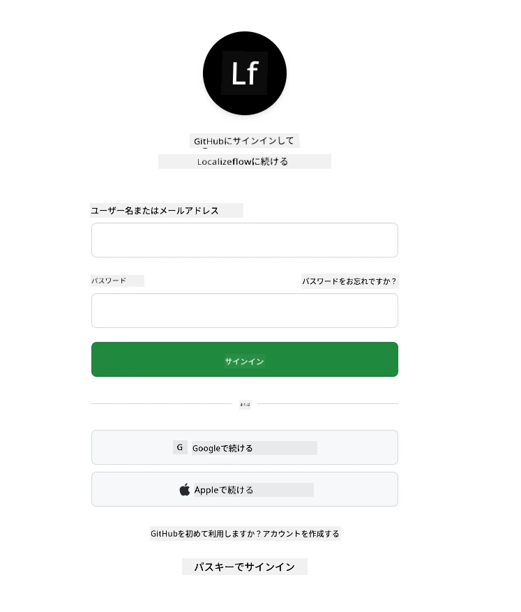
5. Localizeflow GitHub Appをインストールしたいアカウント（個人アカウントまたは管理している組織）を選択します。  
   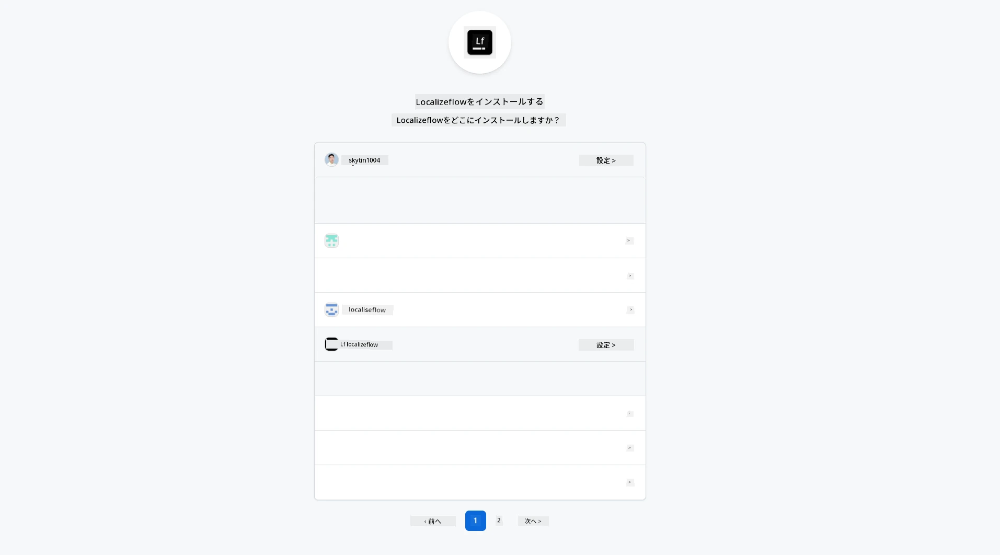
6. Localizeflowにアクセスさせたいリポジトリを選択し、**保存** を選択します。  
   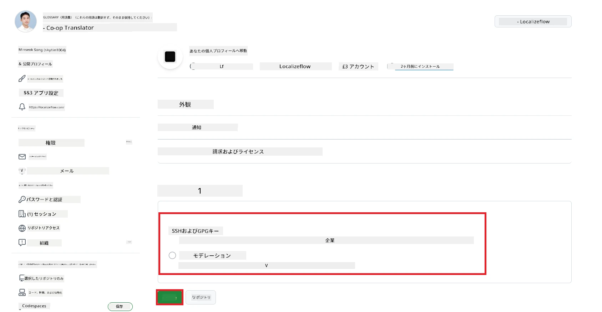
7. Localizeflowホームページにリダイレクトされます。

> [!TIP]
> 後からリポジトリを追加したい場合は、ヘッダーのアカウントを選択し、**+ リポジトリを追加** を選択してください。  
> 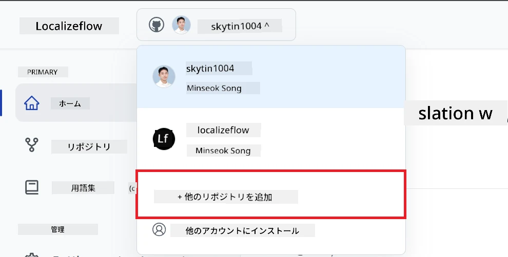

---

## Localizeflowにリポジトリを接続する

1. Localizeflowホームページで **+ リポジトリを接続** を選択します。  
   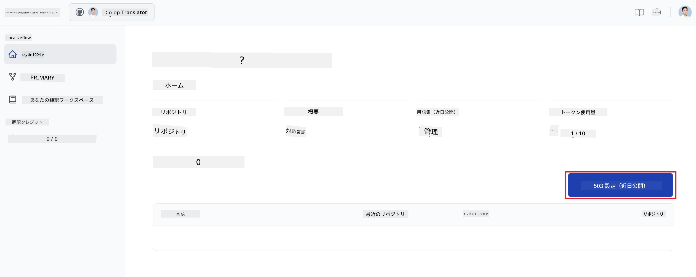

2. 接続したいインストール済みのリポジトリの一つを選び、**保存** を選択します。  
   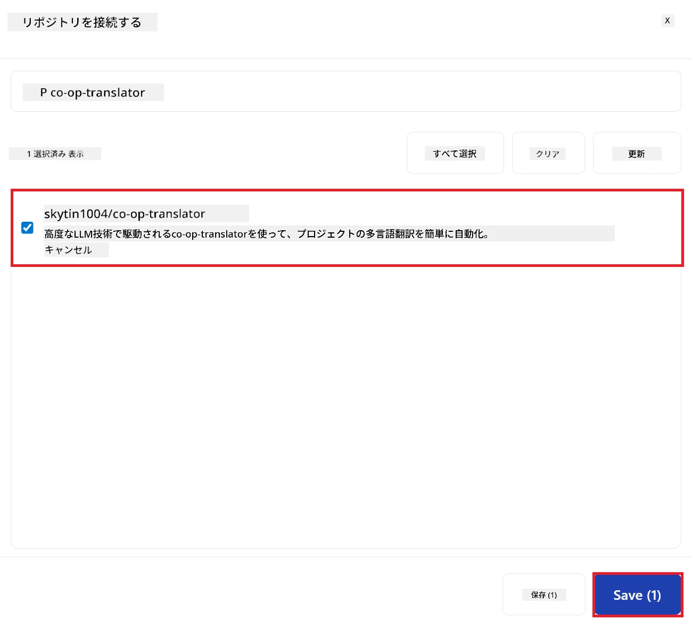

3. 接続されたリポジトリがホームページとリポジトリページの両方に表示されます。  
   

---

## 自動翻訳を開始する

1. 先ほど接続したリポジトリを選択します。  
   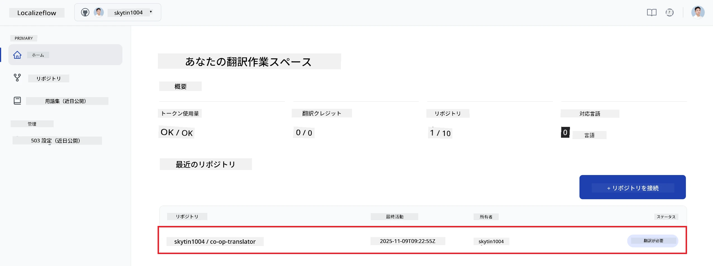

2. リポジトリ詳細ページの下部にある **編集** を選択します。  
   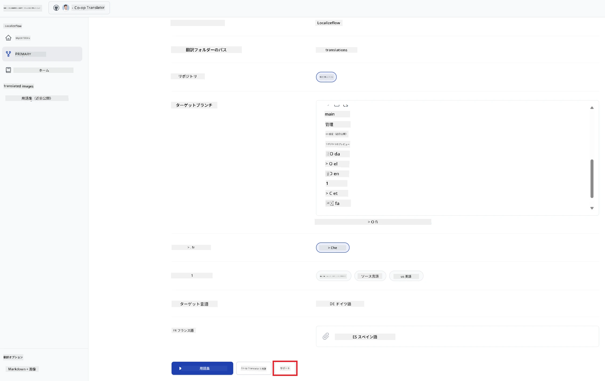

3. 翻訳設定（ターゲットブランチ：デフォルトは`main`、対象言語、ソース言語：デフォルトは`en`）を設定し、**保存** を選択します。  
   

4. **開始＆自動化** を選択します。  
   Localizeflowはソースが変更されるたびにドキュメントを自動で翻訳し、プルリクエストを作成します。  
   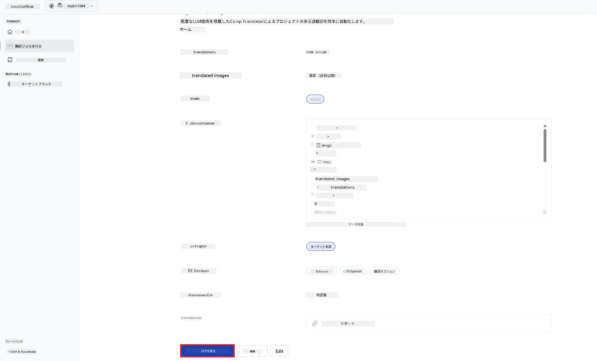

---

<!-- CO-OP TRANSLATOR DISCLAIMER START -->
**免責事項**：
本書類はAI翻訳サービス[Co-op Translator](https://github.com/Azure/co-op-translator)を使用して翻訳されています。正確性には努めておりますが、自動翻訳は誤りや不正確な部分を含む可能性があることをご了承ください。原文のオリジナル言語による文書が正式な情報源とみなされます。重要な情報については、専門の人間翻訳を推奨します。本翻訳の利用により生じた誤解や誤訳について、当方は一切責任を負いません。
<!-- CO-OP TRANSLATOR DISCLAIMER END -->