# Localizeflow – ತ್ವರಿತ ಪ್ರಾರಂಭ ಗೈಡ್

#### [Localizeflow](https://localizeflow.com/) ಮುಖಾಂತರ ಬೆಂಬಲಿತ

<!-- CO-OP TRANSLATOR LANGUAGES TABLE START -->
[Arabic](../ar/README.md) | [Bengali](../bn/README.md) | [Bulgarian](../bg/README.md) | [Burmese (Myanmar)](../my/README.md) | [Chinese (Simplified)](../zh-CN/README.md) | [Chinese (Traditional, Hong Kong)](../zh-HK/README.md) | [Chinese (Traditional, Macau)](../zh-MO/README.md) | [Chinese (Traditional, Taiwan)](../zh-TW/README.md) | [Croatian](../hr/README.md) | [Czech](../cs/README.md) | [Danish](../da/README.md) | [Dutch](../nl/README.md) | [Estonian](../et/README.md) | [Finnish](../fi/README.md) | [French](../fr/README.md) | [German](../de/README.md) | [Greek](../el/README.md) | [Hebrew](../he/README.md) | [Hindi](../hi/README.md) | [Hungarian](../hu/README.md) | [Indonesian](../id/README.md) | [Italian](../it/README.md) | [Japanese](../ja/README.md) | [Kannada](./README.md) | [Korean](../ko/README.md) | [Lithuanian](../lt/README.md) | [Malay](../ms/README.md) | [Malayalam](../ml/README.md) | [Marathi](../mr/README.md) | [Nepali](../ne/README.md) | [Nigerian Pidgin](../pcm/README.md) | [Norwegian](../no/README.md) | [Persian (Farsi)](../fa/README.md) | [Polish](../pl/README.md) | [Portuguese (Brazil)](../pt-BR/README.md) | [Portuguese (Portugal)](../pt-PT/README.md) | [Punjabi (Gurmukhi)](../pa/README.md) | [Romanian](../ro/README.md) | [Russian](../ru/README.md) | [Serbian (Cyrillic)](../sr/README.md) | [Slovak](../sk/README.md) | [Slovenian](../sl/README.md) | [Spanish](../es/README.md) | [Swahili](../sw/README.md) | [Swedish](../sv/README.md) | [Tagalog (Filipino)](../tl/README.md) | [Tamil](../ta/README.md) | [Telugu](../te/README.md) | [Thai](../th/README.md) | [Turkish](../tr/README.md) | [Ukrainian](../uk/README.md) | [Urdu](../ur/README.md) | [Vietnamese](../vi/README.md)

> **ಸ್ಥಳೀಯವಾಗಿ ಕ್ಲೋನ್ ಮಾಡಬೇಕೇ?**

> ಈ ರೆಪೊಸಿಟರಿಯಲ್ಲಿ 50ಕ್ಕೂ ಹೆಚ್ಚು ಭಾಷಾ ಅನುವಾದಗಳು ಸೇರಿವೆ, ಇದು ಡೌನ್‌ಲೋಡ್ ಗಾತ್ರವನ್ನು ಹೆಚ್ಚಿಸುತ್ತದೆ. ಅನುವಾದಗಳಿಲ್ಲದೇ ಕ್ಲೋನ್ ಮಾಡಲು sparse checkout ಬಳಸಿ:
> ```bash
> git clone --filter=blob:none --sparse https://github.com/localizeflow/localizeflow-docs.git
> cd localizeflow-docs
> git sparse-checkout set --no-cone '/*' '!translations' '!translated_images'
> ```
> ಇದರಿಂದ ನೀವು ಪಠ್ಯಕ್ರಮವನ್ನು ಪೂರ್ಣಗೊಳಿಸಲು ಬೇಕಾದ ಎಲ್ಲವೂ ಹೆಚ್ಚು ವೇಗವಾಗಿ ಲಭ್ಯವಾಗುತ್ತದೆ.
<!-- CO-OP TRANSLATOR LANGUAGES TABLE END -->

Localizeflow ಸ್ವಯಂಚಾಲಿತವಾಗಿ ನಿಮ್ಮ ದಸ್ತಾವೇಜೀಕರಣವನ್ನು ಅನುವಾದಿಸುತ್ತದೆ ಮತ್ತು ಮೂಲ ಫೈಲ್ ಬದಲಾಗುವಾಗ ಪುಲ್‌রিক್ವೆಸ್ಟ್‌ಗಳನ್ನು ತೆರೆಯುತ್ತದೆ.  
ಈ ಗೈಡ್ GitHub ಅಪ್ಲಿಕೇಶನ್ ಅನ್ನು ಸ್ಥಾಪಿಸುವುದು ಮತ್ತು ನಿಮ್ಮ ಮೊದಲ ಅನುವಾದವನ್ನು 2 ನಿಮಿಷಗಳಲ್ಲಿ ನಡೆಸುವುದು ಹೇಗೆ ಎಂಬುದನ್ನು ತೋರಿಸುತ್ತದೆ.


> [!NOTE]
>
> Localizeflow ಪ್ರಸ್ತುತ GitHub ಆಧಾರಿತ ದಸ್ತಾವೇಜೀಕರಣ ಪ್ರಾಜೆಕ್ಟ್‌ಗಳನ್ನು ಬೆಂಬಲಿಸುತ್ತದೆ
> (ಉದಾಹರಣೆಗೆ: AI for Beginners ಮತ್ತು ಹೆಚ್ಚಿನ ಮಾನಕ open-source ರೆಪೊಗಳು).  
> 
> Astro, Docusaurus, ಮತ್ತು Hugoವಂತಹ ಆಧುನಿಕ ದಸ್ತಾವೇಜೀಕರಣ ಫ್ರೇಮಕೇಟ್‌ಗಳಿಗೆ ಬೆಂಬಲವು ಸಕ್ರಿಯವಾಗಿ ಅಭಿವೃದ್ಧಿ ಕೈಗೊಳ್ಳುತ್ತಿದೆ.


---

## GitHub ಅಪ್ಲಿಕೇಶನ್‌ಗೆ ಸೈನ್ ಇನ್ ಮಾಡಿ ಮತ್ತು ಸ್ಥಾಪಿಸಿ

1. **[localizeflow.com](https://localizeflow.com/)** ಗೆ ಹೋಗಿ.
2. **Start with free trial** ಆಯ್ಕೆಮಾಡಿ.
   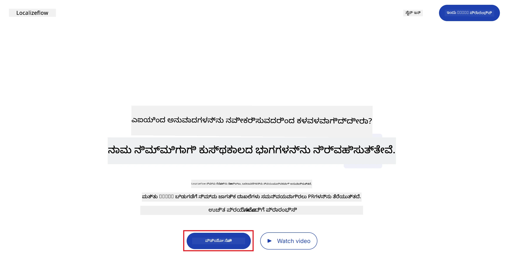
3. **Sign in with GitHub** ಆಯ್ಕೆಮಾಡಿ.  
   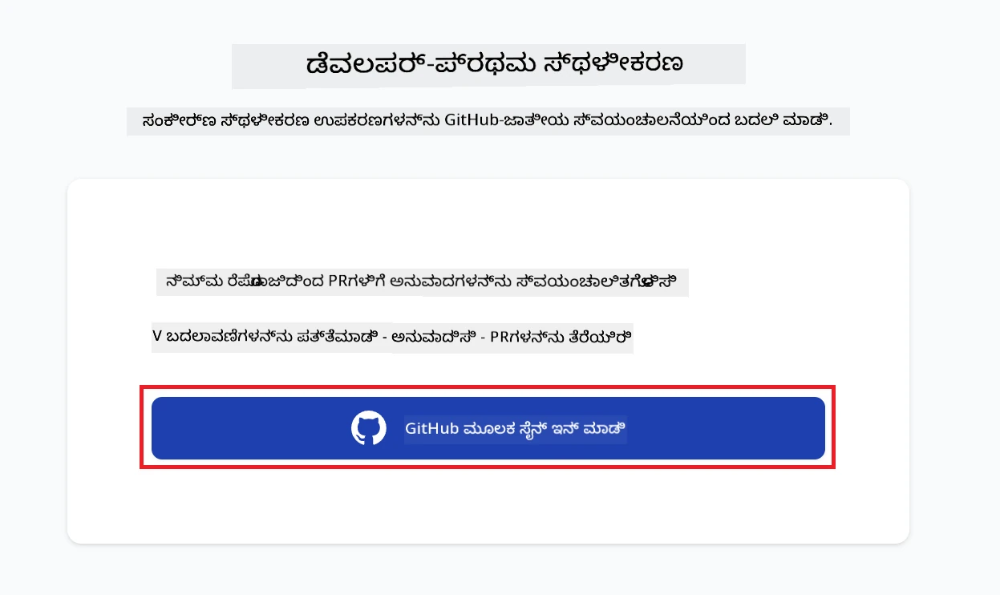
4. ನಿಮ್ಮ GitHub ಖಾತೆಯಲ್ಲಿ ಸೈನ್ ಇನ್ ಆಗಿ.  
   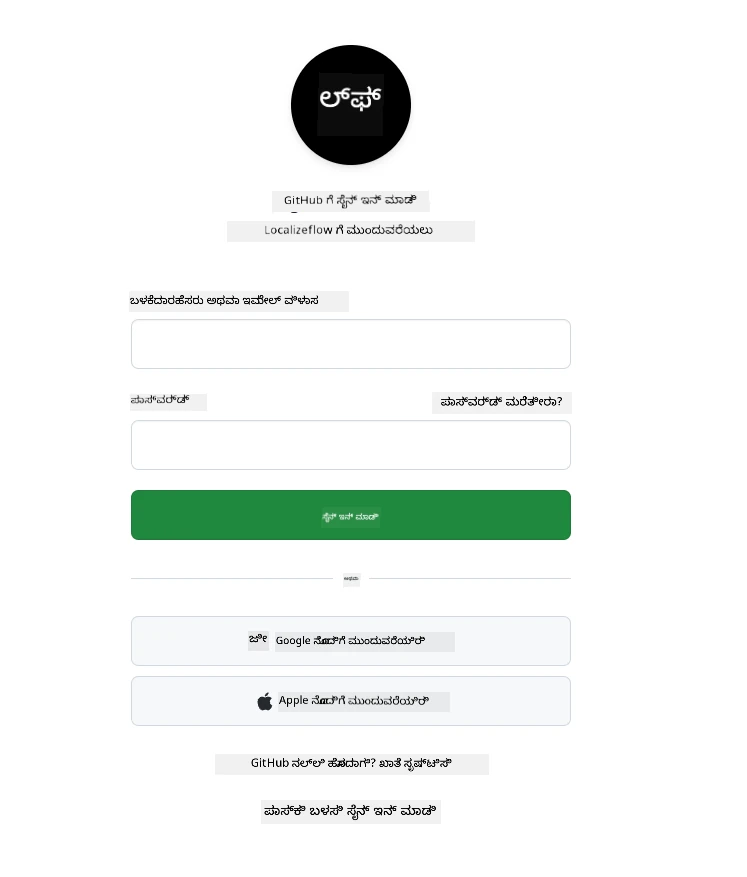
5. Localizeflow GitHub ಅಪ್ಲಿಕೇಶನ್ ಅನ್ನು ನೀವು ಸ್ಥಾಪಿಸಲು ಬಯಸುವ ಖಾತೆಯನ್ನು ಆಯ್ಕೆಮಾಡಿ — ನಿಮ್ಮ ವೈಯಕ್ತಿಕ ಖಾತೆ ಅಥವಾ ನೀವು ನಿರ್ವಹಿಸುವ ಸಂಸ್ಥೆ.  
   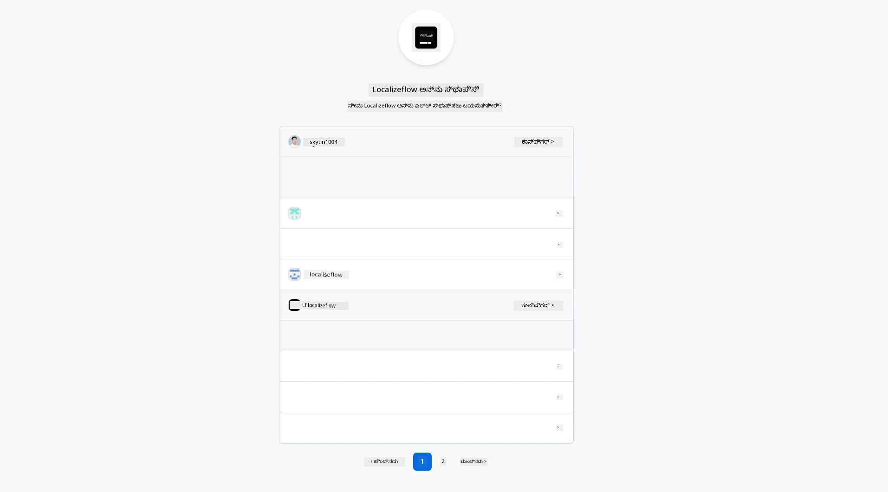
6. Localizeflow ಪ್ರವೆಶಕ್ಕೆ ಅನುಮತಿಸಬೇಕಾದ ರೆಪೊಸಿಟರಿಗಳನ್ನು ಆಯ್ಕೆಮಾಡಿ, ನಂತರ **Save** ಕ್ಲಿಕ್ ಮಾಡಿ.  
   
7. ನೀವು Localizeflow ಹೋಮ್ ಪುಟಕ್ಕೆ ಮರುನಿರ್ದೇಶಿತಾಗುತ್ತೀರಿ.

> [!TIP]
> ನಂತರ ಇನ್ನಷ್ಟು ರೆಪೊಸಿಟರಿಗಳನ್ನು ಸೇರಿಸಲು, ಹೆಡರ್‌ನಲ್ಲಿ ನಿಮ್ಮ ಖಾತೆಯನ್ನು ಆಯ್ಕೆಮಾಡಿ ಮತ್ತು **+ Add more repositories** ಆಯ್ಕೆಮಾಡಿ.  
> 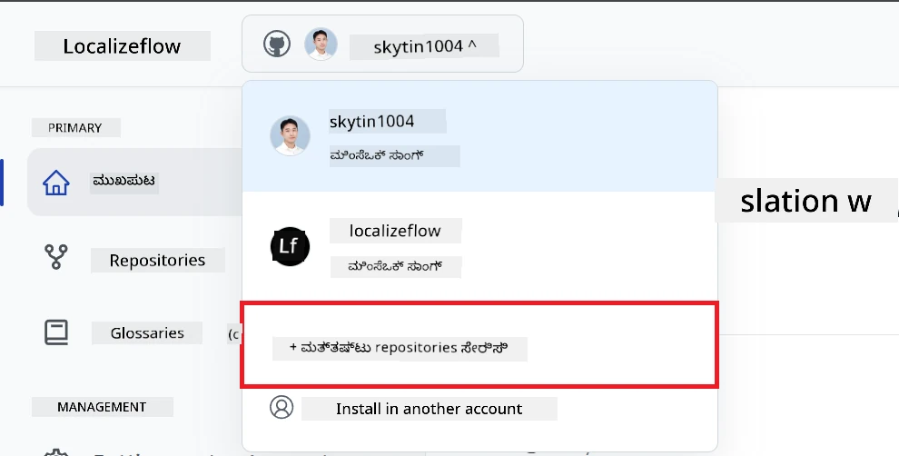

---

## ನಿಮ್ಮ ರೆಪೊಸಿಟರಿಗಳನ್ನು Localizeflowಗೆ ಸಂಪರ್ಕಿಸಿ

1. Localizeflow ಹೋಮ್ ಪುಟದಲ್ಲಿ, **+ Connect repositories** ಆಯ್ಕೆಮಾಡಿ.  
   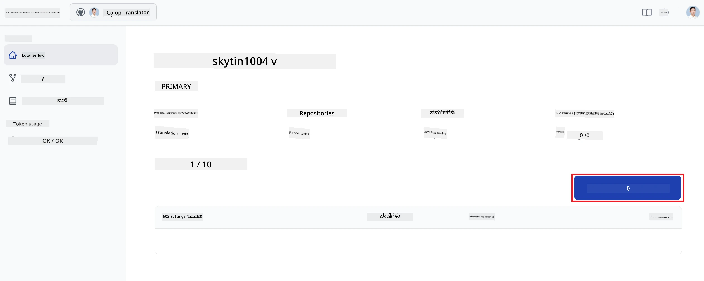

2. ನೀವು ಸಂಪರ್ಕಿಸಲು ಬಯಸುವ ಸ್ಥಾಪಿತ ರೆಪೊಸಿಟರಿಗಳಲ್ಲಿ ಒಂದನ್ನು ಆಯ್ಕೆಮಾಡಿ ಮತ್ತು **Save** ಕ್ಲಿಕ್ ಮಾಡಿ.  
   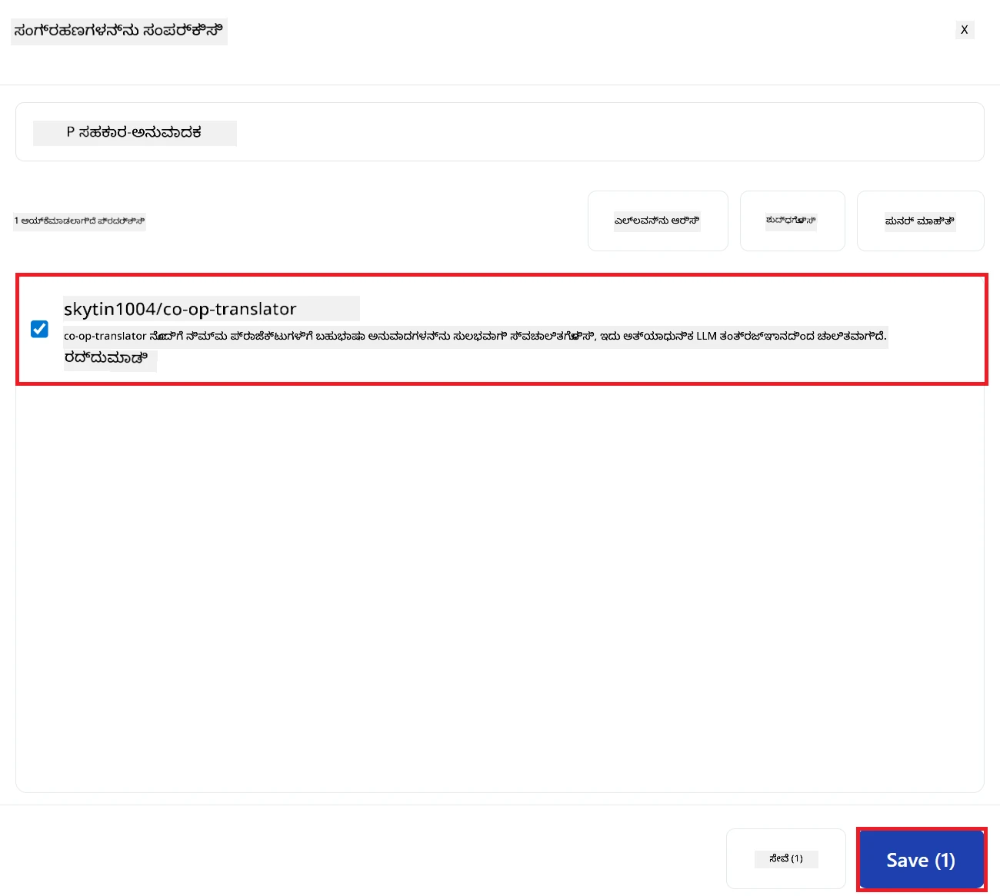

3. ನೀವು ಸಂಪರ್ಕಿಸಿದ ರೆಪೊಸಿಟರಿಗಳು ಈಗ both Home ಪುಟ ಮತ್ತು Repositories ಪುಟದಲ್ಲಿ ಕಾಣಿಸಿಕೊಳ್ಳುತ್ತವೆ.  
   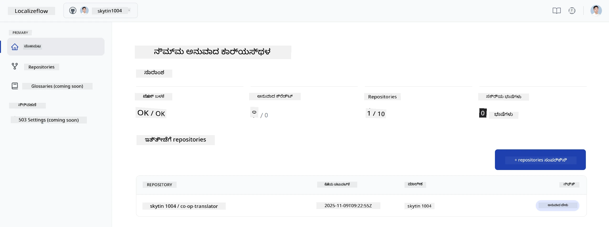

---

## ಸ್ವಯಂಚಾಲಿತ ಅನುವಾದ ಪ್ರಾರಂಭಿಸಿ

1. ನೀವು ಈಗ ಮಾತ್ರ ಸಂಪರ್ಕಿಸಿದ ರೆಪೊಸಿಟರಿಯನ್ನು ಆಯ್ಕೆಮಾಡಿ.  
   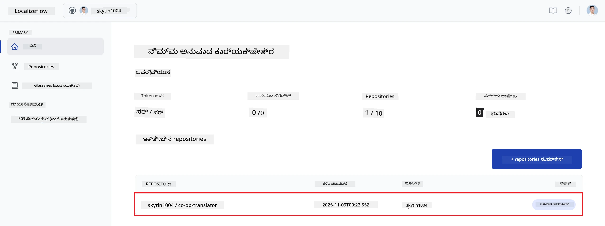

2. ರೆಪೊಸಿಟರಿ ವಿವರ ಪುಟದಲ್ಲಿ, ಕೆಳಗೆ ಇರುವ **Edit** ಆಯ್ಕೆಮಾಡಿ.  
   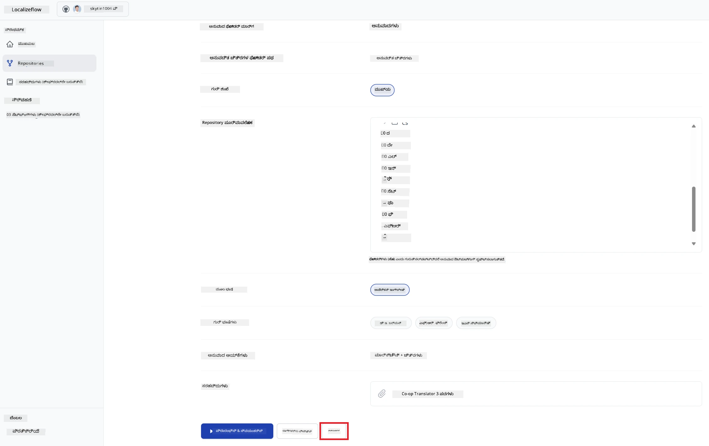

3. ನಿಮ್ಮ ಅನುವಾದ ಸೆಟ್ಟಿಂಗ್‌ಗಳನ್ನು ರಚಿಸಿ — ಗುರಿ ಬ್ರಾಂಚ್ (ಡೀಫಾಲ್ಟ್: `main`), ಗುರಿ ಭಾಷೆಗಳು, ಮತ್ತು ಮೂಲ ಭಾಷೆ (ಡೀಫಾಲ್ಟ್: `en`). ನಂತರ **Save** ಕ್ಲಿಕ್ ಮಾಡಿ.  
   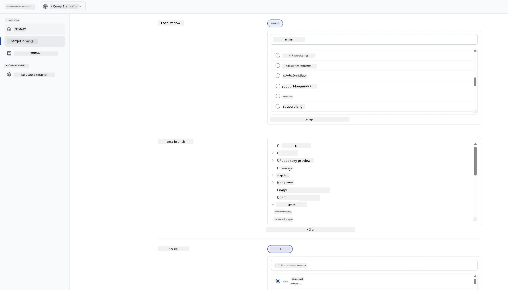

4. **Start & Automate** ಆಯ್ಕೆಮಾಡಿ.  
   Localizeflow ಈಗ ಸ್ವಯಂಚಾಲಿತವಾಗಿ ನಿಮ್ಮ ದಸ್ತಾವೇಜೀಕರಣವನ್ನು ಅನುವಾದಿಸಿ ಮೂಲ ಬದಲಾವಣೆಗಳು ಬಂದಾಗ ಪುಲ್ ರಿಕ್ವೆಸ್ಟ್‌ಗಳನ್ನು ತೆರೆಯುತ್ತದೆ.  
   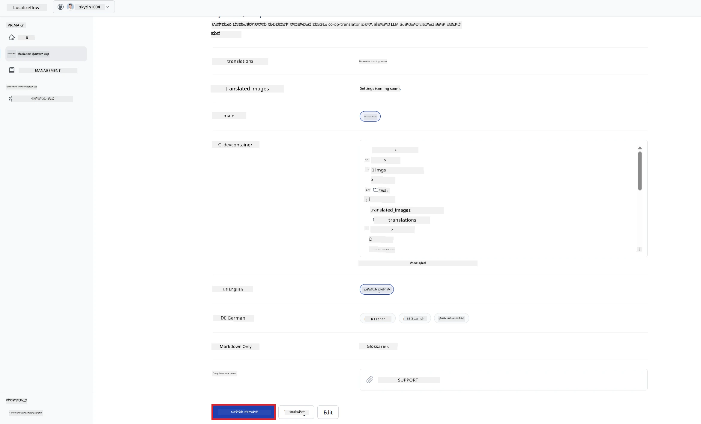

---

<!-- CO-OP TRANSLATOR DISCLAIMER START -->
**ಜ имеют в виду**:  
ಈ ದಾಖಲೆ [Co-op Translator](https://github.com/Azure/co-op-translator) ಎಂಬ AI ಅನುವಾದ ಸೇವೆಯನ್ನು ಬಳಸಿಕೊಂಡು ಅನುವಾದಿಸಲಾಗಿದೆ. ನಾವು ಶುದ್ಧತೆಗೆ ಪ್ರಯತ್ನಿಸುತ್ತಾಗಿದ್ದರೂ, ಸ್ವಯಂಚಾಲಿತ ಅನುವಾದಗಳಲ್ಲಿ ತಪ್ಪುಗಳು ಅಥವಾ ಅಸತ್ಯತೆಗಳು ಇರಬಹುದೆಂದು ದಯವಿಟ್ಟು ಗಮನಿಸಿರಿ. ಮೂಲ ಭಾಷೆಯಲ್ಲಿ ಇರುವ ಮೂಲ ದಾಖಲೆ ಪ್ರಾಮಾಣಿಕ ಮೂಲವೆಂದು ಪರಿಗಣಿಸಬೇಕು. ಗಂಭೀರ ಮಾಹಿತಿಗಾಗಿ, ವೃತ್ತಿಪರ ಮಾನವ ಅನುವಾದವನ್ನು ಶಿಫಾರಸು ಮಾಡಲಾಗುತ್ತದೆ. ಈ ಅನುವಾದವನ್ನು ಬಳಸಿದ ಪರಿಣಾಮವಾಗಿ ಉಂಟಾಗಬಹುದಾದ ಯಾವುದೇ ತಪ್ಪುಗಳನ್ನು ಅಥವಾ ಅರ್ಥಮಾಡಿಕೊಳ್ಳುವ ಭ್ರಾಂತಿಗಳನ್ನು ನಾವು ಹೊಣೆಗಾರರಾಗಿರುವುದಿಲ್ಲ.
<!-- CO-OP TRANSLATOR DISCLAIMER END -->