# Localizeflow – Greito Pradžios Vadovas

#### Remia [Localizeflow](https://localizeflow.com/)

<!-- CO-OP TRANSLATOR LANGUAGES TABLE START -->
[Arabic](../ar/README.md) | [Bengali](../bn/README.md) | [Bulgarian](../bg/README.md) | [Burmese (Myanmar)](../my/README.md) | [Chinese (Simplified)](../zh-CN/README.md) | [Chinese (Traditional, Hong Kong)](../zh-HK/README.md) | [Chinese (Traditional, Macau)](../zh-MO/README.md) | [Chinese (Traditional, Taiwan)](../zh-TW/README.md) | [Croatian](../hr/README.md) | [Czech](../cs/README.md) | [Danish](../da/README.md) | [Dutch](../nl/README.md) | [Estonian](../et/README.md) | [Finnish](../fi/README.md) | [French](../fr/README.md) | [German](../de/README.md) | [Greek](../el/README.md) | [Hebrew](../he/README.md) | [Hindi](../hi/README.md) | [Hungarian](../hu/README.md) | [Indonesian](../id/README.md) | [Italian](../it/README.md) | [Japanese](../ja/README.md) | [Kannada](../kn/README.md) | [Korean](../ko/README.md) | [Lithuanian](./README.md) | [Malay](../ms/README.md) | [Malayalam](../ml/README.md) | [Marathi](../mr/README.md) | [Nepali](../ne/README.md) | [Nigerian Pidgin](../pcm/README.md) | [Norwegian](../no/README.md) | [Persian (Farsi)](../fa/README.md) | [Polish](../pl/README.md) | [Portuguese (Brazil)](../pt-BR/README.md) | [Portuguese (Portugal)](../pt-PT/README.md) | [Punjabi (Gurmukhi)](../pa/README.md) | [Romanian](../ro/README.md) | [Russian](../ru/README.md) | [Serbian (Cyrillic)](../sr/README.md) | [Slovak](../sk/README.md) | [Slovenian](../sl/README.md) | [Spanish](../es/README.md) | [Swahili](../sw/README.md) | [Swedish](../sv/README.md) | [Tagalog (Filipino)](../tl/README.md) | [Tamil](../ta/README.md) | [Telugu](../te/README.md) | [Thai](../th/README.md) | [Turkish](../tr/README.md) | [Ukrainian](../uk/README.md) | [Urdu](../ur/README.md) | [Vietnamese](../vi/README.md)

> **Norite klonuoti vietoje?**

> Ši saugykla apima daugiau nei 50 kalbų vertimus, kurie žymiai padidina atsisiuntimo dydį. Norėdami klonuoti be vertimų, naudokite ne visą atsisiuntimą (sparse checkout):
> ```bash
> git clone --filter=blob:none --sparse https://github.com/localizeflow/localizeflow-docs.git
> cd localizeflow-docs
> git sparse-checkout set --no-cone '/*' '!translations' '!translated_images'
> ```
> Tai suteiks jums viską, ko reikia kursui užbaigti, ir leis atsisiųsti daug greičiau.
<!-- CO-OP TRANSLATOR LANGUAGES TABLE END -->

Localizeflow automatiškai verčia jūsų dokumentaciją ir atidaro pull request'us kiekvieną kartą, kai keičiasi šaltinio failas.  
Šis vadovas parodo, kaip įdiegti GitHub programėlę ir atlikti pirmąjį vertimą per mažiau nei 2 minutes.


> [!NOTE]
>
> Localizeflow šiuo metu palaiko dokumentacijos projektus, pagrįstus GitHub
> (pavyzdžiui: AI for Beginners ir dauguma standartinių atvirojo kodo saugyklų).  
> 
> Tolimesnis palaikymas šiuolaikiniams dokumentacijos karkasams, tokiems kaip Astro, Docusaurus ir Hugo,  
> yra aktyviame kūrime.


---

## Prisijunkite ir įdiekite GitHub programėlę

1. Apsilankykite **[localizeflow.com](https://localizeflow.com/)**.
2. Pasirinkite **Start with free trial**.
   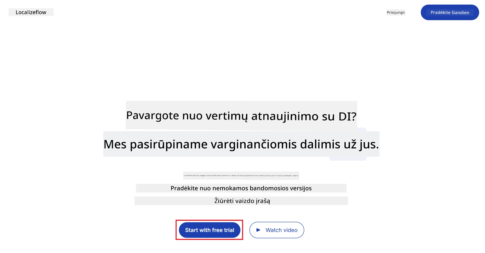
3. Pasirinkite **Sign in with GitHub**.  
   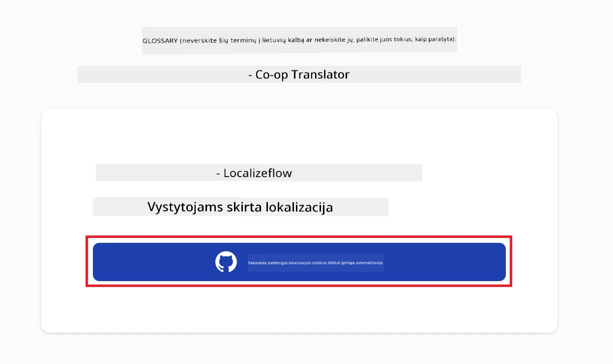
4. Prisijunkite su savo GitHub paskyra.  
   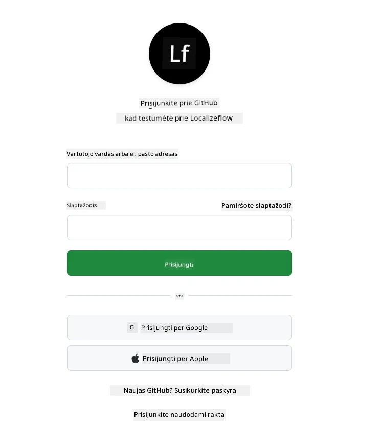
5. Pasirinkite paskyrą, kurioje norite įdiegti Localizeflow GitHub programėlę — savo asmeninę paskyrą arba organizaciją, kuriai vadovaujate.  
   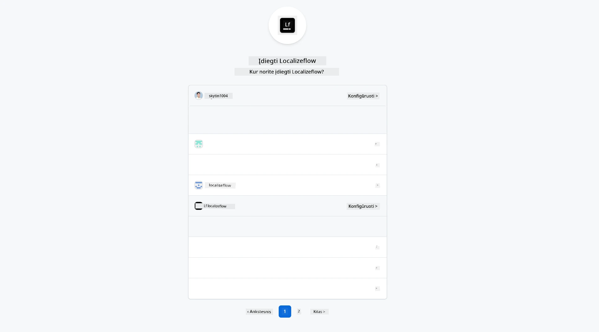
6. Pasirinkite saugyklas, prie kurių Localizeflow turėtų turėti prieigą, tada pasirinkite **Save**.  
   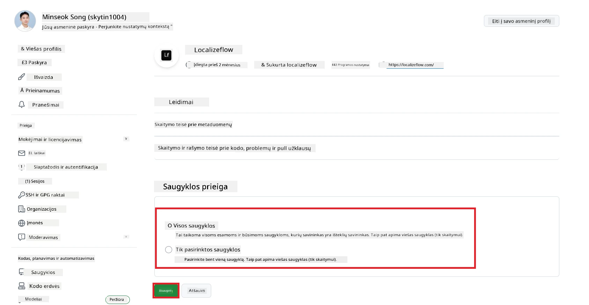
7. Būsite nukreipti į Localizeflow pagrindinį puslapį.

> [!TIP]
> Norėdami vėliau pridėti daugiau saugyklų, pasirinkite savo paskyrą antraštėje ir pasirinkite **+ Add more repositories**.  
> 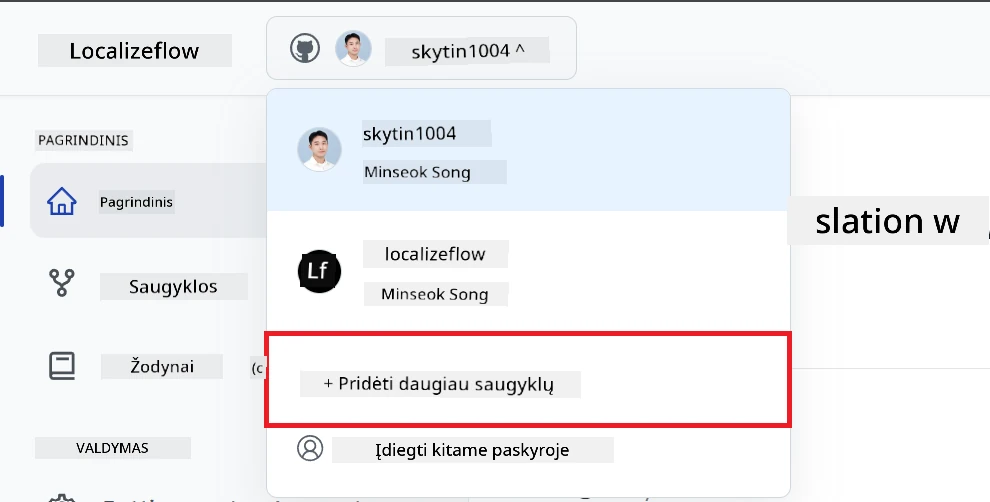

---

## Prijunkite savo saugyklas prie Localizeflow

1. Localizeflow pagrindiniame puslapyje pasirinkite **+ Connect repositories**.  
   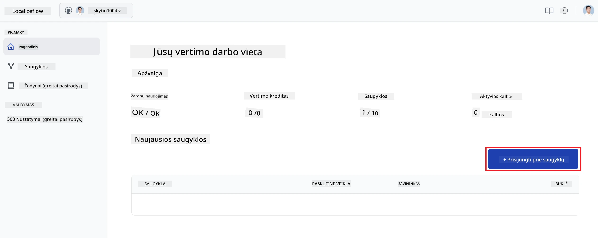

2. Pasirinkite vieną iš įdiegtų saugyklų, kurias norite prijungti, ir pasirinkite **Save**.  
   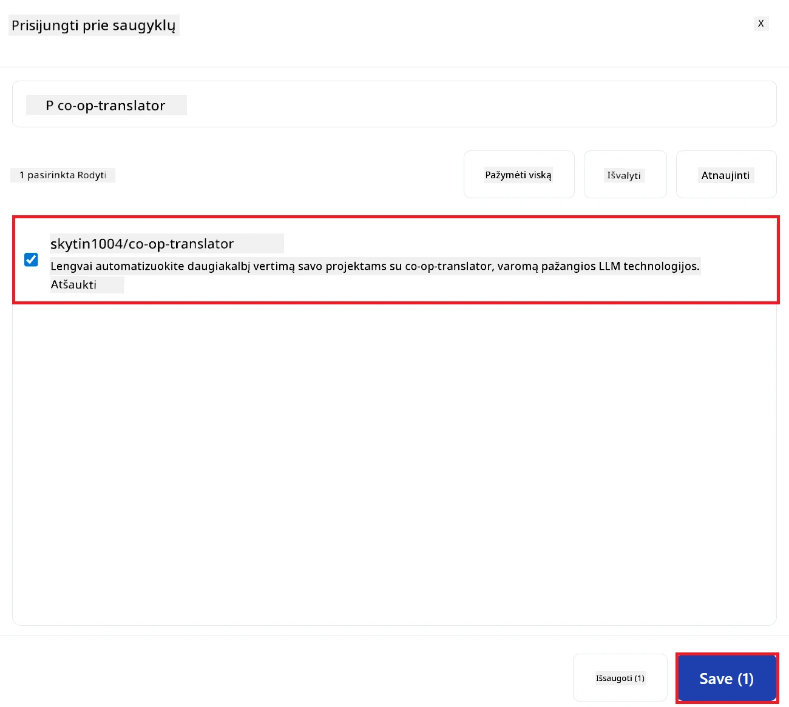

3. Jūsų prijungtos saugyklos dabar bus matomos tiek pagrindiniame puslapyje, tiek puslapyje Repositories.  
   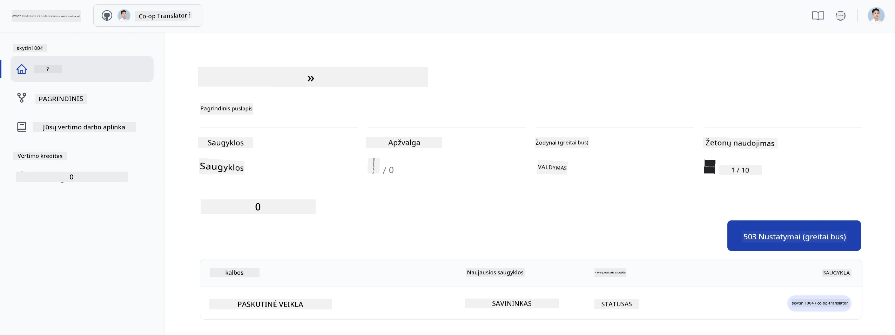

---

## Pradėkite automatinį vertimą

1. Pasirinkite ką tik prijungtą saugyklą.  
   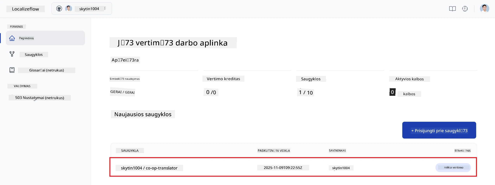

2. Saugyklos detalės puslapyje apačioje pasirinkite **Edit**.  
   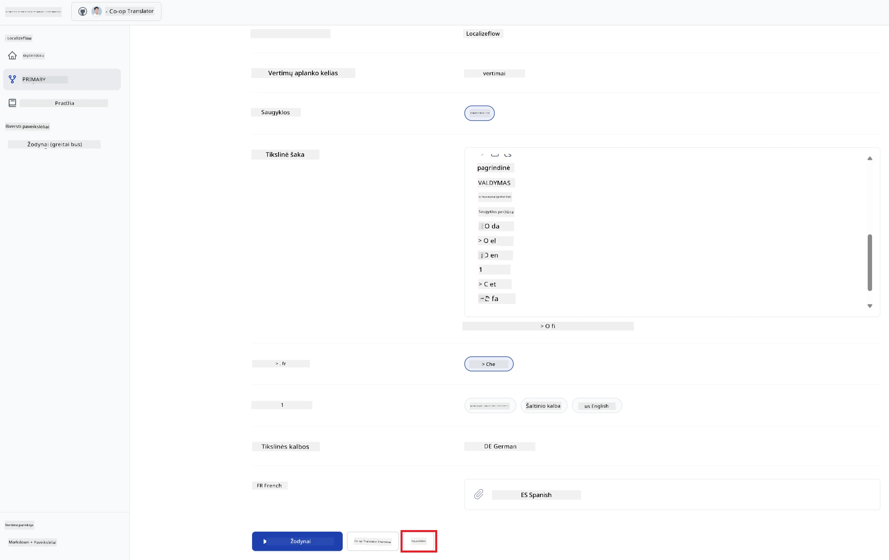

3. Konfigūruokite vertimo nustatymus — tikslinę šaką (numatytoji: `main`), tikslines kalbas ir šaltinio kalbą (numatytoji: `en`). Pasirinkite **Save**.  
   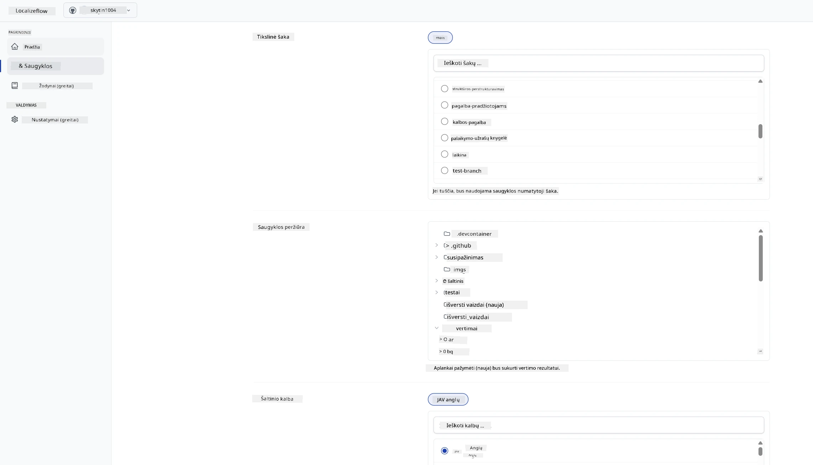

4. Pasirinkite **Start & Automate**.  
   Localizeflow dabar automatiškai verčia jūsų dokumentaciją ir atidaro pull request'us kiekvieną kartą, kai keičiasi šaltinis.  
   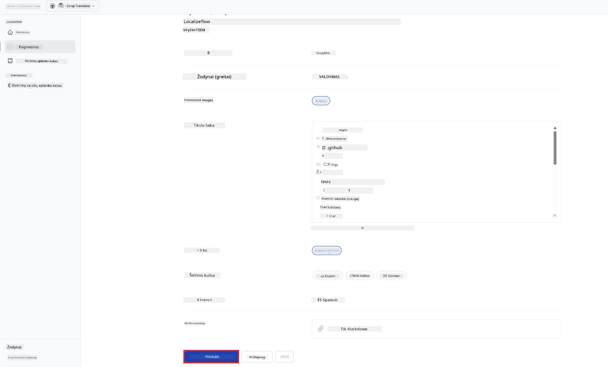

---

<!-- CO-OP TRANSLATOR DISCLAIMER START -->
**Atsakomybės apribojimas**:
Šis dokumentas buvo išverstas naudojant dirbtinio intelekto vertimo paslaugą [Co-op Translator](https://github.com/Azure/co-op-translator). Nors stengiamės užtikrinti tikslumą, prašome atkreipti dėmesį, kad automatiniai vertimai gali turėti klaidų ar netikslumų. Originalus dokumentas jo gimtąja kalba laikomas autoritetingu šaltiniu. Kritinei informacijai rekomenduojama naudoti profesionalų žmogaus atliktą vertimą. Mes neatsakome už jokius nesusipratimus ar neteisingus aiškinimus, kylančius dėl šio vertimo naudojimo.
<!-- CO-OP TRANSLATOR DISCLAIMER END -->