# Localizeflow – जलद प्रारंभ मार्गदर्शक

#### [Localizeflow](https://localizeflow.com/) द्वारे समर्थित

<!-- CO-OP TRANSLATOR LANGUAGES TABLE START -->
[Arabic](../ar/README.md) | [Bengali](../bn/README.md) | [Bulgarian](../bg/README.md) | [Burmese (Myanmar)](../my/README.md) | [Chinese (Simplified)](../zh-CN/README.md) | [Chinese (Traditional, Hong Kong)](../zh-HK/README.md) | [Chinese (Traditional, Macau)](../zh-MO/README.md) | [Chinese (Traditional, Taiwan)](../zh-TW/README.md) | [Croatian](../hr/README.md) | [Czech](../cs/README.md) | [Danish](../da/README.md) | [Dutch](../nl/README.md) | [Estonian](../et/README.md) | [Finnish](../fi/README.md) | [French](../fr/README.md) | [German](../de/README.md) | [Greek](../el/README.md) | [Hebrew](../he/README.md) | [Hindi](../hi/README.md) | [Hungarian](../hu/README.md) | [Indonesian](../id/README.md) | [Italian](../it/README.md) | [Japanese](../ja/README.md) | [Kannada](../kn/README.md) | [Korean](../ko/README.md) | [Lithuanian](../lt/README.md) | [Malay](../ms/README.md) | [Malayalam](../ml/README.md) | [Marathi](./README.md) | [Nepali](../ne/README.md) | [Nigerian Pidgin](../pcm/README.md) | [Norwegian](../no/README.md) | [Persian (Farsi)](../fa/README.md) | [Polish](../pl/README.md) | [Portuguese (Brazil)](../pt-BR/README.md) | [Portuguese (Portugal)](../pt-PT/README.md) | [Punjabi (Gurmukhi)](../pa/README.md) | [Romanian](../ro/README.md) | [Russian](../ru/README.md) | [Serbian (Cyrillic)](../sr/README.md) | [Slovak](../sk/README.md) | [Slovenian](../sl/README.md) | [Spanish](../es/README.md) | [Swahili](../sw/README.md) | [Swedish](../sv/README.md) | [Tagalog (Filipino)](../tl/README.md) | [Tamil](../ta/README.md) | [Telugu](../te/README.md) | [Thai](../th/README.md) | [Turkish](../tr/README.md) | [Ukrainian](../uk/README.md) | [Urdu](../ur/README.md) | [Vietnamese](../vi/README.md)

> **स्थानिक स्वरूपात क्लोन करणे प्राधान्यदर्शक आहे?**

> या रिपॉझिटरीमध्ये ५०+ भाषा अनुवादांचा समावेश आहे ज्यामुळे डाउनलोडचा आकार लक्षणीय वाढतो. भाषांतरांशिवाय क्लोन करण्यासाठी, sparse checkout वापरा:  
> ```bash
> git clone --filter=blob:none --sparse https://github.com/localizeflow/localizeflow-docs.git
> cd localizeflow-docs
> git sparse-checkout set --no-cone '/*' '!translations' '!translated_images'
> ```
> यामुळे आपल्याला कोर्स पूर्ण करण्यासाठी आवश्यक सर्व काही मिळेल आणि डाउनलोड जास्त जलद होईल.  
<!-- CO-OP TRANSLATOR LANGUAGES TABLE END -->

Localizeflow आपोआप तुमची दस्तऐवजीकरणे अनुवादित करते आणि स्रोत फाइल बदलल्यानंतर पुल विनंत्या उघडते.  
हा मार्गदर्शक GitHub अ‍ॅप कसा इन्स्टॉल करायचा आणि दोन मिनिटांच्या आत प्रथम अनुवाद कसा चालवायचा हे दर्शवतो.


> [!NOTE]
>
> सध्या Localizeflow GitHub-आधारित दस्तऐवज प्रकल्पांना समर्थन देते  
> (उदाहरणार्थ: AI for Beginners आणि बहुतेक मानक ओपन-सोर्स रिपॉझिटरीज).  
> 
> Astro, Docusaurus, आणि Hugo सारख्या आधुनिक दस्तऐवज फ्रेमवर्कसाठी समर्थन  
> सक्रिय विकासात आहे.


---

## GitHub अ‍ॅपमध्ये साइन इन करा आणि इन्स्टॉल करा

1. **[localizeflow.com](https://localizeflow.com/)** भेट द्या.
2. **Start with free trial** निवडा.  
   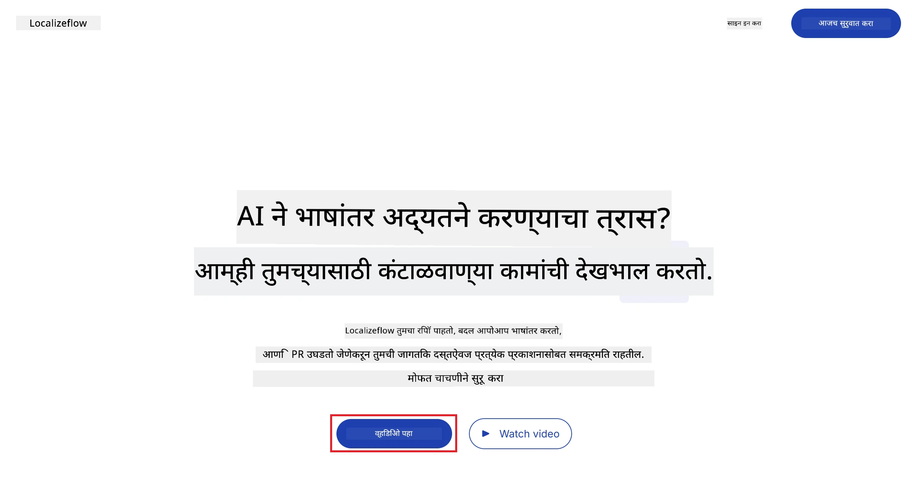
3. **Sign in with GitHub** निवडा.  
   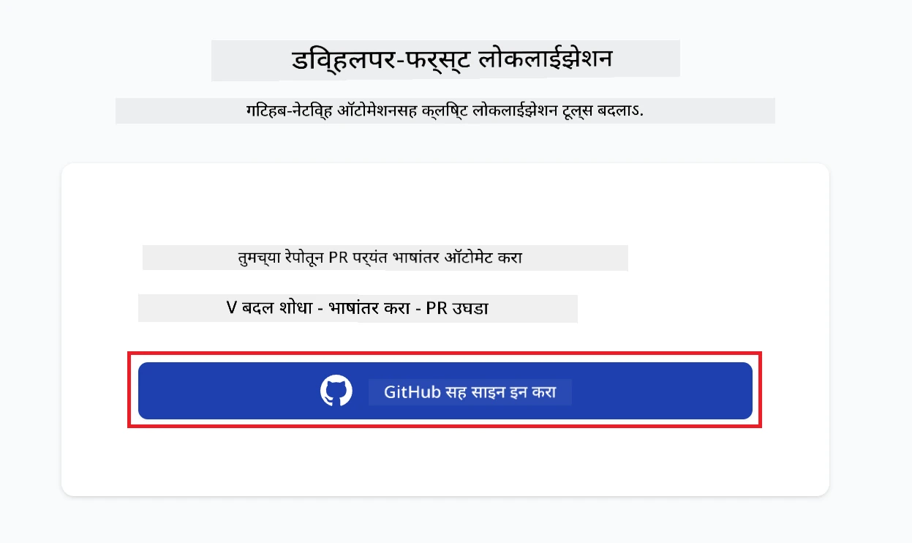
4. तुमच्या GitHub खात्याने साइन इन करा.  
   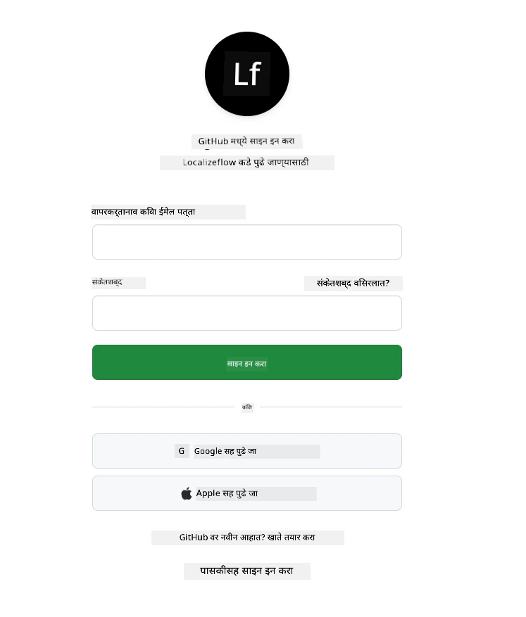
5. Localizeflow GitHub अ‍ॅप इन्स्टॉल करायच्या खात्याची निवड करा — तुमचे वैयक्तिक खाते किंवा तुम्ही व्यवस्थापित करणारे कोणतेही संघटन.  
   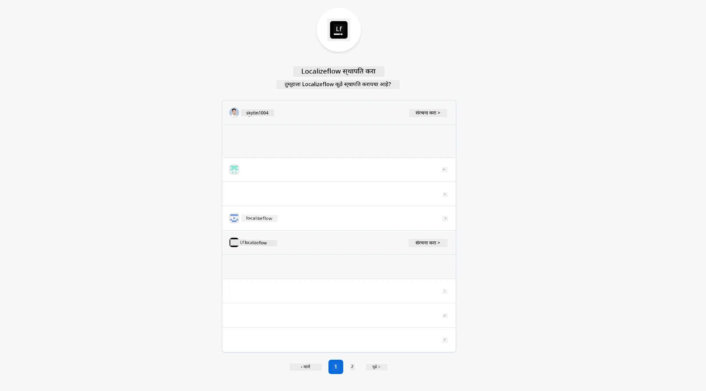
6. Localizeflow ला प्रवेश द्यायच्या रिपॉझिटरीज निवडा, नंतर **Save** निवडा.  
   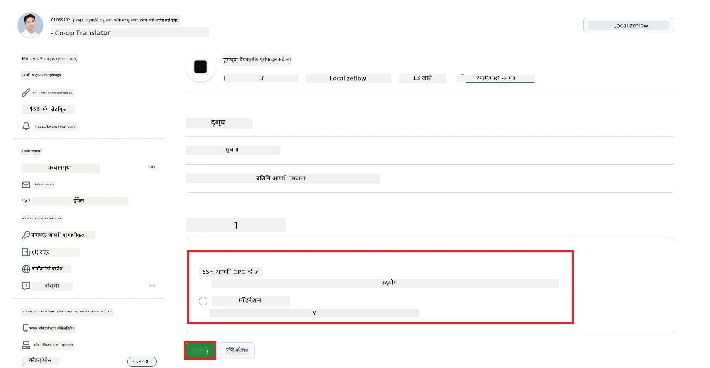
7. तुम्हाला Localizeflow होम पेजवर पुनर्निर्देशित केले जाईल.

> [!TIP]
> नंतर अधिक रिपॉझिटरीज जोडण्यासाठी, हेडरमधील तुमचे खाते निवडा आणि **+ Add more repositories** निवडा.  
> 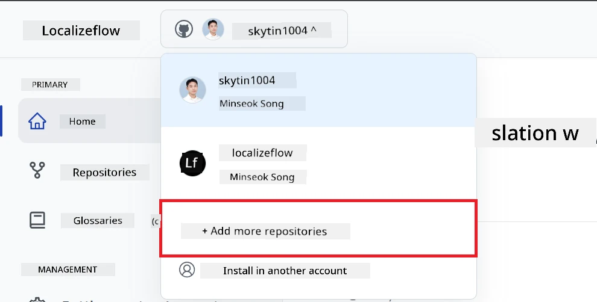

---

## तुमच्या रिपॉझिटरीजना Localizeflow शी कनेक्ट करा

1. Localizeflow होम पेजवर, **+ Connect repositories** निवडा.  
   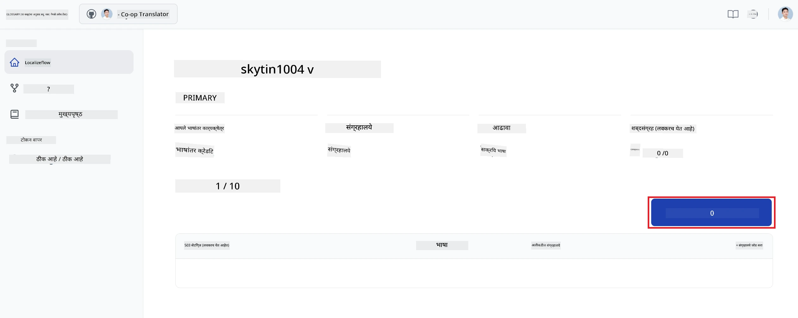

2. जोडायच्या इन्स्टॉल केलेल्या रिपॉझिटरीजपैकी एक निवडा आणि **Save** क्लिक करा.  
   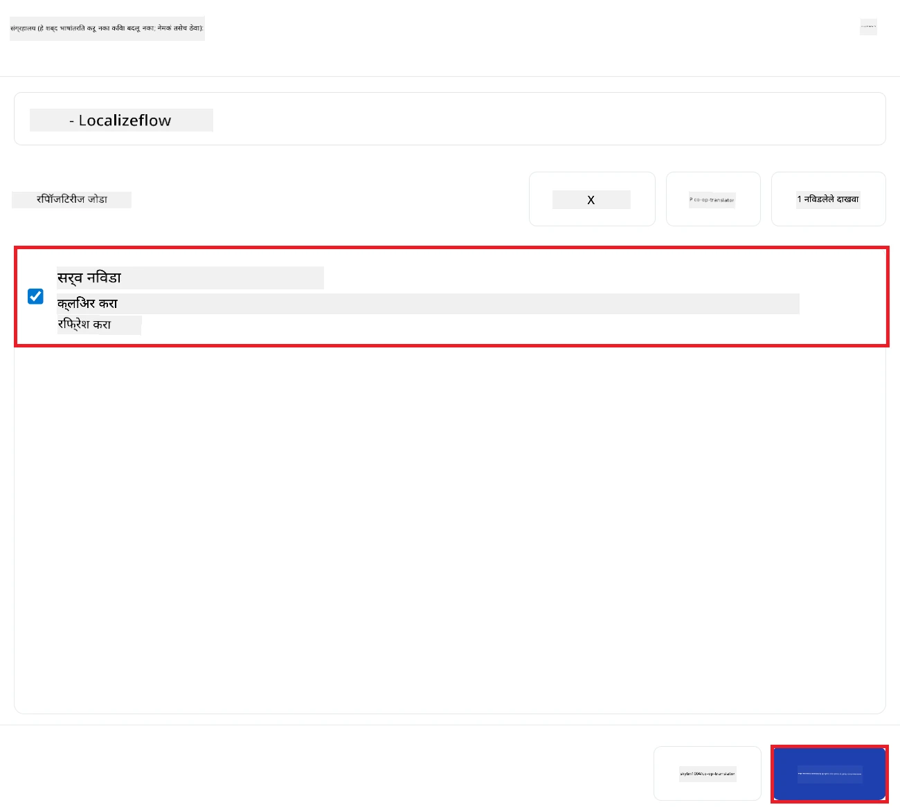

3. तुमच्या जोडलेल्या रिपॉझिटरीज अब होम पेज आणि रिपॉझिटरीज पेज या दोन्ही ठिकाणी दिसतील.  
   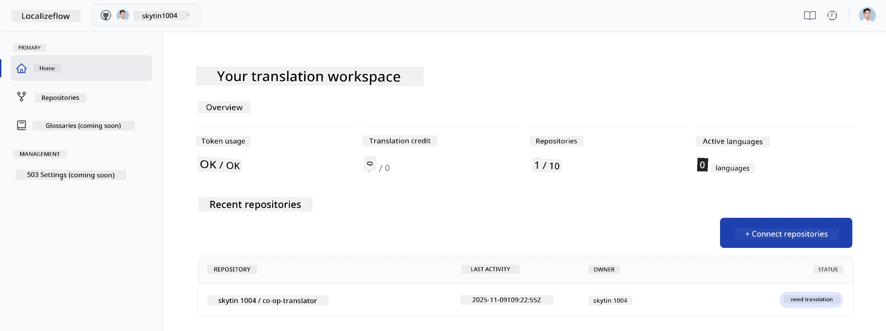

---

## स्वयंचलित अनुवाद सुरू करा

1. नुकतीच जोडलेली रिपॉझिटरी निवडा.  
   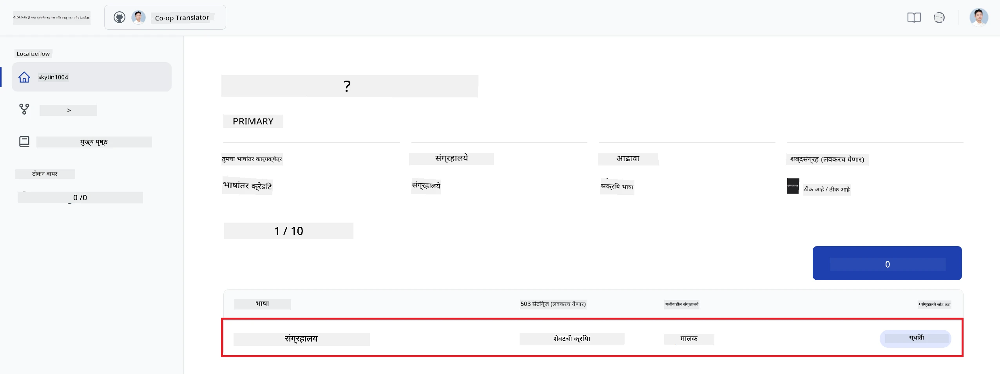

2. रिपॉझिटरीतील तपशील पृष्ठाच्या खालील बाजूला **Edit** निवडा.  
   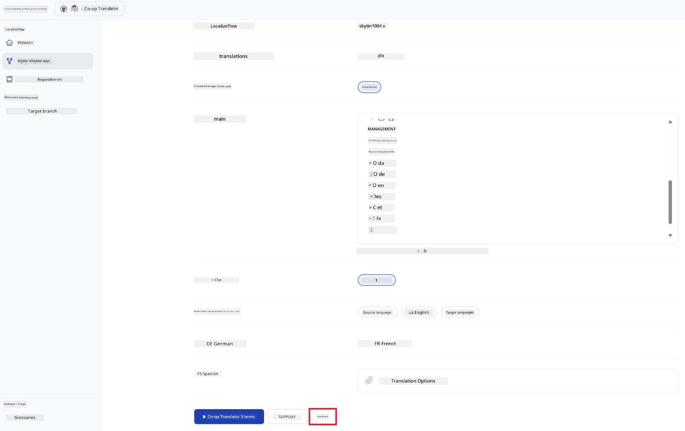

3. तुमचे अनुवाद सेटिंग्ज कॉन्फिगर करा — लक्ष्य शाखा (डिफॉल्ट: `main`), लक्ष्य भाषा, आणि स्रोत भाषा (डिफॉल्ट: `en`). **Save** निवडा.  
   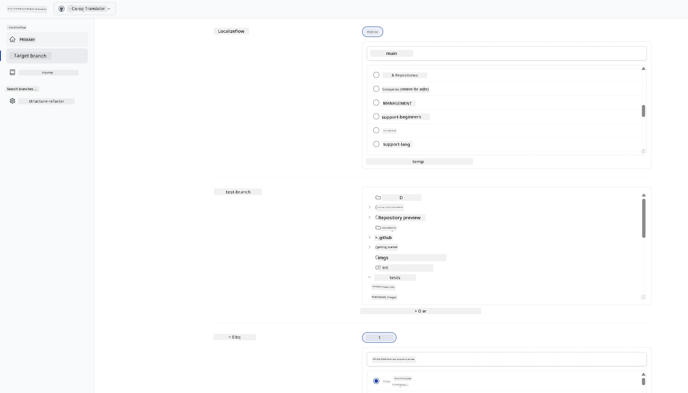

4. **Start & Automate** निवडा.  
   Localizeflow आता तुमची दस्तऐवजीकरणे स्वयंचलितपणे अनुवादित करेल आणि स्रोत बदलल्यावर पुल विनंत्या उघडेल.  
   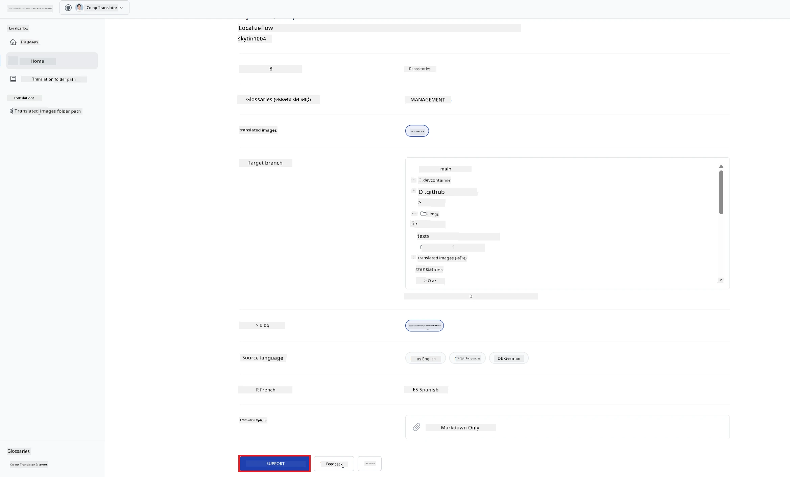

---

<!-- CO-OP TRANSLATOR DISCLAIMER START -->
**अस्वीकरण**:
हे दस्तऐवज एआय अनुवाद सेवा [Co-op Translator](https://github.com/Azure/co-op-translator) द्वारे अनुवादित केलेले आहे. आम्ही अचूकतेसाठी प्रयत्नशील असलो तरी, कृत्रिम अनुवादांमध्ये चुका किंवा अचूकतेचे अभाव असू शकतात हे कृपया लक्षात ठेवा. मूळ दस्तऐवज त्याच्या मूळ भाषेत अधिकृत स्रोत मानला जावा. महत्वाच्या माहितीकरिता व्यावसायिक मानवी अनुवाद करण्याची शिफारस केली जाते. या अनुवादाच्या वापरामुळे उद्भवणाऱ्या कोणत्याही गैरसमजुतींसाठी किंवा चुकीच्या अर्थसंग्रहासाठी आम्ही जबाबदार नाही.
<!-- CO-OP TRANSLATOR DISCLAIMER END -->