# Localizeflow – ဆွယ်တမ်းစတင်လမ်းညွှန်

#### မှ [Localizeflow](https://localizeflow.com/) မှ ပံ့ပိုးသည်

<!-- CO-OP TRANSLATOR LANGUAGES TABLE START -->
[Arabic](../ar/README.md) | [Bengali](../bn/README.md) | [Bulgarian](../bg/README.md) | [Burmese (Myanmar)](./README.md) | [Chinese (Simplified)](../zh-CN/README.md) | [Chinese (Traditional, Hong Kong)](../zh-HK/README.md) | [Chinese (Traditional, Macau)](../zh-MO/README.md) | [Chinese (Traditional, Taiwan)](../zh-TW/README.md) | [Croatian](../hr/README.md) | [Czech](../cs/README.md) | [Danish](../da/README.md) | [Dutch](../nl/README.md) | [Estonian](../et/README.md) | [Finnish](../fi/README.md) | [French](../fr/README.md) | [German](../de/README.md) | [Greek](../el/README.md) | [Hebrew](../he/README.md) | [Hindi](../hi/README.md) | [Hungarian](../hu/README.md) | [Indonesian](../id/README.md) | [Italian](../it/README.md) | [Japanese](../ja/README.md) | [Kannada](../kn/README.md) | [Korean](../ko/README.md) | [Lithuanian](../lt/README.md) | [Malay](../ms/README.md) | [Malayalam](../ml/README.md) | [Marathi](../mr/README.md) | [Nepali](../ne/README.md) | [Nigerian Pidgin](../pcm/README.md) | [Norwegian](../no/README.md) | [Persian (Farsi)](../fa/README.md) | [Polish](../pl/README.md) | [Portuguese (Brazil)](../pt-BR/README.md) | [Portuguese (Portugal)](../pt-PT/README.md) | [Punjabi (Gurmukhi)](../pa/README.md) | [Romanian](../ro/README.md) | [Russian](../ru/README.md) | [Serbian (Cyrillic)](../sr/README.md) | [Slovak](../sk/README.md) | [Slovenian](../sl/README.md) | [Spanish](../es/README.md) | [Swahili](../sw/README.md) | [Swedish](../sv/README.md) | [Tagalog (Filipino)](../tl/README.md) | [Tamil](../ta/README.md) | [Telugu](../te/README.md) | [Thai](../th/README.md) | [Turkish](../tr/README.md) | [Ukrainian](../uk/README.md) | [Urdu](../ur/README.md) | [Vietnamese](../vi/README.md)

> **ပြည်တွင်းတွင်ကလုံးလုပ်ရန်နှစ်သက်ပါသလား?**

> ဤ repository တွင် ဘာသာစကား ၅၀ ကျော်အတွက် ဘာသာပြန်ချက်များ ပါဝင်ပြီး ဒေါင်းလုပ်အရွယ်အစားကို မြှင့်တင်သည်။ ဘာသာပြန်ချက်များမပါဘဲ ကလုံးလုပ်လိုပါက sparse checkout ကိုအသုံးပြုပါ။
> ```bash
> git clone --filter=blob:none --sparse https://github.com/localizeflow/localizeflow-docs.git
> cd localizeflow-docs
> git sparse-checkout set --no-cone '/*' '!translations' '!translated_images'
> ```
> ဒါက သင့်ကို သင်ခန်းစာများ ပြီးမြောက်စေရန် အရေးကြီးတဲ့ အရာအားလုံးကို ပိုမိုလျင်မြန်စွာဒေါင်းလုပ်ဆွဲနိုင်စေပါတယ်။
<!-- CO-OP TRANSLATOR LANGUAGES TABLE END -->

Localizeflow သည် သင့်စာရွက်စာတမ်းများကို အလိုအလျောက် ဘာသာပြန်ပေးပြီး မူလဖိုင်များပြောင်းလဲခြင်းဖြစ်သည့်အခါ pull request များဖွင့်ပေးသည်။  
ဤလမ်းညွှန်သည် GitHub App ကို ထည့်သွင်းခြင်းနှင့် ပထမဆုံး ဘာသာပြန်ချက်ကို ၂ မိနစ်အတွင်း မည်သို့ အလုပ်လုပ်ရမည်ကို ပြသပါသည်။


> [!NOTE]
>
> Localizeflow သည် လောလောဆယ် GitHub အခြေပြု စာရွက်စာတမ်း ပရောဂျက်များကိုသာ ထောက်ပံ့သည်
> (ဥပမာ- AI for Beginners နှင့် ပုံမှန်၀င်းလမ်းများ အများစု)။  
> 
> Astro, Docusaurus, နှင့် Hugo ကဲ့သို့ ခေတ်သစ်စာရွက်စာတမ်း စနစ်များအတွက် ထောက်ပံ့မှုကို လက်ရှိဖွံ့ဖြိုးနေဆဲဖြစ်သည်။


---

## GitHub App တွင် အကောင့်ဝင်၍ ထည့်သွင်းခြင်း

1. **[localizeflow.com](https://localizeflow.com/)** သို့ ဝင်ရောက်ပါ။
2. **Start with free trial** ကို ရွေးချယ်ပါ။
   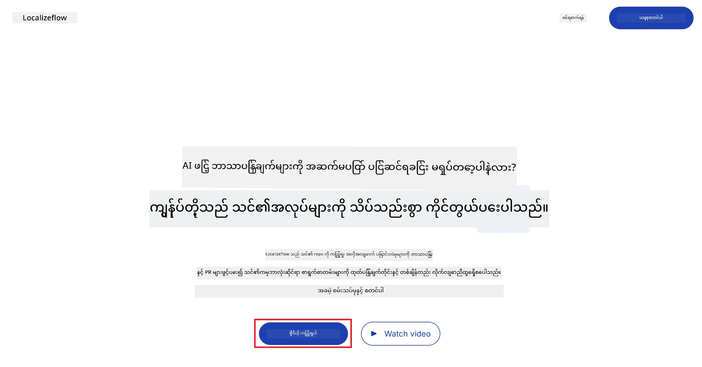
3. **Sign in with GitHub** ကို ရွေးချယ်ပါ။  
   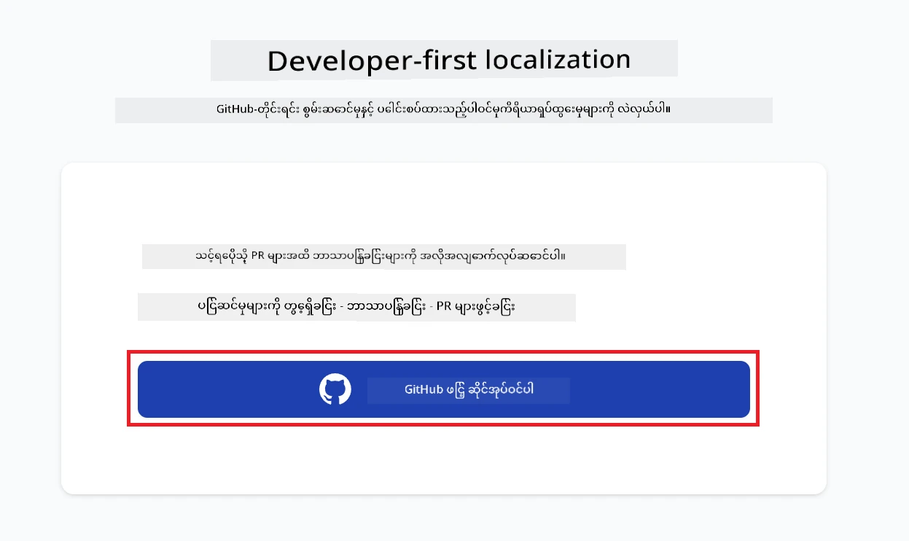
4. သင့် GitHub အကောင့်ဖြင့် အကောင့်ဝင်ပါ။  
   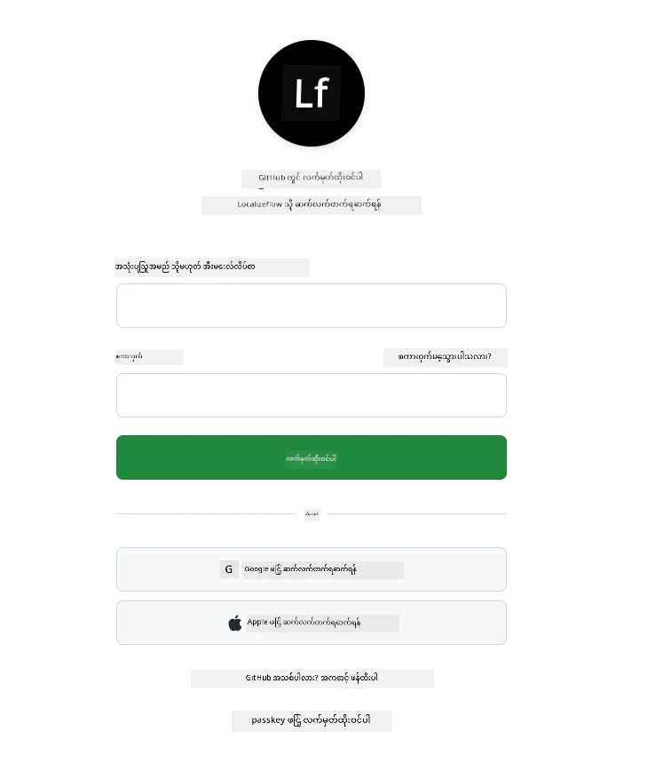
5. Localizeflow GitHub App ကို ထည့်သွင်းလိုသော အကောင့်ကို ရွေးပါ — သင့် ပုဂ္ဂိုလ်ရေးအကောင့် သို့မဟုတ် သင်စီမံခန့်ခွဲသော အဖွဲ့အစည်းတစ်ခု။  
   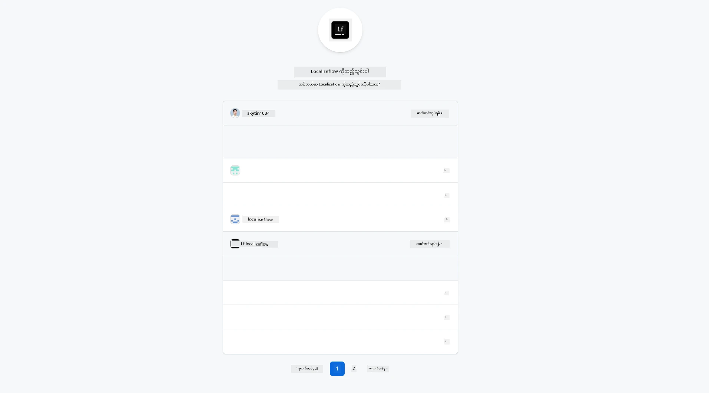
6. Localizeflow ကို 접근ခွင့်ပေးလိုသော repository များကို ရွေးပြီး **Save** ကိုနှိပ်ပါ။  
   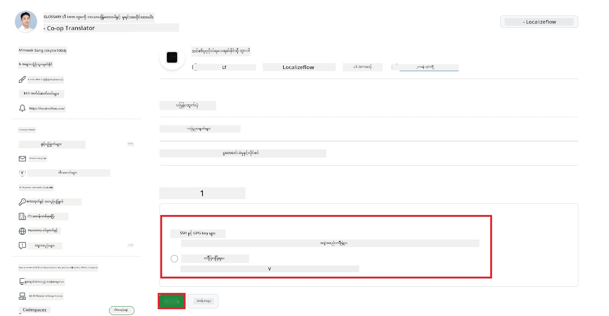
7. Localizeflow မူလစာမျက်နှာသို့ ပြန်လည်ညွှန်ပြမည်။

> [!TIP]
> နောက်ပိုင်း repository များပိုမိုထည့်သွင်းရန်အတွက် header တွင် သင့်အကောင့်ကို ရွေး၍ **+ Add more repositories** ကို ရွေးပါ။  
> 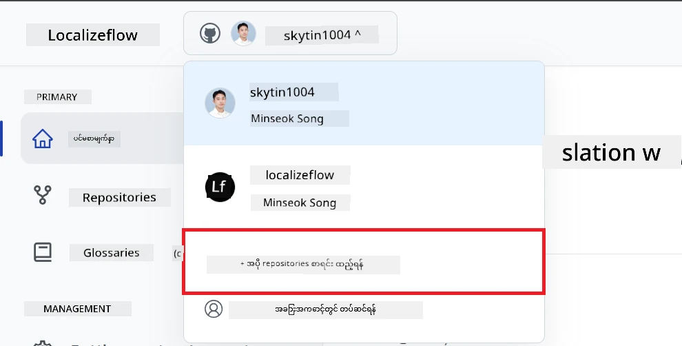

---

## သင့် repository များကို Localizeflow နှင့် ချိတ်ဆက်ခြင်း

1. Localizeflow မူလစာမျက်နှာတွင် **+ Connect repositories** ကို ရွေးပါ။  
   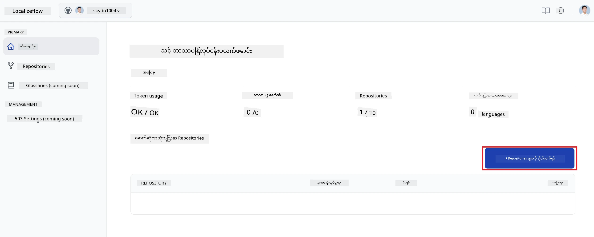

2. ချိတ်ဆက်လိုသော ထည့်သွင်းပြီး repository တစ်ခုကို ရွေးပြီး **Save** ကိုနှိပ်ပါ။  
   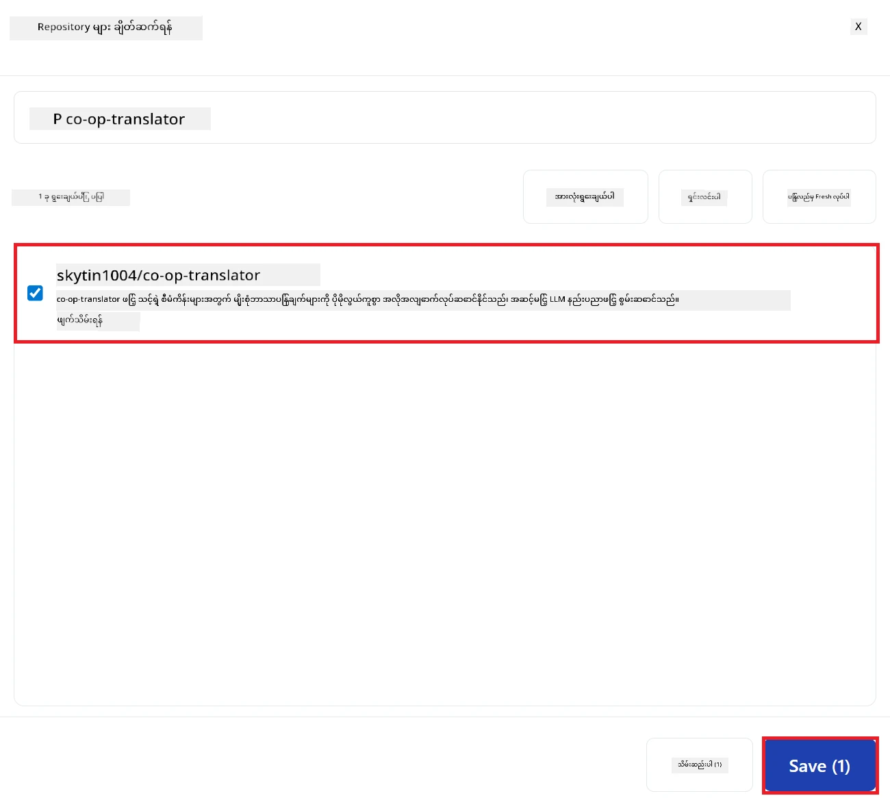

3. ချိတ်ဆက်ပြီးသော repository များသည် မူလစာမျက်နှာနှင့် Repositories စာမျက်နှာ နှစ်ရာတွင် ဖော်ပြမည်။  
   

---

## အလိုအလျောက် ဘာသာပြန်ခြင်း စတင်ခြင်း

1. မကြာသေးမီက ချိတ်ဆက်ခဲ့သော repository ကို ရွေးပါ။  
   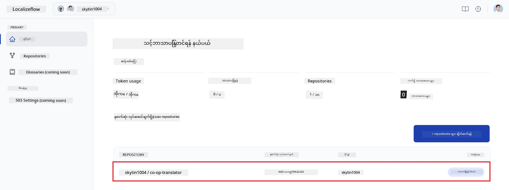

2. repository အသေးစိတ်စာမျက်နှာတွင် အောက်ခြေမှ **Edit** ကို ရွေးပါ။  
   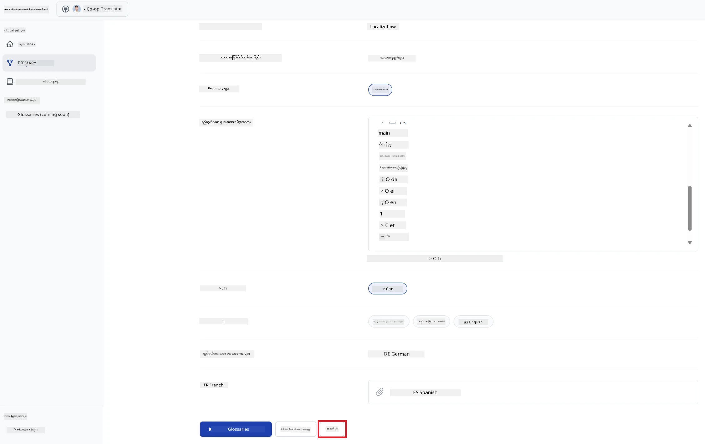

3. သင့် ဘာသာပြန်စာမျက်နှာများကို ပြင်ဆင်ပါ – ပစ်မှတ် branch (အကြ.defaults: `main`), ပစ်မှတ် ဘာသာစကားများနှင့် မူလဘာသာစကား (အကြ.defaults: `en`) ကို ရွေးချယ်ပြီး **Save** နှိပ်ပါ။  
   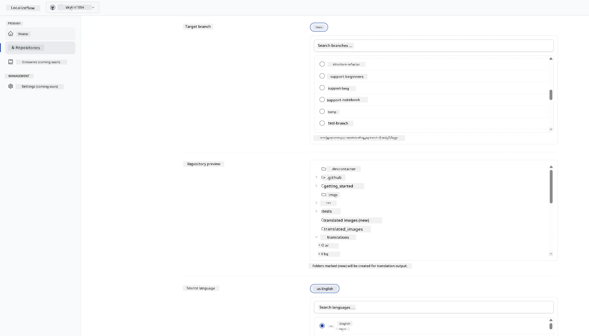

4. **Start & Automate** ကို ရွေးပါ။  
   Localizeflow သည် သင့် စာရွက်စာတမ်းများကို အလိုအလျောက် ဘာသာပြန်၍ မူလဖိုင်ပြောင်းလဲမှုများ ဖြစ်သည်များဖြစ်တိုင်း pull request များ ဖွင့်ပေးမည်ဖြစ်သည်။  
   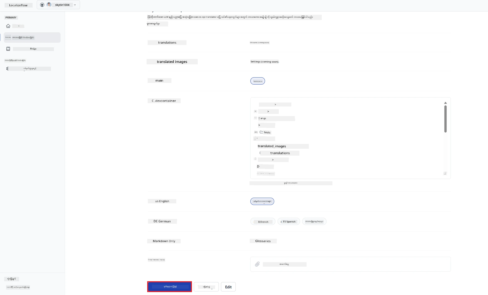

---

<!-- CO-OP TRANSLATOR DISCLAIMER START -->
**ချက်တိတင်ပြချက်**  
ဤစာတမ်းကို AI ဘာသာပြန်ခြင်း ဝန်ဆောင်မှု [Co-op Translator](https://github.com/Azure/co-op-translator) တွင် အသုံးပြု၍ ဘာသာပြန်ထားခြင်း ဖြစ်သည်။ တိကျမှန်ကန်မှုအတွက် ကြိုးပမ်းပေမယ့်၊ စက်ရုပ်ဘာသာပြန်မှုများတွင် အမှားများ သို့မဟုတ် မှားယွင်းချက်များ ဖြစ်ပေါ်နိုင်ကြောင်း သိရှိရန် မေတ္တာရပ်ခံပါသည်။ မူရင်းစာတမ်းသည် ကိုယ်ပိုင်ဘာသာဖြင့် တင်ပြထားသောအတိုင်း အတည်ပြုအရင်းမြစ်ဖြစ်သည်ဟု သတ်မှတ်ကြပါ။ အရေးကြီးသောအချက်အလက်များအတွက်လူ့ဘာသာပြန် တတ်ကျွမ်းသူ၏ ဘာသာပြန်ခြင်းကို အကြံပြုပါသည်။ ဤဘာသာပြန်ခြင်းကို အသုံးပြုခြင်းမှ ဖြစ်ပေါ်နိုင်သည့် နားလည်မှုမှားယွင်းခြင်းများအတွက် ကျနော်တို့ တာ၀န်မယူပါ။
<!-- CO-OP TRANSLATOR DISCLAIMER END -->