# Localizeflow – Raskstartguide

#### Støttet av [Localizeflow](https://localizeflow.com/)

<!-- CO-OP TRANSLATOR LANGUAGES TABLE START -->
[Arabic](../ar/README.md) | [Bengali](../bn/README.md) | [Bulgarian](../bg/README.md) | [Burmese (Myanmar)](../my/README.md) | [Chinese (Simplified)](../zh-CN/README.md) | [Chinese (Traditional, Hong Kong)](../zh-HK/README.md) | [Chinese (Traditional, Macau)](../zh-MO/README.md) | [Chinese (Traditional, Taiwan)](../zh-TW/README.md) | [Croatian](../hr/README.md) | [Czech](../cs/README.md) | [Danish](../da/README.md) | [Dutch](../nl/README.md) | [Estonian](../et/README.md) | [Finnish](../fi/README.md) | [French](../fr/README.md) | [German](../de/README.md) | [Greek](../el/README.md) | [Hebrew](../he/README.md) | [Hindi](../hi/README.md) | [Hungarian](../hu/README.md) | [Indonesian](../id/README.md) | [Italian](../it/README.md) | [Japanese](../ja/README.md) | [Kannada](../kn/README.md) | [Korean](../ko/README.md) | [Lithuanian](../lt/README.md) | [Malay](../ms/README.md) | [Malayalam](../ml/README.md) | [Marathi](../mr/README.md) | [Nepali](../ne/README.md) | [Nigerian Pidgin](../pcm/README.md) | [Norwegian](./README.md) | [Persian (Farsi)](../fa/README.md) | [Polish](../pl/README.md) | [Portuguese (Brazil)](../pt-BR/README.md) | [Portuguese (Portugal)](../pt-PT/README.md) | [Punjabi (Gurmukhi)](../pa/README.md) | [Romanian](../ro/README.md) | [Russian](../ru/README.md) | [Serbian (Cyrillic)](../sr/README.md) | [Slovak](../sk/README.md) | [Slovenian](../sl/README.md) | [Spanish](../es/README.md) | [Swahili](../sw/README.md) | [Swedish](../sv/README.md) | [Tagalog (Filipino)](../tl/README.md) | [Tamil](../ta/README.md) | [Telugu](../te/README.md) | [Thai](../th/README.md) | [Turkish](../tr/README.md) | [Ukrainian](../uk/README.md) | [Urdu](../ur/README.md) | [Vietnamese](../vi/README.md)

> **Foretrekker du å klone lokalt?**

> Dette depotet inkluderer 50+ språkoversettelser som betydelig øker nedlastingsstørrelsen. For å klone uten oversettelser, bruk sparse checkout:
> ```bash
> git clone --filter=blob:none --sparse https://github.com/localizeflow/localizeflow-docs.git
> cd localizeflow-docs
> git sparse-checkout set --no-cone '/*' '!translations' '!translated_images'
> ```
> Dette gir deg alt du trenger for å fullføre kurset med en mye raskere nedlasting.
<!-- CO-OP TRANSLATOR LANGUAGES TABLE END -->

Localizeflow oversetter automatisk dokumentasjonen din og åpner pull requests når kildfilen endres.  
Denne guiden viser deg hvordan du installerer GitHub-appen og kjører din første oversettelse på under 2 minutter.


> [!NOTE]
>
> Localizeflow støtter for øyeblikket GitHub-baserte dokumentasjonsprosjekter
> (for eksempel: AI for Beginners og de fleste standard åpne kildekode-repositorier).  
> 
> Støtte for moderne dokumentasjonsrammeverk som Astro, Docusaurus og Hugo  
> er under aktiv utvikling.


---

## Logg inn og installer GitHub-appen

1. Besøk **[localizeflow.com](https://localizeflow.com/)**.
2. Velg **Start med gratis prøveperiode**.
   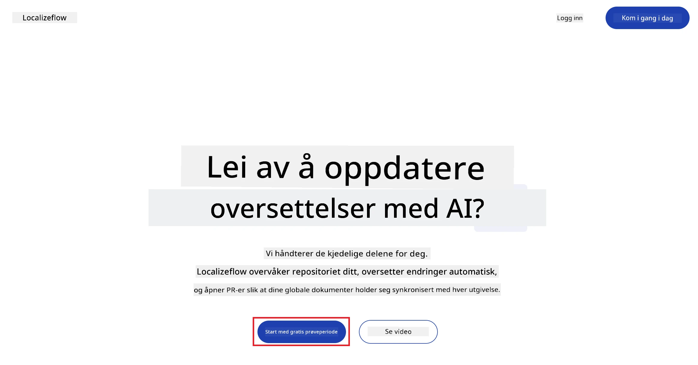
3. Velg **Logg inn med GitHub**.  
   
4. Logg inn med din GitHub-konto.  
   
5. Velg kontoen der du vil installere Localizeflow GitHub-appen — din personlige konto eller en organisasjon du administrerer.  
   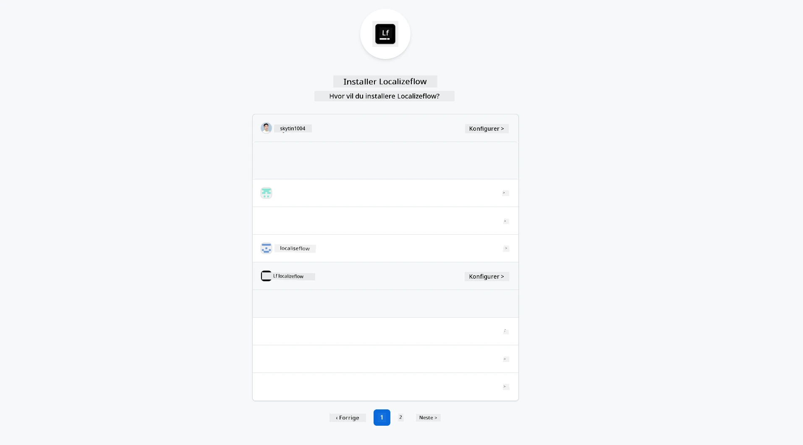
6. Velg repositoriene du ønsker at Localizeflow skal få tilgang til, og velg deretter **Lagre**.  
   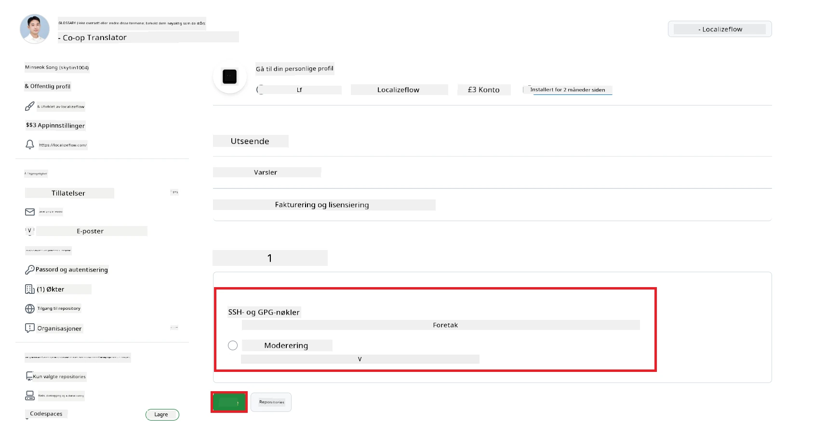
7. Du vil bli omdirigert til Localizeflow-hjemmesiden.

> [!TIP]
> For å legge til flere repositorier senere, velg kontoen din i toppteksten og velg **+ Legg til flere repositorier**.  
> 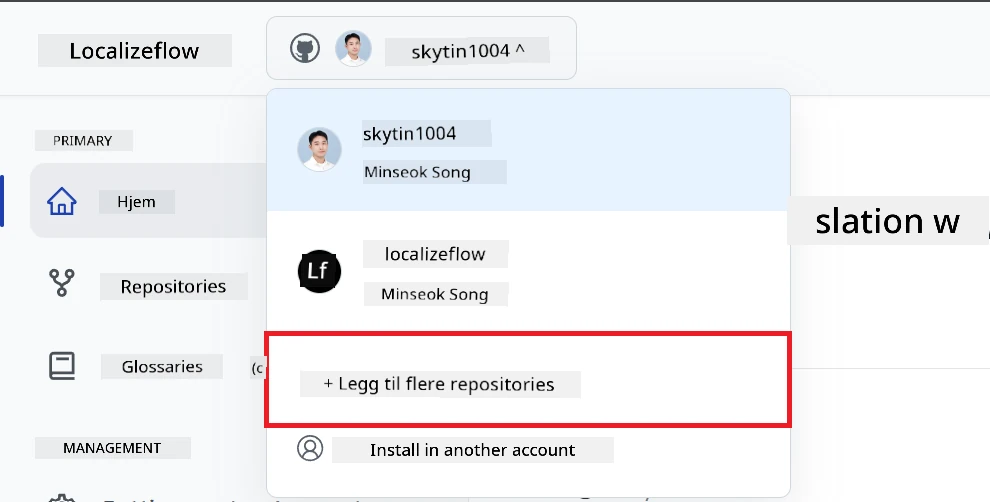

---

## Koble repositoriene dine til Localizeflow

1. På Localizeflow-hjemmesiden velger du **+ Koble til repositorier**.  
   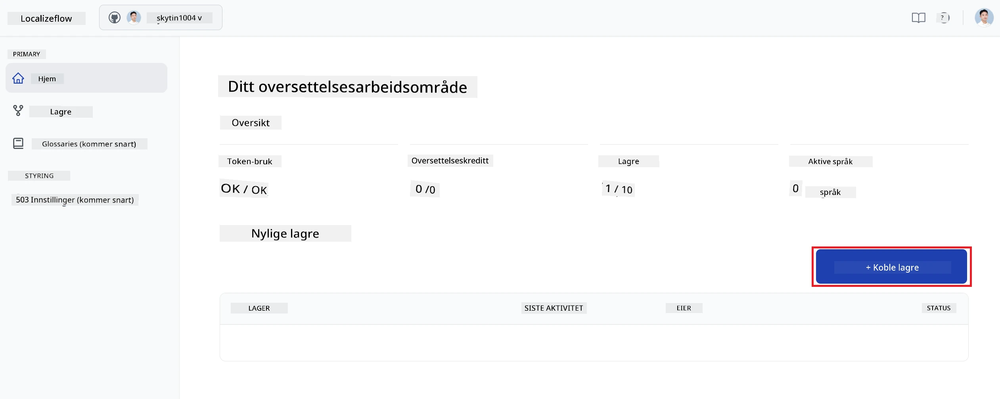

2. Velg et av de installerte repositoriene du ønsker å koble til og velg **Lagre**.  
   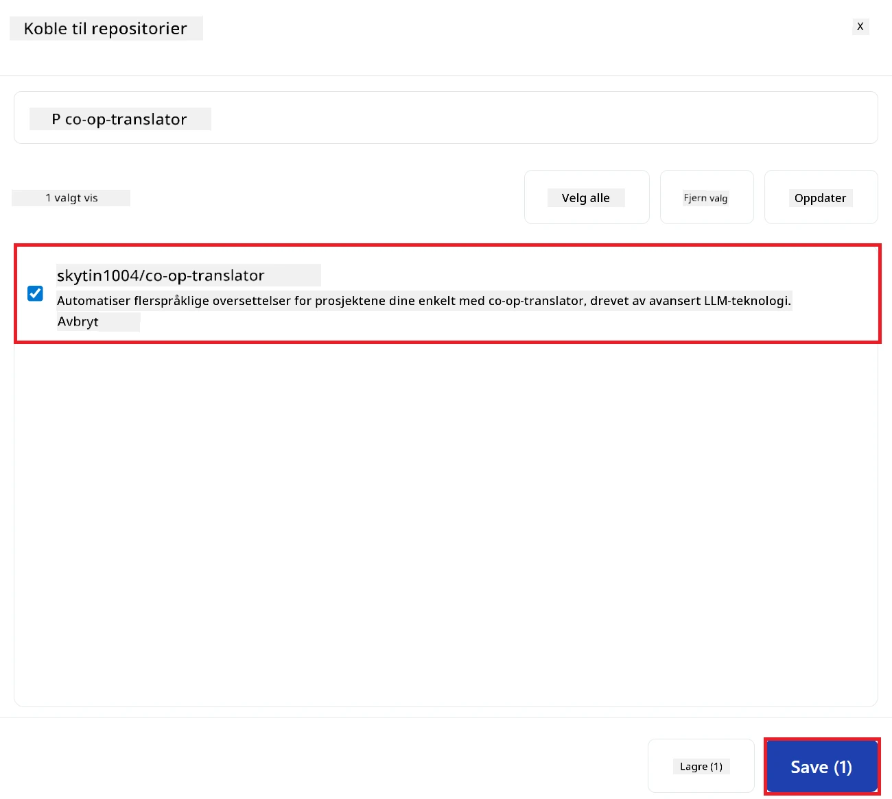

3. Dine tilkoblede repositorier vil nå vises både på Hjem-siden og på Repositorier-siden.  
   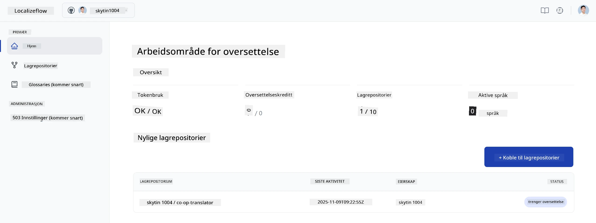

---

## Start automatisk oversettelse

1. Velg repositoriet du nettopp koblet til.  
   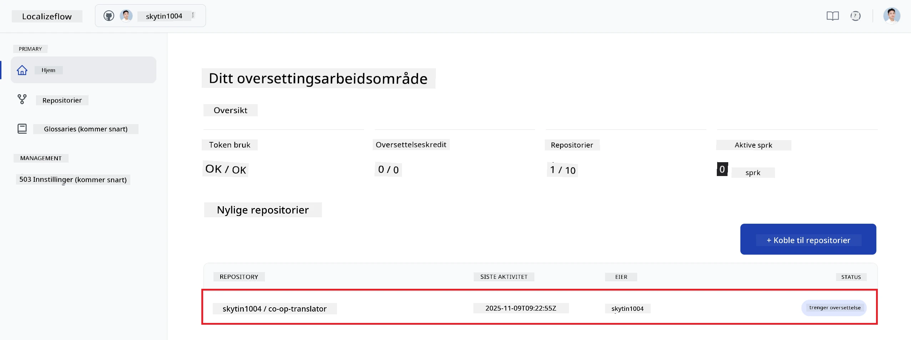

2. På repositoriets detaljside velger du **Rediger** nederst.  
   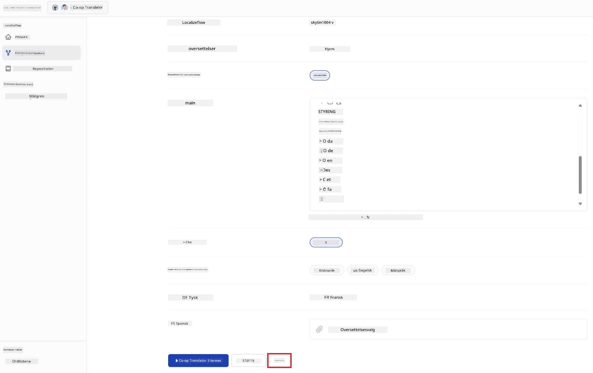

3. Konfigurer oversettelsesinnstillingene dine — målgren (standard: `main`), mål språk, og kildespråk (standard: `en`). Velg **Lagre**.  
   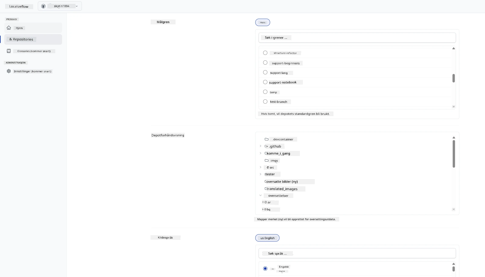

4. Velg **Start & Automatiser**.  
   Localizeflow vil nå automatisk oversette dokumentasjonen din og åpne pull requests når kilden endres.  
   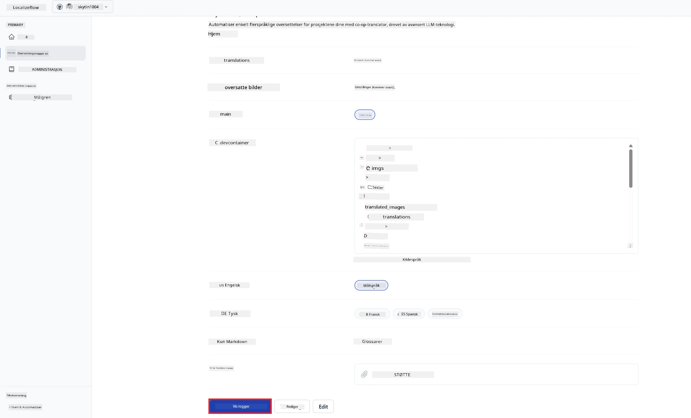

---

<!-- CO-OP TRANSLATOR DISCLAIMER START -->
**Ansvarsfraskrivelse**:
Dette dokumentet er oversatt ved hjelp av AI-oversettelsestjenesten [Co-op Translator](https://github.com/Azure/co-op-translator). Selv om vi streber etter nøyaktighet, vennligst vær oppmerksom på at automatiske oversettelser kan inneholde feil eller unøyaktigheter. Det originale dokumentet på sitt opprinnelige språk bør anses som den autoritative kilden. For kritisk informasjon anbefales profesjonell menneskelig oversettelse. Vi er ikke ansvarlige for eventuelle misforståelser eller feiltolkninger som oppstår fra bruk av denne oversettelsen.
<!-- CO-OP TRANSLATOR DISCLAIMER END -->