# Localizeflow – ਤੁਰੰਤ ਸ਼ੁਰੂਆਤ ਮਾਰਗਦਰਸ਼ਿਕ

#### [Localizeflow](https://localizeflow.com/) ਦੁਆਰਾ ਸਮਰਥਿਤ

<!-- CO-OP TRANSLATOR LANGUAGES TABLE START -->
[Arabic](../ar/README.md) | [Bengali](../bn/README.md) | [Bulgarian](../bg/README.md) | [Burmese (Myanmar)](../my/README.md) | [Chinese (Simplified)](../zh-CN/README.md) | [Chinese (Traditional, Hong Kong)](../zh-HK/README.md) | [Chinese (Traditional, Macau)](../zh-MO/README.md) | [Chinese (Traditional, Taiwan)](../zh-TW/README.md) | [Croatian](../hr/README.md) | [Czech](../cs/README.md) | [Danish](../da/README.md) | [Dutch](../nl/README.md) | [Estonian](../et/README.md) | [Finnish](../fi/README.md) | [French](../fr/README.md) | [German](../de/README.md) | [Greek](../el/README.md) | [Hebrew](../he/README.md) | [Hindi](../hi/README.md) | [Hungarian](../hu/README.md) | [Indonesian](../id/README.md) | [Italian](../it/README.md) | [Japanese](../ja/README.md) | [Kannada](../kn/README.md) | [Korean](../ko/README.md) | [Lithuanian](../lt/README.md) | [Malay](../ms/README.md) | [Malayalam](../ml/README.md) | [Marathi](../mr/README.md) | [Nepali](../ne/README.md) | [Nigerian Pidgin](../pcm/README.md) | [Norwegian](../no/README.md) | [Persian (Farsi)](../fa/README.md) | [Polish](../pl/README.md) | [Portuguese (Brazil)](../pt-BR/README.md) | [Portuguese (Portugal)](../pt-PT/README.md) | [Punjabi (Gurmukhi)](./README.md) | [Romanian](../ro/README.md) | [Russian](../ru/README.md) | [Serbian (Cyrillic)](../sr/README.md) | [Slovak](../sk/README.md) | [Slovenian](../sl/README.md) | [Spanish](../es/README.md) | [Swahili](../sw/README.md) | [Swedish](../sv/README.md) | [Tagalog (Filipino)](../tl/README.md) | [Tamil](../ta/README.md) | [Telugu](../te/README.md) | [Thai](../th/README.md) | [Turkish](../tr/README.md) | [Ukrainian](../uk/README.md) | [Urdu](../ur/README.md) | [Vietnamese](../vi/README.md)

> **ਕੀ ਤੁਸੀਂ ਲੋਕਲ ਤੌਰ 'ਤੇ ਕਲੋਨ ਕਰਨਾ ਪਸੰਦ ਕਰਦੇ ਹੋ?**

> ਇਹ ਰਿਪਾਜ਼ਿਟਰੀ 50+ ਭਾਸ਼ਾ ਅਨੁਵਾਦ ਸ਼ਾਮਲ ਕਰਦੀ ਹੈ ਜੋ ਡਾਊਨਲੋਡ ਦਾ ਆਕਾਰ ਵਧਾਉਂਦੀ ਹੈ। ਅਨੁਵਾਦ ਦੇ ਬਿਨਾ ਕਲੋਨ ਕਰਨ ਲਈ, sparse checkout ਵਰਤੋਂ ਕਰੋ:  
> ```bash
> git clone --filter=blob:none --sparse https://github.com/localizeflow/localizeflow-docs.git
> cd localizeflow-docs
> git sparse-checkout set --no-cone '/*' '!translations' '!translated_images'
> ```
> ਇਹ ਤੁਹਾਨੂੰ ਕੋਰਸ ਪੂਰਾ ਕਰਨ ਲਈ ਹਰ ਚੀਜ਼ ਦਿੰਦਾ ਹੈ ਅਤੇ ਡਾਊਨਲੋਡ ਪ੍ਰਕਿਰਿਆ ਨੂੰ ਤੇਜ਼ ਕਰਦਾ ਹੈ।  
<!-- CO-OP TRANSLATOR LANGUAGES TABLE END -->

Localizeflow ਆਪਣੇ ਦਰਸ਼ਾਏ ਦਸਤਾਵੇਜ਼ਾਂ ਦਾ ਸਵੈਚਾਲਿਤ ਅਨੁਵਾਦ ਕਰਦਾ ਹੈ ਅਤੇ ਜਦੋਂ ਵੀ ਸੋਰਸ ਫਾਈਲ ਬਦਲਦੀ ਹੈ ਤਾਂ ਪੁੱਲ ਅਨੁਰੋਧ ਖੋਲ੍ਹਦਾ ਹੈ।  
ਇਹ ਮਾਰਗਦਰਸ਼ਿਕ ਤੁਹਾਨੂੰ ਵੱਖ-ਵੱਖ ਭਾਸ਼ਾਵਾਂ ਵਿੱਚ ਪਹਿਲਾ ਅਨੁਵਾਦ ਚਲਾਉਣ ਦੇ ਲਈ GitHub ਐਪ ਇੰਸਟਾਲ ਕਰਨ ਅਤੇ ਚਲਾਉਣ ਦੀ ਪ੍ਰਕਿਰਿਆ ਦਿਖਾਂਦੀ ਹੈ, ਜੋ 2 ਮਿੰਟਾਂ ਦੇ ਅੰਦਰ ਹੈ।


> [!NOTE]
>
> Localizeflow ਇਸ ਸਮੇਂ GitHub ਅਧਾਰਤ ਦਸਤਾਵੇਜ਼ੀ ਪ੍ਰੋਜੈਕਟਾਂ ਨੂੰ ਸਮਰਥਨ ਦਿੰਦਾ ਹੈ  
> (ਜਿਵੇਂ ਕਿ AI for Beginners ਅਤੇ ਸਧਾਰਣ ਖੁੱਲ੍ਹੇ ਸਰੋਤ ਰਿਪਾਜ਼ਿਟਰੀਜ਼)।  
> 
> Astro, Docusaurus ਅਤੇ Hugo ਵਰਗੇ ਆਧੁਨਿਕ ਦਸਤਾਵੇਜ਼ੀ ਫਰੇਮਵਰਕਾਂ ਲਈ ਸਮਰਥਨ ਫਿਲਹਾਲ ਵਿਕਾਸ ਵਿੱਚ ਹੈ।  


---

## ਸਾਈਨ ਇਨ ਕਰੋ ਅਤੇ GitHub ਐਪ ਇੰਸਟਾਲ ਕਰੋ

1. ਜਾਓ **[localizeflow.com](https://localizeflow.com/)** ਤੇ।
2. ਚੁਣੋ **ਮੁਫ਼ਤ ਟ੍ਰਾਇਲ ਨਾਲ ਸ਼ੁਰੂ ਕਰੋ**।  
   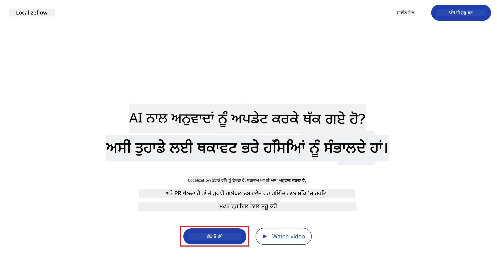
3. ਚੁਣੋ **GitHub ਨਾਲ ਸਾਈਨ ਇਨ ਕਰੋ**।  
   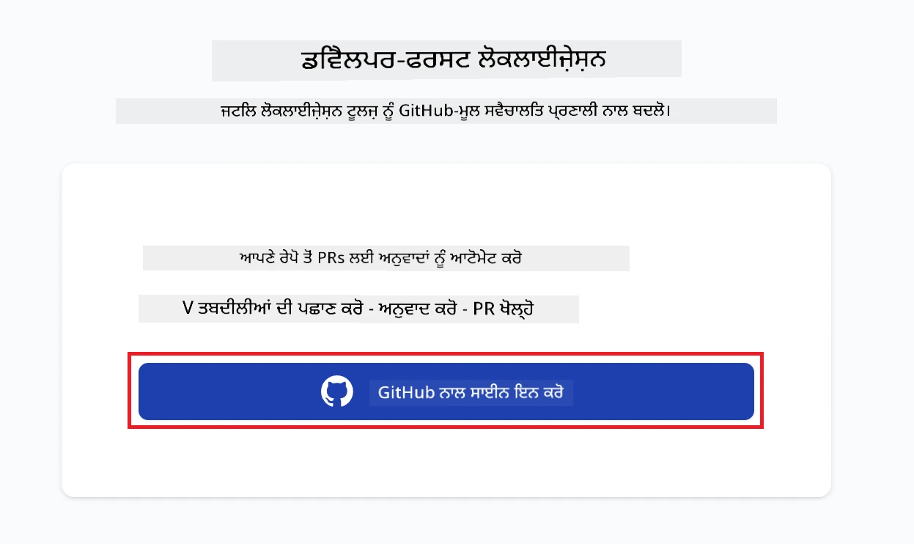
4. ਆਪਣੇ GitHub ਅਕਾਊਂਟ ਨਾਲ ਸਾਈਨ ਇਨ ਕਰੋ।  
   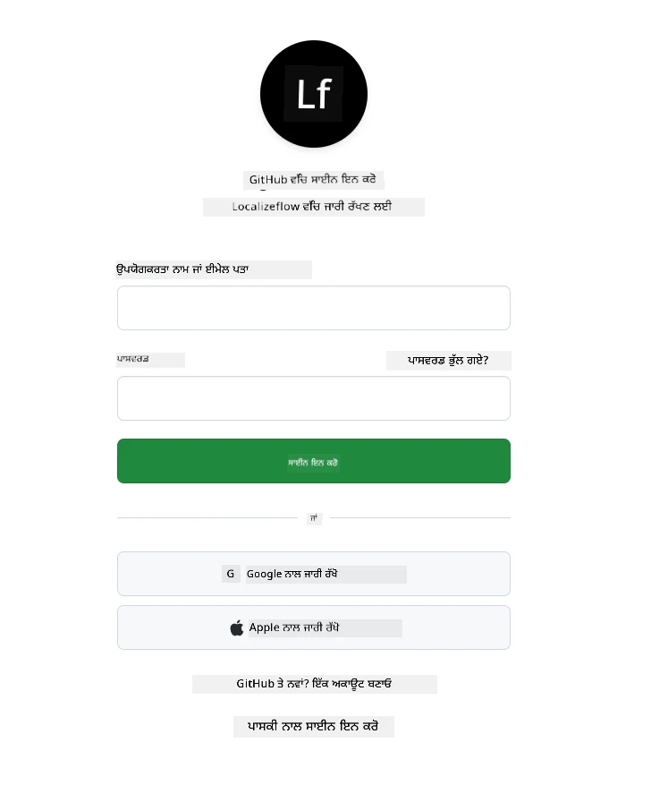
5. ਉਹ ਅਕਾਊਂਟ ਚੁਣੋ ਜਿੱਥੇ ਤੁਸੀਂ Localizeflow GitHub ਐਪ ਇੰਸਟਾਲ ਕਰਨਾ ਚਾਹੁੰਦੇ ਹੋ — ਆਪਣਾ ਨਿੱਜੀ ਖਾਤਾ ਜਾਂ ਜੇਕਰ ਤੁਸੀਂ ਕਿਸੇ ਸੰਗਠਨ ਨੂੰ ਸੰਭਾਲਦੇ ਹੋ।  
   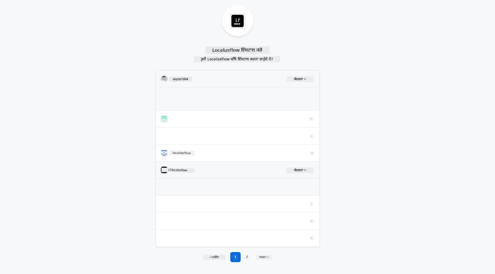
6. ਉਹ ਰਿਪਾਜ਼ਿਟਰੀਆਂ ਚੁਣੋ ਜਿਹੜੀਆਂ Localizeflow ਨੂੰ ਐਕਸੈੱਸ ਦੇਣੀਆਂ ਹਨ, ਫਿਰ **ਸੰਭਾਲੋ** ਤੇ ਕਲਿਕ ਕਰੋ।  
   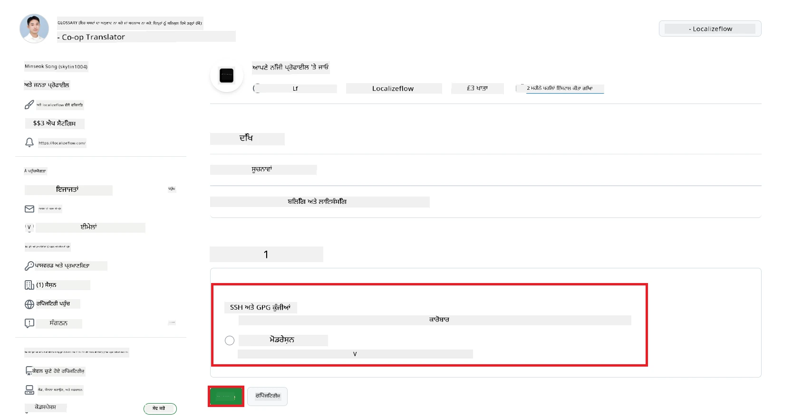
7. ਤੁਸੀਂ Localizeflow ਦੇ ਮੁੱਖ ਪੰਨੇ ਤੇ ਮੁੜ ਲੈ ਜਾਓਗੇ।

> [!TIP]
> ਬਾਅਦ ਵਿੱਚ ਹੋਰ ਰਿਪਾਜ਼ਿਟਰੀਆਂ ਸ਼ਾਮਲ ਕਰਨ ਲਈ, ਸਿਰੇ ਦੀ ਬਾਰ ਵਿੱਚ ਆਪਣੇ ਅਕਾਊਂਟ ਨੂੰ ਚੁਣੋ ਅਤੇ **+ ਹੋਰ ਰਿਪਾਜ਼ਿਟਰੀਆਂ ਸ਼ਾਮਲ ਕਰੋ** ਚੁਣੋ।  
> 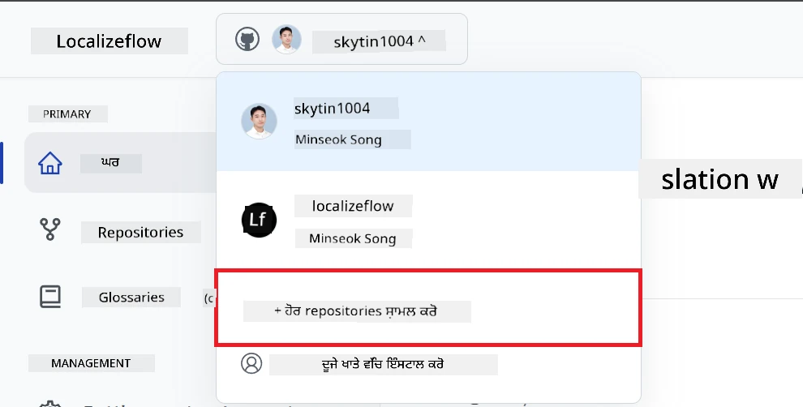

---

## ਆਪਣੇ ਰਿਪਾਜ਼ਿਟਰੀਆਂ ਨੂੰ Localizeflow ਨਾਲ ਜੁੜੋ

1. Localizeflow ਮੁੱਖ ਪੰਨੇ 'ਤੇ, **+ ਰਿਪਾਜ਼ਿਟਰੀਆਂ ਨੂੰ ਜੁੜੋ** ਚੁਣੋ।  
   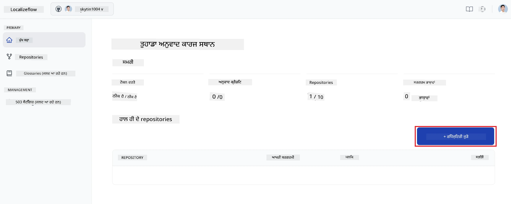

2. ਉਹਨਾਂ ਇੰਸਟਾਲ ਕੀਤੀਆਂ ਰਿਪਾਜ਼ਿਟਰੀਆਂ ਵਿੱਚੋਂ ਇੱਕ ਚੁਣੋ ਜੋ ਤੁਸੀਂ ਜੁੜਨਾ ਚਾਹੁੰਦੇ ਹੋ ਅਤੇ **ਸੰਭਾਲੋ** ਚੁਣੋ।  
   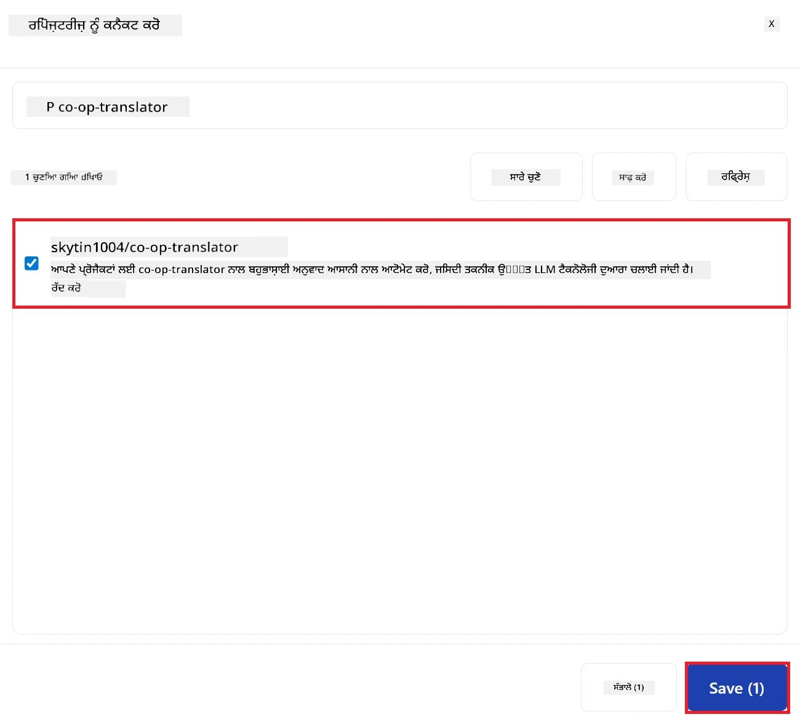

3. ਤੁਸੀਂ ਆਪਣੇ ਜੁੜੇ ਹੋਏ ਰਿਪਾਜ਼ਿਟਰੀਆਂ ਨੂੰ ਹੁਣ ਮੱਖ ਪੰਨਾ ਅਤੇ ਰਿਪਾਜ਼ਿਟਰੀਜ਼ ਪੰਨੇ ਉੱਤੇ ਦੇਖ ਸਕੋਗੇ।  
   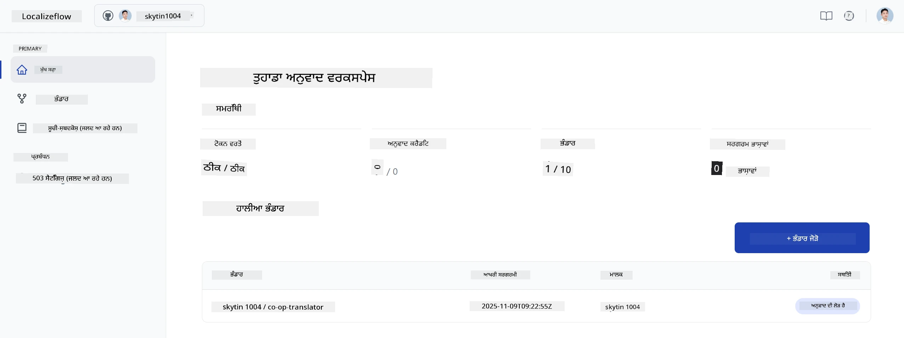

---

## ਸਵੈਚਾਲਿਤ ਅਨੁਵਾਦ ਸ਼ੁਰੂ ਕਰੋ

1. ਉਹ ਰਿਪਾਜ਼ਿਟਰੀ ਚੁਣੋ ਜੋ ਤੁਸੀਂ ਹਾਲ ਹੀ ਵਿੱਚ ਜੋੜੀ ਹੈ।  
   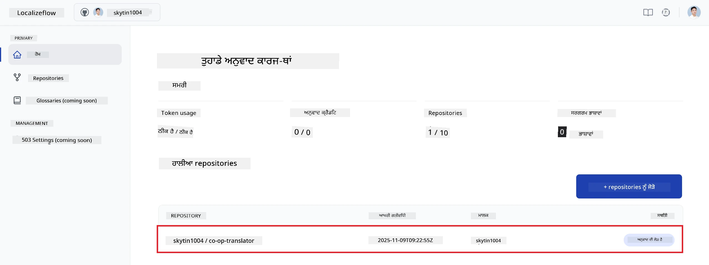

2. ਰਿਪਾਜ਼ਿਟਰੀ ਵਿਸਥਾਰ ਪੰਨੇ 'ਤੇ, ਹੇਠਾਂ ਦਿੱਖ ਰਹੇ **ਸੰਪਾਦਿਤ ਕਰੋ** ਨੂੰ ਚੁਣੋ।  
   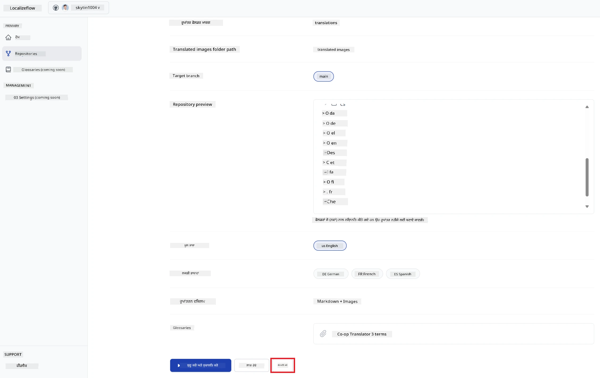

3. ਆਪਣੇ ਅਨੁਵਾਦ ਸੈਟਿੰਗਜ਼ ਸੈੱਟ ਕਰੋ — ਟਾਰਗੇਟ ਬ੍ਰਾਂਚ (ਮੂਲ: `main`), ਟਾਰਗੇਟ ਭਾਸ਼ਾਵਾਂ, ਅਤੇ ਸੋਰਸ ਭਾਸ਼ਾ (ਮੂਲ: `en`)। ਫਿਰ **ਸੰਭਾਲੋ** ਚੁਣੋ।  
   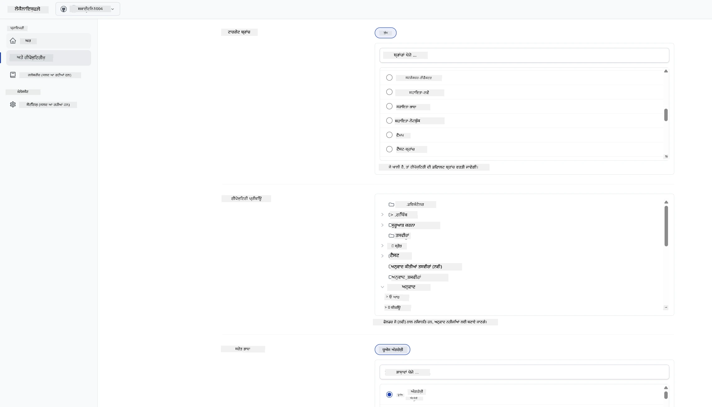

4. **ਸ਼ੁਰੂ ਕਰੋ ਅਤੇ ਆਪਣੇ ਆਪ ਚਲਾਓ** ਚੁਣੋ।  
   Localizeflow ਹੁਣ ਸਵੈਚਾਲਿਤ ਤੌਰ ਤੇ ਤੁਹਾਡੇ ਦਸਤਾਵੇਜ਼ਾਂ ਦਾ ਅਨੁਵਾਦ ਕਰੇਗਾ ਅਤੇ ਜਦੋਂ ਵੀ ਸੋਰਸ ਬਦਲੇਗਾ ਤਦ ਪੁੱਲ ਅਨੁਰੋਧ ਖੋਲ੍ਹੇਗਾ।  
   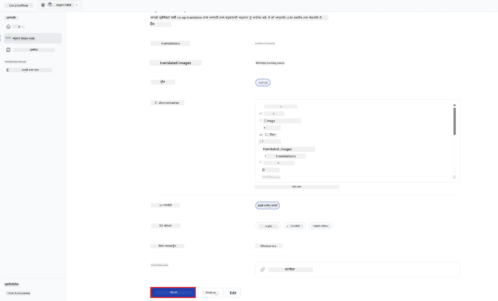

---

<!-- CO-OP TRANSLATOR DISCLAIMER START -->
**ਇਸਤਿਆਰਨਾਮਾ**:  
ਇਹ ਦਸਤਾਵੇਜ਼ ਏਆਈ ਅਨੁਵਾਦ ਸੇਵਾ [Co-op Translator](https://github.com/Azure/co-op-translator) ਦੀ ਵਰਤੋਂ ਕਰਕੇ ਅਨੁਵਾਦਿਤ ਕੀਤਾ ਗਿਆ ਹੈ। ਜਦੋਂ ਕਿ ਅਸੀਂ ਸਹੀਤਾ ਲਈ ਕੋਸ਼ਿਸ਼ ਕਰਦੇ ਹਾਂ, ਕਿਰਪਾ ਕਰਕੇ ਧਿਆਨ ਵਿੱਚ ਰੱਖੋ ਕਿ ਆਟੋਮੇਟਿਕ ਅਨੁਵਾਦਾਂ ਵਿੱਚ ਗਲਤੀਆਂ ਜਾਂ ਅਣਸਹੀਤਤਾਵਾਂ ਹੋ ਸਕਦੀਆਂ ਹਨ। ਮੂਲ ਦਸਤਾਵੇਜ਼ ਜਿਸ ਦੀ ਮੂਲ ਭਾਸ਼ਾ ਹੈ, ਉਹ ਹੀ ਪ੍ਰਮੁੱਖ ਸਰੋਤ ਮੰਨਿਆ ਜਾਣਾ ਚਾਹੀਦਾ ਹੈ। ਮਹੱਤਵਪੂਰਨ ਜਾਣਕਾਰੀ ਲਈ, ਪੇਸ਼ੇਵਰ ਮਨੁੱਖੀ ਅਨੁਵਾਦ ਸਿਫਾਰਸ਼ੀ ਹੈ। ਅਸੀਂ ਇਸ ਅਨੁਵਾਦ ਦੀ ਵਰਤੋਂ ਤੋਂ ਪੈਦਾ ਹੋਣ ਵਾਲੀਆਂ ਕਿਸੇ ਵੀ ਗਲਤਫ਼ਹਿਮੀ ਜਾਂ ਗਲਤ ਵਿਆਖਿਆਵਾਂ ਲਈ ਜ਼ਿੰਮੇਵਾਰ ਨਹੀਂ ਹਾਂ।
<!-- CO-OP TRANSLATOR DISCLAIMER END -->