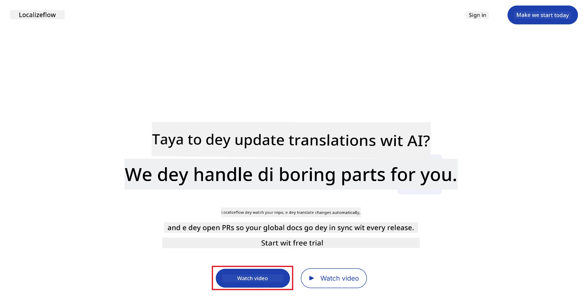
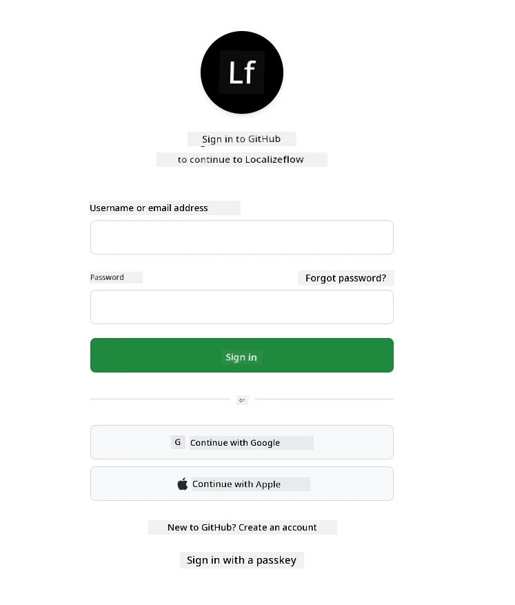
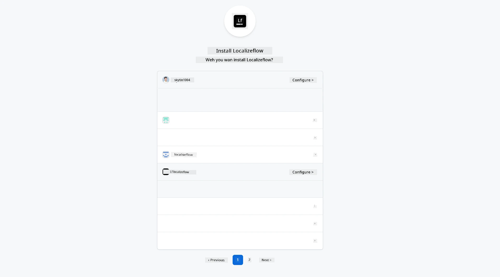
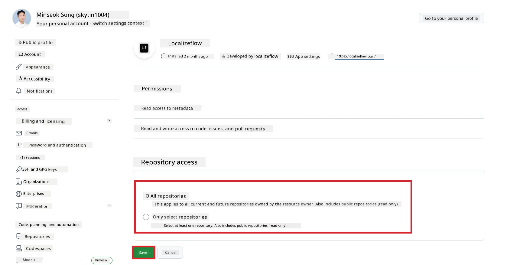
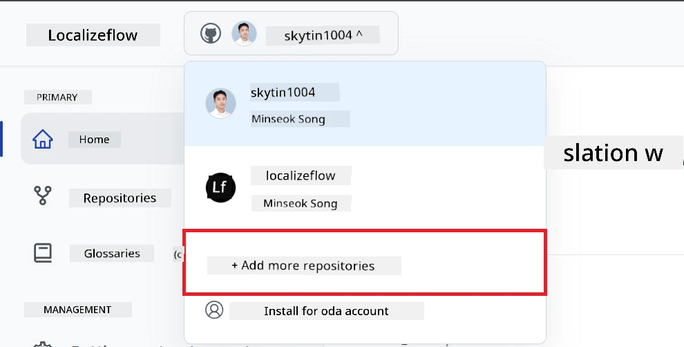
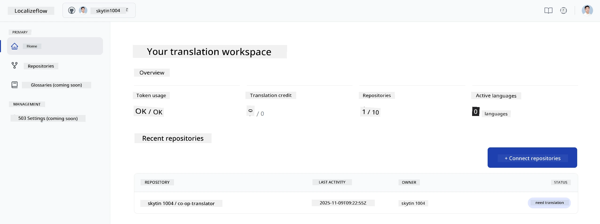
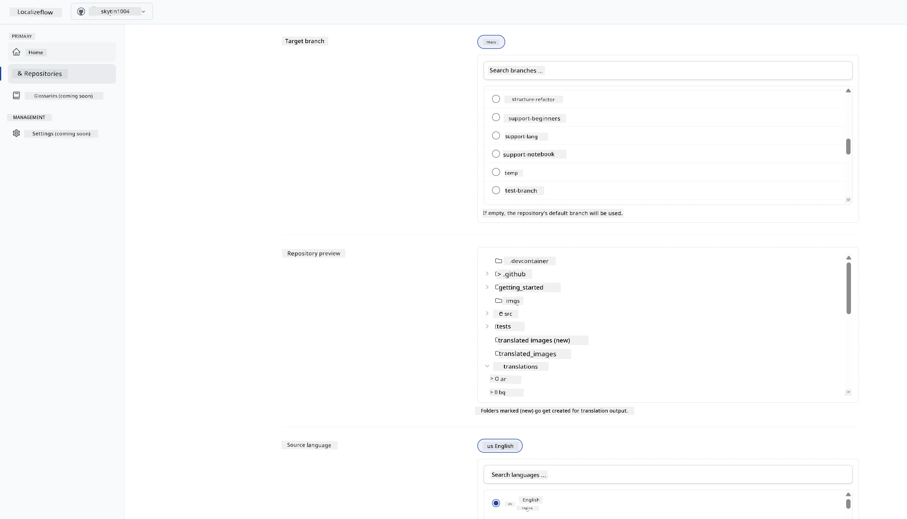

# Localizeflow – Quick Start Guide

#### Supported by [Localizeflow](https://localizeflow.com/)

<!-- CO-OP TRANSLATOR LANGUAGES TABLE START -->
[Arabic](../ar/README.md) | [Bengali](../bn/README.md) | [Bulgarian](../bg/README.md) | [Burmese (Myanmar)](../my/README.md) | [Chinese (Simplified)](../zh-CN/README.md) | [Chinese (Traditional, Hong Kong)](../zh-HK/README.md) | [Chinese (Traditional, Macau)](../zh-MO/README.md) | [Chinese (Traditional, Taiwan)](../zh-TW/README.md) | [Croatian](../hr/README.md) | [Czech](../cs/README.md) | [Danish](../da/README.md) | [Dutch](../nl/README.md) | [Estonian](../et/README.md) | [Finnish](../fi/README.md) | [French](../fr/README.md) | [German](../de/README.md) | [Greek](../el/README.md) | [Hebrew](../he/README.md) | [Hindi](../hi/README.md) | [Hungarian](../hu/README.md) | [Indonesian](../id/README.md) | [Italian](../it/README.md) | [Japanese](../ja/README.md) | [Kannada](../kn/README.md) | [Korean](../ko/README.md) | [Lithuanian](../lt/README.md) | [Malay](../ms/README.md) | [Malayalam](../ml/README.md) | [Marathi](../mr/README.md) | [Nepali](../ne/README.md) | [Nigerian Pidgin](./README.md) | [Norwegian](../no/README.md) | [Persian (Farsi)](../fa/README.md) | [Polish](../pl/README.md) | [Portuguese (Brazil)](../pt-BR/README.md) | [Portuguese (Portugal)](../pt-PT/README.md) | [Punjabi (Gurmukhi)](../pa/README.md) | [Romanian](../ro/README.md) | [Russian](../ru/README.md) | [Serbian (Cyrillic)](../sr/README.md) | [Slovak](../sk/README.md) | [Slovenian](../sl/README.md) | [Spanish](../es/README.md) | [Swahili](../sw/README.md) | [Swedish](../sv/README.md) | [Tagalog (Filipino)](../tl/README.md) | [Tamil](../ta/README.md) | [Telugu](../te/README.md) | [Thai](../th/README.md) | [Turkish](../tr/README.md) | [Ukrainian](../uk/README.md) | [Urdu](../ur/README.md) | [Vietnamese](../vi/README.md)

> **Prefer to Clone Locally?**

> Dis repository get plus 50 language translations wey go increase download size well well. To clone without translations, use sparse checkout:
> ```bash
> git clone --filter=blob:none --sparse https://github.com/localizeflow/localizeflow-docs.git
> cd localizeflow-docs
> git sparse-checkout set --no-cone '/*' '!translations' '!translated_images'
> ```
> Dis one go give you everything wey you need to complete di course quick quick wit beta download speed.
<!-- CO-OP TRANSLATOR LANGUAGES TABLE END -->

Localizeflow dey automatically translate your documentation and e dey open pull requests anytime di source file change.  
Dis guide go show you how to install di GitHub App and run your very first translation inside 2 minutes.

> [!NOTE]
>
> Localizeflow now dey support GitHub-based documentation projects
> (example: AI for Beginners and most normal open-source repos).  
> 
> Support for modern documentation frameworks like Astro, Docusaurus, and Hugo  
> dey active development.


---

## Sign in and install the GitHub App

1. Visit **[localizeflow.com](https://localizeflow.com/)**.
2. Choose **Start with free trial**.
   
3. Select **Sign in with GitHub**.  
   
4. Sign in wit your GitHub account.  
   
5. Pick di account weh you want install di Localizeflow GitHub App — your personal account or one organization wey you dey manage.  
   
6. Select di repositories wey you want Localizeflow to get access, then select **Save**.  
   
7. You go redirect go Localizeflow home page.

> [!TIP]
> To add more repositories later, just select your account for di header and choose **+ Add more repositories**.  
> 

---

## Connect your repositories to Localizeflow

1. For Localizeflow home page, select **+ Connect repositories**.  
   

2. Pick one of di installed repositories wey you want connect and select **Save**.  
   

3. Your connected repositories go show now for both Home page and di Repositories page.  
   

---

## Start automatic translation

1. Select di repository wey you just connect.  
   

2. For di repository detail page, select **Edit** for bottom.  
   

3. Configure your translation settings — target branch (default: `main`), target languages, and source language (default: `en`). Select **Save**.  
   

4. Select **Start & Automate**.  
   Localizeflow go now begin automatically translate your documentation and open pull requests anytime source change.  
   

---

<!-- CO-OP TRANSLATOR DISCLAIMER START -->
**Disclaimer**:
Dis document na AI translation service [Co-op Translator](https://github.com/Azure/co-op-translator) wey translate am. Even though we dey try make am correct, abeg sabi say automated translation fit get some error or no correct well. The original document wey dey im own language na im be the correct one. If na serious matter, make person wey sabi translate am do am. We no responsible for any wahala or wrong meaning wey fit come from using this translation.
<!-- CO-OP TRANSLATOR DISCLAIMER END -->