# Localizeflow – Przewodnik szybkiego startu

#### Wspierane przez [Localizeflow](https://localizeflow.com/)

<!-- CO-OP TRANSLATOR LANGUAGES TABLE START -->
[Arabic](../ar/README.md) | [Bengali](../bn/README.md) | [Bulgarian](../bg/README.md) | [Burmese (Myanmar)](../my/README.md) | [Chinese (Simplified)](../zh-CN/README.md) | [Chinese (Traditional, Hong Kong)](../zh-HK/README.md) | [Chinese (Traditional, Macau)](../zh-MO/README.md) | [Chinese (Traditional, Taiwan)](../zh-TW/README.md) | [Croatian](../hr/README.md) | [Czech](../cs/README.md) | [Danish](../da/README.md) | [Dutch](../nl/README.md) | [Estonian](../et/README.md) | [Finnish](../fi/README.md) | [French](../fr/README.md) | [German](../de/README.md) | [Greek](../el/README.md) | [Hebrew](../he/README.md) | [Hindi](../hi/README.md) | [Hungarian](../hu/README.md) | [Indonesian](../id/README.md) | [Italian](../it/README.md) | [Japanese](../ja/README.md) | [Kannada](../kn/README.md) | [Korean](../ko/README.md) | [Lithuanian](../lt/README.md) | [Malay](../ms/README.md) | [Malayalam](../ml/README.md) | [Marathi](../mr/README.md) | [Nepali](../ne/README.md) | [Nigerian Pidgin](../pcm/README.md) | [Norwegian](../no/README.md) | [Persian (Farsi)](../fa/README.md) | [Polish](./README.md) | [Portuguese (Brazil)](../pt-BR/README.md) | [Portuguese (Portugal)](../pt-PT/README.md) | [Punjabi (Gurmukhi)](../pa/README.md) | [Romanian](../ro/README.md) | [Russian](../ru/README.md) | [Serbian (Cyrillic)](../sr/README.md) | [Slovak](../sk/README.md) | [Slovenian](../sl/README.md) | [Spanish](../es/README.md) | [Swahili](../sw/README.md) | [Swedish](../sv/README.md) | [Tagalog (Filipino)](../tl/README.md) | [Tamil](../ta/README.md) | [Telugu](../te/README.md) | [Thai](../th/README.md) | [Turkish](../tr/README.md) | [Ukrainian](../uk/README.md) | [Urdu](../ur/README.md) | [Vietnamese](../vi/README.md)

> **Wolisz sklonować lokalnie?**

> To repozytorium zawiera tłumaczenia na ponad 50 języków, co znacznie zwiększa rozmiar pobierania. Aby pobrać bez tłumaczeń, użyj sparse checkout:
> ```bash
> git clone --filter=blob:none --sparse https://github.com/localizeflow/localizeflow-docs.git
> cd localizeflow-docs
> git sparse-checkout set --no-cone '/*' '!translations' '!translated_images'
> ```
> Dzięki temu otrzymasz wszystko, czego potrzebujesz do ukończenia kursu, z dużo szybszym pobieraniem.
<!-- CO-OP TRANSLATOR LANGUAGES TABLE END -->

Localizeflow automatycznie tłumaczy Twoją dokumentację i otwiera pull requesty za każdym razem, gdy zmienia się plik źródłowy.  
Ten przewodnik pokaże Ci, jak zainstalować aplikację GitHub i uruchomić pierwsze tłumaczenie w mniej niż 2 minuty.


> [!NOTE]
>
> Localizeflow obsługuje obecnie projekty dokumentacji oparte na GitHub  
> (na przykład: AI for Beginners i większość standardowych repozytoriów open-source).  
>
> Obsługa nowoczesnych frameworków dokumentacyjnych, takich jak Astro, Docusaurus i Hugo,  
> jest w trakcie aktywnego rozwoju.


---

## Zaloguj się i zainstaluj aplikację GitHub

1. Odwiedź **[localizeflow.com](https://localizeflow.com/)**.
2. Wybierz **Start with free trial**.
   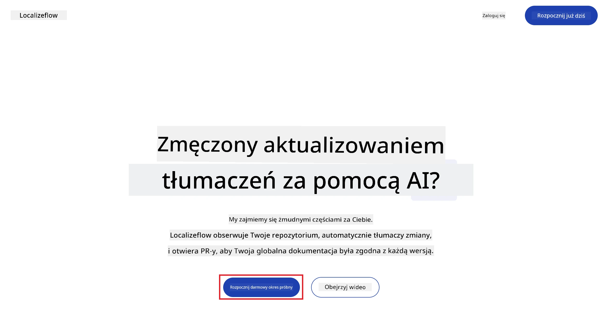
3. Wybierz **Sign in with GitHub**.  
   
4. Zaloguj się na swoje konto GitHub.  
   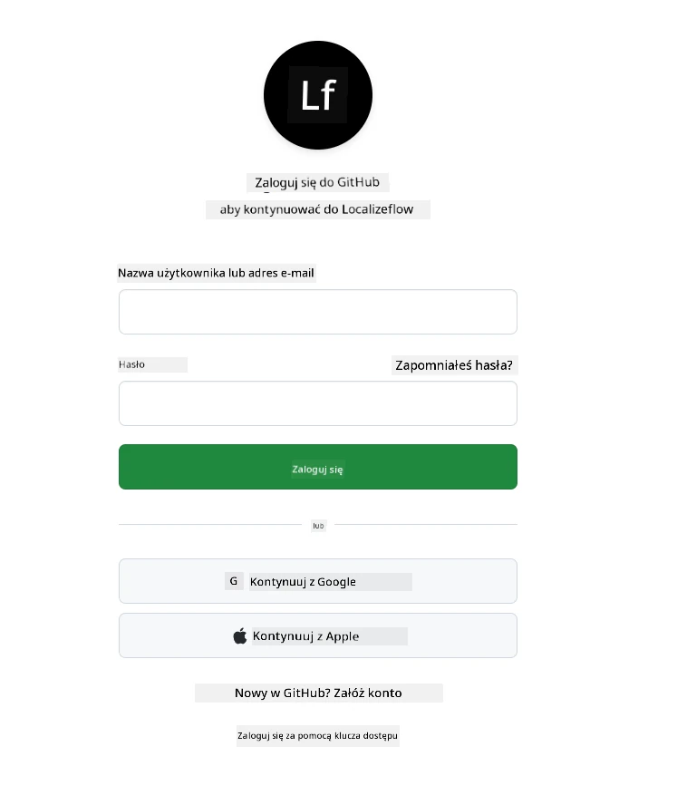
5. Wybierz konto, na którym chcesz zainstalować aplikację Localizeflow — swoje konto osobiste lub zarządzaną przez Ciebie organizację.  
   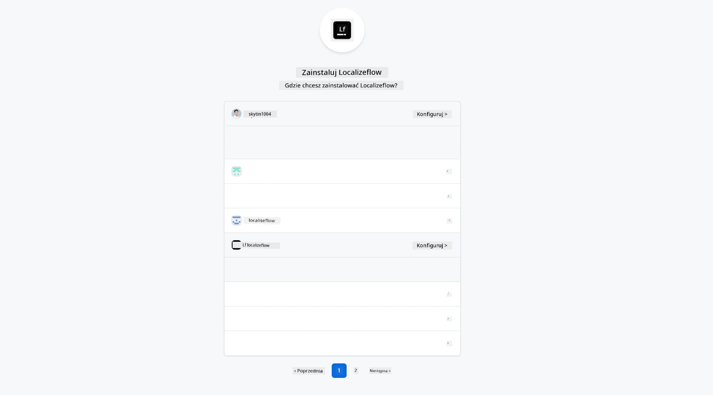
6. Wybierz repozytoria, do których Localizeflow ma mieć dostęp, a następnie kliknij **Save**.  
   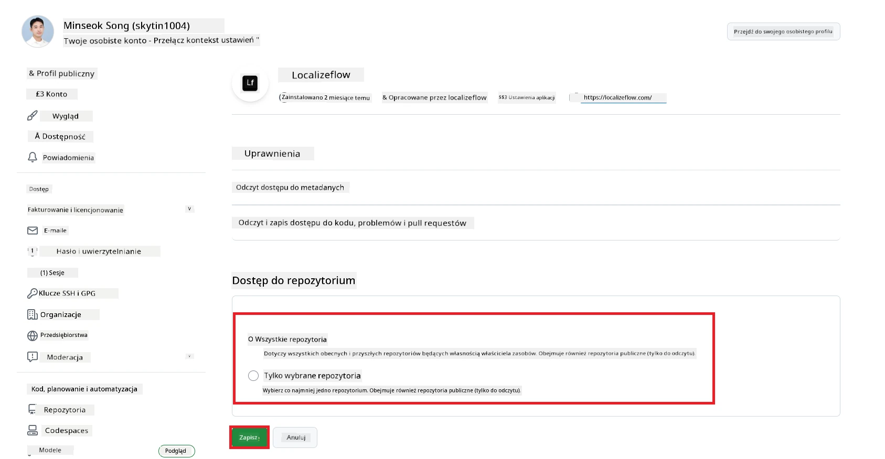
7. Zostaniesz przekierowany na stronę główną Localizeflow.

> [!TIP]
> Aby dodać więcej repozytoriów później, wybierz swoje konto w nagłówku i wybierz **+ Add more repositories**.  
> 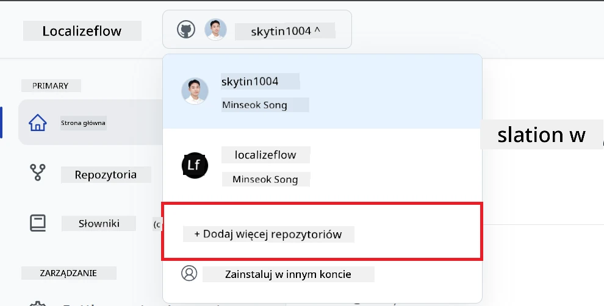

---

## Połącz swoje repozytoria z Localizeflow

1. Na stronie głównej Localizeflow wybierz **+ Connect repositories**.  
   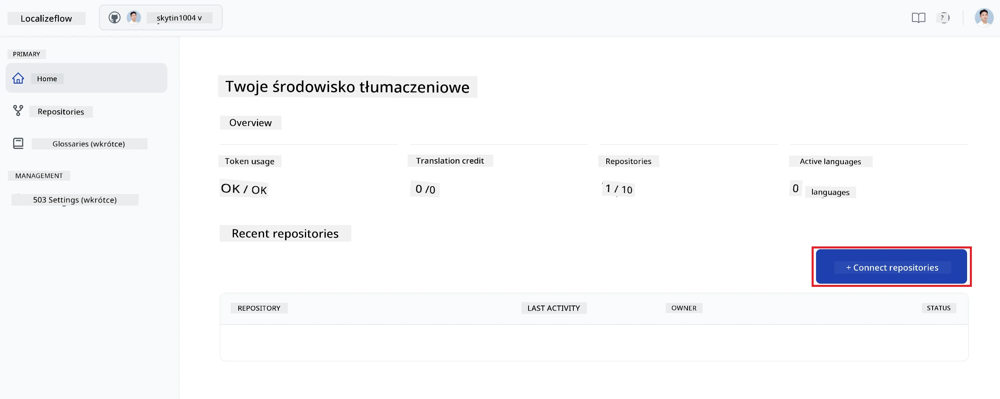

2. Wybierz jedno z zainstalowanych repozytoriów, które chcesz połączyć, i kliknij **Save**.  
   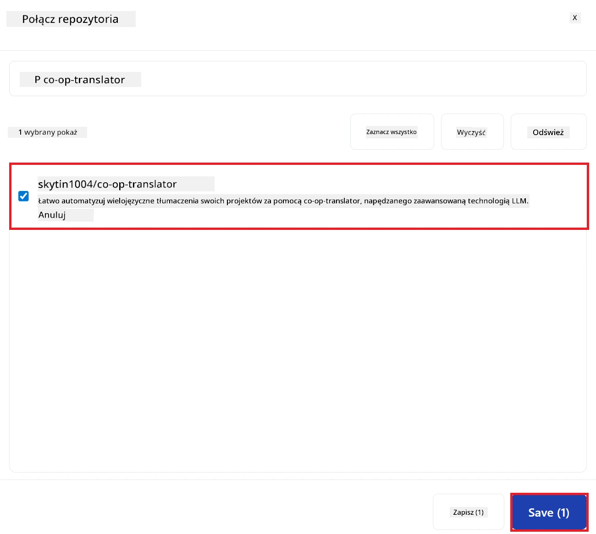

3. Twoje połączone repozytoria pojawią się teraz zarówno na stronie głównej, jak i na stronie Repozytoria.  
   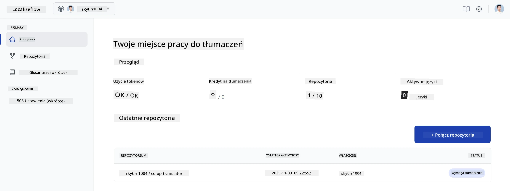

---

## Rozpocznij automatyczne tłumaczenie

1. Wybierz repozytorium, które właśnie połączyłeś.  
   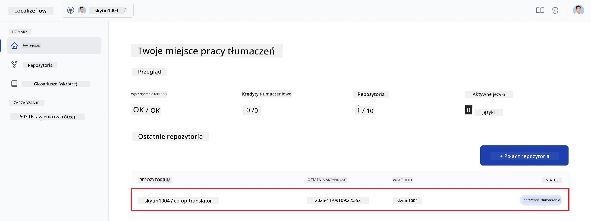

2. Na stronie szczegółów repozytorium wybierz na dole **Edit**.  
   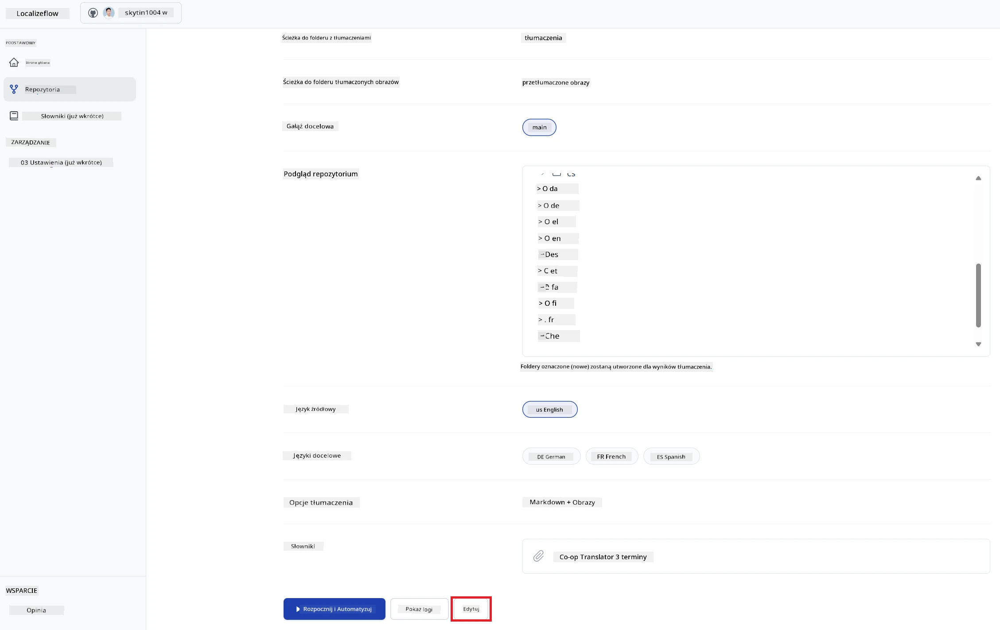

3. Skonfiguruj ustawienia tłumaczenia — gałąź docelową (domyślnie: `main`), języki docelowe oraz język źródłowy (domyślnie: `en`). Wybierz **Save**.  
   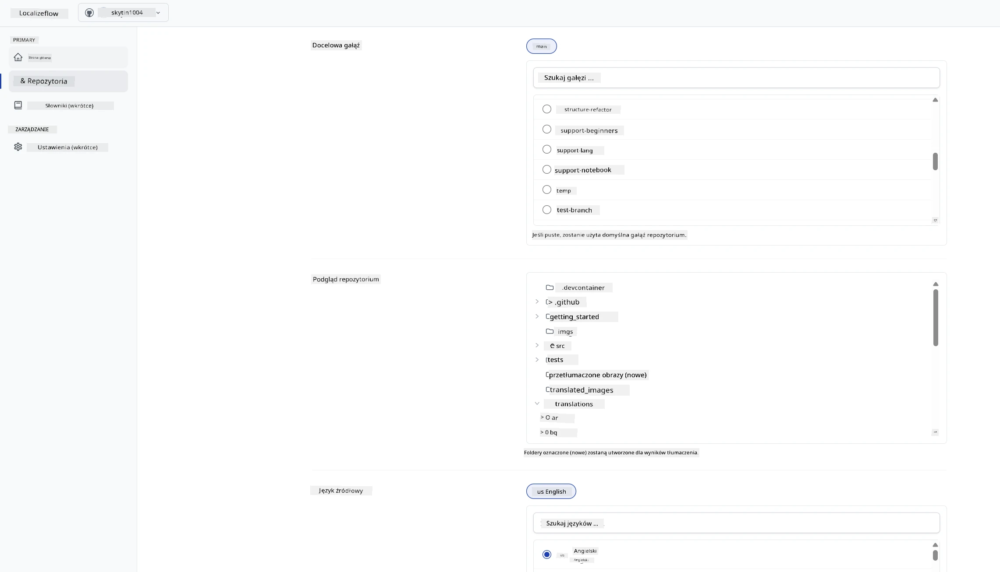

4. Wybierz **Start & Automate**.  
   Localizeflow będzie teraz automatycznie tłumaczyć Twoją dokumentację i otwierać pull requesty za każdym razem, gdy zmieni się źródło.  
   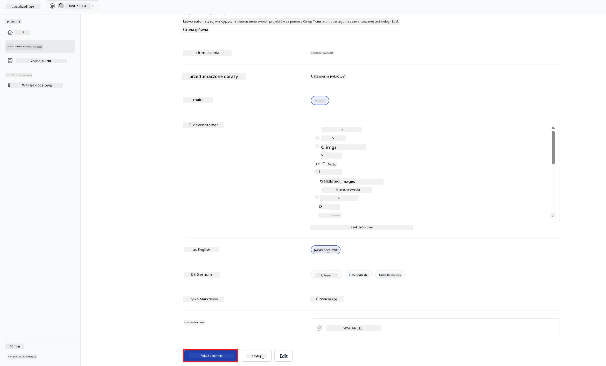

---

<!-- CO-OP TRANSLATOR DISCLAIMER START -->
**Zastrzeżenie**:  
Niniejszy dokument został przetłumaczony za pomocą usługi tłumaczenia AI [Co-op Translator](https://github.com/Azure/co-op-translator). Chociaż dokładamy starań, aby tłumaczenie było jak najbardziej precyzyjne, prosimy pamiętać, że automatyczne tłumaczenia mogą zawierać błędy lub nieścisłości. Oryginalny dokument w jego rodzimym języku należy traktować jako źródło wiążące. W przypadku informacji krytycznych zaleca się skorzystanie z profesjonalnego tłumaczenia dokonanego przez człowieka. Nie ponosimy odpowiedzialności za jakiekolwiek nieporozumienia lub błędne interpretacje wynikające z użycia tego tłumaczenia.
<!-- CO-OP TRANSLATOR DISCLAIMER END -->