# Localizeflow – Guia de Introdução Rápida

#### Suportado por [Localizeflow](https://localizeflow.com/)

<!-- CO-OP TRANSLATOR LANGUAGES TABLE START -->
[Arabic](../ar/README.md) | [Bengali](../bn/README.md) | [Bulgarian](../bg/README.md) | [Burmese (Myanmar)](../my/README.md) | [Chinese (Simplified)](../zh-CN/README.md) | [Chinese (Traditional, Hong Kong)](../zh-HK/README.md) | [Chinese (Traditional, Macau)](../zh-MO/README.md) | [Chinese (Traditional, Taiwan)](../zh-TW/README.md) | [Croatian](../hr/README.md) | [Czech](../cs/README.md) | [Danish](../da/README.md) | [Dutch](../nl/README.md) | [Estonian](../et/README.md) | [Finnish](../fi/README.md) | [French](../fr/README.md) | [German](../de/README.md) | [Greek](../el/README.md) | [Hebrew](../he/README.md) | [Hindi](../hi/README.md) | [Hungarian](../hu/README.md) | [Indonesian](../id/README.md) | [Italian](../it/README.md) | [Japanese](../ja/README.md) | [Kannada](../kn/README.md) | [Korean](../ko/README.md) | [Lithuanian](../lt/README.md) | [Malay](../ms/README.md) | [Malayalam](../ml/README.md) | [Marathi](../mr/README.md) | [Nepali](../ne/README.md) | [Nigerian Pidgin](../pcm/README.md) | [Norwegian](../no/README.md) | [Persian (Farsi)](../fa/README.md) | [Polish](../pl/README.md) | [Portuguese (Brazil)](../pt-BR/README.md) | [Portuguese (Portugal)](./README.md) | [Punjabi (Gurmukhi)](../pa/README.md) | [Romanian](../ro/README.md) | [Russian](../ru/README.md) | [Serbian (Cyrillic)](../sr/README.md) | [Slovak](../sk/README.md) | [Slovenian](../sl/README.md) | [Spanish](../es/README.md) | [Swahili](../sw/README.md) | [Swedish](../sv/README.md) | [Tagalog (Filipino)](../tl/README.md) | [Tamil](../ta/README.md) | [Telugu](../te/README.md) | [Thai](../th/README.md) | [Turkish](../tr/README.md) | [Ukrainian](../uk/README.md) | [Urdu](../ur/README.md) | [Vietnamese](../vi/README.md)

> **Prefere Clonar Localmente?**

> Este repositório inclui traduções em mais de 50 línguas, o que aumenta significativamente o tamanho do download. Para clonar sem traduções, use o sparse checkout:
> ```bash
> git clone --filter=blob:none --sparse https://github.com/localizeflow/localizeflow-docs.git
> cd localizeflow-docs
> git sparse-checkout set --no-cone '/*' '!translations' '!translated_images'
> ```
> Isto dá-lhe tudo o que precisa para completar o curso com um download muito mais rápido.
<!-- CO-OP TRANSLATOR LANGUAGES TABLE END -->

Localizeflow traduz automaticamente a sua documentação e abre pedidos de integração sempre que o ficheiro fonte muda.  
Este guia mostra-lhe como instalar a App do GitHub e executar a sua primeira tradução em menos de 2 minutos.


> [!NOTE]
>
> Atualmente, o Localizeflow suporta projetos de documentação baseados em GitHub  
> (por exemplo: AI for Beginners e a maioria dos repositórios open-source padrão).  
> 
> O suporte para frameworks modernas de documentação como Astro, Docusaurus, e Hugo  
> está em desenvolvimento ativo.


---

## Inicie sessão e instale a App do GitHub

1. Visite **[localizeflow.com](https://localizeflow.com/)**.
2. Selecione **Começar com avaliação gratuita**.
   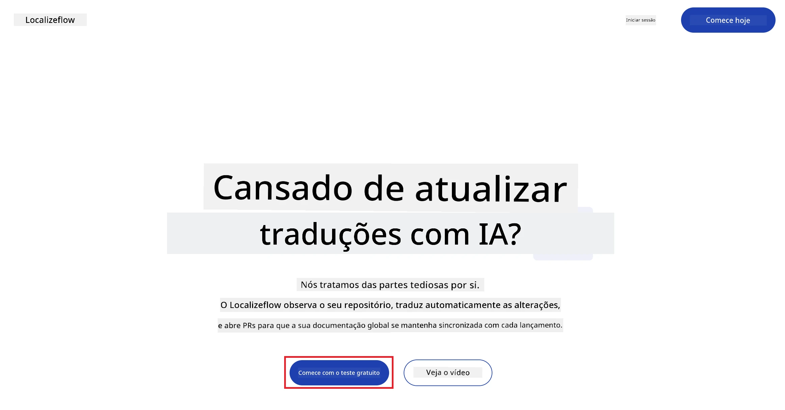
3. Selecione **Iniciar sessão com GitHub**.  
   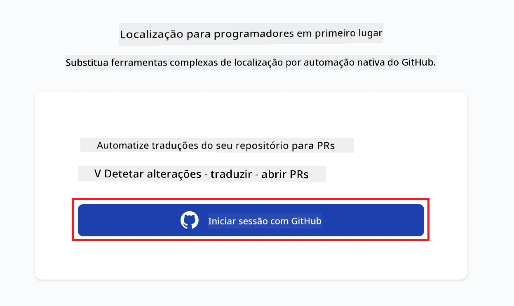
4. Inicie sessão com a sua conta do GitHub.  
   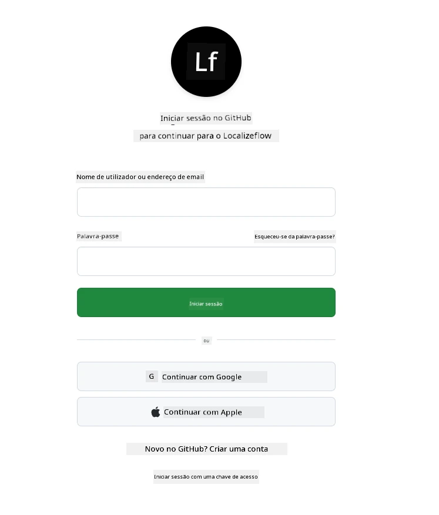
5. Escolha a conta onde pretende instalar a App Localizeflow do GitHub — a sua conta pessoal ou uma organização que gere.  
   
6. Selecione os repositórios aos quais pretende dar acesso ao Localizeflow e depois escolha **Guardar**.  
   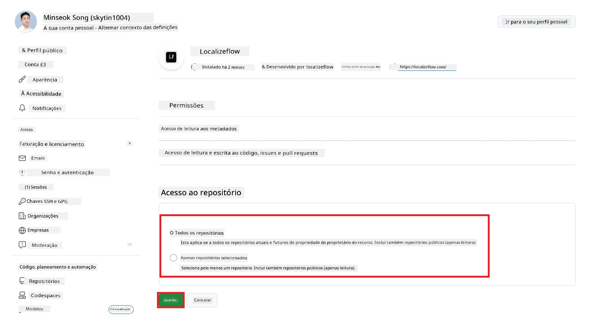
7. Será redireccionado para a página principal do Localizeflow.

> [!TIP]
> Para adicionar mais repositórios posteriormente, selecione a sua conta no cabeçalho e escolha **+ Adicionar mais repositórios**.  
> 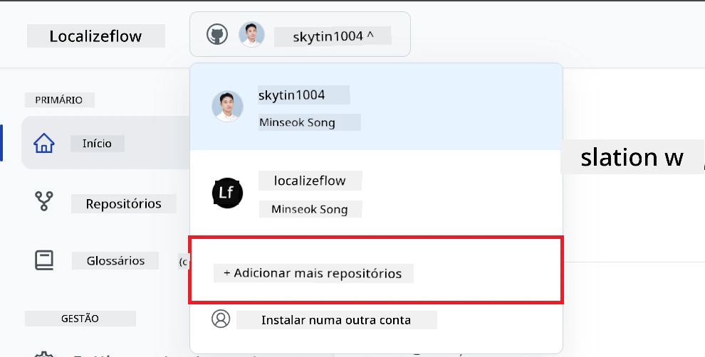

---

## Ligue os seus repositórios ao Localizeflow

1. Na página principal do Localizeflow, selecione **+ Ligar repositórios**.  
   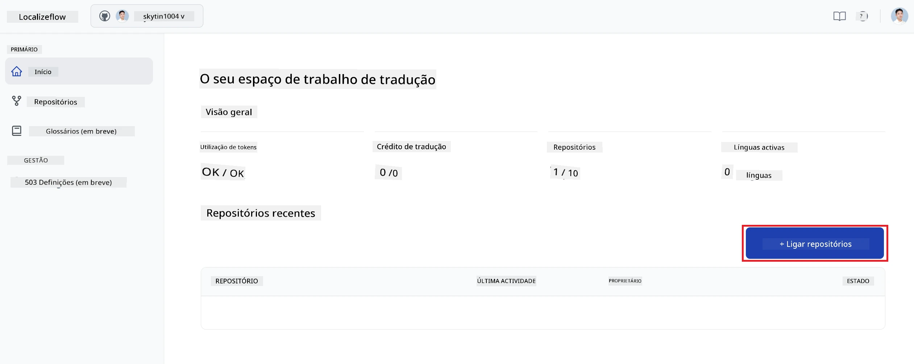

2. Escolha um dos repositórios instalados que pretende ligar e selecione **Guardar**.  
   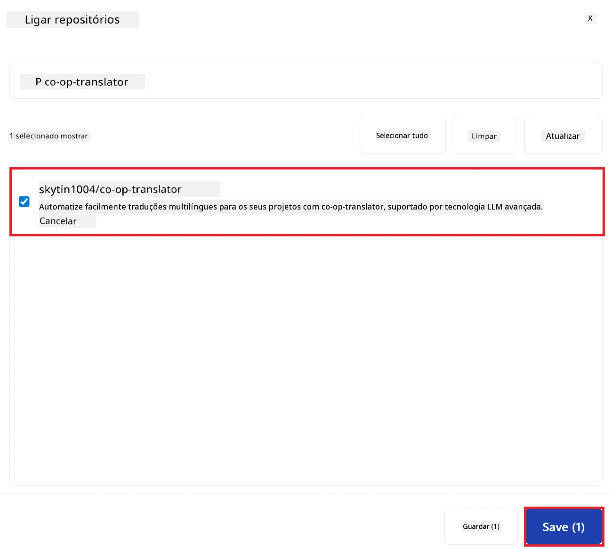

3. Os seus repositórios ligados aparecerão agora tanto na página Inicial como na página de Repositórios.  
   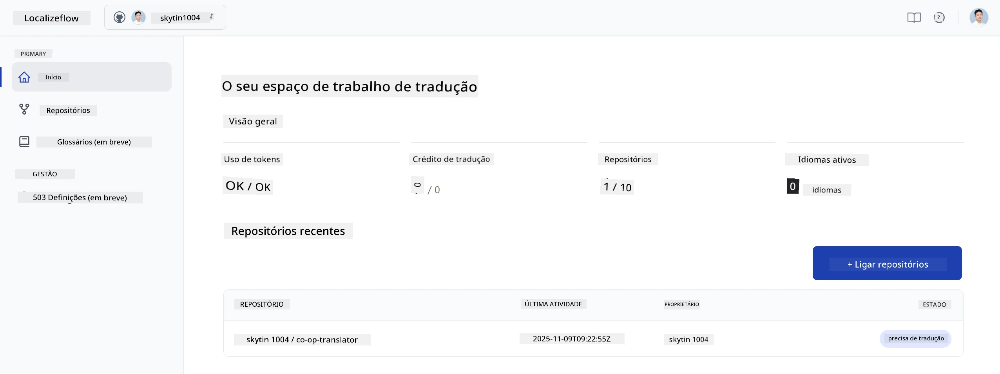

---

## Comece a tradução automática

1. Selecione o repositório que acabou de ligar.  
   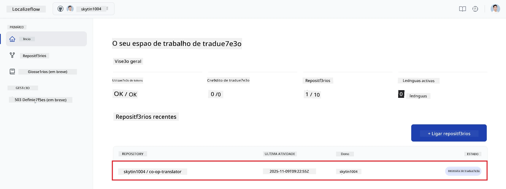

2. Na página de detalhes do repositório, selecione **Editar** na parte inferior.  
   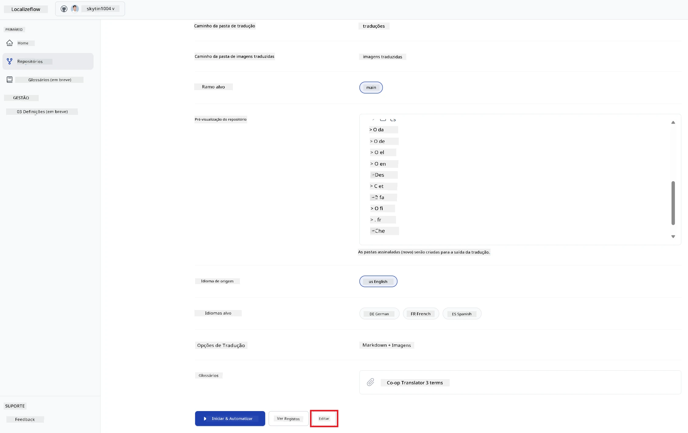

3. Configure as definições de tradução — ramificação alvo (padrão: `main`), línguas alvo, e língua fonte (padrão: `en`). Selecione **Guardar**.  
   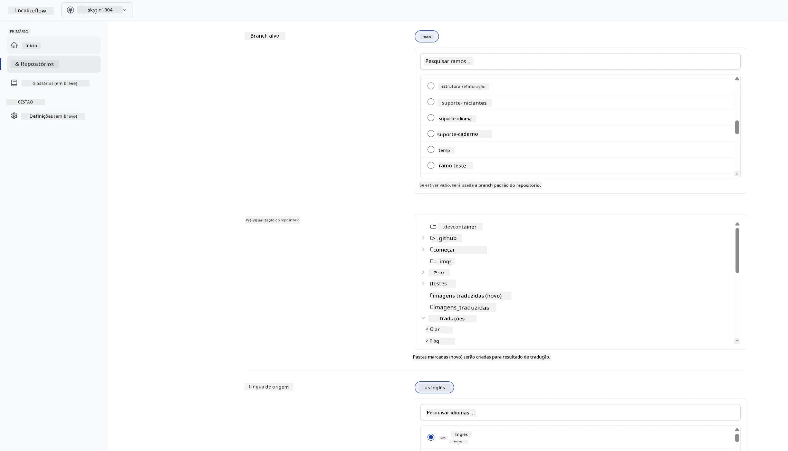

4. Selecione **Iniciar & Automatizar**.  
   Localizeflow irá agora traduzir automaticamente a sua documentação e abrir pedidos de integração sempre que a origem mudar.  
   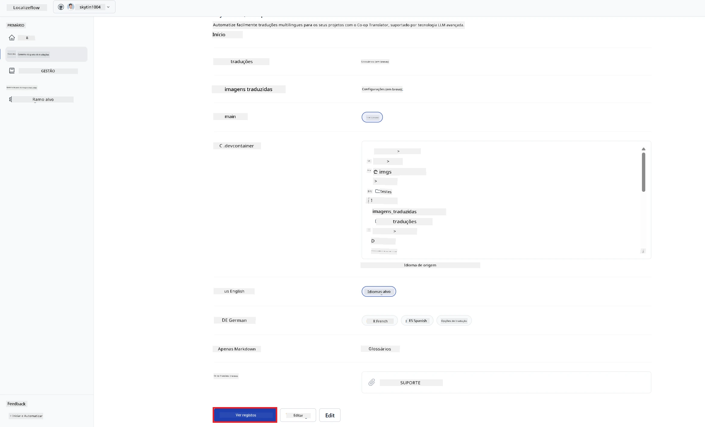

---

<!-- CO-OP TRANSLATOR DISCLAIMER START -->
**Aviso Legal**:
Este documento foi traduzido utilizando o serviço de tradução automática [Co-op Translator](https://github.com/Azure/co-op-translator). Embora nos esforcemos para garantir a precisão, esteja ciente de que traduções automáticas podem conter erros ou imprecisões. O documento original na sua língua nativa deve ser considerado a fonte autorizada. Para informações críticas, recomenda-se a tradução profissional realizada por um tradutor humano. Não nos responsabilizamos por quaisquer mal-entendidos ou interpretações incorretas decorrentes da utilização desta tradução.
<!-- CO-OP TRANSLATOR DISCLAIMER END -->