# Localizeflow – Руководство по быстрому старту

#### Поддерживается [Localizeflow](https://localizeflow.com/)

<!-- CO-OP TRANSLATOR LANGUAGES TABLE START -->
[Arabic](../ar/README.md) | [Bengali](../bn/README.md) | [Bulgarian](../bg/README.md) | [Burmese (Myanmar)](../my/README.md) | [Chinese (Simplified)](../zh-CN/README.md) | [Chinese (Traditional, Hong Kong)](../zh-HK/README.md) | [Chinese (Traditional, Macau)](../zh-MO/README.md) | [Chinese (Traditional, Taiwan)](../zh-TW/README.md) | [Croatian](../hr/README.md) | [Czech](../cs/README.md) | [Danish](../da/README.md) | [Dutch](../nl/README.md) | [Estonian](../et/README.md) | [Finnish](../fi/README.md) | [French](../fr/README.md) | [German](../de/README.md) | [Greek](../el/README.md) | [Hebrew](../he/README.md) | [Hindi](../hi/README.md) | [Hungarian](../hu/README.md) | [Indonesian](../id/README.md) | [Italian](../it/README.md) | [Japanese](../ja/README.md) | [Kannada](../kn/README.md) | [Korean](../ko/README.md) | [Lithuanian](../lt/README.md) | [Malay](../ms/README.md) | [Malayalam](../ml/README.md) | [Marathi](../mr/README.md) | [Nepali](../ne/README.md) | [Nigerian Pidgin](../pcm/README.md) | [Norwegian](../no/README.md) | [Persian (Farsi)](../fa/README.md) | [Polish](../pl/README.md) | [Portuguese (Brazil)](../pt-BR/README.md) | [Portuguese (Portugal)](../pt-PT/README.md) | [Punjabi (Gurmukhi)](../pa/README.md) | [Romanian](../ro/README.md) | [Russian](./README.md) | [Serbian (Cyrillic)](../sr/README.md) | [Slovak](../sk/README.md) | [Slovenian](../sl/README.md) | [Spanish](../es/README.md) | [Swahili](../sw/README.md) | [Swedish](../sv/README.md) | [Tagalog (Filipino)](../tl/README.md) | [Tamil](../ta/README.md) | [Telugu](../te/README.md) | [Thai](../th/README.md) | [Turkish](../tr/README.md) | [Ukrainian](../uk/README.md) | [Urdu](../ur/README.md) | [Vietnamese](../vi/README.md)

> **Предпочитаете клонировать локально?**

> В этом репозитории содержится более 50 языковых переводов, что значительно увеличивает размер загрузки. Чтобы клонировать без переводов, используйте sparse checkout:
> ```bash
> git clone --filter=blob:none --sparse https://github.com/localizeflow/localizeflow-docs.git
> cd localizeflow-docs
> git sparse-checkout set --no-cone '/*' '!translations' '!translated_images'
> ```
> Это даст вам всё необходимое для прохождения курса при гораздо более быстрой загрузке.
<!-- CO-OP TRANSLATOR LANGUAGES TABLE END -->

Localizeflow автоматически переводит вашу документацию и открывает pull-запросы при каждом изменении исходных файлов.  
Это руководство покажет, как установить GitHub App и запустить ваш первый перевод менее чем за 2 минуты.


> [!NOTE]
>
> В настоящее время Localizeflow поддерживает проекты документации, основанные на GitHub
> (например: AI for Beginners и большинство стандартных open-source репозиториев).  
> 
> Поддержка современных фреймворков для документации, таких как Astro, Docusaurus и Hugo, 
> находится в активной разработке.


---

## Войдите и установите GitHub App

1. Перейдите на сайт **[localizeflow.com](https://localizeflow.com/)**.
2. Выберите **Start with free trial**.
   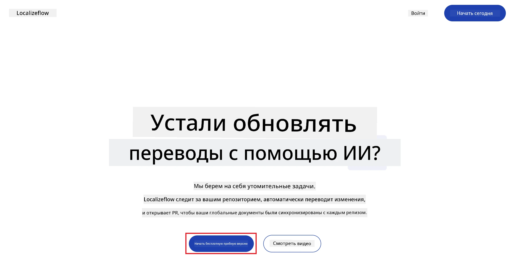
3. Выберите **Sign in with GitHub**.  
   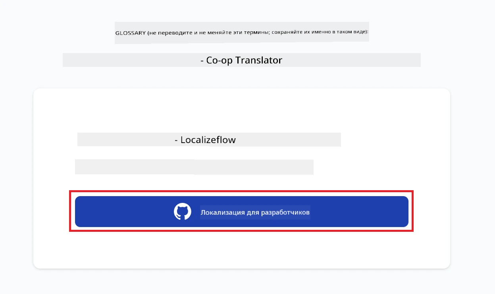
4. Войдите в свой аккаунт GitHub.  
   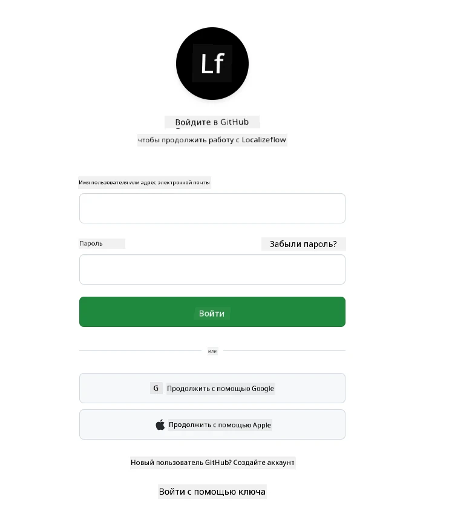
5. Выберите аккаунт, в который хотите установить Localizeflow GitHub App — личный аккаунт или организацию, которой вы управляете.  
   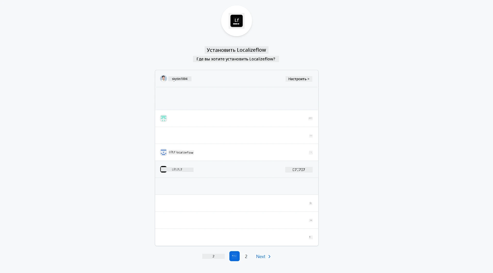
6. Выберите репозитории, к которым вы хотите предоставить доступ Localizeflow, затем выберите **Save**.  
   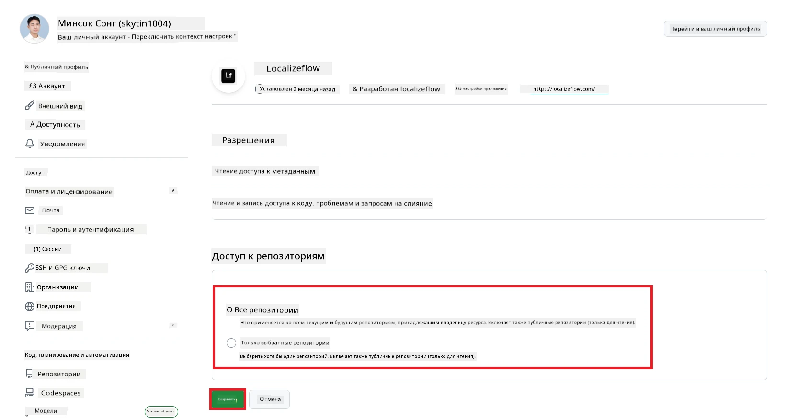
7. Вы будете перенаправлены на домашнюю страницу Localizeflow.

> [!TIP]
> Чтобы добавить больше репозиториев позже, выберите свой аккаунт в заголовке и выберите **+ Add more repositories**.  
> 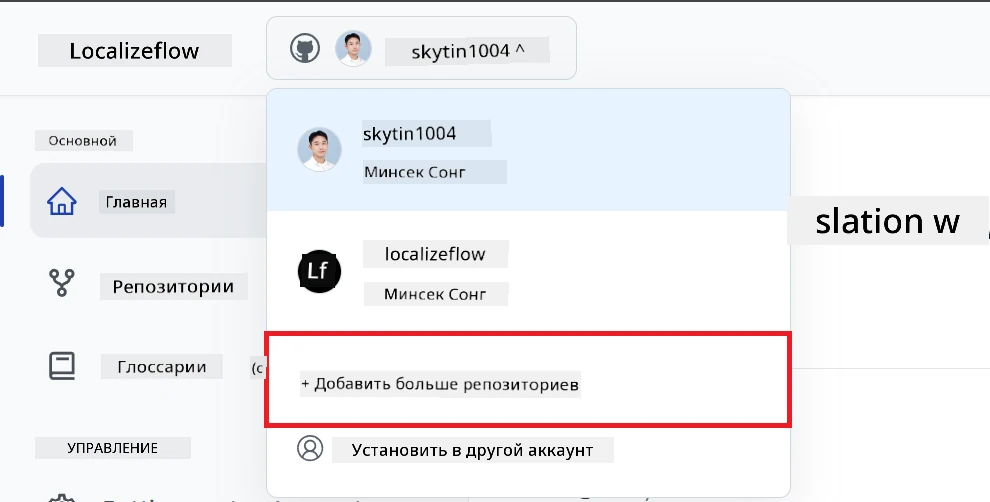

---

## Подключите ваши репозитории к Localizeflow

1. На домашней странице Localizeflow выберите **+ Connect repositories**.  
   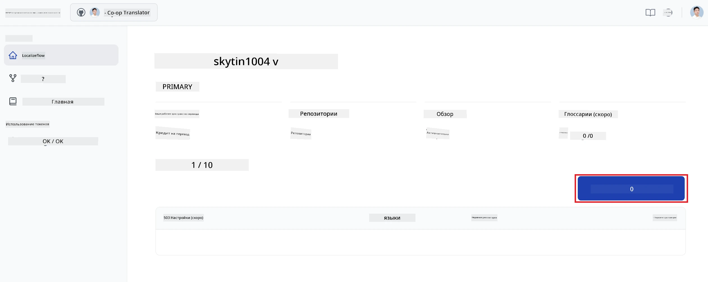

2. Выберите один из установленных репозиториев, который хотите подключить, и нажмите **Save**.  
   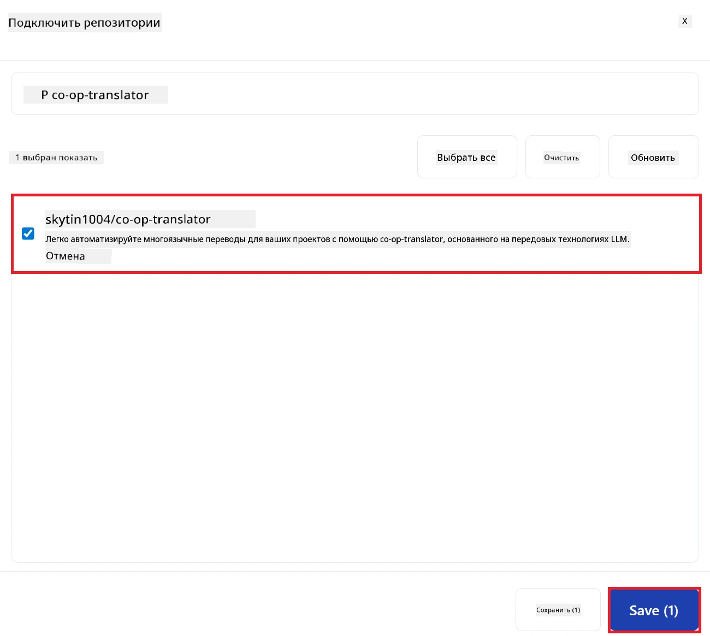

3. Ваши подключённые репозитории теперь будут отображаться как на главной странице, так и на странице Репозиториев.  
   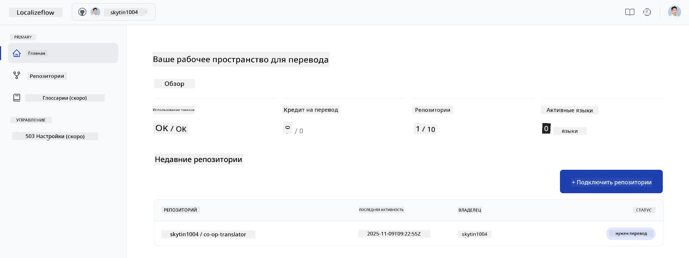

---

## Начните автоматический перевод

1. Выберите репозиторий, который вы только что подключили.  
   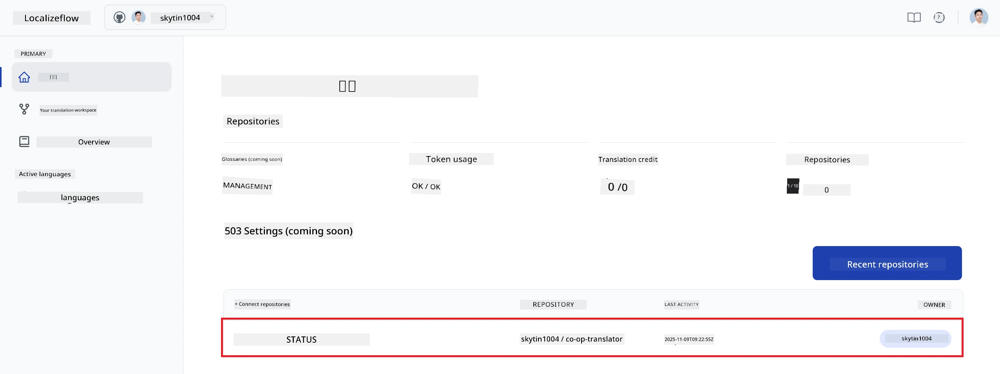

2. На странице с деталями репозитория выберите **Edit** внизу.  
   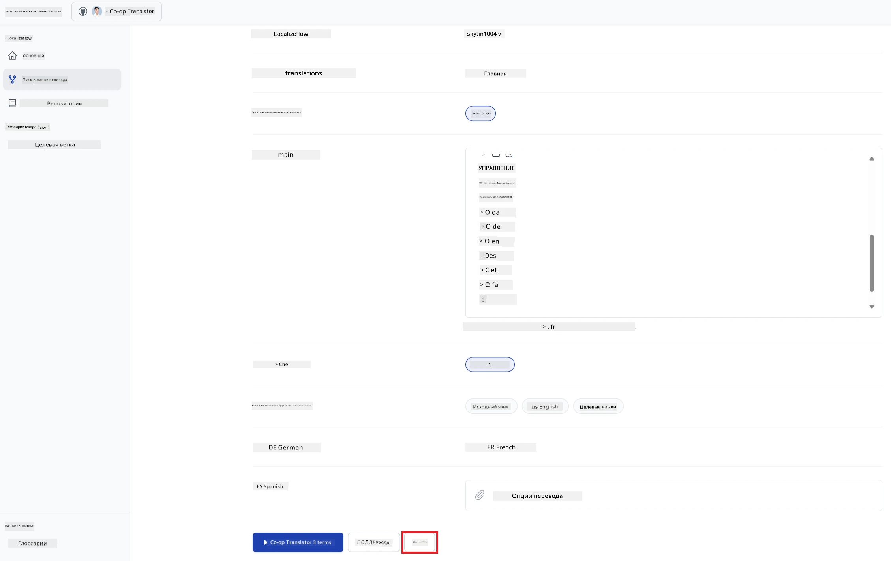

3. Настройте параметры перевода — целевую ветку (по умолчанию: `main`), целевые языки и язык источника (по умолчанию: `en`). Выберите **Save**.  
   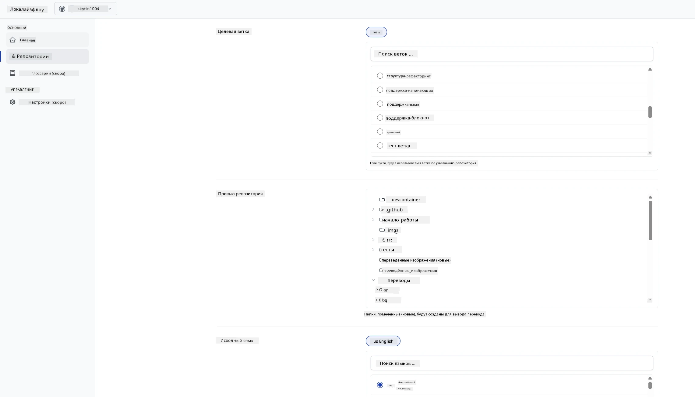

4. Выберите **Start & Automate**.  
   Localizeflow теперь будет автоматически переводить вашу документацию и открывать pull-запросы при каждом изменении исходников.  
   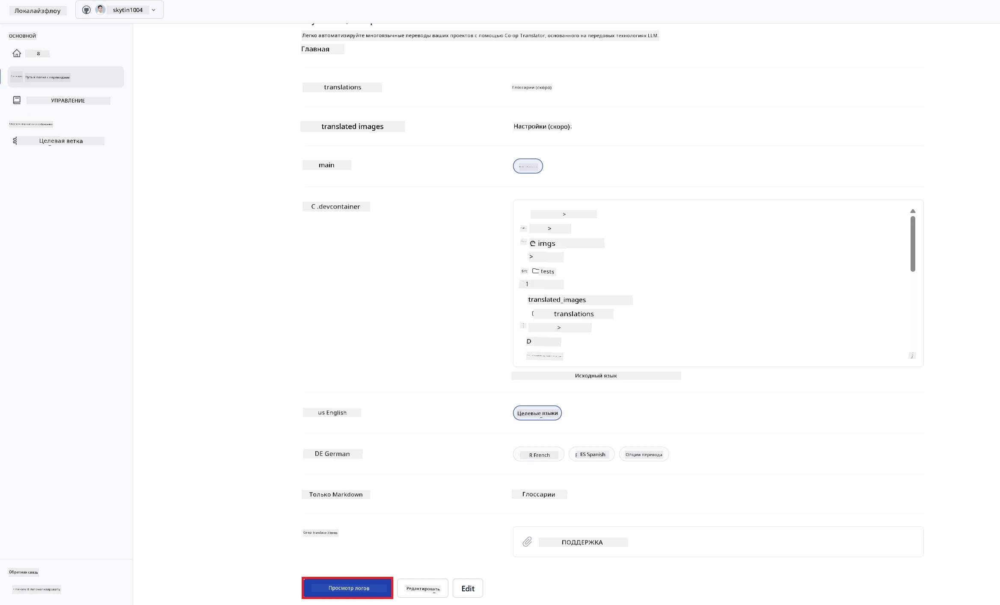

---

<!-- CO-OP TRANSLATOR DISCLAIMER START -->
**Отказ от ответственности**:  
Этот документ был переведен с использованием сервиса автоматического перевода [Co-op Translator](https://github.com/Azure/co-op-translator). Несмотря на наши усилия обеспечить точность, просим учитывать, что автоматический перевод может содержать ошибки или неточности. Оригинальный документ на исходном языке следует считать авторитетным источником. Для критически важной информации рекомендуется воспользоваться услугами профессионального переводчика. Мы не несем ответственности за любые недоразумения или неправильные толкования, возникшие вследствие использования данного перевода.
<!-- CO-OP TRANSLATOR DISCLAIMER END -->