# Localizeflow – Rýchly návod na začiatok

#### Podporované spoločnosťou [Localizeflow](https://localizeflow.com/)

<!-- CO-OP TRANSLATOR LANGUAGES TABLE START -->
[Arabic](../ar/README.md) | [Bengali](../bn/README.md) | [Bulgarian](../bg/README.md) | [Burmese (Myanmar)](../my/README.md) | [Chinese (Simplified)](../zh-CN/README.md) | [Chinese (Traditional, Hong Kong)](../zh-HK/README.md) | [Chinese (Traditional, Macau)](../zh-MO/README.md) | [Chinese (Traditional, Taiwan)](../zh-TW/README.md) | [Croatian](../hr/README.md) | [Czech](../cs/README.md) | [Danish](../da/README.md) | [Dutch](../nl/README.md) | [Estonian](../et/README.md) | [Finnish](../fi/README.md) | [French](../fr/README.md) | [German](../de/README.md) | [Greek](../el/README.md) | [Hebrew](../he/README.md) | [Hindi](../hi/README.md) | [Hungarian](../hu/README.md) | [Indonesian](../id/README.md) | [Italian](../it/README.md) | [Japanese](../ja/README.md) | [Kannada](../kn/README.md) | [Korean](../ko/README.md) | [Lithuanian](../lt/README.md) | [Malay](../ms/README.md) | [Malayalam](../ml/README.md) | [Marathi](../mr/README.md) | [Nepali](../ne/README.md) | [Nigerian Pidgin](../pcm/README.md) | [Norwegian](../no/README.md) | [Persian (Farsi)](../fa/README.md) | [Polish](../pl/README.md) | [Portuguese (Brazil)](../pt-BR/README.md) | [Portuguese (Portugal)](../pt-PT/README.md) | [Punjabi (Gurmukhi)](../pa/README.md) | [Romanian](../ro/README.md) | [Russian](../ru/README.md) | [Serbian (Cyrillic)](../sr/README.md) | [Slovak](./README.md) | [Slovenian](../sl/README.md) | [Spanish](../es/README.md) | [Swahili](../sw/README.md) | [Swedish](../sv/README.md) | [Tagalog (Filipino)](../tl/README.md) | [Tamil](../ta/README.md) | [Telugu](../te/README.md) | [Thai](../th/README.md) | [Turkish](../tr/README.md) | [Ukrainian](../uk/README.md) | [Urdu](../ur/README.md) | [Vietnamese](../vi/README.md)

> **Preferujete klonovanie lokálne?**

> Tento repozitár obsahuje viac ako 50 jazykových prekladov, čo výrazne zvyšuje veľkosť stiahnutia. Ak chcete klonovať bez prekladov, použite sparse checkout:
> ```bash
> git clone --filter=blob:none --sparse https://github.com/localizeflow/localizeflow-docs.git
> cd localizeflow-docs
> git sparse-checkout set --no-cone '/*' '!translations' '!translated_images'
> ```
> Toto vám poskytne všetko, čo potrebujete na dokončenie kurzu s oveľa rýchlejším sťahovaním.
<!-- CO-OP TRANSLATOR LANGUAGES TABLE END -->

Localizeflow automaticky prekladá vašu dokumentáciu a otvára pull requesty, kedykoľvek sa zmení zdrojový súbor.  
Tento návod vám ukáže, ako nainštalovať GitHub App a spustiť prvý preklad za menej než 2 minúty.


> [!NOTE]
>
> Localizeflow momentálne podporuje dokumentačné projekty založené na GitHub-e
> (napríklad: AI pre Začiatočníkov a väčšina štandardných open-source repozitárov).  
> 
> Podpora moderných dokumentačných rámcov ako Astro, Docusaurus a Hugo  
> je vo vývoji.


---

## Prihláste sa a nainštalujte GitHub App

1. Navštívte **[localizeflow.com](https://localizeflow.com/)**.
2. Vyberte **Začať s bezplatnou skúšobnou verziou**.
   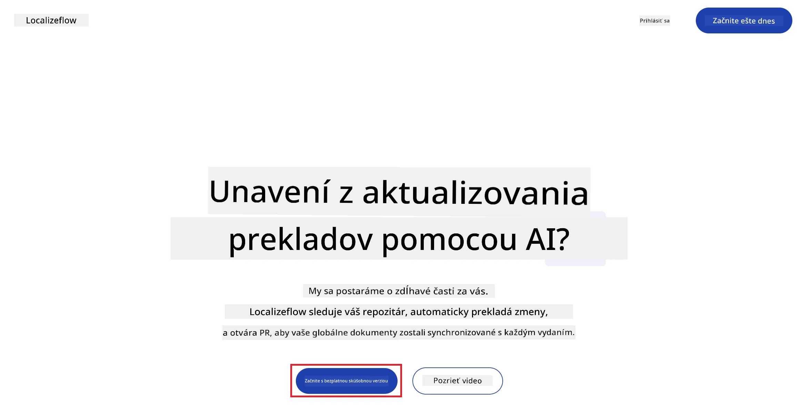
3. Vyberte **Prihlásiť sa cez GitHub**.  
   
4. Prihláste sa pomocou svojho GitHub účtu.  
   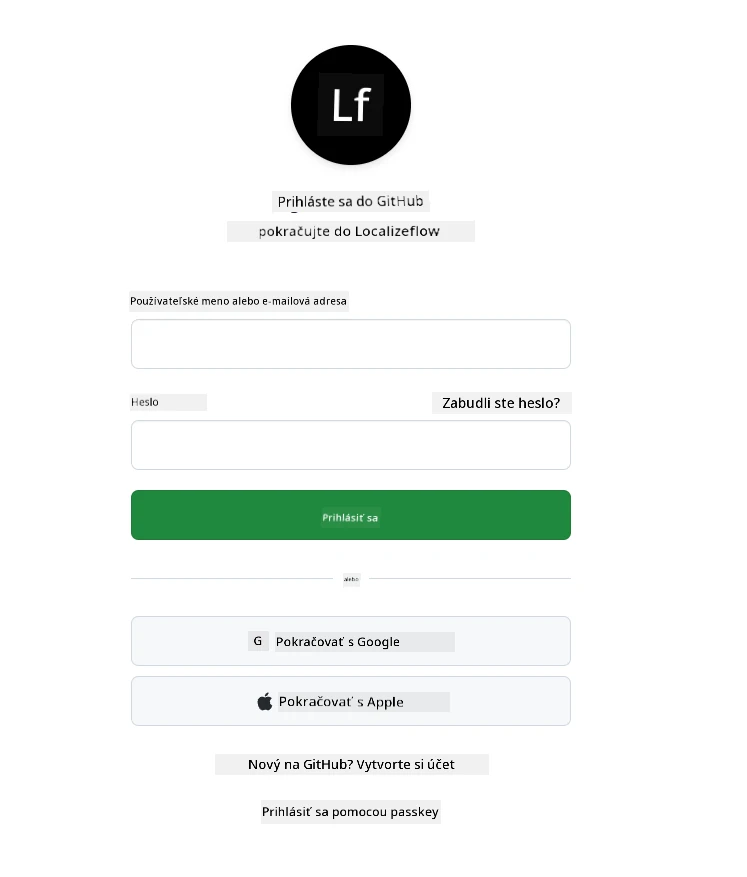
5. Vyberte účet, kde chcete nainštalovať Localizeflow GitHub App — váš osobný účet alebo organizáciu, ktorú spravujete.  
   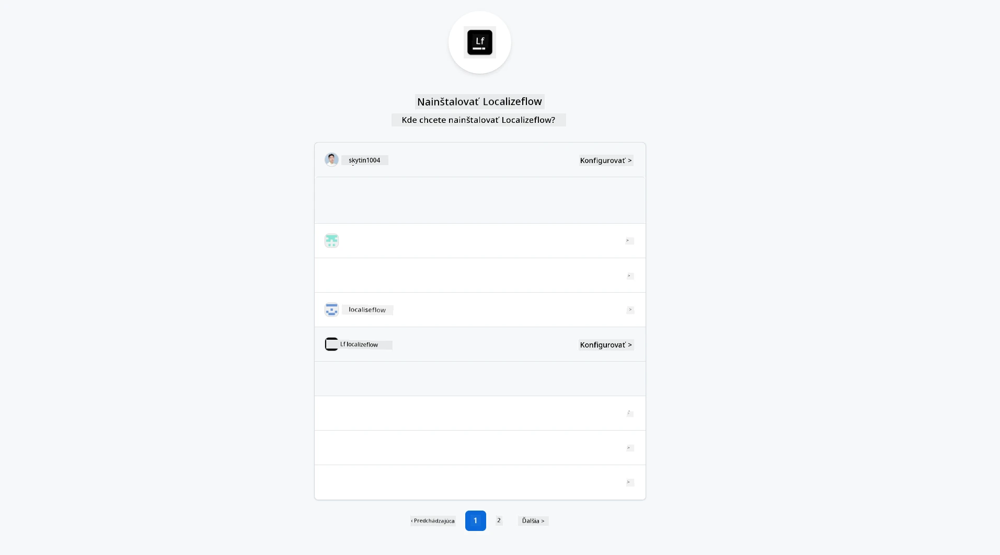
6. Vyberte repozitáre, ku ktorým chcete Localizeflow povoliť prístup, potom zvoľte **Uložiť**.  
   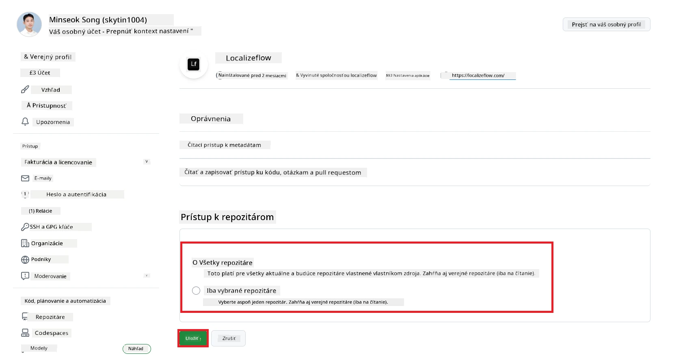
7. Budete presmerovaní na domovskú stránku Localizeflow.

> [!TIP]
> Ak chcete neskôr pridať viac repozitárov, vyberte si svoj účet v hlavičke a zvoľte **+ Pridať viac repozitárov**.  
> 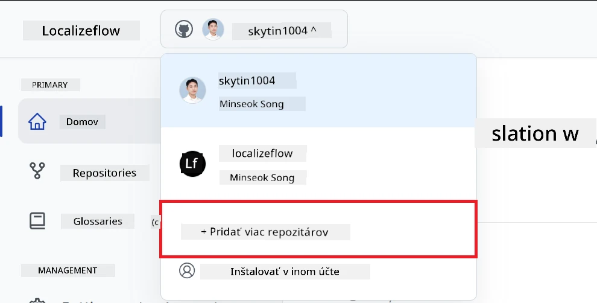

---

## Pripojte svoje repozitáre k Localizeflow

1. Na domovskej stránke Localizeflow vyberte **+ Pripojiť repozitáre**.  
   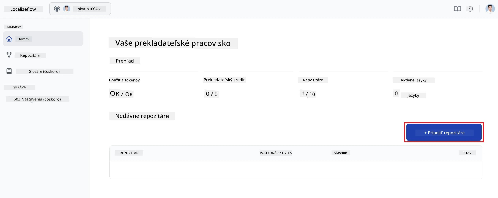

2. Vyberte jeden z nainštalovaných repozitárov, ktorý chcete pripojiť, a zvoľte **Uložiť**.  
   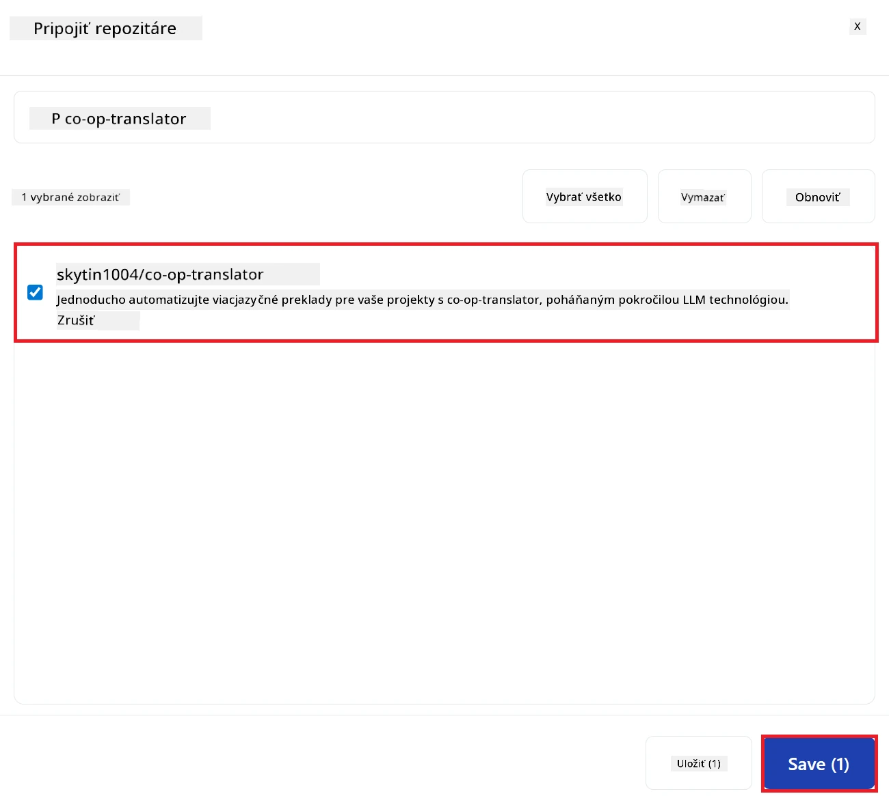

3. Vaše pripojené repozitáre sa teraz zobrazia na domovskej stránke aj na stránke Repozitáre.  
   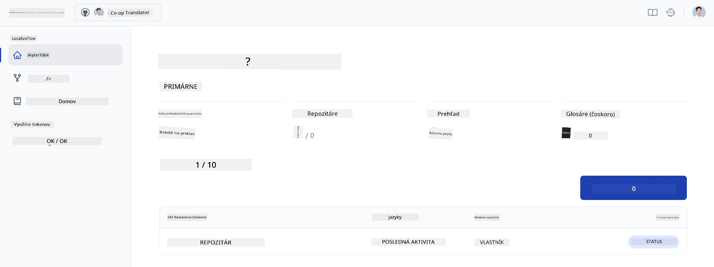

---

## Spustite automatický preklad

1. Vyberte práve pripojený repozitár.  
   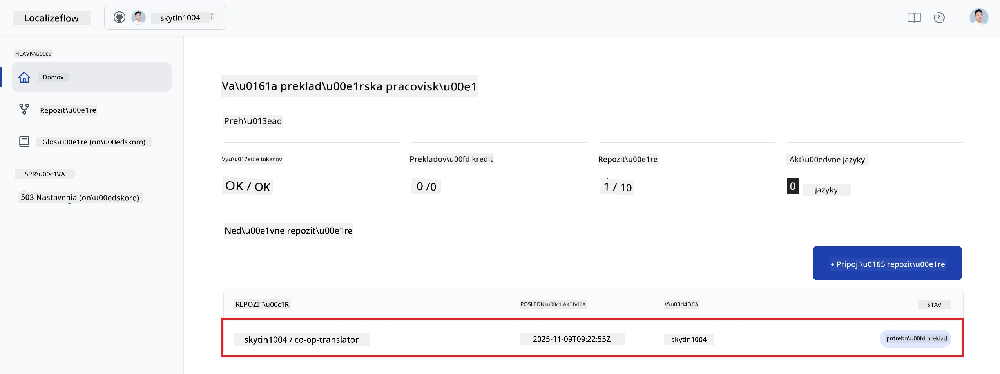

2. Na stránke s detailmi repozitára vyberte v dolnej časti **Upraviť**.  
   

3. Nakonfigurujte nastavenia prekladu — cieľovú vetvu (predvolené: `main`), cieľové jazyky a zdrojový jazyk (predvolené: `en`). Vyberte **Uložiť**.  
   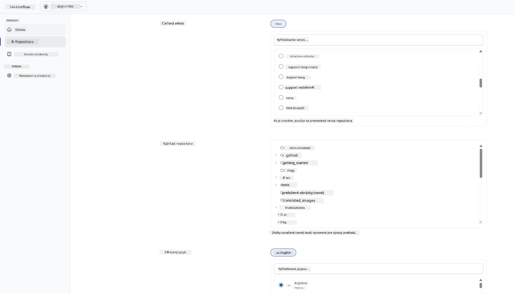

4. Vyberte **Spustiť & Automatizovať**.  
   Localizeflow teraz automaticky preloží vašu dokumentáciu a otvorí pull requesty, kedykoľvek sa zdroj zmení.  
   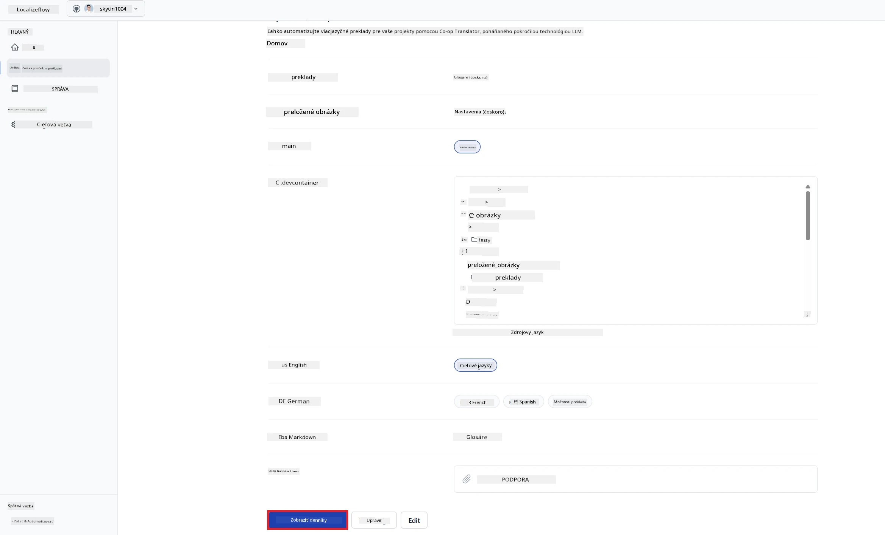

---

<!-- CO-OP TRANSLATOR DISCLAIMER START -->
**Vyhlásenie o zodpovednosti**:
Tento dokument bol preložený pomocou AI prekladateľskej služby [Co-op Translator](https://github.com/Azure/co-op-translator). Aj keď sa snažíme o presnosť, berte prosím na vedomie, že automatizované preklady môžu obsahovať chyby alebo nepresnosti. Originálny dokument v jeho pôvodnom jazyku by mal byť považovaný za autoritatívny zdroj. Pre kritické informácie sa odporúča profesionálny ľudský preklad. Nezodpovedáme za žiadne nedorozumenia alebo nesprávne interpretácie vzniknuté použitím tohto prekladu.
<!-- CO-OP TRANSLATOR DISCLAIMER END -->