# Localizeflow – Hitri začetek

#### Podprto s strani [Localizeflow](https://localizeflow.com/)

<!-- CO-OP TRANSLATOR LANGUAGES TABLE START -->
[Arabic](../ar/README.md) | [Bengali](../bn/README.md) | [Bulgarian](../bg/README.md) | [Burmese (Myanmar)](../my/README.md) | [Chinese (Simplified)](../zh-CN/README.md) | [Chinese (Traditional, Hong Kong)](../zh-HK/README.md) | [Chinese (Traditional, Macau)](../zh-MO/README.md) | [Chinese (Traditional, Taiwan)](../zh-TW/README.md) | [Croatian](../hr/README.md) | [Czech](../cs/README.md) | [Danish](../da/README.md) | [Dutch](../nl/README.md) | [Estonian](../et/README.md) | [Finnish](../fi/README.md) | [French](../fr/README.md) | [German](../de/README.md) | [Greek](../el/README.md) | [Hebrew](../he/README.md) | [Hindi](../hi/README.md) | [Hungarian](../hu/README.md) | [Indonesian](../id/README.md) | [Italian](../it/README.md) | [Japanese](../ja/README.md) | [Kannada](../kn/README.md) | [Korean](../ko/README.md) | [Lithuanian](../lt/README.md) | [Malay](../ms/README.md) | [Malayalam](../ml/README.md) | [Marathi](../mr/README.md) | [Nepali](../ne/README.md) | [Nigerian Pidgin](../pcm/README.md) | [Norwegian](../no/README.md) | [Persian (Farsi)](../fa/README.md) | [Polish](../pl/README.md) | [Portuguese (Brazil)](../pt-BR/README.md) | [Portuguese (Portugal)](../pt-PT/README.md) | [Punjabi (Gurmukhi)](../pa/README.md) | [Romanian](../ro/README.md) | [Russian](../ru/README.md) | [Serbian (Cyrillic)](../sr/README.md) | [Slovak](../sk/README.md) | [Slovenian](./README.md) | [Spanish](../es/README.md) | [Swahili](../sw/README.md) | [Swedish](../sv/README.md) | [Tagalog (Filipino)](../tl/README.md) | [Tamil](../ta/README.md) | [Telugu](../te/README.md) | [Thai](../th/README.md) | [Turkish](../tr/README.md) | [Ukrainian](../uk/README.md) | [Urdu](../ur/README.md) | [Vietnamese](../vi/README.md)

> **Raje klonirate lokalno?**

> Ta repozitorij vsebuje več kot 50 jezikovnih prevodov, kar znatno poveča velikost prenosa. Za kloniranje brez prevodov uporabite sparse checkout:  
> ```bash
> git clone --filter=blob:none --sparse https://github.com/localizeflow/localizeflow-docs.git
> cd localizeflow-docs
> git sparse-checkout set --no-cone '/*' '!translations' '!translated_images'
> ```
> Tako boste prejeli vse, kar potrebujete za dokončanje tečaja z veliko hitrejšim prenosom.
<!-- CO-OP TRANSLATOR LANGUAGES TABLE END -->

Localizeflow samodejno prevaja vašo dokumentacijo in odpre pull requeste vsakič, ko se izvorna datoteka spremeni.  
Ta vodič vam pokaže, kako namestiti GitHub aplikacijo in zagnati prvi prevod v manj kot 2 minutah.


> [!NOTE]
>
> Localizeflow trenutno podpira dokumentacijske projekte na GitHubu  
> (na primer: AI for Beginners in večina standardnih odprtokodnih repozitorijev).  
>  
> Podpora za moderne dokumentacijske ogrodja, kot so Astro, Docusaurus in Hugo,  
> je v aktivnem razvoju.


---

## Prijavite se in namestite GitHub aplikacijo

1. Obiščite **[localizeflow.com](https://localizeflow.com/)**.
2. Izberite **Začni s preizkusno različico brezplačno**.
   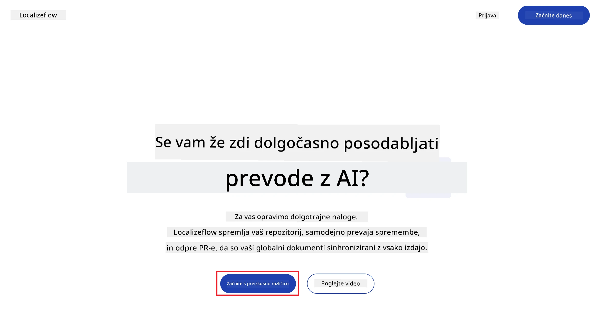
3. Izberite **Prijava z GitHubom**.  
   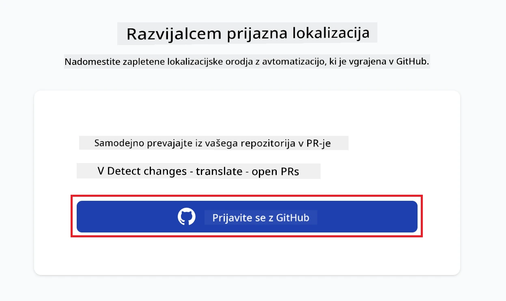
4. Prijavite se z vašim GitHub računom.  
   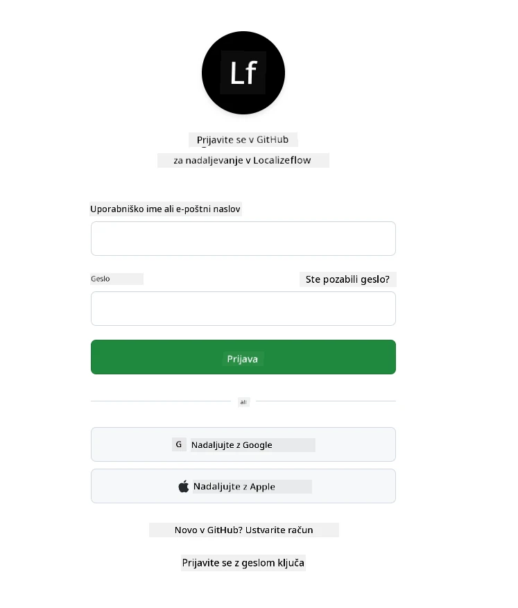
5. Izberite račun, v katerega želite namestiti Localizeflow GitHub aplikacijo — vaš osebni račun ali organizacijo, ki jo upravljate.  
   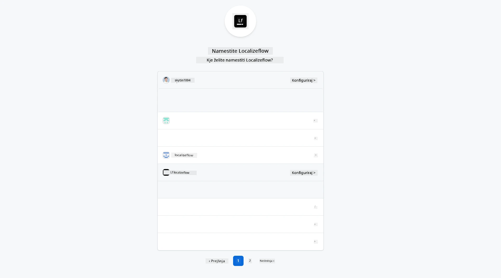
6. Izberite repozitorije, do katerih želite, da ima Localizeflow dostop, nato izberite **Shrani**.  
   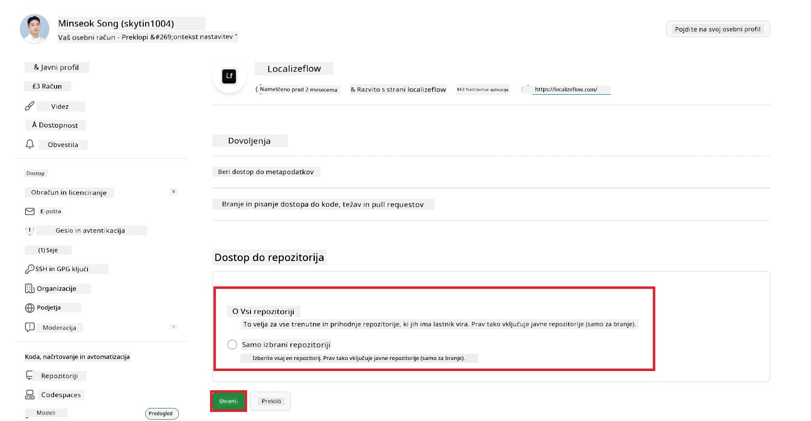
7. Preusmerjeni boste na domačo stran Localizeflow.

> [!TIP]
> Če želite kasneje dodati več repozitorijev, izberite svoj račun v glavi in izberite **+ Dodaj več repozitorijev**.  
> 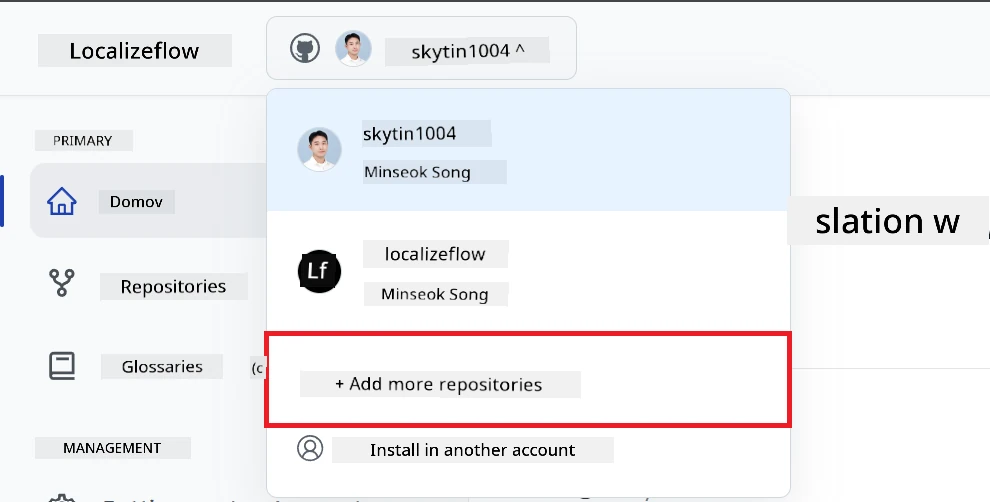

---

## Povežite svoje repozitorije z Localizeflow

1. Na domači strani Localizeflow izberite **+ Poveži repozitorije**.  
   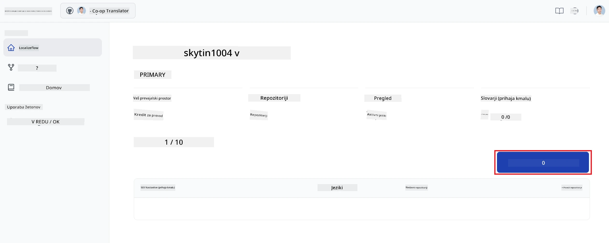

2. Izberite enega izmed nameščenih repozitorijev, ki ga želite povezati, in izberite **Shrani**.  
   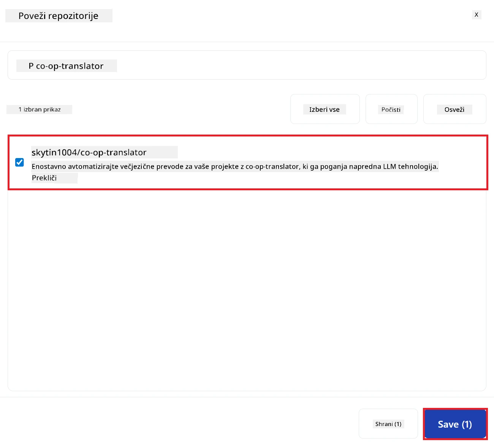

3. Vaši povezani repozitoriji se bodo zdaj prikazali tako na domači strani kot na strani Repozitoriji.  
   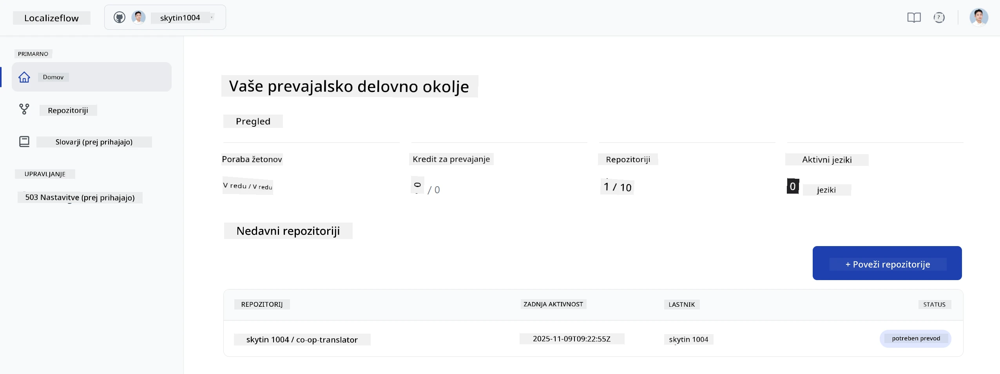

---

## Začni samodejni prevod

1. Izberite repozitorij, ki ste ga pravkar povezali.  
   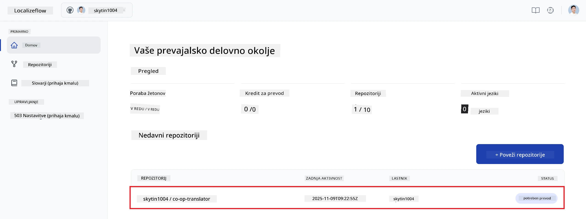

2. Na strani s podrobnostmi repozitorija izberite **Uredi** na dnu.  
   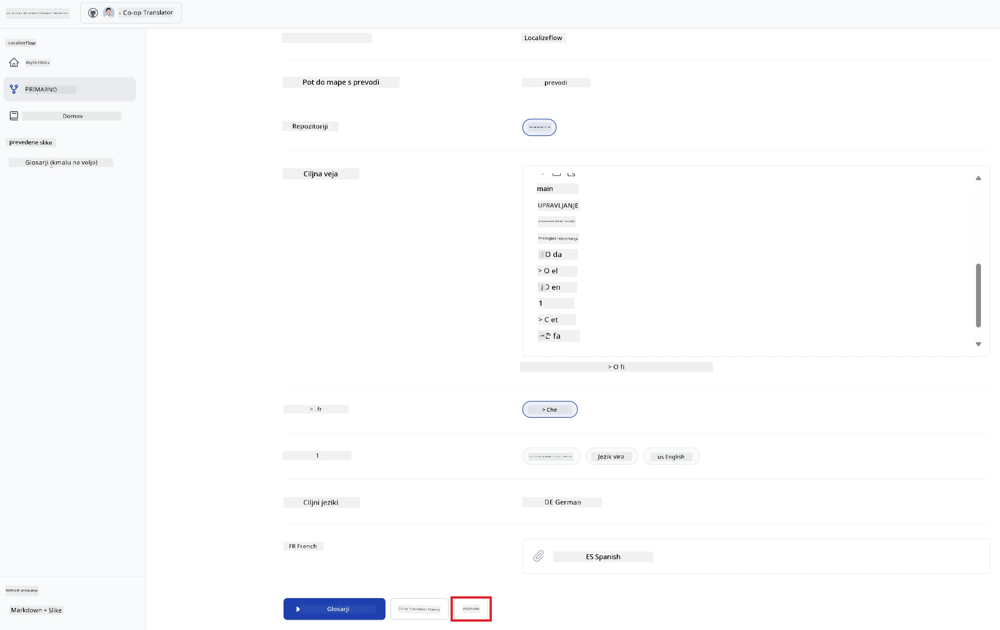

3. Nastavite svoje prevajalske nastavitve — ciljno vejo (privzeto: `main`), ciljne jezike in izvorni jezik (privzeto: `en`). Izberite **Shrani**.  
   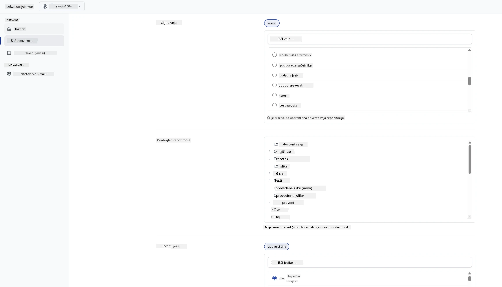

4. Izberite **Začni & Avtomatiziraj**.  
   Localizeflow bo zdaj samodejno prevajal vašo dokumentacijo in odpiral pull requeste ob vsaki spremembi izvora.  
   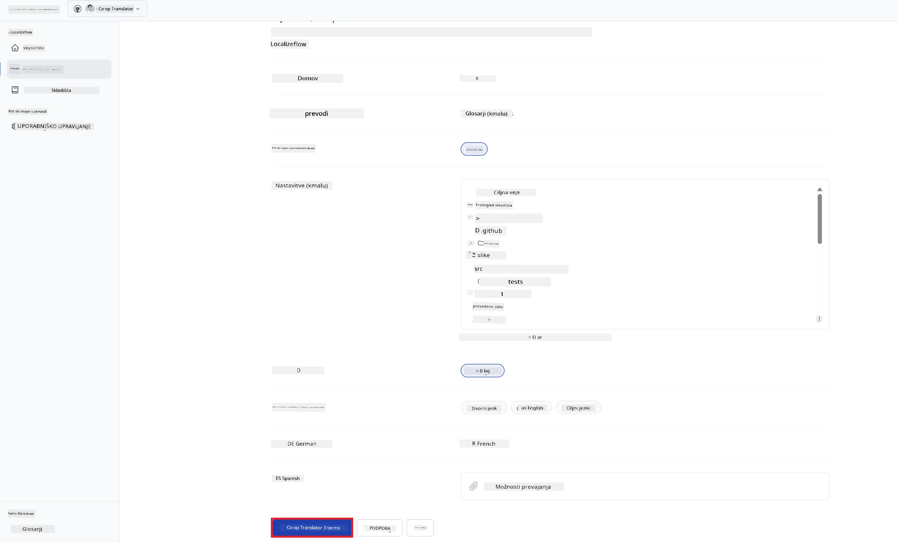

---

<!-- CO-OP TRANSLATOR DISCLAIMER START -->
**Omejitev odgovornosti**:
Ta dokument je bil preveden z uporabo storitve za prevajanje z umetno inteligenco [Co-op Translator](https://github.com/Azure/co-op-translator). Čeprav si prizadevamo za natančnost, vas opozarjamo, da avtomatizirani prevodi lahko vsebujejo napake ali netočnosti. Izvirni dokument v izvorni jezik velja za dokončen in zavezujoč vir. Za pomembne informacije priporočamo strokovni človeški prevod. Ne odgovarjamo za morebitna nesporazume ali napačne interpretacije, ki izhajajo iz uporabe tega prevoda.
<!-- CO-OP TRANSLATOR DISCLAIMER END -->