# Localizeflow – Kom igång-guide

#### Stöds av [Localizeflow](https://localizeflow.com/)

<!-- CO-OP TRANSLATOR LANGUAGES TABLE START -->
[Arabic](../ar/README.md) | [Bengali](../bn/README.md) | [Bulgarian](../bg/README.md) | [Burmese (Myanmar)](../my/README.md) | [Chinese (Simplified)](../zh-CN/README.md) | [Chinese (Traditional, Hong Kong)](../zh-HK/README.md) | [Chinese (Traditional, Macau)](../zh-MO/README.md) | [Chinese (Traditional, Taiwan)](../zh-TW/README.md) | [Croatian](../hr/README.md) | [Czech](../cs/README.md) | [Danish](../da/README.md) | [Dutch](../nl/README.md) | [Estonian](../et/README.md) | [Finnish](../fi/README.md) | [French](../fr/README.md) | [German](../de/README.md) | [Greek](../el/README.md) | [Hebrew](../he/README.md) | [Hindi](../hi/README.md) | [Hungarian](../hu/README.md) | [Indonesian](../id/README.md) | [Italian](../it/README.md) | [Japanese](../ja/README.md) | [Kannada](../kn/README.md) | [Korean](../ko/README.md) | [Lithuanian](../lt/README.md) | [Malay](../ms/README.md) | [Malayalam](../ml/README.md) | [Marathi](../mr/README.md) | [Nepali](../ne/README.md) | [Nigerian Pidgin](../pcm/README.md) | [Norwegian](../no/README.md) | [Persian (Farsi)](../fa/README.md) | [Polish](../pl/README.md) | [Portuguese (Brazil)](../pt-BR/README.md) | [Portuguese (Portugal)](../pt-PT/README.md) | [Punjabi (Gurmukhi)](../pa/README.md) | [Romanian](../ro/README.md) | [Russian](../ru/README.md) | [Serbian (Cyrillic)](../sr/README.md) | [Slovak](../sk/README.md) | [Slovenian](../sl/README.md) | [Spanish](../es/README.md) | [Swahili](../sw/README.md) | [Swedish](./README.md) | [Tagalog (Filipino)](../tl/README.md) | [Tamil](../ta/README.md) | [Telugu](../te/README.md) | [Thai](../th/README.md) | [Turkish](../tr/README.md) | [Ukrainian](../uk/README.md) | [Urdu](../ur/README.md) | [Vietnamese](../vi/README.md)

> **Föredrar du att klona lokalt?**

> Detta arkiv innehåller 50+ språköversättningar vilket avsevärt ökar nedladdningsstorleken. För att klona utan översättningar, använd sparse checkout:
> ```bash
> git clone --filter=blob:none --sparse https://github.com/localizeflow/localizeflow-docs.git
> cd localizeflow-docs
> git sparse-checkout set --no-cone '/*' '!translations' '!translated_images'
> ```
> Detta ger dig allt du behöver för att slutföra kursen med en mycket snabbare nedladdning.
<!-- CO-OP TRANSLATOR LANGUAGES TABLE END -->

Localizeflow översätter automatiskt din dokumentation och öppnar pull-requests när källfilen ändras.  
Denna guide visar hur du installerar GitHub-appen och kör din första översättning på under 2 minuter.


> [!NOTE]
>
> Localizeflow stöder för närvarande GitHub-baserade dokumentationsprojekt
> (till exempel: AI for Beginners och de flesta standard open-source repos).  
> 
> Stöd för moderna dokumentationsramverk som Astro, Docusaurus och Hugo  
> är under aktiv utveckling.


---

## Logga in och installera GitHub-appen

1. Besök **[localizeflow.com](https://localizeflow.com/)**.
2. Välj **Start with free trial**.
   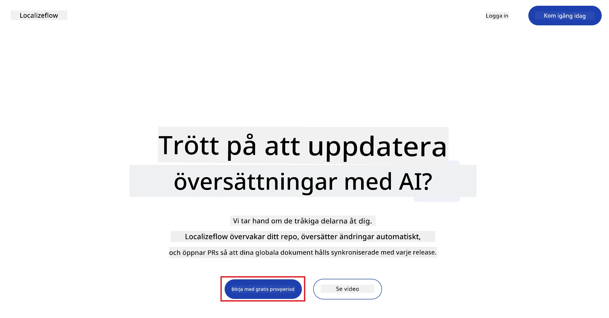
3. Välj **Sign in with GitHub**.  
   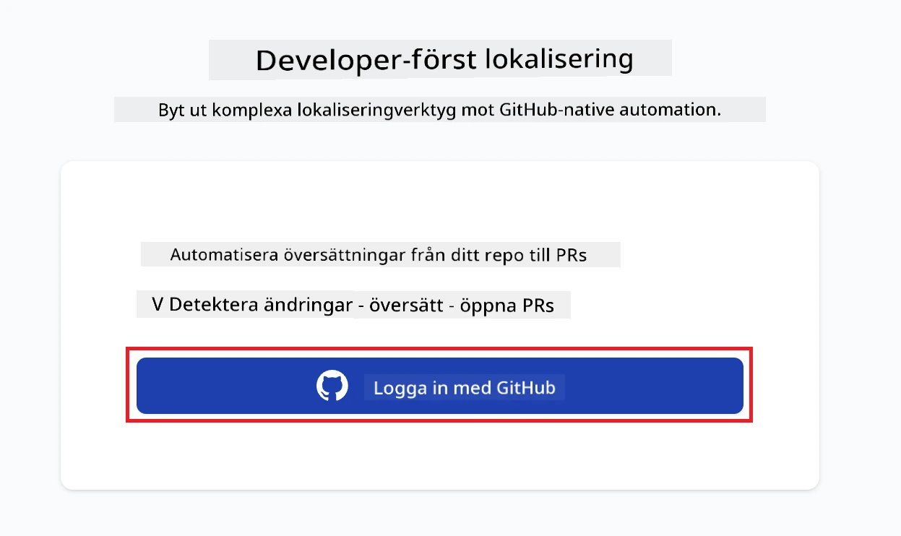
4. Logga in med ditt GitHub-konto.  
   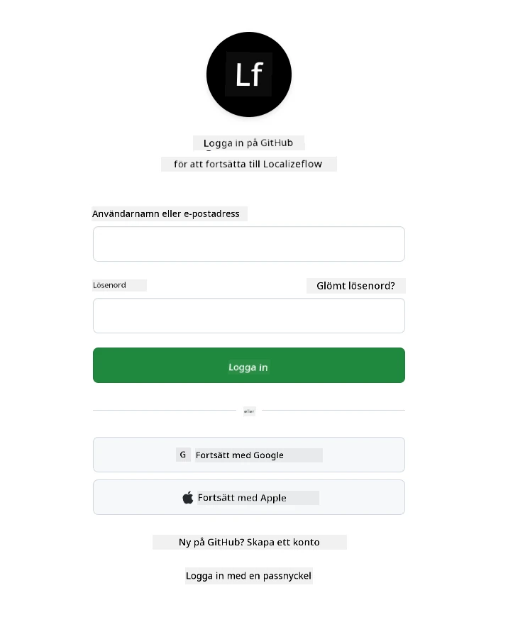
5. Välj det konto där du vill installera Localizeflow GitHub-appen — ditt personliga konto eller en organisation du administrerar.  
   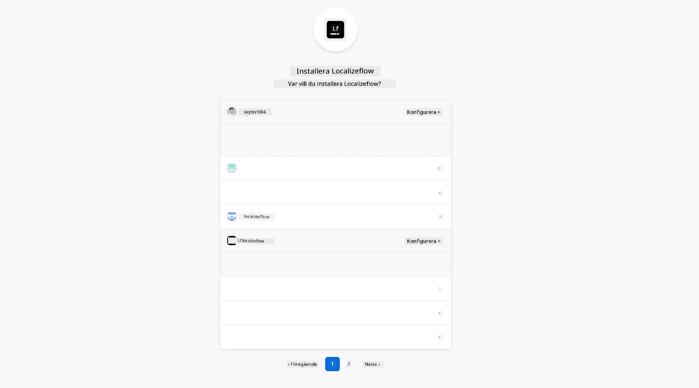
6. Välj de repositorier du vill att Localizeflow ska få åtkomst till, och tryck sedan på **Save**.  
   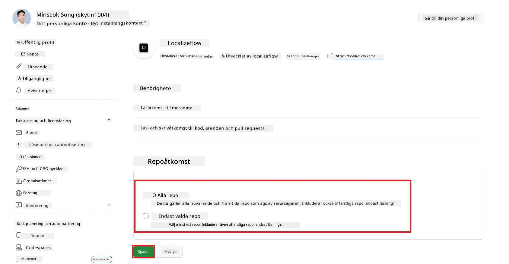
7. Du omdirigeras till Localizeflows startsida.

> [!TIP]
> För att lägga till fler repositorier senare, välj ditt konto i sidhuvudet och välj **+ Add more repositories**.  
> 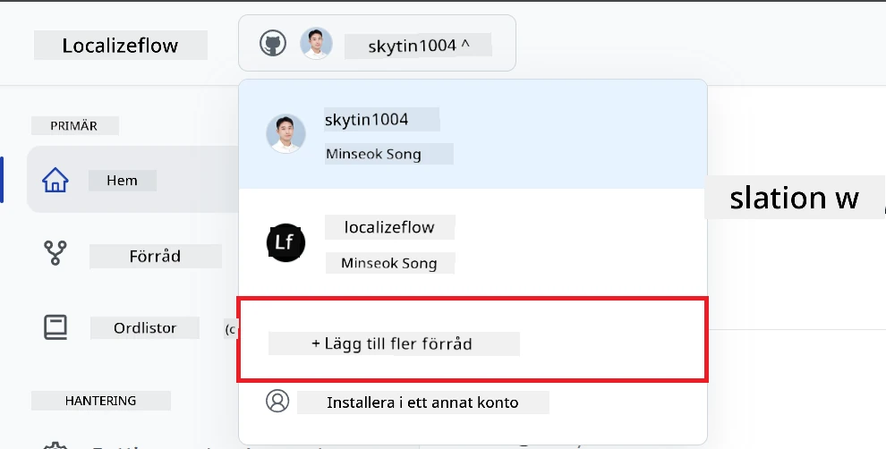

---

## Anslut dina repositorier till Localizeflow

1. På Localizeflows startsida, välj **+ Connect repositories**.  
   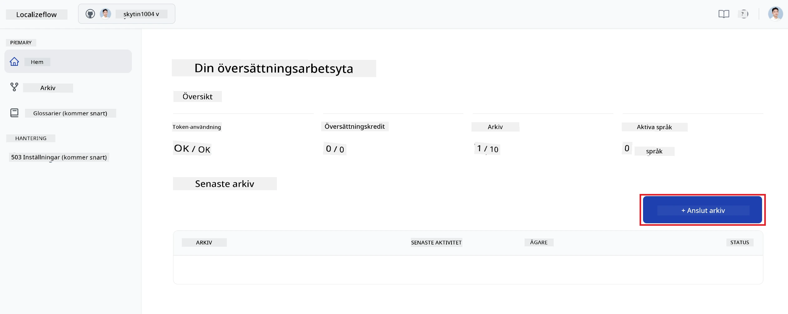

2. Välj ett av de installerade repositorierna du vill ansluta och klicka på **Save**.  
   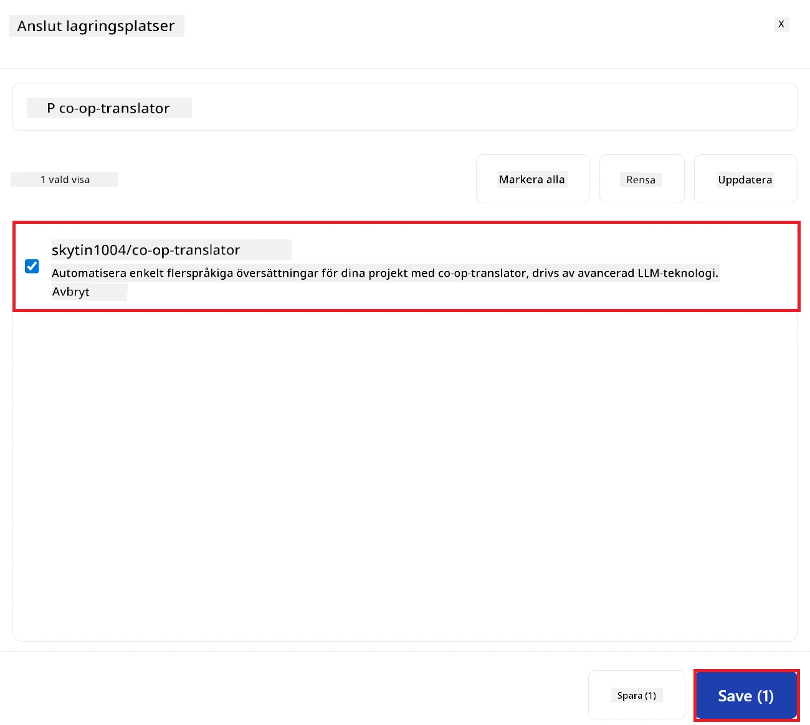

3. Dina anslutna repositorier visas nu både på startsidan och på sidan Repositories.  
   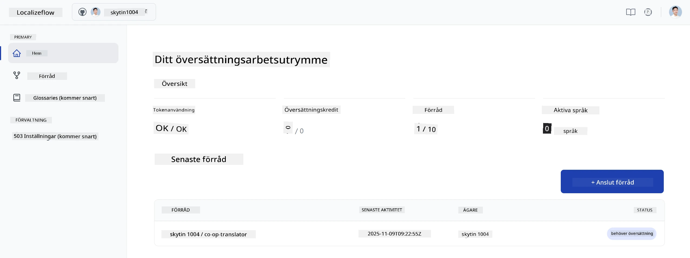

---

## Starta automatisk översättning

1. Välj det repository du just anslöt.  
   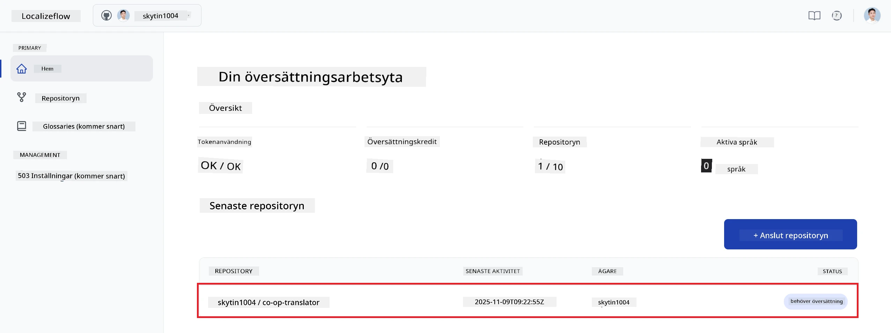

2. På sidan för repository-information, välj **Edit** längst ner.  
   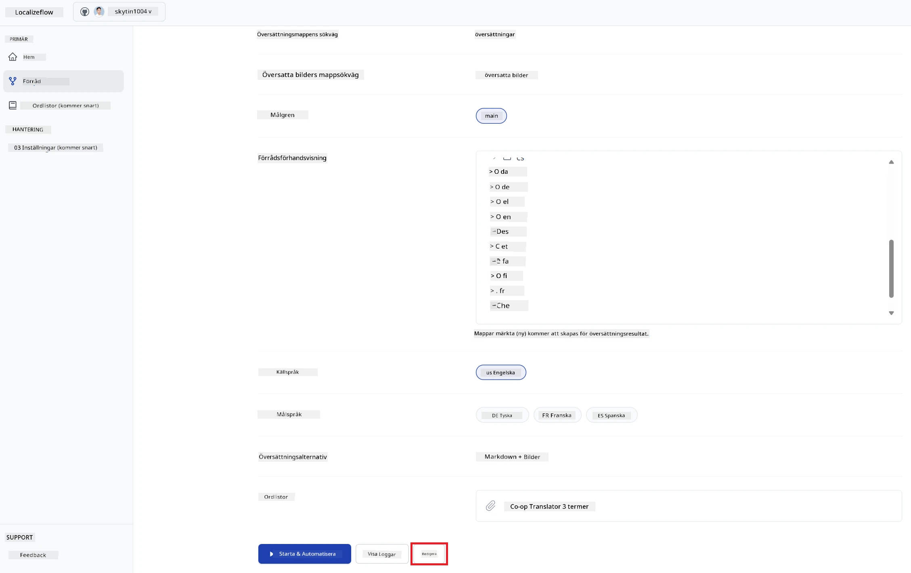

3. Konfigurera dina översättningsinställningar — målbranch (standard: `main`), målspråk och källspråk (standard: `en`). Välj **Save**.  
   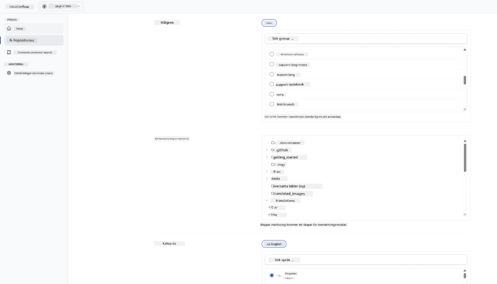

4. Välj **Start & Automate**.  
   Localizeflow kommer nu automatiskt att översätta din dokumentation och öppna pull-requests när källan ändras.  
   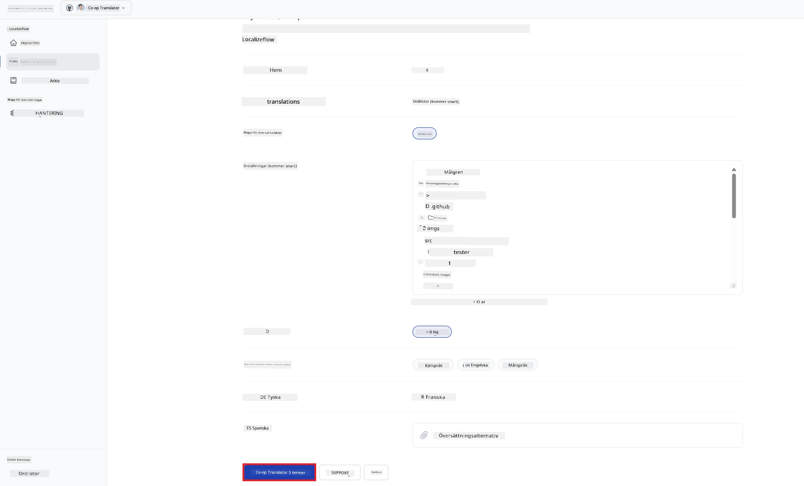

---

<!-- CO-OP TRANSLATOR DISCLAIMER START -->
**Ansvarsfriskrivning**:
Detta dokument har översatts med hjälp av AI-översättningstjänsten [Co-op Translator](https://github.com/Azure/co-op-translator). Även om vi strävar efter noggrannhet, bör du vara medveten om att automatiska översättningar kan innehålla fel eller brister. Det ursprungliga dokumentet på dess modersmål bör betraktas som den auktoritativa källan. För viktig information rekommenderas professionell mänsklig översättning. Vi ansvarar inte för några missförstånd eller feltolkningar som uppstår till följd av användningen av denna översättning.
<!-- CO-OP TRANSLATOR DISCLAIMER END -->