# Localizeflow – త్వరిత ప్రారంభ మార్గదర్శిని

#### [Localizeflow](https://localizeflow.com/) ద్వారా మద్దతు పొందింది

<!-- CO-OP TRANSLATOR LANGUAGES TABLE START -->
[Arabic](../ar/README.md) | [Bengali](../bn/README.md) | [Bulgarian](../bg/README.md) | [Burmese (Myanmar)](../my/README.md) | [Chinese (Simplified)](../zh-CN/README.md) | [Chinese (Traditional, Hong Kong)](../zh-HK/README.md) | [Chinese (Traditional, Macau)](../zh-MO/README.md) | [Chinese (Traditional, Taiwan)](../zh-TW/README.md) | [Croatian](../hr/README.md) | [Czech](../cs/README.md) | [Danish](../da/README.md) | [Dutch](../nl/README.md) | [Estonian](../et/README.md) | [Finnish](../fi/README.md) | [French](../fr/README.md) | [German](../de/README.md) | [Greek](../el/README.md) | [Hebrew](../he/README.md) | [Hindi](../hi/README.md) | [Hungarian](../hu/README.md) | [Indonesian](../id/README.md) | [Italian](../it/README.md) | [Japanese](../ja/README.md) | [Kannada](../kn/README.md) | [Korean](../ko/README.md) | [Lithuanian](../lt/README.md) | [Malay](../ms/README.md) | [Malayalam](../ml/README.md) | [Marathi](../mr/README.md) | [Nepali](../ne/README.md) | [Nigerian Pidgin](../pcm/README.md) | [Norwegian](../no/README.md) | [Persian (Farsi)](../fa/README.md) | [Polish](../pl/README.md) | [Portuguese (Brazil)](../pt-BR/README.md) | [Portuguese (Portugal)](../pt-PT/README.md) | [Punjabi (Gurmukhi)](../pa/README.md) | [Romanian](../ro/README.md) | [Russian](../ru/README.md) | [Serbian (Cyrillic)](../sr/README.md) | [Slovak](../sk/README.md) | [Slovenian](../sl/README.md) | [Spanish](../es/README.md) | [Swahili](../sw/README.md) | [Swedish](../sv/README.md) | [Tagalog (Filipino)](../tl/README.md) | [Tamil](../ta/README.md) | [Telugu](./README.md) | [Thai](../th/README.md) | [Turkish](../tr/README.md) | [Ukrainian](../uk/README.md) | [Urdu](../ur/README.md) | [Vietnamese](../vi/README.md)

> **స్థానికంగా క్లోన్ చేయాలని ఇష్టపడుతున్నారా?**

> ఈ రిపాజిటరీ 50+ భాషల అనువాదాలను కలిగి ఉంది, ఇది డౌన్లోడ్ పరిమాణాన్ని గణనీయంగా పెంచుతుంది. అనువాదాలుని లేకుండా క్లోన్ చేయడానికి, స్పార్స్ చెకౌట్ను ఉపయోగించండి:
> ```bash
> git clone --filter=blob:none --sparse https://github.com/localizeflow/localizeflow-docs.git
> cd localizeflow-docs
> git sparse-checkout set --no-cone '/*' '!translations' '!translated_images'
> ```
> ఇది కోర్సును పూర్తిచేయడానికి మీరు అవసరమైన అన్నింటినీ చాలా వేగంగా డౌన్లోడ్ చేసే అవకాశం అందిస్తుంది.
<!-- CO-OP TRANSLATOR LANGUAGES TABLE END -->

Localizeflow మీ డాక్యుమেন্টేషన్ ను స్వయంచాలకంగా అనువదించి, మూల ఫైల్ మారినప్పుడు పుల్ రిక్వెస్టులను తెరవుతుంది.  
ఈ గైడ్ GitHub యాప్ ని ఎలా ఇన్స్టాల్ చేయాలో మరియు రెండువాటి లోపు మీ మొదటి అనువాదాన్ని ఎలా నడిపించాలో చూపిస్తుంది.

> [!NOTE]
>
> Localizeflow ప్రస్తుతం GitHub ఆధారిత డాక్యుమెంటేషన్ ప్రాజెక్టులను మద్దతు ఇస్తోంది  
> (ఉదాహరణకు: AI for Beginners మరియు ఎక్కువ భాగం సాందర్భిక ఓపెన్-సోర్స్ రిపొలు).  
>  
> Astro, Docusaurus, Hugo వంటి ఆధునిక డాక్యుమెంటేషన్ ఫ్రేమ్‌వర్క్‌లకు మద్దతు  
> ప్రస్తుతట్లో అభివృద్ధిలో ఉంది.

---

## సైన్ ఇన్ చేసి GitHub యాప్ ఇన్స్టాల్ చేయండి

1. **[localizeflow.com](https://localizeflow.com/)** ను సందర్శించండి.
2. **Start with free trial** ఎంచుకోండి.  
   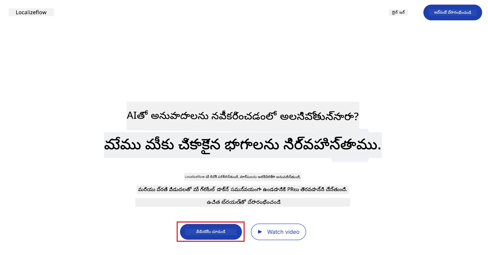
3. **Sign in with GitHub** ఎంచుకోండి.  
   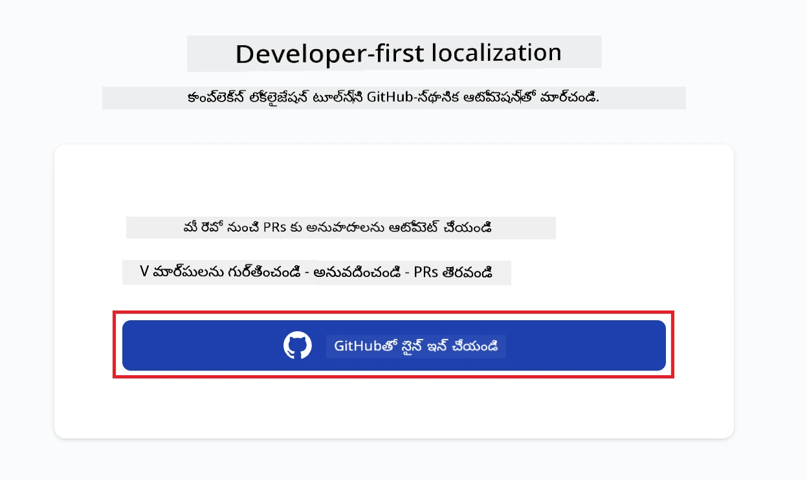
4. మీ GitHub ఖాతాతో సైన్ ఇన్ చేయండి.  
   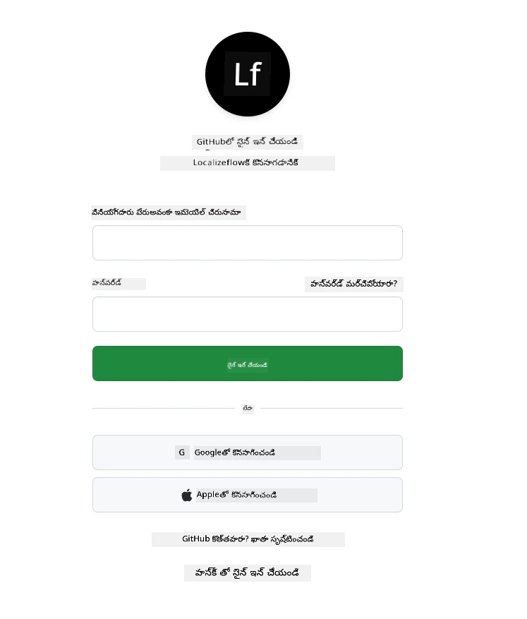
5. Localizeflow GitHub యాప్ ని ఇన్స్టాల్ చేయాలనుకునే ఖాతాను ఎంచుకోండి — మీ వ్యక్తిగత ఖాతా లేదా మీరు నిర్వహించే సంస్థ.  
   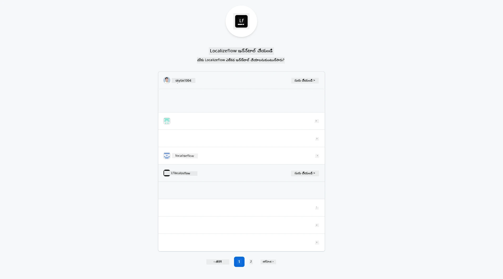
6. Localizeflow యాక్సెస్ చేసుకోవాలనుకునే రిపొలను ఎంచుకుని **Save** ఎంచుకోండి.  
   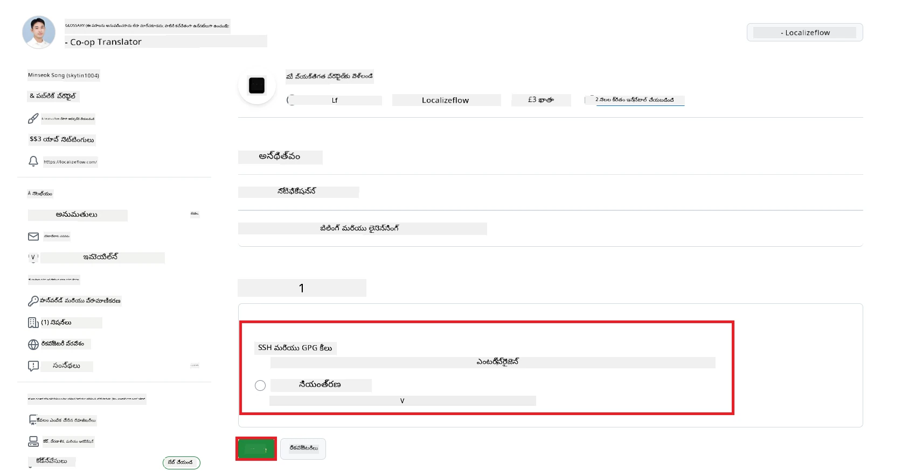
7. మీరు Localizeflow హోమ్ పేజీకి రీడైరెక్ట్ అవుతారు.

> [!TIP]
> తర్వాత మరిన్ని రిపొలను జోడించాలంటే, హెడ్డర్ లో మీ ఖాతాను ఎంచుకుని **+ Add more repositories** ఎంచుకోండి.  
> 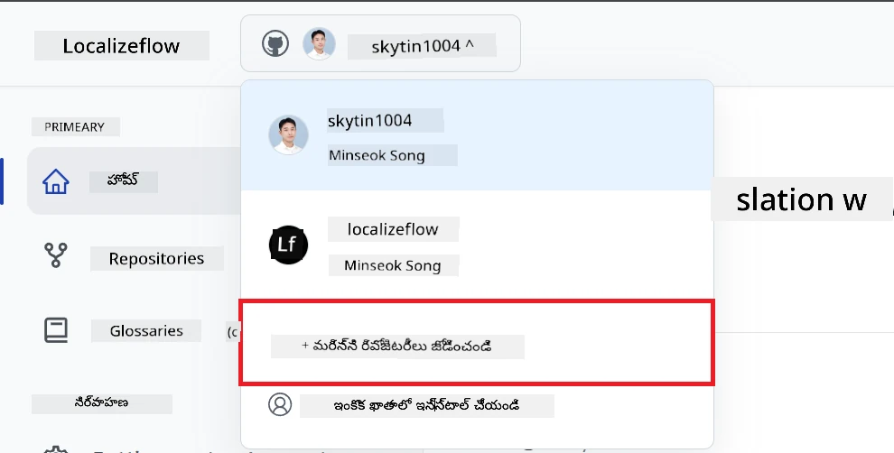

---

## మీ రిపోజిటరిలను Localizeflow తో కనెక్ట్ చేయండి

1. Localizeflow హోమ్ పేజీపై **+ Connect repositories** ఎంచుకోండి.  
   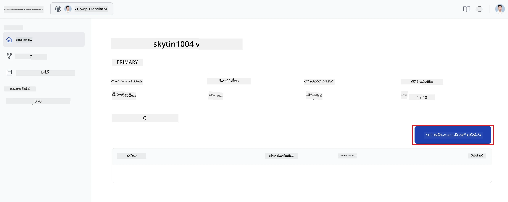

2. మీరు ఇన్స్టాల్ చేసిన రిపొలలో ఒకదాన్ని ఎంచుకుని **Save** ఎంచుకోండి.  
   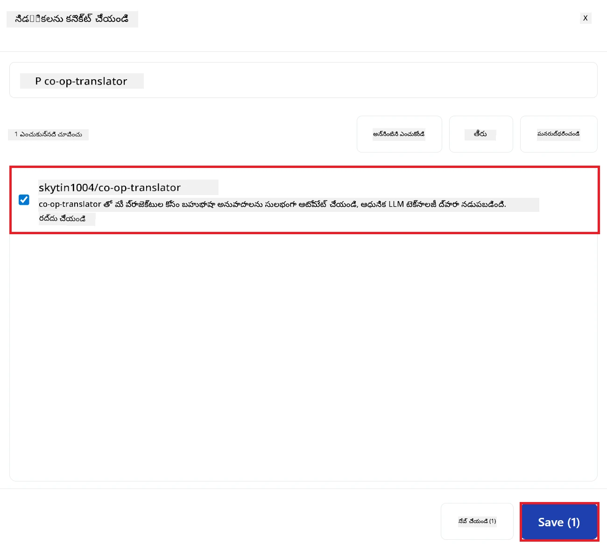

3. మీ కనెక్టైన రిపొలు ఇప్పడు హోమ్ పేజీ మరియు రిపోజిటరీస్ పేజీ రెండింటి మీద కనబడతాయి.  
   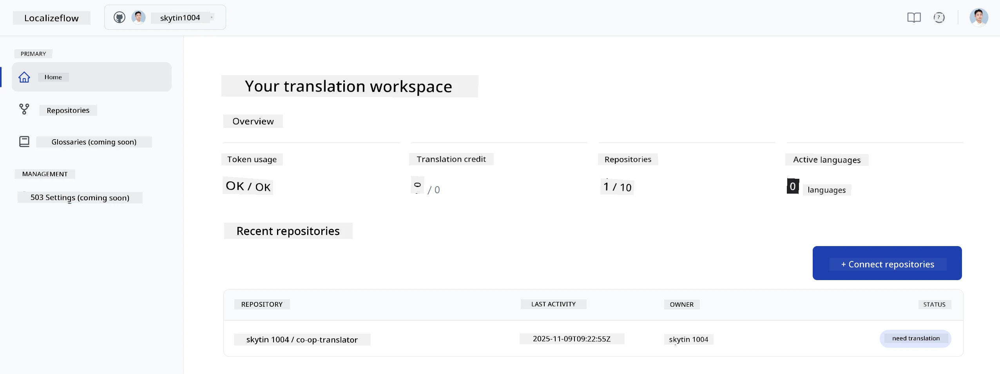

---

## స్వయంప్రేరిత అనువాదం ప్రారంభం

1. మీరు ఇప్పుడు కనెక్ట్ చేసిన రిపొను ఎంచుకోండి.  
   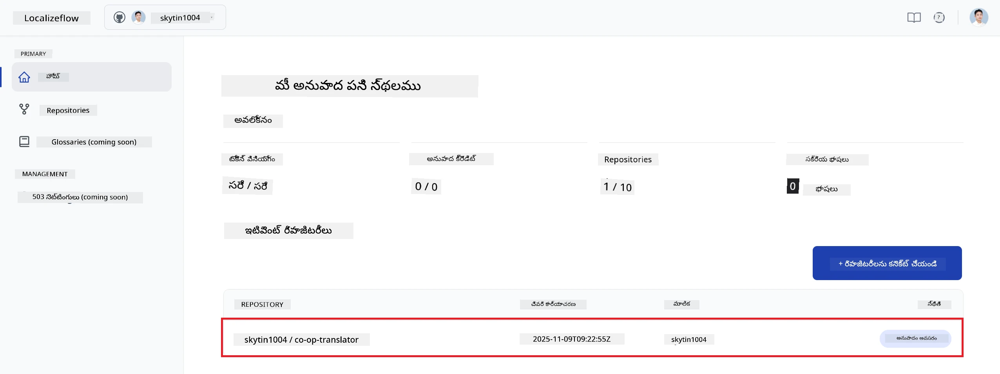

2. రిపొ వివరాల పేజీలో కింద భాగంలో **Edit** ఎంచుకోండి.  
   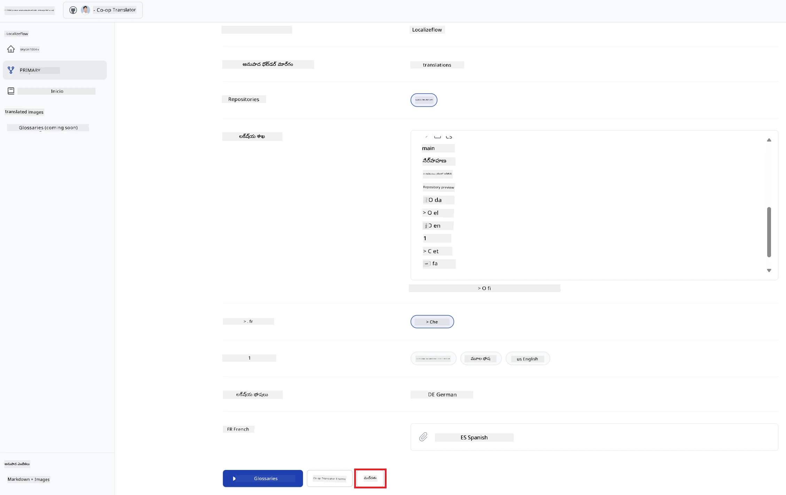

3. మీ అనువాద సెట్టింగ్లను అమర్చండి — టార్గెట్ బ్రాంచ్ (మూల్య ప్రాథమికం: `main`), లక్ష్య భాషలు, మూల భాష (మూల్య ప్రాథమికం: `en`). **Save** ఎంచుకోండి.  
   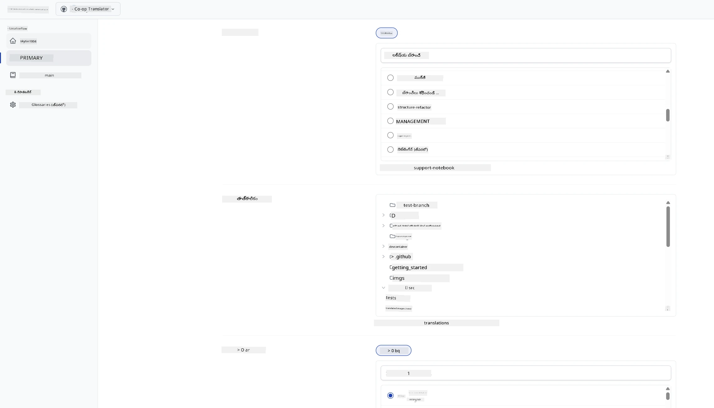

4. **Start & Automate** ఎంచుకోండి.  
   Localizeflow ఇప్పుడు మీ డాక్యుమెంటేషన్‌ను స్వయంచాలకంగా అనువదించడం మరియు మూలం మారినపుడు పుల్ రిక్వెస్ట్‌లను తెరవడం ప్రారంభిస్తుంది.  
   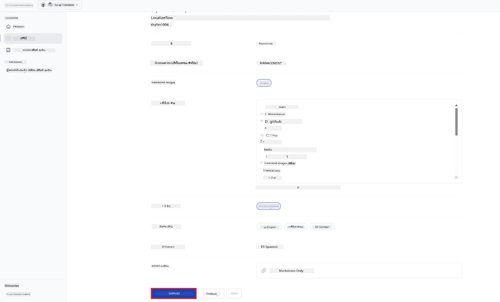

---

<!-- CO-OP TRANSLATOR DISCLAIMER START -->
**డిస్క్లెయిమర్**:  
ఈ కాగితం AI అనువాద సేవ [Co-op Translator](https://github.com/Azure/co-op-translator) వాడి అనువదించబడింది. మేము ఖచ్చితత్వం కోసం ప్రయత్నించినప్పటికీ, ఆటోమేటెడ్ అనువాదాలలో తప్పులు లేదా అస్పష్టతలు ఉండవచ్చు అని దయచేసి గమనించండి. స్థానిక భాషలో ఉన్న అసలైన డాక్యుమెంట్ నిఖార్సైన మూలంగా పరిగణించబడాలి. కీలకమైన సమాచారం కోసం, ప్రొఫెషనల్ మానవ అనువాదం సూచించబడుతుంది. ఈ అనువాదం వాడకంపై ఉత్పన్నమయ్యే ఏదైనా అపార్థాలు లేదా తప్పుదారులు గురించి మేము బాధ్యత వహించము.
<!-- CO-OP TRANSLATOR DISCLAIMER END -->