# Localizeflow – คู่มือเริ่มต้นอย่างรวดเร็ว

#### สนับสนุนโดย [Localizeflow](https://localizeflow.com/)

<!-- CO-OP TRANSLATOR LANGUAGES TABLE START -->
[Arabic](../ar/README.md) | [Bengali](../bn/README.md) | [Bulgarian](../bg/README.md) | [Burmese (Myanmar)](../my/README.md) | [Chinese (Simplified)](../zh-CN/README.md) | [Chinese (Traditional, Hong Kong)](../zh-HK/README.md) | [Chinese (Traditional, Macau)](../zh-MO/README.md) | [Chinese (Traditional, Taiwan)](../zh-TW/README.md) | [Croatian](../hr/README.md) | [Czech](../cs/README.md) | [Danish](../da/README.md) | [Dutch](../nl/README.md) | [Estonian](../et/README.md) | [Finnish](../fi/README.md) | [French](../fr/README.md) | [German](../de/README.md) | [Greek](../el/README.md) | [Hebrew](../he/README.md) | [Hindi](../hi/README.md) | [Hungarian](../hu/README.md) | [Indonesian](../id/README.md) | [Italian](../it/README.md) | [Japanese](../ja/README.md) | [Kannada](../kn/README.md) | [Korean](../ko/README.md) | [Lithuanian](../lt/README.md) | [Malay](../ms/README.md) | [Malayalam](../ml/README.md) | [Marathi](../mr/README.md) | [Nepali](../ne/README.md) | [Nigerian Pidgin](../pcm/README.md) | [Norwegian](../no/README.md) | [Persian (Farsi)](../fa/README.md) | [Polish](../pl/README.md) | [Portuguese (Brazil)](../pt-BR/README.md) | [Portuguese (Portugal)](../pt-PT/README.md) | [Punjabi (Gurmukhi)](../pa/README.md) | [Romanian](../ro/README.md) | [Russian](../ru/README.md) | [Serbian (Cyrillic)](../sr/README.md) | [Slovak](../sk/README.md) | [Slovenian](../sl/README.md) | [Spanish](../es/README.md) | [Swahili](../sw/README.md) | [Swedish](../sv/README.md) | [Tagalog (Filipino)](../tl/README.md) | [Tamil](../ta/README.md) | [Telugu](../te/README.md) | [Thai](./README.md) | [Turkish](../tr/README.md) | [Ukrainian](../uk/README.md) | [Urdu](../ur/README.md) | [Vietnamese](../vi/README.md)

> **ต้องการโคลนแบบโลคัล?**

> ที่เก็บนี้รวมการแปลมากกว่า 50 ภาษา ซึ่งจะเพิ่มขนาดการดาวน์โหลดอย่างมาก เพื่อโคลนโดยไม่รวมการแปล ให้ใช้ sparse checkout:  
> ```bash
> git clone --filter=blob:none --sparse https://github.com/localizeflow/localizeflow-docs.git
> cd localizeflow-docs
> git sparse-checkout set --no-cone '/*' '!translations' '!translated_images'
> ```
> วิธีนี้จะให้ทุกอย่างที่คุณต้องการเพื่อทำคอร์สได้สำเร็จด้วยความเร็วดาวน์โหลดที่เร็วขึ้นมาก  
<!-- CO-OP TRANSLATOR LANGUAGES TABLE END -->

Localizeflow จะแปลเอกสารของคุณโดยอัตโนมัติและเปิด pull requests ทุกครั้งที่ไฟล์ต้นฉบับมีการเปลี่ยนแปลง  
คู่มือนี้จะแสดงวิธีติดตั้ง GitHub App และรันการแปลแรกของคุณภายในเวลาไม่ถึง 2 นาที


> [!NOTE]
>
> ปัจจุบัน Localizeflow รองรับเฉพาะโครงการเอกสารที่ใช้ GitHub 
> (ตัวอย่างเช่น: AI for Beginners และรีโปมาตรฐานโอเพ่นซอร์สส่วนใหญ่)  
> 
> การสนับสนุนสำหรับกรอบงานเอกสารสมัยใหม่ เช่น Astro, Docusaurus และ Hugo  
> กำลังอยู่ในระหว่างการพัฒนาอย่างต่อเนื่อง


---

## เข้าสู่ระบบและติดตั้ง GitHub App

1. เข้าไปที่ **[localizeflow.com](https://localizeflow.com/)**  
2. เลือก **เริ่มต้นทดลองใช้ฟรี**  
   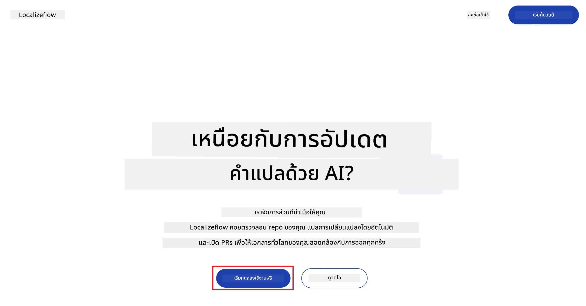
3. เลือก **ลงชื่อเข้าใช้ด้วย GitHub**  
   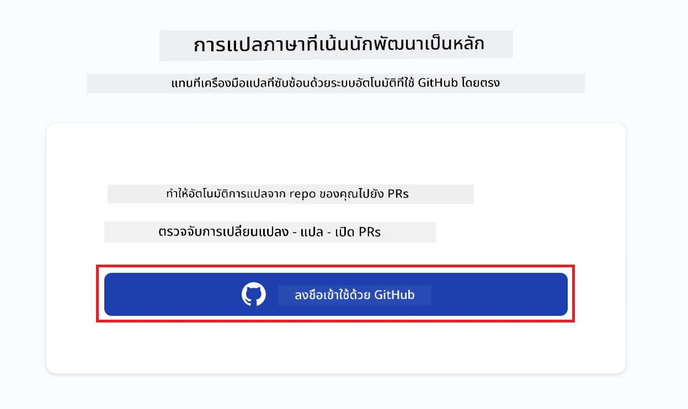
4. ลงชื่อเข้าใช้ด้วยบัญชี GitHub ของคุณ  
   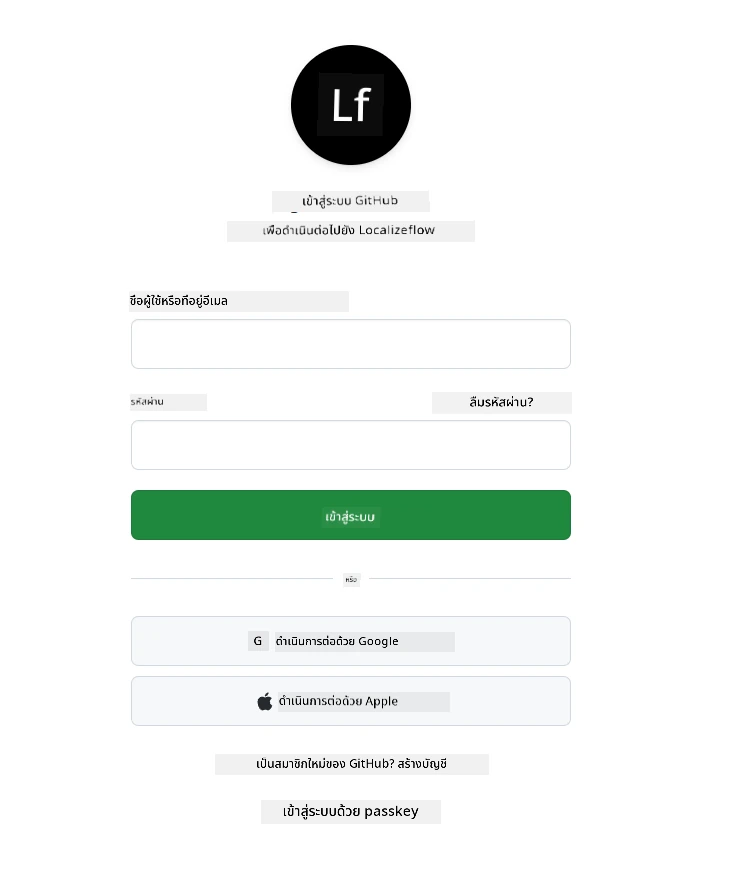
5. เลือกบัญชีที่คุณต้องการติดตั้ง Localizeflow GitHub App — บัญชีส่วนตัวของคุณหรือองค์กรที่คุณจัดการ  
   
6. เลือกรีโปที่คุณต้องการให้ Localizeflow เข้าถึง แล้วเลือก **บันทึก**  
   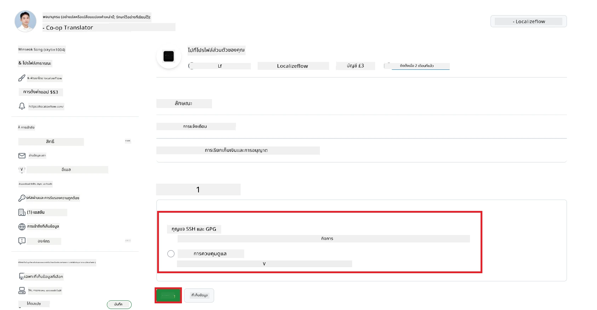
7. คุณจะถูกนำไปยังหน้าแรกของ Localizeflow

> [!TIP]
> หากต้องการเพิ่มรีโปเพิ่มเติมในภายหลัง ให้เลือกบัญชีของคุณที่หัวข้อแล้วเลือก **+ เพิ่มรีโปเพิ่มเติม**  
> 

---

## เชื่อมต่อรีโปของคุณกับ Localizeflow

1. ที่หน้าแรกของ Localizeflow เลือก **+ เชื่อมต่อรีโป**  
   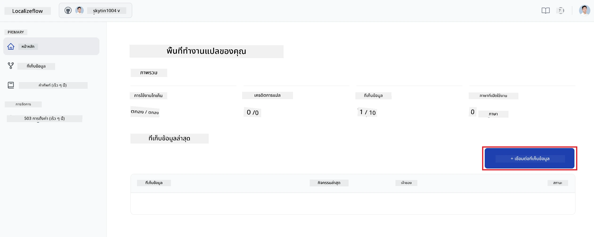

2. เลือกรีโปที่ติดตั้งและต้องการเชื่อมต่อ แล้วเลือก **บันทึก**  
   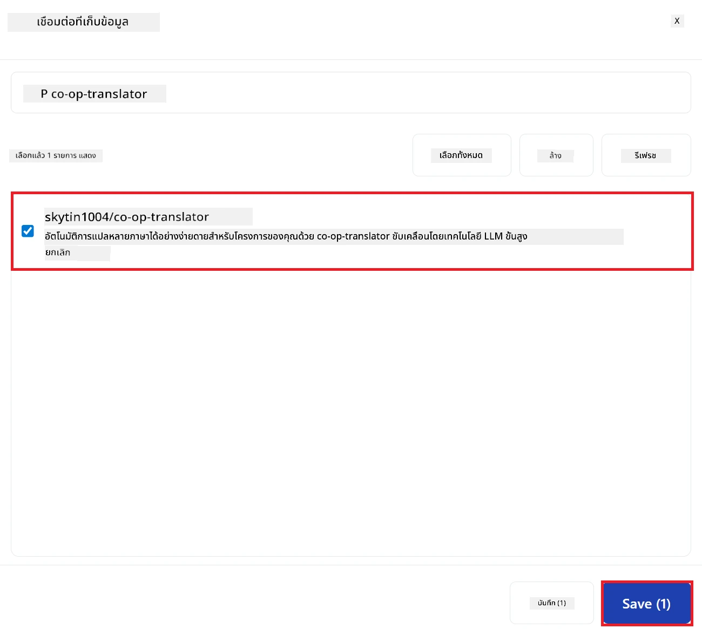

3. รีโปที่เชื่อมต่อจะปรากฏทั้งที่หน้าแรกและหน้ารายการรีโป  
   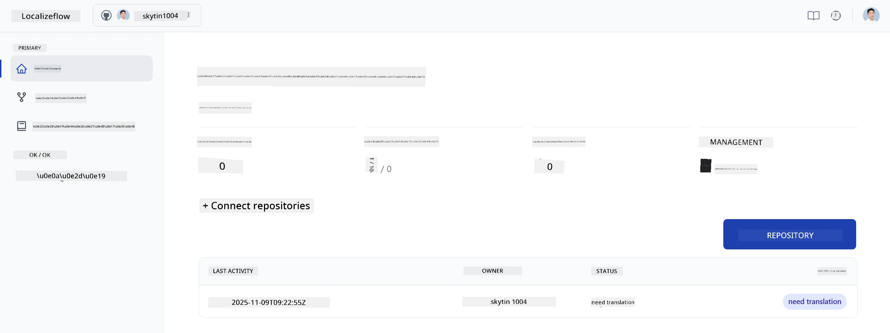

---

## เริ่มการแปลอัตโนมัติ

1. เลือกรีโปที่คุณเพิ่งเชื่อมต่อ  
   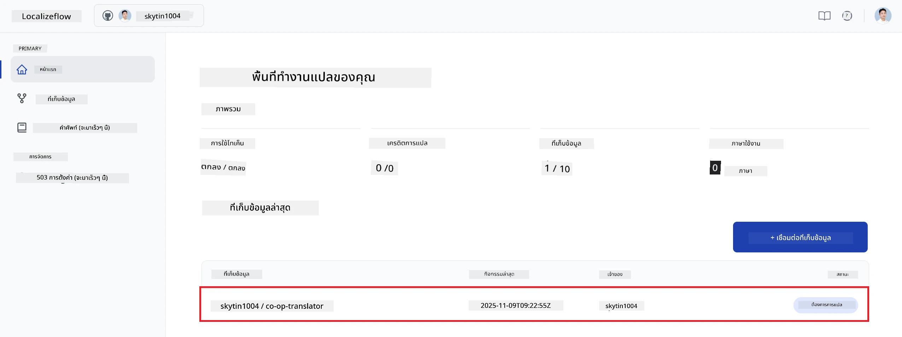

2. ที่หน้ารายละเอียดรีโป เลือก **แก้ไข** ที่ด้านล่าง  
   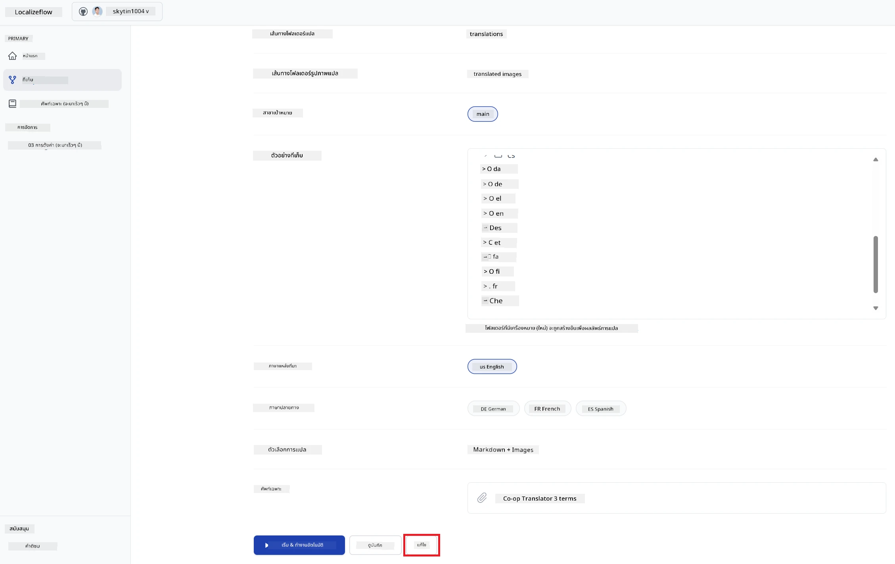

3. กำหนดค่าการแปลของคุณ — สาขาเป้าหมาย (ค่าเริ่มต้น: `main`), ภาษาเป้าหมาย และภาษาต้นทาง (ค่าเริ่มต้น: `en`) เลือก **บันทึก**  
   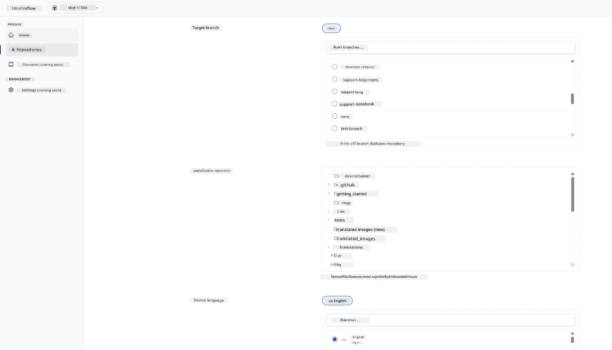

4. เลือก **เริ่ม & อัตโนมัติ**  
   Localizeflow จะเริ่มแปลเอกสารของคุณโดยอัตโนมัติและเปิด pull requests ทุกครั้งที่มีการเปลี่ยนแปลงต้นทาง  
   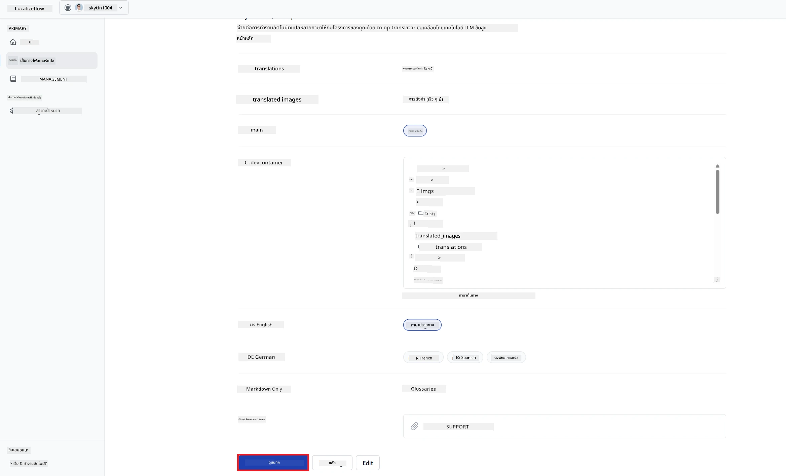

---

<!-- CO-OP TRANSLATOR DISCLAIMER START -->
**ข้อจำกัดความรับผิดชอบ**:  
เอกสารนี้ได้รับการแปลโดยใช้บริการแปลด้วย AI [Co-op Translator](https://github.com/Azure/co-op-translator) แม้ว่าเราจะพยายามให้ความถูกต้องสูงสุด แต่โปรดทราบว่าการแปลอัตโนมัติอาจมีข้อผิดพลาดหรือความไม่แม่นยำ เอกสารต้นฉบับในภาษาต้นทางถือเป็นแหล่งข้อมูลที่เชื่อถือได้ สำหรับข้อมูลที่มีความสำคัญ ขอแนะนำให้ใช้บริการแปลโดยมนุษย์ผู้เชี่ยวชาญ เราไม่มีความรับผิดชอบต่อความเข้าใจผิดหรือการตีความที่ผิดพลาดใด ๆ ที่เกิดขึ้นจากการใช้การแปลนี้
<!-- CO-OP TRANSLATOR DISCLAIMER END -->