# Localizeflow – Gabay sa Mabilis na Pagsisimula

#### Sinusuportahan ng [Localizeflow](https://localizeflow.com/)

<!-- CO-OP TRANSLATOR LANGUAGES TABLE START -->
[Arabic](../ar/README.md) | [Bengali](../bn/README.md) | [Bulgarian](../bg/README.md) | [Burmese (Myanmar)](../my/README.md) | [Chinese (Simplified)](../zh-CN/README.md) | [Chinese (Traditional, Hong Kong)](../zh-HK/README.md) | [Chinese (Traditional, Macau)](../zh-MO/README.md) | [Chinese (Traditional, Taiwan)](../zh-TW/README.md) | [Croatian](../hr/README.md) | [Czech](../cs/README.md) | [Danish](../da/README.md) | [Dutch](../nl/README.md) | [Estonian](../et/README.md) | [Finnish](../fi/README.md) | [French](../fr/README.md) | [German](../de/README.md) | [Greek](../el/README.md) | [Hebrew](../he/README.md) | [Hindi](../hi/README.md) | [Hungarian](../hu/README.md) | [Indonesian](../id/README.md) | [Italian](../it/README.md) | [Japanese](../ja/README.md) | [Kannada](../kn/README.md) | [Korean](../ko/README.md) | [Lithuanian](../lt/README.md) | [Malay](../ms/README.md) | [Malayalam](../ml/README.md) | [Marathi](../mr/README.md) | [Nepali](../ne/README.md) | [Nigerian Pidgin](../pcm/README.md) | [Norwegian](../no/README.md) | [Persian (Farsi)](../fa/README.md) | [Polish](../pl/README.md) | [Portuguese (Brazil)](../pt-BR/README.md) | [Portuguese (Portugal)](../pt-PT/README.md) | [Punjabi (Gurmukhi)](../pa/README.md) | [Romanian](../ro/README.md) | [Russian](../ru/README.md) | [Serbian (Cyrillic)](../sr/README.md) | [Slovak](../sk/README.md) | [Slovenian](../sl/README.md) | [Spanish](../es/README.md) | [Swahili](../sw/README.md) | [Swedish](../sv/README.md) | [Tagalog (Filipino)](./README.md) | [Tamil](../ta/README.md) | [Telugu](../te/README.md) | [Thai](../th/README.md) | [Turkish](../tr/README.md) | [Ukrainian](../uk/README.md) | [Urdu](../ur/README.md) | [Vietnamese](../vi/README.md)

> **Mas gusto mo bang i-clone nang Lokal?**

> Kasama sa repositoryong ito ang mahigit 50 na pagsasalin ng wika na nagpapalaki nang malaki sa laki ng pag-download. Upang mag-clone nang walang mga pagsasalin, gamitin ang sparse checkout:
> ```bash
> git clone --filter=blob:none --sparse https://github.com/localizeflow/localizeflow-docs.git
> cd localizeflow-docs
> git sparse-checkout set --no-cone '/*' '!translations' '!translated_images'
> ```
> Ito ay nagbibigay sa iyo ng lahat ng kailangan upang tapusin ang kurso nang mas mabilis ang pag-download.
<!-- CO-OP TRANSLATOR LANGUAGES TABLE END -->

Awtomatikong isinasalin ng Localizeflow ang iyong dokumentasyon at bumubuksan ng mga pull request tuwing nagbabago ang source file.  
Ipinapakita ng gabay na ito kung paano i-install ang GitHub App at patakbuhin ang iyong unang pagsasalin sa loob ng 2 minuto.


> [!NOTE]
>
> Sa kasalukuyan, sinusuportahan ng Localizeflow ang mga proyektong dokumentasyon na naka-GitHub  
> (halimbawa: AI for Beginners at karamihan sa mga karaniwang open-source na repos).  
> 
> Aktibo ang pagpapaunlad ng suporta para sa mga modernong dokumentasyon na framework tulad ng Astro, Docusaurus, at Hugo.


---

## Mag-sign in at i-install ang GitHub App

1. Bisitahin ang **[localizeflow.com](https://localizeflow.com/)**.
2. Piliin ang **Start with free trial**.
   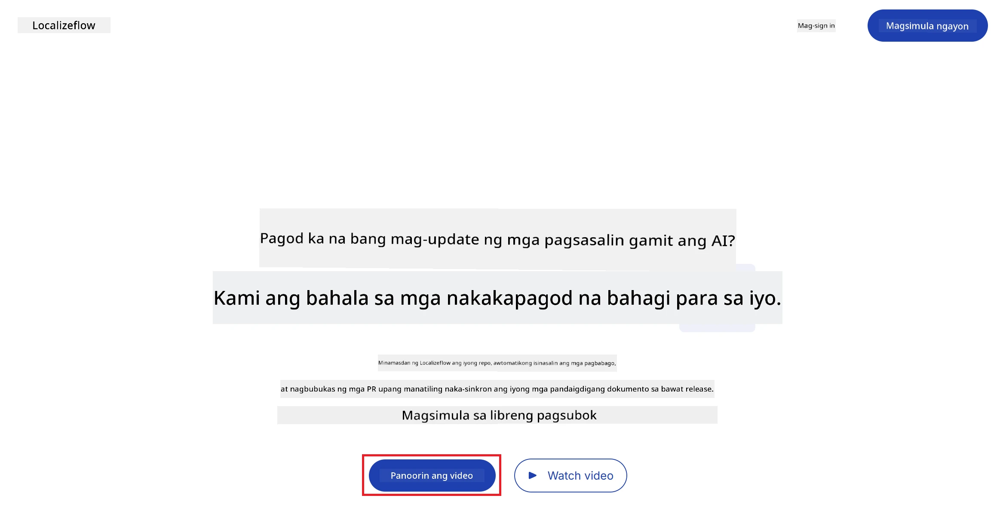
3. Piliin ang **Sign in with GitHub**.  
   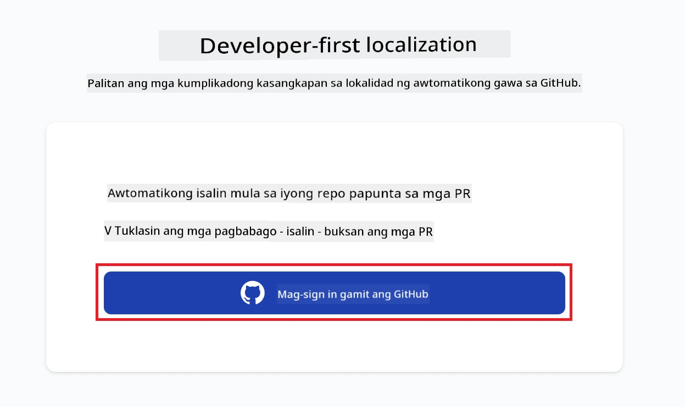
4. Mag-sign in gamit ang iyong GitHub account.  
   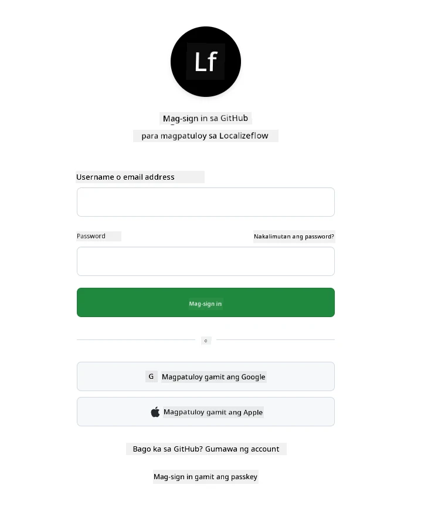
5. Piliin ang account kung saan mo gustong i-install ang Localizeflow GitHub App — ang personal mong account o isang organisasyong pinamamahalaan mo.  
   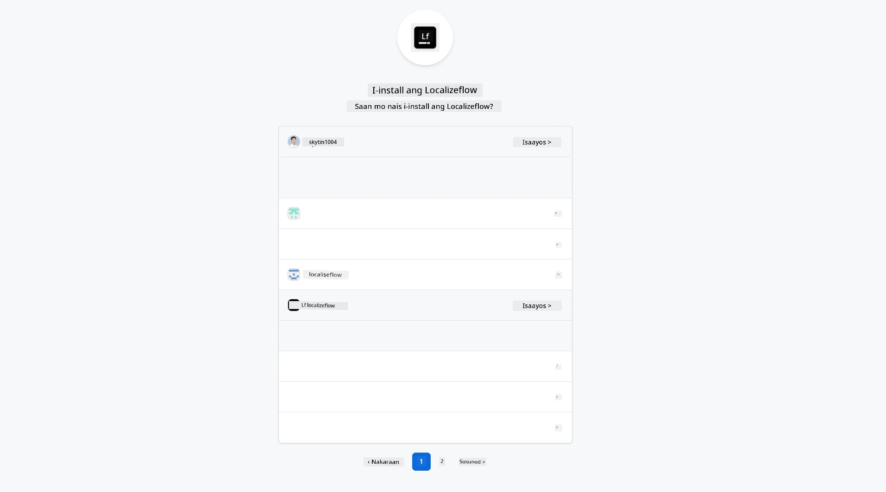
6. Piliin ang mga repositories na gusto mong ma-access ng Localizeflow, pagkatapos ay piliin ang **Save**.  
   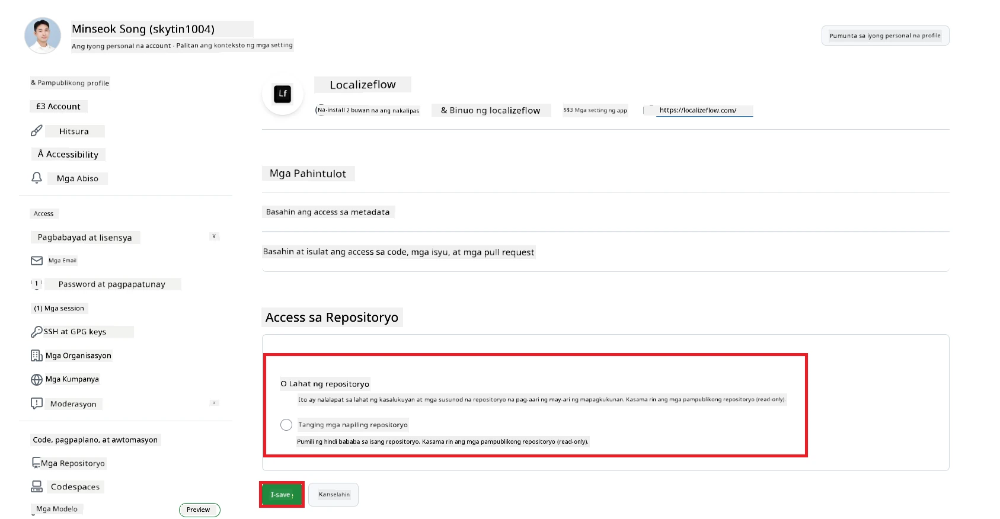
7. Ire-redirect ka sa home page ng Localizeflow.

> [!TIP]
> Para magdagdag ng higit pang repositories sa ibang pagkakataon, piliin ang iyong account sa header at piliin ang **+ Add more repositories**.  
> 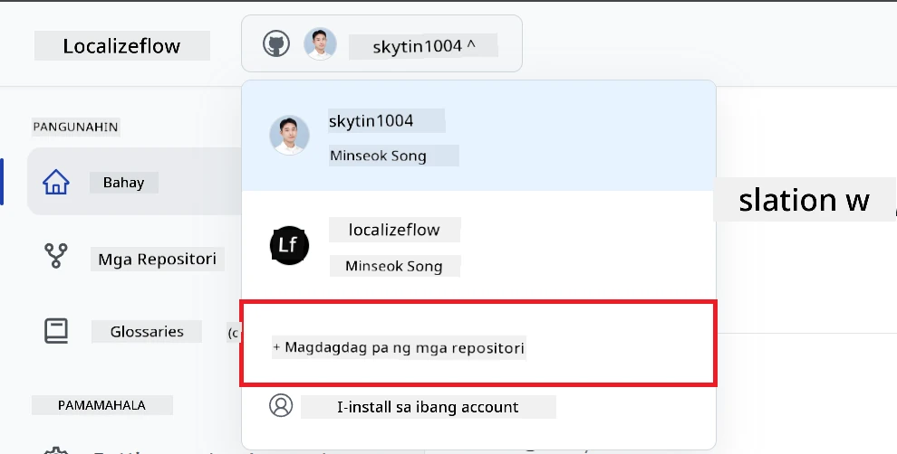

---

## Ikonekta ang iyong mga repositories sa Localizeflow

1. Sa home page ng Localizeflow, piliin ang **+ Connect repositories**.  
   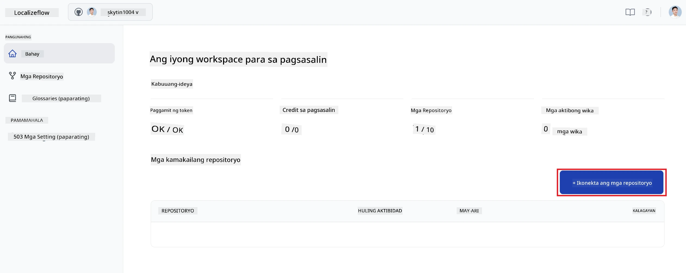

2. Piliin ang isa sa mga na-install na repositories na gusto mong ikonekta at piliin ang **Save**.  
   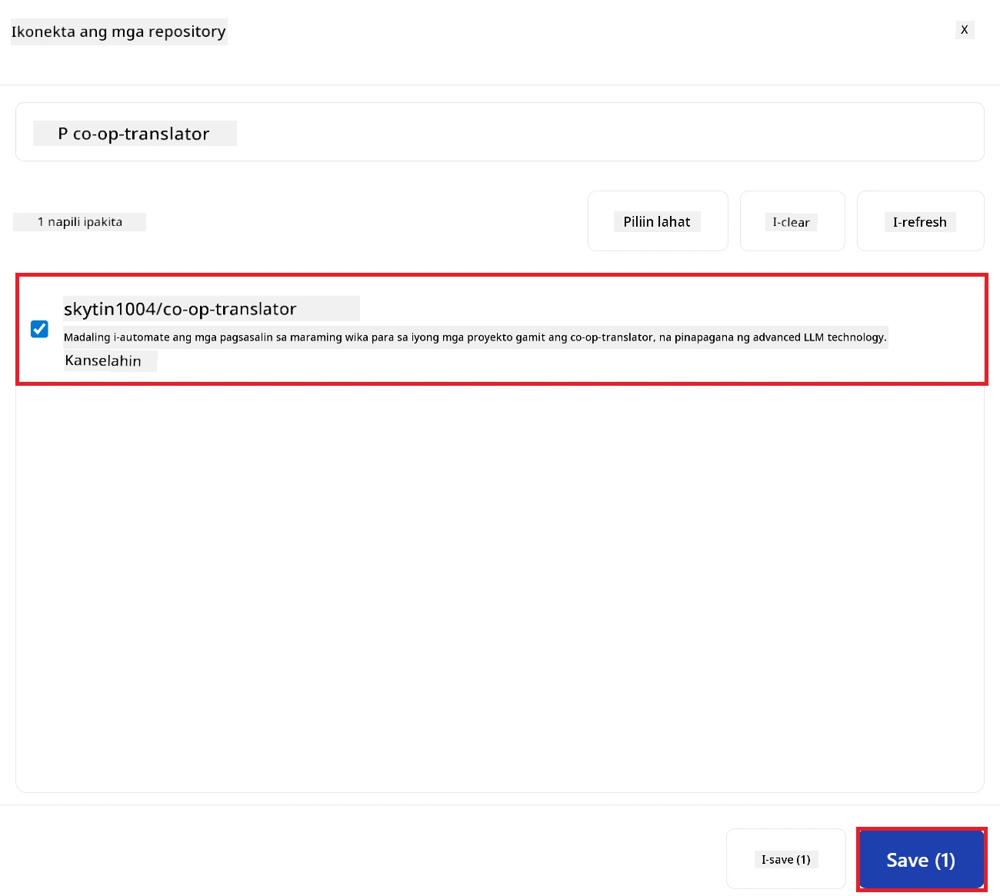

3. Ang iyong mga nakakonektang repositories ay lalabas na ngayon sa Home page at Repositories page.  
   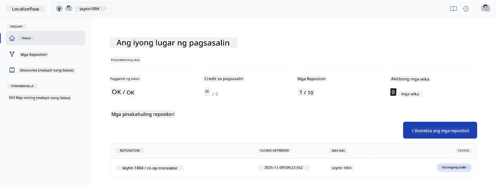

---

## Simulan ang awtomatikong pagsasalin

1. Piliin ang repository na kakakonekta mo lang.  
   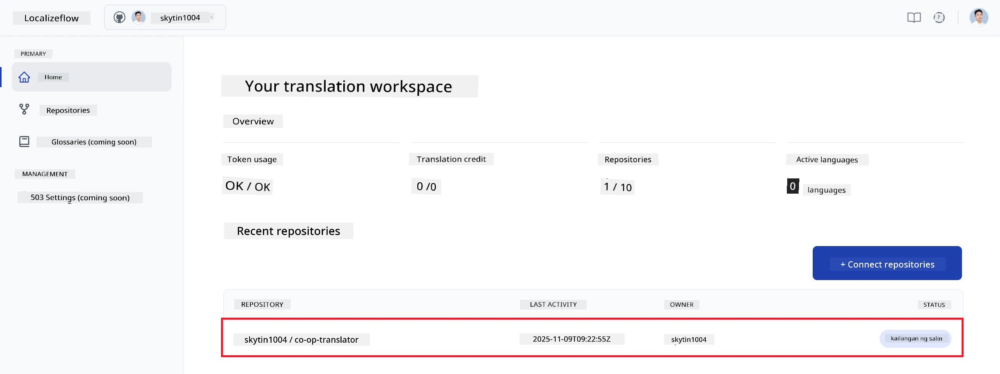

2. Sa pahina ng detalye ng repository, piliin ang **Edit** sa ibaba.  
   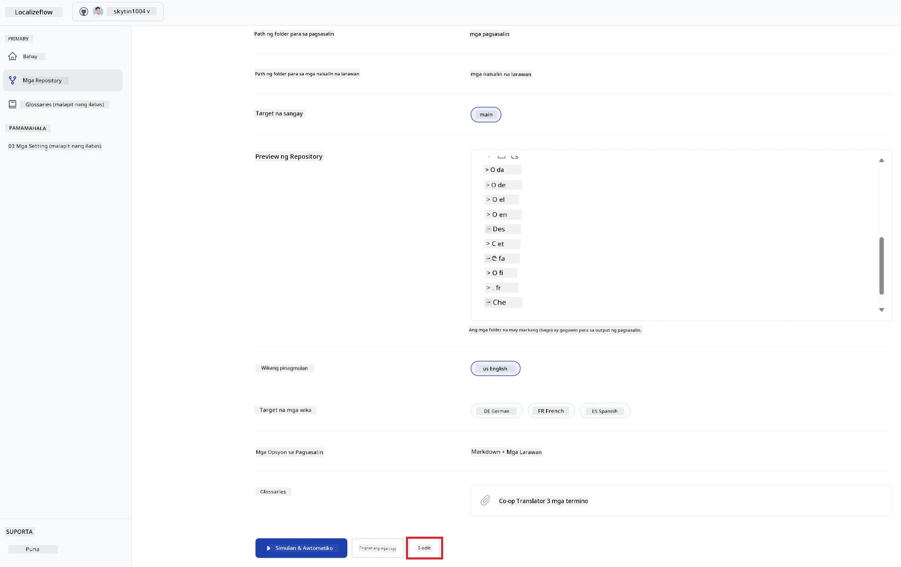

3. I-configure ang iyong mga setting sa pagsasalin — target branch (default: `main`), mga target na wika, at source na wika (default: `en`). Piliin ang **Save**.  
   

4. Piliin ang **Start & Automate**.  
   Awtomatikong isasalin na ngayon ng Localizeflow ang iyong dokumentasyon at magbubukas ng mga pull request tuwing may pagbabago sa source.  
   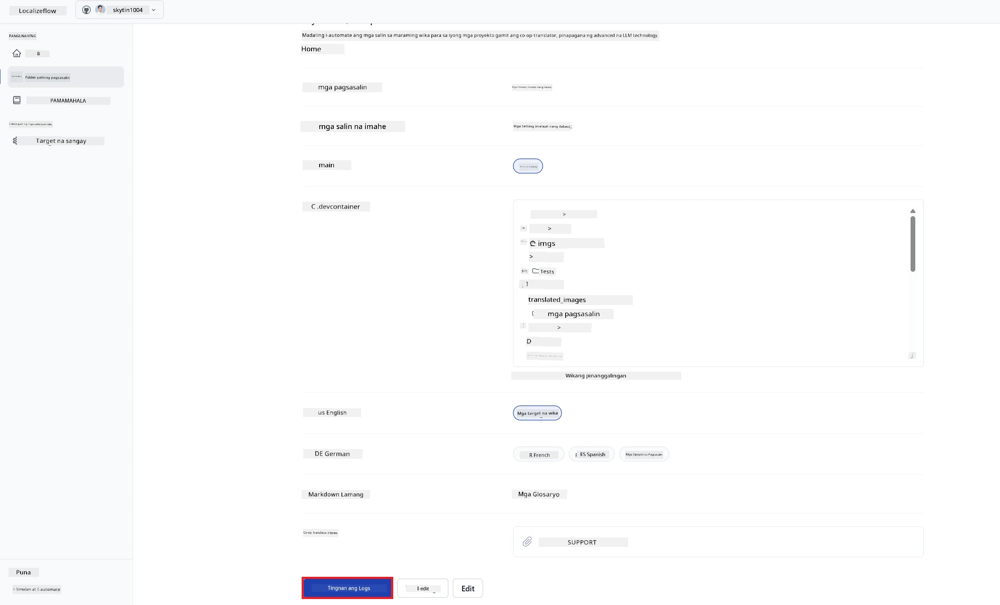

---

<!-- CO-OP TRANSLATOR DISCLAIMER START -->
**Paunawa**:  
Ang dokumentong ito ay isinalin gamit ang AI translation service na [Co-op Translator](https://github.com/Azure/co-op-translator). Bagamat aming pinagsisikapang maging tumpak, pakatandaan na maaaring mayroon pa ring mga pagkakamali o di-saktong pagsasalin ang awtomatikong pagsasalin. Ang orihinal na dokumento sa orihinal nitong wika ang dapat ituring na pangunahing sanggunian. Para sa mahahalagang impormasyon, inirerekomenda ang propesyonal na pagsasalin ng tao. Hindi kami mananagot sa anumang hindi pagkakaunawaan o maling interpretasyon na maaaring magmula sa paggamit ng pagsasaling ito.
<!-- CO-OP TRANSLATOR DISCLAIMER END -->