# Localizeflow – Hızlı Başlangıç Kılavuzu

#### Destekleyen [Localizeflow](https://localizeflow.com/)

<!-- CO-OP TRANSLATOR LANGUAGES TABLE START -->
[Arabic](../ar/README.md) | [Bengali](../bn/README.md) | [Bulgarian](../bg/README.md) | [Burmese (Myanmar)](../my/README.md) | [Chinese (Simplified)](../zh-CN/README.md) | [Chinese (Traditional, Hong Kong)](../zh-HK/README.md) | [Chinese (Traditional, Macau)](../zh-MO/README.md) | [Chinese (Traditional, Taiwan)](../zh-TW/README.md) | [Croatian](../hr/README.md) | [Czech](../cs/README.md) | [Danish](../da/README.md) | [Dutch](../nl/README.md) | [Estonian](../et/README.md) | [Finnish](../fi/README.md) | [French](../fr/README.md) | [German](../de/README.md) | [Greek](../el/README.md) | [Hebrew](../he/README.md) | [Hindi](../hi/README.md) | [Hungarian](../hu/README.md) | [Indonesian](../id/README.md) | [Italian](../it/README.md) | [Japanese](../ja/README.md) | [Kannada](../kn/README.md) | [Korean](../ko/README.md) | [Lithuanian](../lt/README.md) | [Malay](../ms/README.md) | [Malayalam](../ml/README.md) | [Marathi](../mr/README.md) | [Nepali](../ne/README.md) | [Nigerian Pidgin](../pcm/README.md) | [Norwegian](../no/README.md) | [Persian (Farsi)](../fa/README.md) | [Polish](../pl/README.md) | [Portuguese (Brazil)](../pt-BR/README.md) | [Portuguese (Portugal)](../pt-PT/README.md) | [Punjabi (Gurmukhi)](../pa/README.md) | [Romanian](../ro/README.md) | [Russian](../ru/README.md) | [Serbian (Cyrillic)](../sr/README.md) | [Slovak](../sk/README.md) | [Slovenian](../sl/README.md) | [Spanish](../es/README.md) | [Swahili](../sw/README.md) | [Swedish](../sv/README.md) | [Tagalog (Filipino)](../tl/README.md) | [Tamil](../ta/README.md) | [Telugu](../te/README.md) | [Thai](../th/README.md) | [Turkish](./README.md) | [Ukrainian](../uk/README.md) | [Urdu](../ur/README.md) | [Vietnamese](../vi/README.md)

> **Yerel olarak klonlamayı mı tercih ediyorsunuz?**

> Bu depo, indirme boyutunu önemli ölçüde artıran 50'den fazla dil çevirisini içerir. Çeviriler olmadan klonlamak için sparse checkout kullanın:  
> ```bash
> git clone --filter=blob:none --sparse https://github.com/localizeflow/localizeflow-docs.git
> cd localizeflow-docs
> git sparse-checkout set --no-cone '/*' '!translations' '!translated_images'
> ```
> Bu, kursu tamamlamak için ihtiyacınız olan her şeyi çok daha hızlı bir indirme ile sağlar.
<!-- CO-OP TRANSLATOR LANGUAGES TABLE END -->

Localizeflow belgelerinizi otomatik olarak çevirir ve kaynak dosya değiştiğinde pull requestler açar.  
Bu kılavuz, GitHub Uygulamasını nasıl kurup ilk çevirinizi 2 dakikadan az sürede nasıl yapacağınızı gösterir.


> [!NOTE]
>
> Localizeflow şu anda GitHub tabanlı belge projelerini desteklemektedir  
> (örneğin: AI for Beginners ve çoğu standart açık kaynak depolar).  
> 
> Astro, Docusaurus ve Hugo gibi modern belge çerçeveleri için destek  
> geliştirme aşamasındadır.


---

## Giriş yapın ve GitHub Uygulamasını kurun

1. **[localizeflow.com](https://localizeflow.com/)** adresini ziyaret edin.
2. **Ücretsiz deneme ile başla** seçeneğini seçin.  
   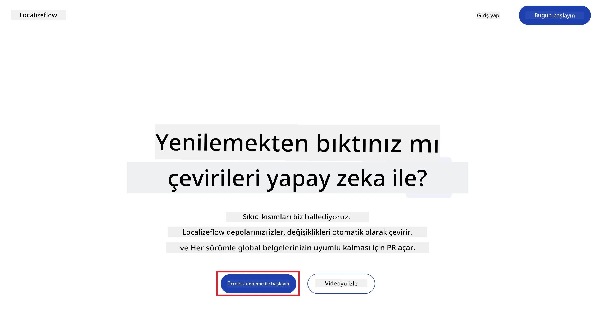
3. **GitHub ile giriş yap** seçeneğini seçin.  
   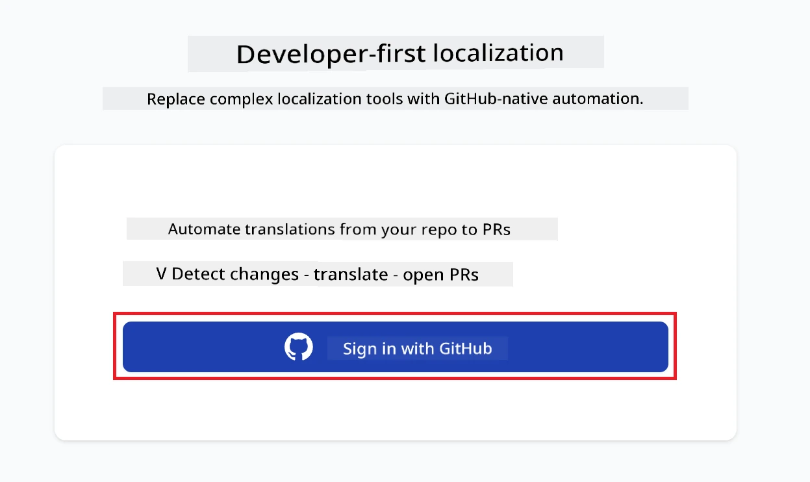
4. GitHub hesabınızla giriş yapın.  
   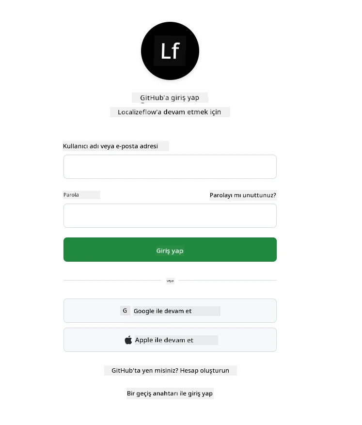
5. Localizeflow GitHub Uygulamasını kurmak istediğiniz hesabı seçin — kişisel hesabınız veya yönettiğiniz bir organizasyon.  
   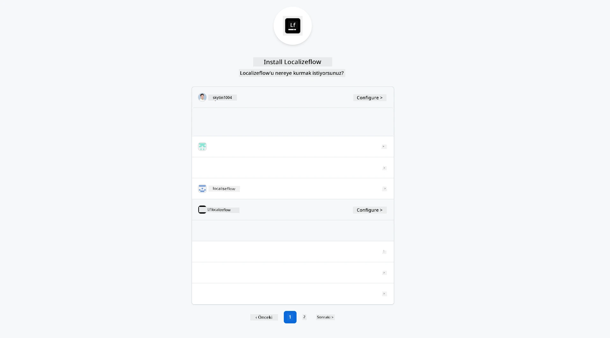
6. Localizeflow'un erişmesini istediğiniz depoları seçin, ardından **Kaydet** seçeneğini seçin.  
   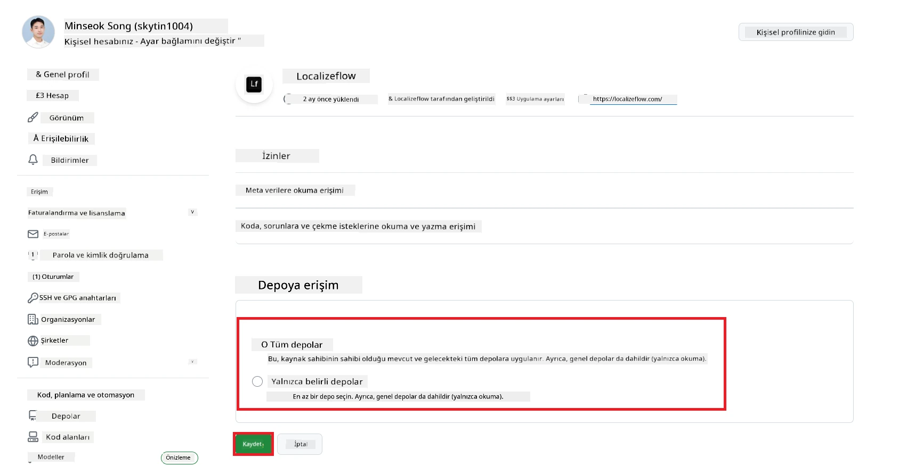
7. Localizeflow ana sayfasına yönlendirileceksiniz.

> [!TIP]
> Daha sonra daha fazla depo eklemek için, başlıkta hesabınızı seçin ve **+ Daha fazla depo ekle** seçeneğini seçin.  
> 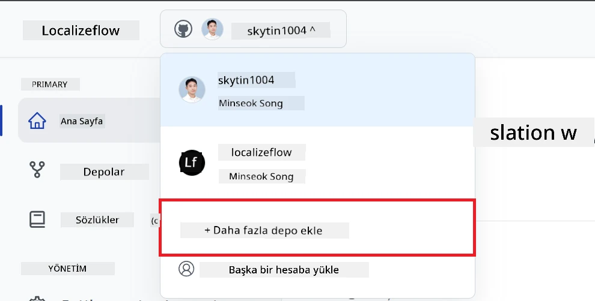

---

## Depolarınızı Localizeflow'a bağlayın

1. Localizeflow ana sayfasında, **+ Depoları bağla** seçeneğini seçin.  
   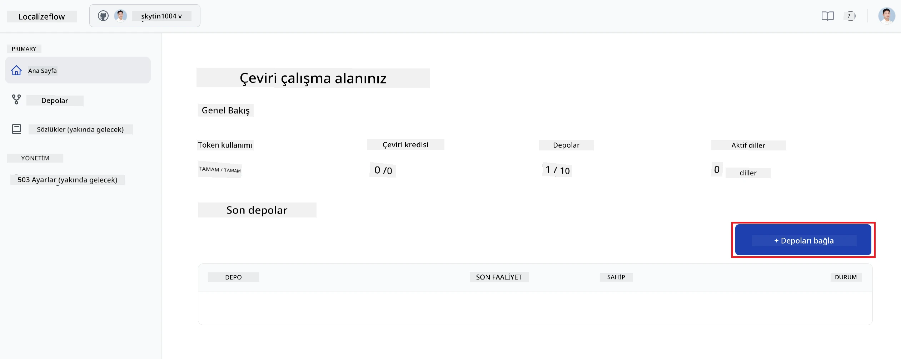

2. Bağlamak istediğiniz kurulu depolardan birini seçin ve **Kaydet** seçeneğini seçin.  
   

3. Bağlanmış depolarınız şimdi Hem Ana Sayfada hem de Depolar sayfasında görünecektir.  
   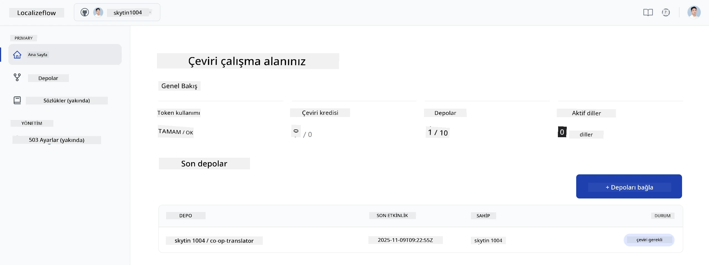

---

## Otomatik çeviriye başlayın

1. Şimdi bağladığınız depoyu seçin.  
   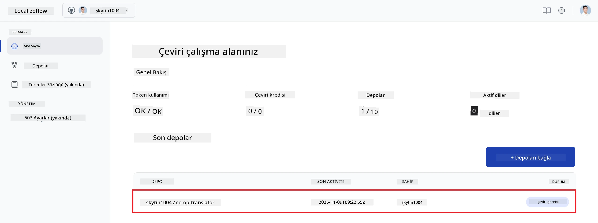

2. Depo detay sayfasında, altta bulunan **Düzenle** seçeneğini seçin.  
   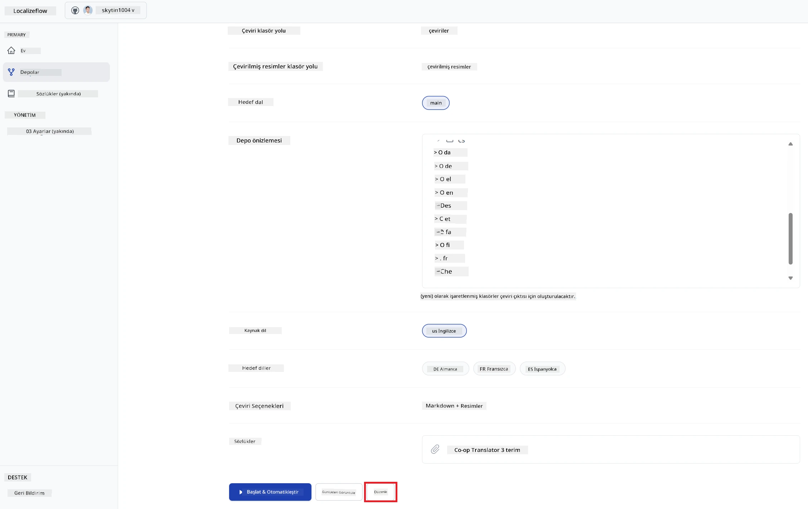

3. Çeviri ayarlarınızı yapılandırın — hedef dal (varsayılan: `main`), hedef diller ve kaynak dil (varsayılan: `en`). **Kaydet** seçeneğini seçin.  
   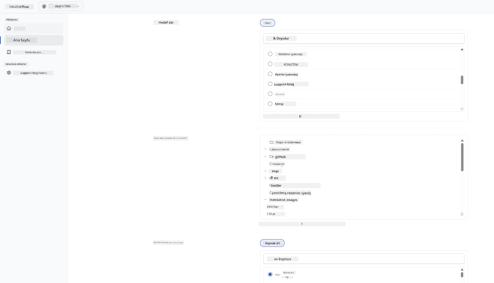

4. **Başlat & Otomatikleştir** seçeneğini seçin.  
   Localizeflow artık belgelerinizi otomatik olarak çevirecek ve kaynak dosya değiştiğinde pull requestler açacaktır.  
   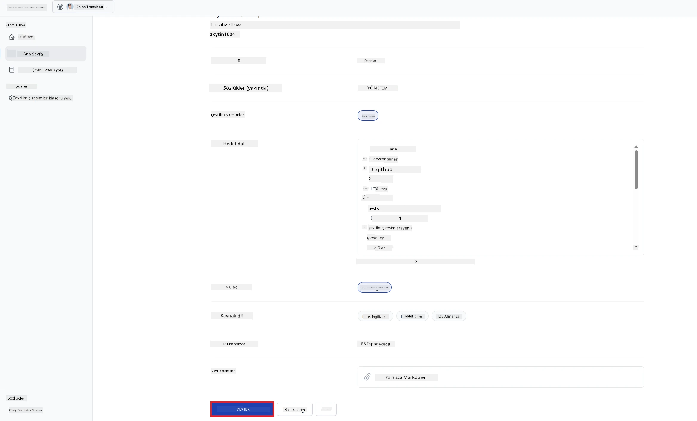

---

<!-- CO-OP TRANSLATOR DISCLAIMER START -->
**Feragatname**:  
Bu belge, AI çeviri hizmeti [Co-op Translator](https://github.com/Azure/co-op-translator) kullanılarak çevrilmiştir. Doğruluk için çaba göstermemize rağmen, otomatik çevirilerin hata veya yanlışlık içerebileceğini lütfen unutmayınız. Orijinal belge, kendi dilinde yetkili kaynak olarak kabul edilmelidir. Önemli bilgiler için profesyonel insan çevirisi önerilir. Bu çevirinin kullanımı sonucunda ortaya çıkabilecek herhangi bir yanlış anlama veya yanlış yorumdan sorumlu değiliz.
<!-- CO-OP TRANSLATOR DISCLAIMER END -->