# Localizeflow – 快速入门指南

#### 由 [Localizeflow](https://localizeflow.com/) 支持

<!-- CO-OP TRANSLATOR LANGUAGES TABLE START -->
[Arabic](../ar/README.md) | [Bengali](../bn/README.md) | [Bulgarian](../bg/README.md) | [Burmese (Myanmar)](../my/README.md) | [Chinese (Simplified)](./README.md) | [Chinese (Traditional, Hong Kong)](../zh-HK/README.md) | [Chinese (Traditional, Macau)](../zh-MO/README.md) | [Chinese (Traditional, Taiwan)](../zh-TW/README.md) | [Croatian](../hr/README.md) | [Czech](../cs/README.md) | [Danish](../da/README.md) | [Dutch](../nl/README.md) | [Estonian](../et/README.md) | [Finnish](../fi/README.md) | [French](../fr/README.md) | [German](../de/README.md) | [Greek](../el/README.md) | [Hebrew](../he/README.md) | [Hindi](../hi/README.md) | [Hungarian](../hu/README.md) | [Indonesian](../id/README.md) | [Italian](../it/README.md) | [Japanese](../ja/README.md) | [Kannada](../kn/README.md) | [Korean](../ko/README.md) | [Lithuanian](../lt/README.md) | [Malay](../ms/README.md) | [Malayalam](../ml/README.md) | [Marathi](../mr/README.md) | [Nepali](../ne/README.md) | [Nigerian Pidgin](../pcm/README.md) | [Norwegian](../no/README.md) | [Persian (Farsi)](../fa/README.md) | [Polish](../pl/README.md) | [Portuguese (Brazil)](../pt-BR/README.md) | [Portuguese (Portugal)](../pt-PT/README.md) | [Punjabi (Gurmukhi)](../pa/README.md) | [Romanian](../ro/README.md) | [Russian](../ru/README.md) | [Serbian (Cyrillic)](../sr/README.md) | [Slovak](../sk/README.md) | [Slovenian](../sl/README.md) | [Spanish](../es/README.md) | [Swahili](../sw/README.md) | [Swedish](../sv/README.md) | [Tagalog (Filipino)](../tl/README.md) | [Tamil](../ta/README.md) | [Telugu](../te/README.md) | [Thai](../th/README.md) | [Turkish](../tr/README.md) | [Ukrainian](../uk/README.md) | [Urdu](../ur/README.md) | [Vietnamese](../vi/README.md)

> **更喜欢本地克隆？**

> 本仓库包含50多种语言的翻译，显著增加了下载大小。要克隆不包含翻译的版本，请使用稀疏检出：
> ```bash
> git clone --filter=blob:none --sparse https://github.com/localizeflow/localizeflow-docs.git
> cd localizeflow-docs
> git sparse-checkout set --no-cone '/*' '!translations' '!translated_images'
> ```
> 这样您可以得到完成课程所需的一切，并且下载速度更快。
<!-- CO-OP TRANSLATOR LANGUAGES TABLE END -->

Localizeflow 会自动翻译您的文档，并在源文件更改时自动发起拉取请求。  
本指南将向您展示如何安装 GitHub 应用，并在两分钟内完成首次翻译。


> [!NOTE]
>
> Localizeflow 目前支持基于 GitHub 的文档项目
> （例如：AI for Beginners 和大多数标准开源仓库）。  
> 
> 对现代文档框架如 Astro、Docusaurus 和 Hugo 的支持  
> 正在积极开发中。


---

## 登录并安装 GitHub 应用

1. 访问 **[localizeflow.com](https://localizeflow.com/)**。
2. 选择 **Start with free trial（免费试用）**。
   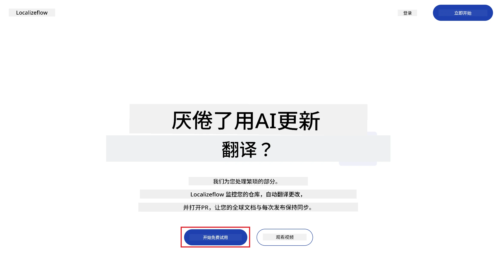
3. 选择 **Sign in with GitHub（用 GitHub 登录）**。  
   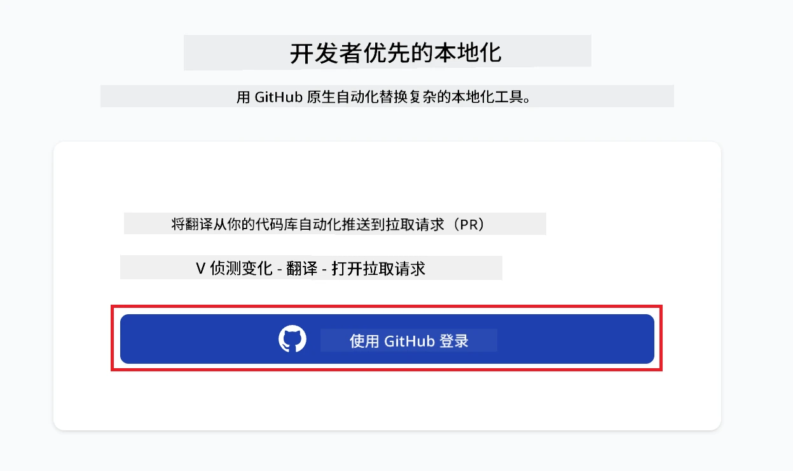
4. 使用您的 GitHub 账号登录。  
   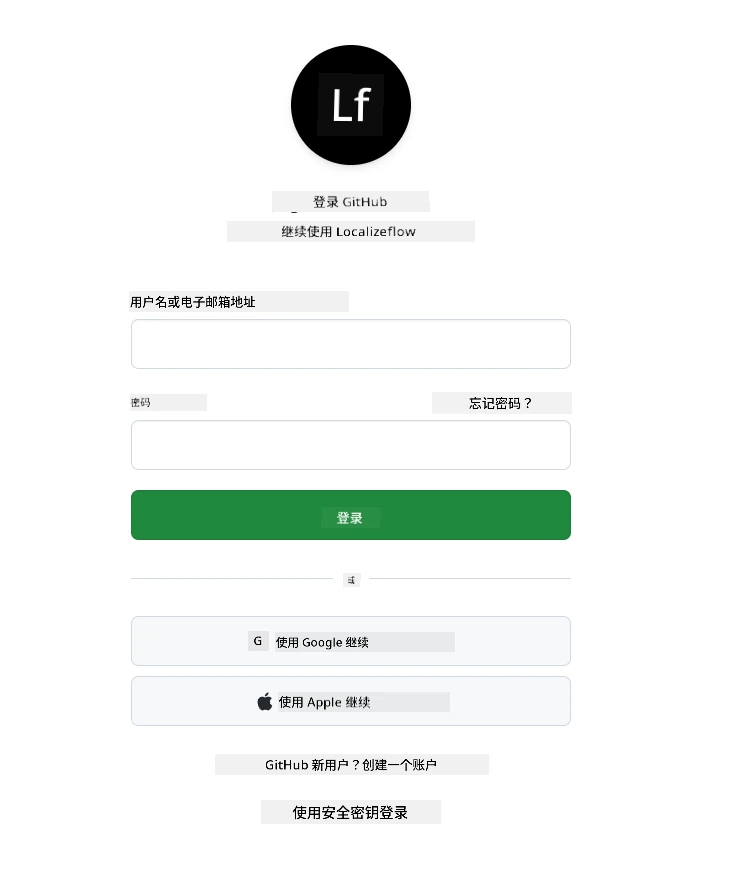
5. 选择您要安装 Localizeflow GitHub 应用的账户 —— 您的个人账户或您管理的组织。  
   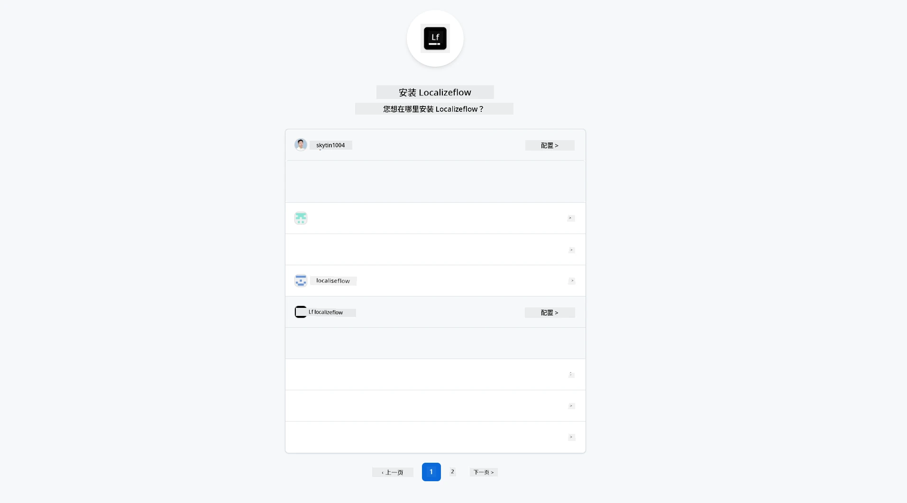
6. 选择您希望 Localizeflow 访问的仓库，然后点击 **Save（保存）**。  
   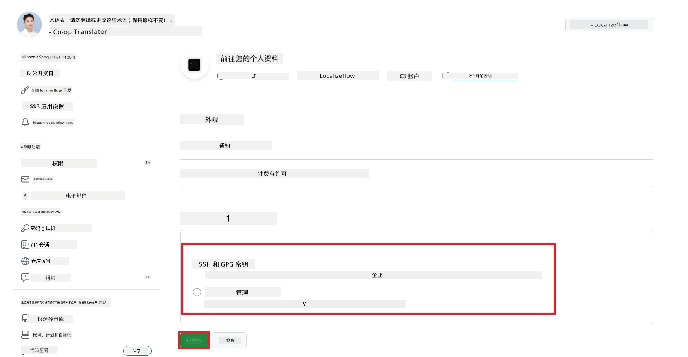
7. 您将被重定向到 Localizeflow 首页。

> [!TIP]
> 若要以后添加更多仓库，请在页眉中选择您的账户，然后选择 **+ Add more repositories（添加更多仓库）**。  
> 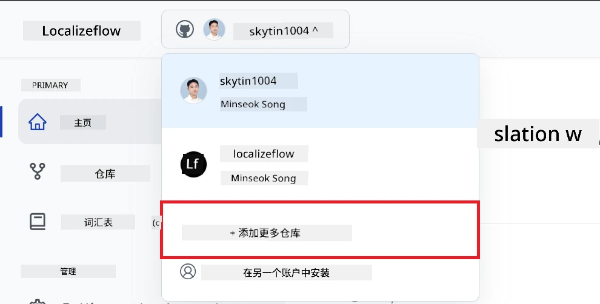

---

## 连接您的仓库到 Localizeflow

1. 在 Localizeflow 首页，选择 **+ Connect repositories（连接仓库）**。  
   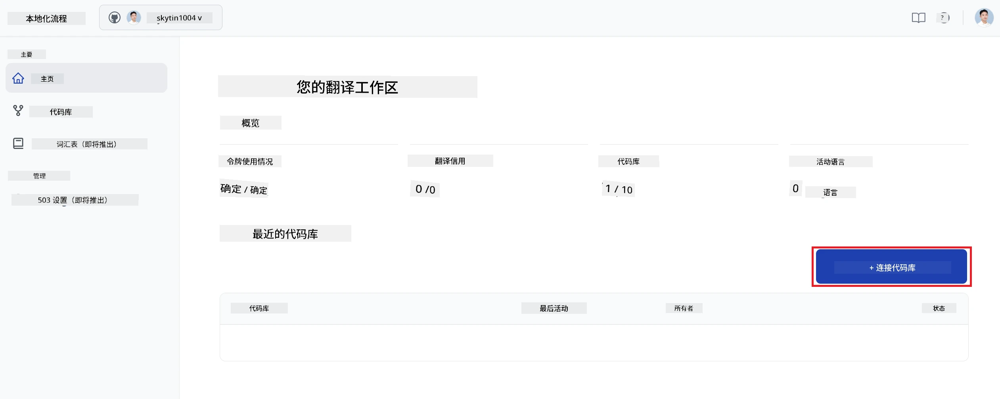

2. 选择您想连接的已安装仓库之一，然后点击 **Save（保存）**。  
   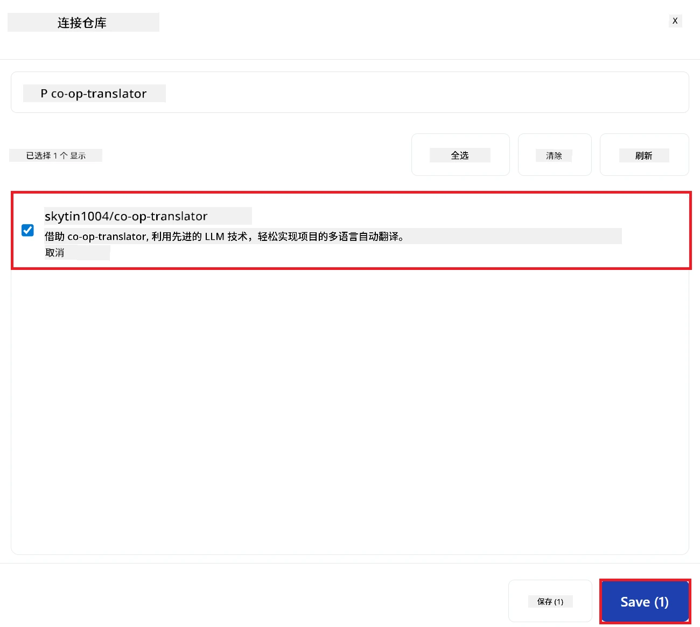

3. 您连接的仓库现在会显示在首页和仓库页面上。  
   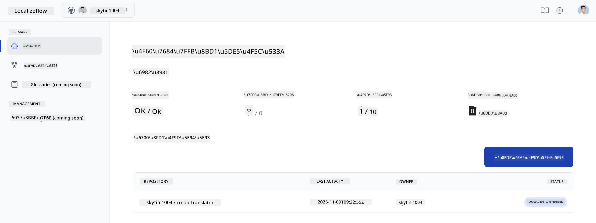

---

## 开始自动翻译

1. 选择您刚连接的仓库。  
   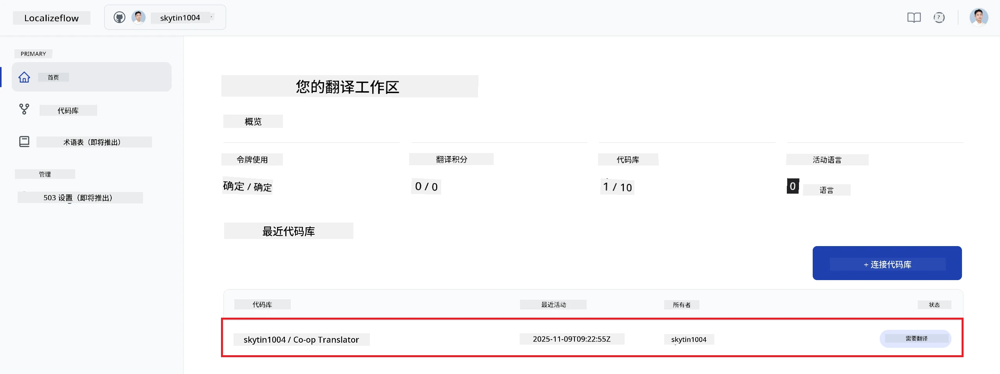

2. 在仓库详情页，点击底部的 **Edit（编辑）**。  
   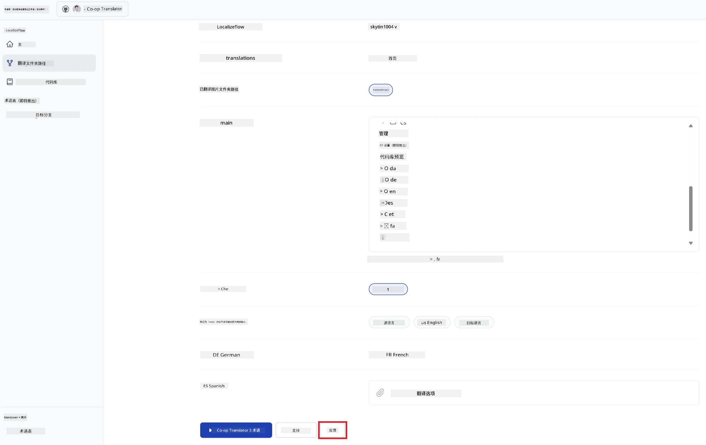

3. 配置您的翻译设置——目标分支（默认：`main`）、目标语言和源语言（默认：`en`）。点击 **Save（保存）**。  
   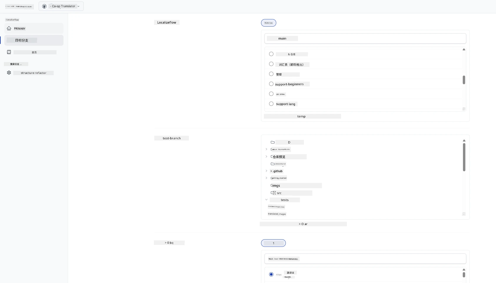

4. 点击 **Start & Automate（开始并自动化）**。  
   Localizeflow 现在会自动翻译您的文档，并在源文件变更时自动发起拉取请求。  
   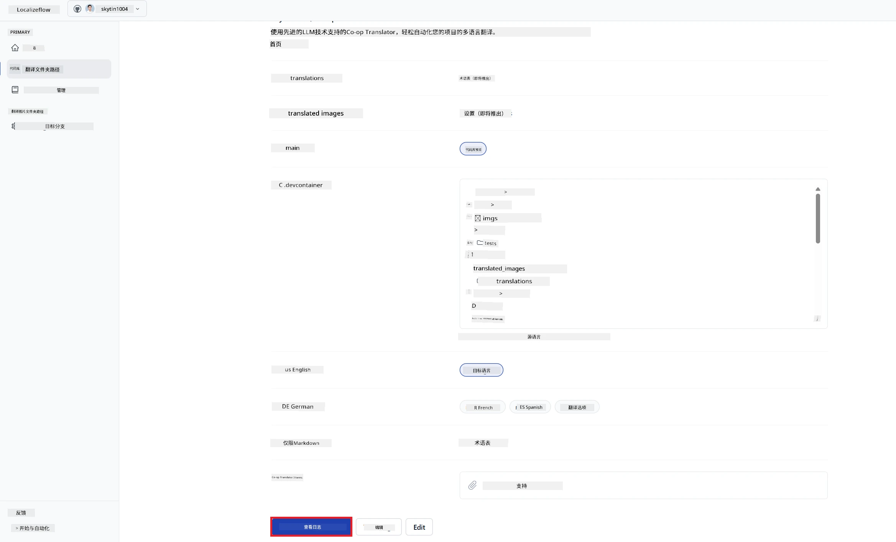

---

<!-- CO-OP TRANSLATOR DISCLAIMER START -->
**免责声明**：  
本文件由 AI 翻译服务 [Co-op Translator](https://github.com/Azure/co-op-translator) 翻译。尽管我们力求准确，但请注意自动翻译可能包含错误或不准确之处。原始语言的文件应被视为权威来源。对于关键信息，建议采用专业人工翻译。因使用本翻译而产生的任何误解或误释，我们概不负责。
<!-- CO-OP TRANSLATOR DISCLAIMER END -->