# Localizeflow – 快速入門指南

#### 支援由 [Localizeflow](https://localizeflow.com/) 提供

<!-- CO-OP TRANSLATOR LANGUAGES TABLE START -->
[Arabic](../ar/README.md) | [Bengali](../bn/README.md) | [Bulgarian](../bg/README.md) | [Burmese (Myanmar)](../my/README.md) | [Chinese (Simplified)](../zh-CN/README.md) | [Chinese (Traditional, Hong Kong)](../zh-HK/README.md) | [Chinese (Traditional, Macau)](../zh-MO/README.md) | [Chinese (Traditional, Taiwan)](./README.md) | [Croatian](../hr/README.md) | [Czech](../cs/README.md) | [Danish](../da/README.md) | [Dutch](../nl/README.md) | [Estonian](../et/README.md) | [Finnish](../fi/README.md) | [French](../fr/README.md) | [German](../de/README.md) | [Greek](../el/README.md) | [Hebrew](../he/README.md) | [Hindi](../hi/README.md) | [Hungarian](../hu/README.md) | [Indonesian](../id/README.md) | [Italian](../it/README.md) | [Japanese](../ja/README.md) | [Kannada](../kn/README.md) | [Korean](../ko/README.md) | [Lithuanian](../lt/README.md) | [Malay](../ms/README.md) | [Malayalam](../ml/README.md) | [Marathi](../mr/README.md) | [Nepali](../ne/README.md) | [Nigerian Pidgin](../pcm/README.md) | [Norwegian](../no/README.md) | [Persian (Farsi)](../fa/README.md) | [Polish](../pl/README.md) | [Portuguese (Brazil)](../pt-BR/README.md) | [Portuguese (Portugal)](../pt-PT/README.md) | [Punjabi (Gurmukhi)](../pa/README.md) | [Romanian](../ro/README.md) | [Russian](../ru/README.md) | [Serbian (Cyrillic)](../sr/README.md) | [Slovak](../sk/README.md) | [Slovenian](../sl/README.md) | [Spanish](../es/README.md) | [Swahili](../sw/README.md) | [Swedish](../sv/README.md) | [Tagalog (Filipino)](../tl/README.md) | [Tamil](../ta/README.md) | [Telugu](../te/README.md) | [Thai](../th/README.md) | [Turkish](../tr/README.md) | [Ukrainian](../uk/README.md) | [Urdu](../ur/README.md) | [Vietnamese](../vi/README.md)

> **偏好本地克隆？**

> 此儲存庫包含 50 多種語言的翻譯檔案，會大幅增加下載大小。若要克隆時不包含翻譯檔，請使用 sparse checkout：  
> ```bash
> git clone --filter=blob:none --sparse https://github.com/localizeflow/localizeflow-docs.git
> cd localizeflow-docs
> git sparse-checkout set --no-cone '/*' '!translations' '!translated_images'
> ```
> 這樣您就能以更快的速度下載，且取得完成課程所需的一切內容。
<!-- CO-OP TRANSLATOR LANGUAGES TABLE END -->

Localizeflow 會自動翻譯您的文件，並在原始檔案變更時開啟拉取請求。  
本指南將示範如何安裝 GitHub App，並在 2 分鐘內執行您的首次翻譯。

> [!NOTE]
>
> Localizeflow 目前支援基於 GitHub 的文件專案  
>（例如：AI for Beginners 以及大多數標準的開源倉庫）。  
> 
> 支援 Astro、Docusaurus 與 Hugo 等現代文件框架  
> 正在積極開發中。

---

## 登入並安裝 GitHub App

1. 訪問 **[localizeflow.com](https://localizeflow.com/)**。
2. 選擇 **Start with free trial**。  
   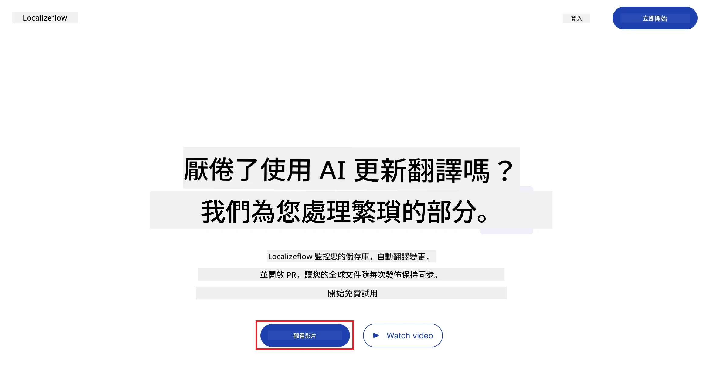
3. 選擇 **Sign in with GitHub**。  
   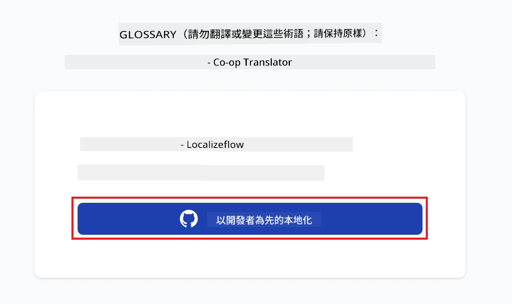
4. 使用您的 GitHub 帳號登入。  
   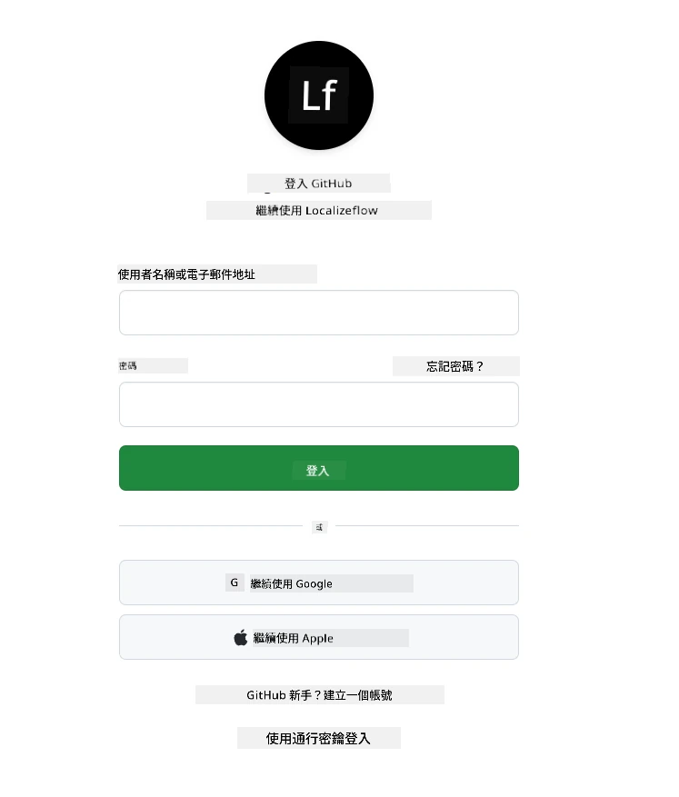
5. 選擇要安裝 Localizeflow GitHub App 的帳號 — 您的個人帳號或您管理的組織。  
   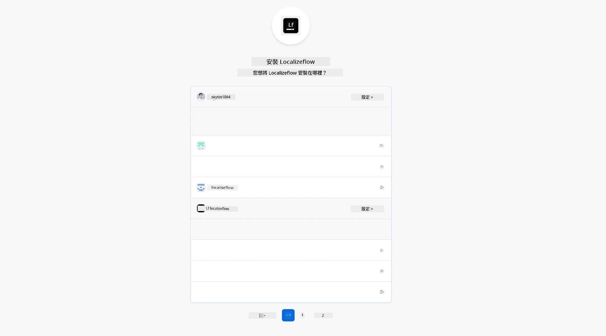
6. 選擇 Localizeflow 應該存取的倉庫，然後選擇 **Save**。  
   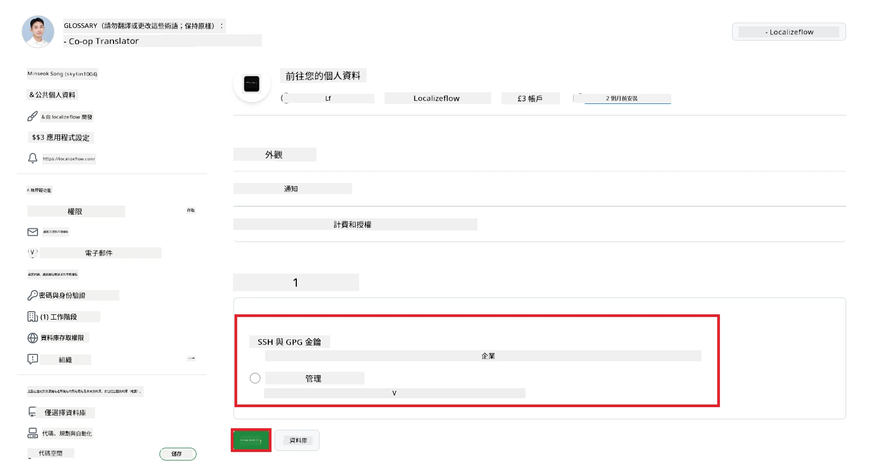
7. 您將被導向至 Localizeflow 首頁。

> [!TIP]
> 若之後要新增更多倉庫，可以在頁首選擇您的帳號，然後點選 **+ Add more repositories**。  
> 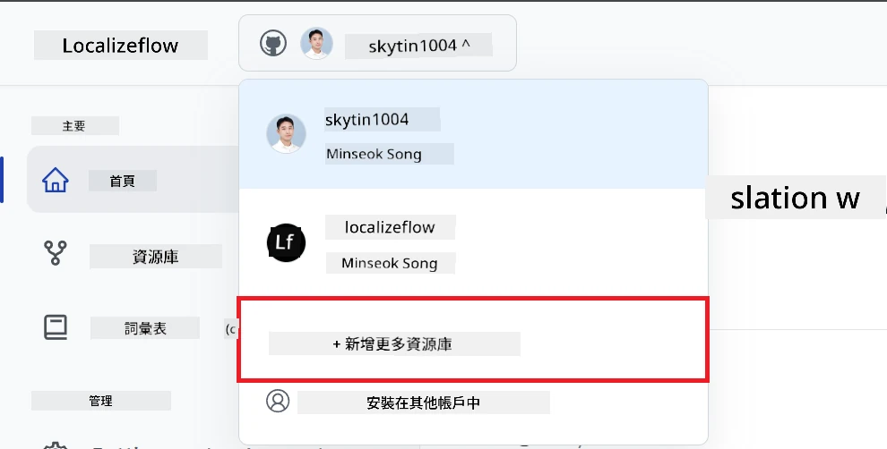

---

## 將您的倉庫連接到 Localizeflow

1. 在 Localizeflow 首頁，選擇 **+ Connect repositories**。  
   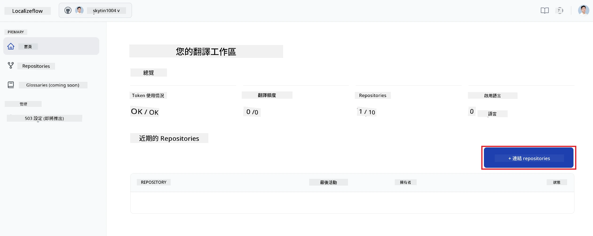

2. 選擇您想要連接的已安裝倉庫，然後選擇 **Save**。  
   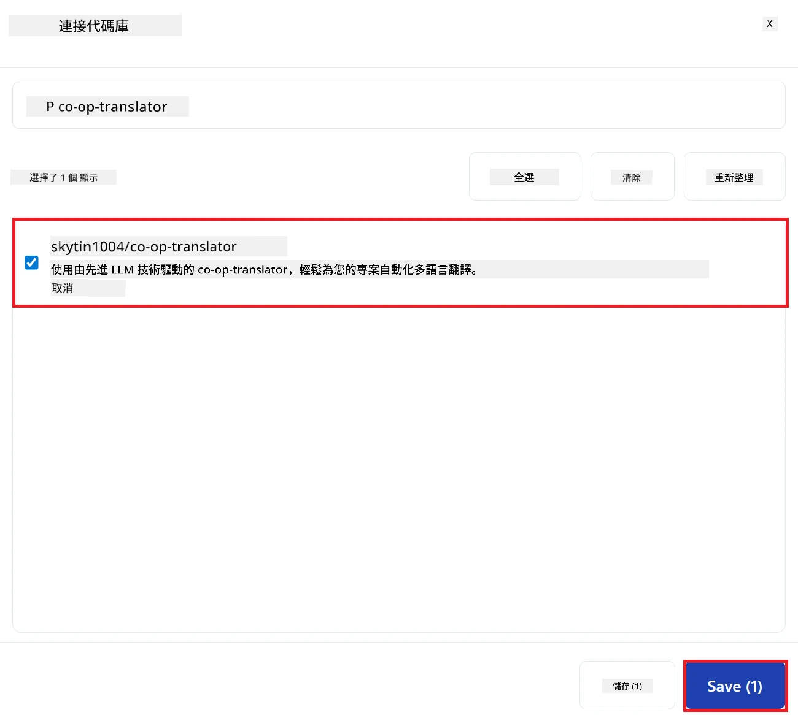

3. 您連接的倉庫現在會出現在首頁與倉庫頁面中。  
   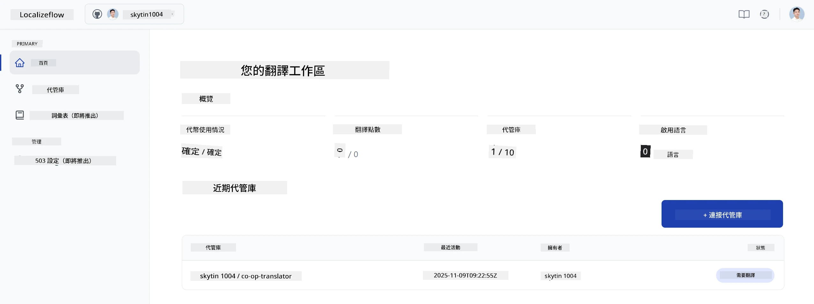

---

## 開始自動翻譯

1. 選擇您剛連接的倉庫。  
   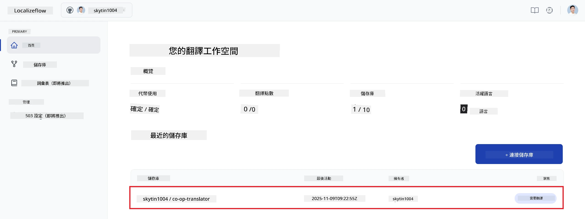

2. 在倉庫詳細頁面，向下選擇 **Edit**。  
   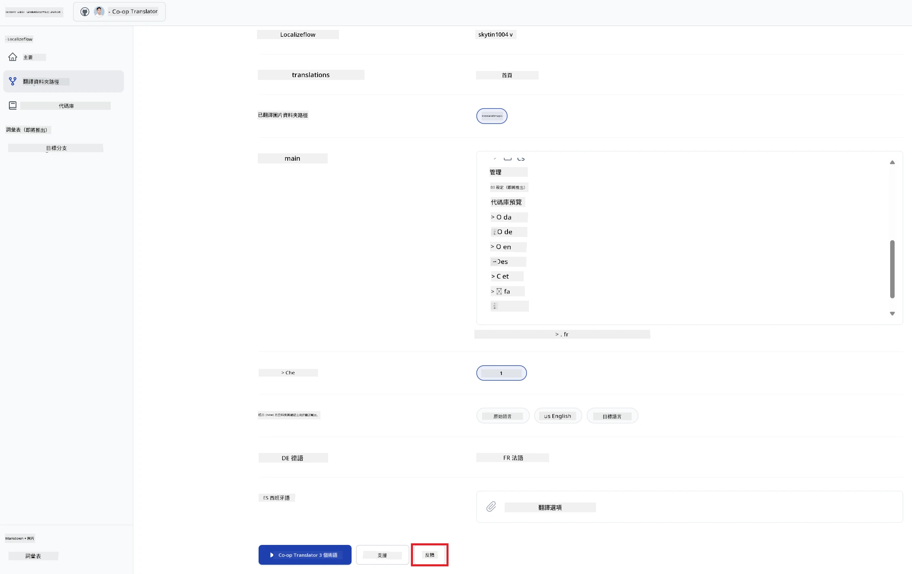

3. 設定您的翻譯選項 — 目標分支（預設為 `main`）、目標語言與來源語言（預設為 `en`）。選擇 **Save**。  
   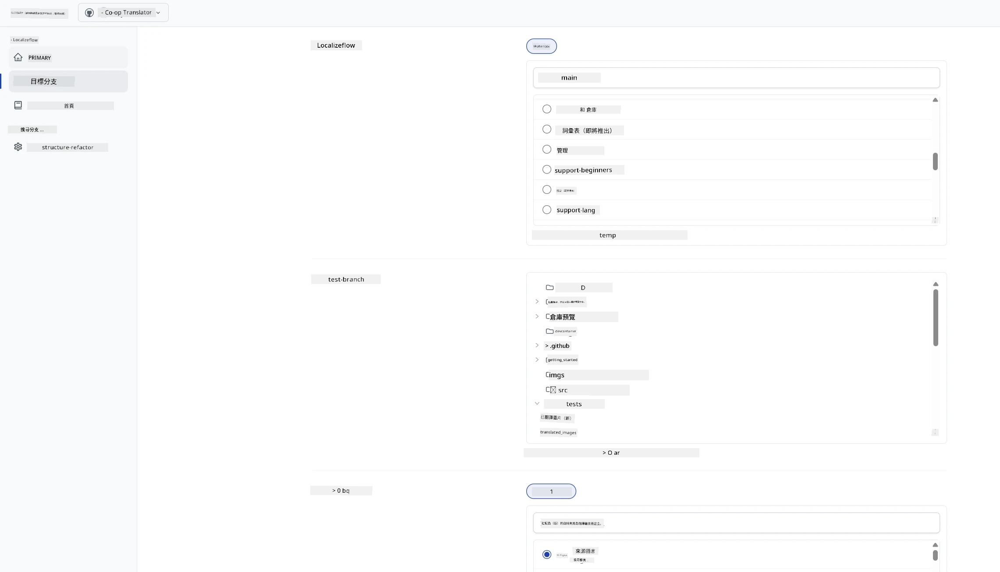

4. 選擇 **Start & Automate**。  
   Localizeflow 現在會自動翻譯您的文件，且在原始檔案變更時開啟拉取請求。  
   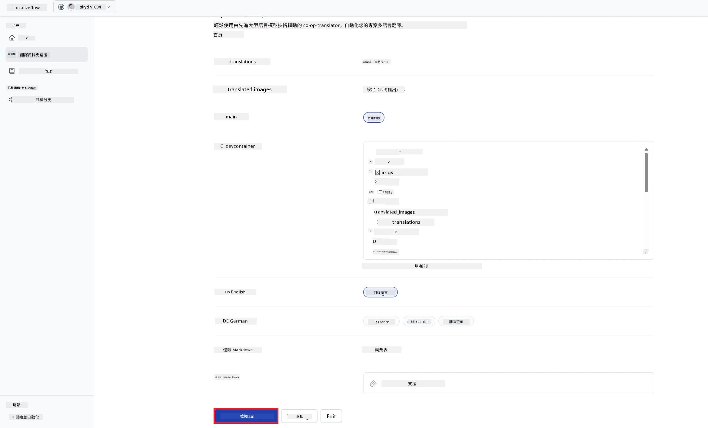

---

<!-- CO-OP TRANSLATOR DISCLAIMER START -->
**免責聲明**：  
本文件使用 AI 翻譯服務 [Co-op Translator](https://github.com/Azure/co-op-translator) 進行翻譯。雖然我們致力於確保翻譯的準確性，但請注意自動翻譯可能包含錯誤或不準確之處。原始文件的母語版本應視為權威來源。對於關鍵資訊，建議採用專業人工翻譯。我們對因使用本翻譯所導致的任何誤解或誤譯不承擔任何責任。
<!-- CO-OP TRANSLATOR DISCLAIMER END -->